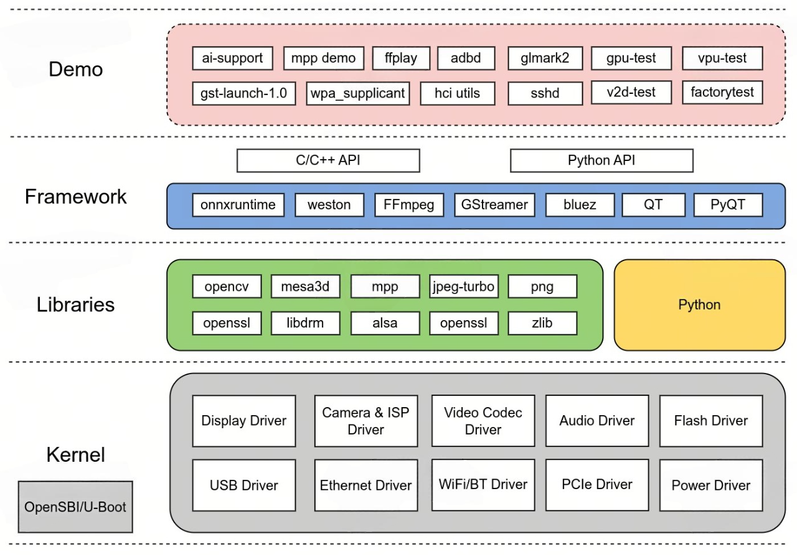

# 简介

基于Buildroot构建的Linux SDK，适配SpacemiT K系列芯片。包含监管程序接口（OpenSBI）、引导加载程序（U-Boot/UEFI）、Linux 内核、根文件系统（包含各种中间件和库）以及示例等。其目标是为客户提供处理器 Linux 支持，并且可以开发驱动或应用。

## 系统架构

## 主要组件

SDK包含的组件如下：

- OpenSBI
- U-Boot
- Linux Kernel
- Buildroot
- onnxruntime (with Hardware Accelerated)
- ai-support: AI demo
- img-gpu-powervr: GPU DDK
- mesa3d
- QT 5.15 (with GPU enabled)
- k1x-vpu-firmware: Video Process Unit firmware
- k1x-vpu-test: Video Process Unit test program
- k1x-jpu: JPEG Process Unit API
- k1x-cam: CMOS Sensor and ISP API
- mpp: Media Process Platform
- FFmpeg (with Hardware Accelerated)
- GStreamer (with Hardware Accelerated)
- v2d-test: 2D Unit test program
- factorytest: factory test app

更多组件正在适配中。

## 快速指南

- [镜像](image.md)
- [源码](source.md)
- [工具](tools.md)

## 更新说明

- [更新说明](release_notes/index.md)
