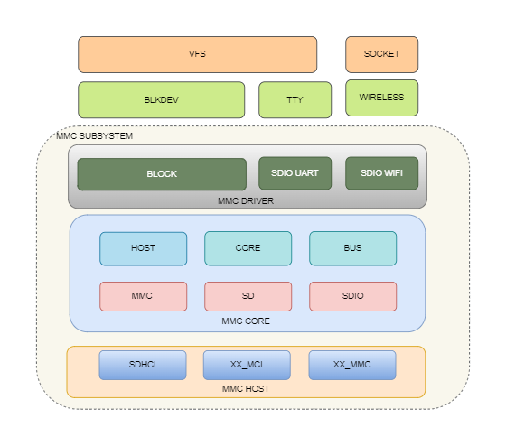

# SDHC

介绍 K3 平台 SDHC 控制器的功能、设备树配置以及调试方法。

## 模块介绍

SDHC 是 MMC/SD/SDIO 设备的主机控制器，K3 平台的 SDHC 主要支持以下设备或者接口：

- **SD 卡**
- **SDIO**
- **eMMC**

### 功能介绍



Linux MMC 框架大致分为三层：

- **MMC Host**：主控制器驱动层，负责控制器初始化、命令发送、数据收发、电压切换等逻辑；
- **MMC Core**：MMC 核心层，统一管理卡枚举、协议处理和状态机；
- **MMC Block / SDIO 功能层**：为块设备或 SDIO 外设驱动提供上层接口。

K3 上 eMMC 和 SD 卡对应的块设备如下：

- eMMC 对应的块设备节点 `/dev/mmcblk2`；
- SD 卡对应的块设备节点 `/dev/mmcblk0`；

### 源码结构介绍

控制器相关代码主要位于：

```text
linux-6.18/
|-- drivers/mmc/host/
|   |-- sdhci.c                # SDHCI 通用框架
|   |-- sdhci-pltfm.c          # SDHCI 平台层
|   `-- sdhci-of-k1.c          # SpacemiT K1/K3 SDHCI 驱动
|-- Documentation/devicetree/bindings/mmc/
|   `-- spacemit,sdhci.yaml    # SpacemiT SDHCI binding
`-- arch/riscv/boot/dts/spacemit/
    |-- k3.dtsi                # K3 soc级dts配置
    `-- k3*.dts                # 板级dts配置
```

## 关键特性

### 特性

| 特性 | 特性说明 |
| :----- | :---- |
| 控制器数量 | K3 提供 3 个主控制器：`sdcard`、`sdio`、`emmc` |
| 支持设备类型 | 支持 SD、SDIO、eMMC |
| eMMC5.1 | 支持 HS400 和 HS400ES |
| SD 3.0 | 支持 UHS , 最高支持 SDR104 |
| SDIO | SDIO Specification Ver3.00 |
| 软件 tuning | 驱动支持 rx 自动 tuning ，支持方案单独配置 `tx_delaycode` |

### K3 的三个 slot 用法

slot1 支持 SD/SDIO(1/4 bit)，slot2 支持 SDIO/eMMC(1/4 bit)，slot3 只支持 eMMC(1/4/8 bit)，DTS 中的三个
slot分别用sdcard，sdio，emmc描述：

- **`sdcard`**： SD 卡配置，最高支持 SDR104；
- **`sdio`**： SDIO 接口配置，一般用于接 Wi‑Fi 模组；
- **`emmc`**： eMMC 配置，最高支持 HS400ES 。

## 配置介绍

主要包括内核配置和 DTS 配置。

### CONFIG 配置

K3 SDHC 常见配置如下：

`CONFIG_MMC` 为 MMC 总线协议提供支持，通常为 `Y`：

```text
Device Drivers
    MMC/SD/SDIO card support (MMC [=y])
```

`CONFIG_MMC_BLOCK` 为 MMC 块设备提供支持，通常为 `Y`：

```text
Device Drivers
    MMC/SD/SDIO card support (MMC [=y])
        MMC block device driver (MMC_BLOCK [=y])
```

`CONFIG_MMC_SDHCI` / `CONFIG_MMC_SDHCI_PLTFM` / `CONFIG_MMC_SDHCI_OF_K1` 为 SpacemiT SDHCI 控制器提供支持：

```text
Device Drivers
    MMC/SD/SDIO card support (MMC [=y])
        Secure Digital Host Controller Interface support (MMC_SDHCI [=y])
            SDHCI platform and OF driver helper (MMC_SDHCI_PLTFM [=y])
            SDHCI OF support for the SpacemiT SDHCI controller (MMC_SDHCI_OF_K1 [=y])
```

### DTS 配置

#### 控制器节点

K3 的三个控制器节点位于 `k3.dtsi`：

```dts
sdcard: mmc@d4280000 {
        compatible = "spacemit,k3-sdhci";
        reg = <0x0 0xd4280000 0x0 0x200>;
        clocks = <&syscon_apmu CLK_APMU_SDH_AXI>,
                 <&syscon_apmu CLK_APMU_SDH0>;
        clock-names = "core", "io";
        interrupt-parent = <&saplic>;
        interrupts = <99 IRQ_TYPE_LEVEL_HIGH>;
        resets = <&syscon_apmu RESET_APMU_SDH_AXI>,
                 <&syscon_apmu RESET_APMU_SDH0>;
        reset-names = "sdh_axi", "sdh0";
        status = "disabled";
};
```

```dts
sdio: mmc@d4280800 {
        compatible = "spacemit,k3-sdhci";
        reg = <0x0 0xd4280800 0x0 0x200>;
        clocks = <&syscon_apmu CLK_APMU_SDH_AXI>,
                 <&syscon_apmu CLK_APMU_SDH1>;
        clock-names = "core", "io";
        interrupt-parent = <&saplic>;
        interrupts = <100 IRQ_TYPE_LEVEL_HIGH>;
        resets = <&syscon_apmu RESET_APMU_SDH_AXI>,
                 <&syscon_apmu RESET_APMU_SDH1>;
        reset-names = "sdh_axi", "sdh1";
        status = "disabled";
};
```

```dts
emmc: mmc@d4281000 {
        compatible = "spacemit,k3-sdhci";
        reg = <0x0 0xd4281000 0x0 0x200>;
        clocks = <&syscon_apmu CLK_APMU_SDH_AXI>,
                 <&syscon_apmu CLK_APMU_SDH2>;
        clock-names = "core", "io";
        interrupt-parent = <&saplic>;
        interrupts = <101 IRQ_TYPE_LEVEL_HIGH>;
        resets = <&syscon_apmu RESET_APMU_SDH_AXI>,
                 <&syscon_apmu RESET_APMU_SDH2>;
        reset-names = "sdh_axi", "sdh2";
        status = "disabled";
};
```

#### pinctrl 配置

K3 板级中，SD 卡控制器支持三组 pinctrl：

- `default`
- `uhs`
- `debug`

例如：

```dts
&sdcard {
        pinctrl-names = "default","uhs","debug";
        pinctrl-0 = <&mmc1_cfg>;
        pinctrl-1 = <&mmc1_uhs_cfg>;
        pinctrl-2 = <&mmc1_debug_cfg>;
        status = "okay";
};
```

其中：

- `default`：默认工作模式，工作在3.3v IO场景；
- `uhs`：UHS 模式，工作在1.8v IO场景，驱动会动态切pinctrl模式；
- `debug`：调试场景，根据方案需求选择以下两种 pinctrl 之一配置到 `pinctrl-2`：
  - `mmc1_debug_cfg`：将 PAD 132/133（SD DAT3/DAT2）复用为 UART0 TX/RX，其余引脚保持 SD 功能，用于外接调试子板打印场景（参考 EVB）；
  - `mmc1_jtag_cfg`：将 PAD 132/133/134/137（SD DAT3/DAT2/DAT1/CLK）复用为 JTAG 的 TDI/TMS/TDO/TCK，用于 JTAG 调试场景（参考 COM260）。

  驱动在 probe 时默认切入 `debug` 状态。检测到 SD 卡插入后自动切换到 `default` 或者 `uhs` 模式，拔出后自动切换回 `debug`。因此调试功能仅在 SD 卡未工作时可用。

`mmc1_debug_cfg` 配置参考（k3-pinctrl.dtsi，EVB 使用）：

```dts
mmc1_debug_cfg: mmc1-debug-cfg {
        mmc1-0-pins {
                pinmux = <K3_PADCONF(132, 2)>,  /* uart0 tx */
                         <K3_PADCONF(133, 2)>,  /* uart0 rx */
                         <K3_PADCONF(134, 0)>,  /* mmc1 dat1 */
                         <K3_PADCONF(135, 0)>,  /* mmc1 dat0 */
                         <K3_PADCONF(136, 0)>;  /* mmc1 cmd */

                bias-pull-up;
                drive-strength = <8>;
                power-source = <3300>;
        };

        mmc1-1-pins {
                pinmux = <K3_PADCONF(137, 0)>;  /* mmc1 clk */

                bias-pull-down;
                drive-strength = <8>;
                power-source = <3300>;
        };
};
```

`mmc1_jtag_cfg` 配置参考（k3-pinctrl.dtsi，COM260 使用）：

```dts
mmc1_jtag_cfg: mmc1-jtag-cfg {
        mmc1-0-pins {
                pinmux = <K3_PADCONF(132, 5)>,  /* pri tdi */
                         <K3_PADCONF(133, 5)>,  /* pri tms */
                         <K3_PADCONF(134, 5)>,  /* pri tdo */
                         <K3_PADCONF(137, 5)>;  /* pri tck */

                bias-pull-up;
                drive-strength = <8>;
                power-source = <3300>;
        };
};
```

SDIO 控制器和 eMMC 控制器不支持1.8v和3.3v IO切换，只需要配置一组 pinctrl。

#### 电源配置

对 SD 卡和 SDIO 来说，通常需要配置：

- `vmmc-supply`：卡供电；
- `vqmmc-supply`：IO 供电，其中 SD 卡需要支持 3.3V / 1.8V 切换。

例如：

```dts
&sdcard {
        vmmc-supply = <&p3v3>;
        vqmmc-supply = <&aldo1>;
};
```

eMMC 默认板级会保证供电，不需要显式的配置电源。

#### 卡检测配置

SD 卡支持热插拔检测，需要配置卡检测 GPIO，例如：

```dts
&sdcard {
        cd-gpios = <&gpio 0 4 GPIO_ACTIVE_HIGH>;
};
```

卡检测的有效电平根据实际硬件进行修改。

卡检测 GPIO 需要配置对应的 pinctrl 上拉。

```dts
&pinctrl {
        mmc1_cd_cfg: mmc1-cd-cfg {
                mmc1-cd-pins {
                        pinmux = <K3_PADCONF(4, 0)>;  /* cd gpio */

                        bias-pull-up = <1>;
                        drive-strength = <8>;
                        power-source = <3300>;
                };
        };
};
```

卡检测需要配置 pinctrl，默认上拉，power-source 需要设置为 3.3v。

#### SD 卡配置示例

K3 COM260 上的 `sdcard` 方案配置：

```dts
&sdcard {
        pinctrl-names = "default","uhs","debug";
        pinctrl-0 = <&mmc1_cfg &mmc1_cd_cfg>;
        pinctrl-1 = <&mmc1_uhs_cfg &mmc1_cd_cfg>;
        pinctrl-2 = <&mmc1_jtag_cfg &mmc1_cd_cfg>;
        bus-width = <4>;
        wp-inverted;
        cd-gpios = <&gpio 0 4 GPIO_ACTIVE_HIGH>;
        vmmc-supply = <&p3v3>;
        vqmmc-supply = <&aldo1>;
        no-mmc;
        no-sdio;
        clock-frequency = <204800000>;
        spacemit,tx_delaycode = <0x1f>;
        status = "okay";
};
```

主要配置项说明：

- `bus-width = <4>`：SD 卡最大位宽为 4-bit，调试时可以设置为 1-bit 进行硬件相关排查；
- `wp-inverted`：反转写保护信号的逻辑电平。当硬件上写保护引脚的有效电平与控制器默认逻辑相反时，需要配置此属性；
- `cd-gpios`： SD 卡的检测引脚，需要根据实际硬件进行配置；
- `vmmc-supply` / `vqmmc-supply`： SD 卡的供电和 IO 电源，根据实际硬件进行配置；
- `no-mmc`：禁止该控制器枚举 eMMC 设备，SD 卡控制器需要配置；
- `no-sdio`：禁止该控制器枚举 SDIO 设备，SD 卡控制器需要配置；
- `clock-frequency`：指定时钟源，SD 卡选择的是 204M 时钟源，控制器输出最高频率 204M ；
- `spacemit,tx_delaycode`：指定tuning的tx参数，根据实际硬件进行调整，未配置时默认使用 0x7f；
- `spacemit,rx_tuning_limit`：软件 RX tuning 时要求 pass 窗口的最小宽度（delay code 数量），低于此值则 tuning 失败。未配置时默认为 50，可根据实际硬件 tuning 结果调整；
- `spacemit,rx_tuning_type`：RX tuning 在 pass 窗口内的取点位置，`0` 为窗口 1/3 处，`1` 为窗口中点，`2` 为窗口 2/3 处。未配置时默认为 `1`（取中点）；
- `spacemit,phy_driver_sel`：PHY 驱动能力选择，未配置时默认为 `0x4`。

#### SDIO 配置示例

K3 EVB 中的 `sdio` 方案配置：

```dts
vmmc_sdio: regulator-vmmc-sdio {
        compatible = "regulator-fixed";
        regulator-name = "vmmc-sdio";
        regulator-min-microvolt = <3300000>;
        regulator-max-microvolt = <3300000>;
        enable-active-high;
        gpio = <&gpio 3 6 GPIO_ACTIVE_HIGH>;
};

sdio_pwrseq: sdio-pwrseq {
        compatible = "mmc-pwrseq-simple";

        reset-gpios = <&gpio 3 4 GPIO_ACTIVE_LOW>;
};

&sdio {
        pinctrl-names = "default";
        pinctrl-0 = <&mmc2_cfg>;
        bus-width = <4>;
        non-removable;
        vmmc-supply = <&vmmc_sdio>;
        vqmmc-supply = <&p1v8>;
        mmc-pwrseq = <&sdio_pwrseq>;
        no-mmc;
        no-sd;
        keep-power-in-suspend;
        clock-frequency = <375000000>;
        spacemit,tx_delaycode = <0x7f>;
        #address-cells = <1>;
        #size-cells = <0>;
        status = "okay";

        wifi@1 {
                reg = <1>;
                compatible = "realtek,rtl8852bs";
                pinctrl-names = "default";
                pinctrl-0 = <&wifi_hostwake_cfg>;
                interrupts-extended = <&pinctrl 101 IRQ_TYPE_EDGE_FALLING>;
        };
};
```

主要配置项说明：

- `bus-width = <4>`：SDIO 最大位宽为 4-bit，调试时可以设置为 1-bit 进行硬件相关排查；
- `non-removable`：表示该设备不可移除，SDIO 设备（如 Wi-Fi 模组）焊接在板上，必须配置此属性，否则内核不会主动枚举设备；
- `vmmc-supply` / `vqmmc-supply`： SDIO 的供电和 IO 电源，根据实际硬件进行配置；
- `mmc-pwrseq`：SDIO pwrseq 配置，配置 WiFi REG_ON 引脚，用于 reset 设备；
- `no-mmc`：禁止该控制器枚举 eMMC 设备，SDIO 控制器需要配置；
- `no-sd`：禁止该控制器枚举 SD 卡设备，SDIO 控制器需要配置；
- `keep-power-in-suspend`：系统休眠时保持设备供电不断电，Wi-Fi 等需要保持连接或支持唤醒的场景必须配置；
- `clock-frequency`：指定时钟源，SDIO 选择的是 375M 时钟源，控制器内部进行二分频，输出最高频率 187M ；
- `spacemit,tx_delaycode`：指定tuning的tx delay参数，根据实际硬件进行调整，未配置时默认使用 0x7f；
- `reset-gpios`：指定 SDIO 设备的 reset 引脚，对于 WiFi 设备一般对应 REG_ON，有效电平根据实际需求配置；
- `wifi@1`：SDIO 子设备节点，`reg` 对应 SDIO 功能号（Wi-Fi 为 1），`compatible` 根据实际 Wi-Fi 芯片填写；`interrupts-extended` 配置 host wake 中断引脚，需同时配置对应的 pinctrl（`wifi_hostwake_cfg`）。

#### eMMC 配置示例

K3 EVB 上的 `emmc` 方案配置：

```dts
&emmc {
        bus-width = <8>;
        non-removable;
        mmc-hs400-1_8v;
        mmc-hs400-enhanced-strobe;
        no-sd;
        no-sdio;
        clock-frequency = <375000000>;
        status = "okay";
};
```

主要配置项说明：

- `bus-width = <8>`：eMMC 通常使用 8-bit，调试时可以设置为 1-bit/4-bit 进行硬件相关排查；
- `non-removable`：表示该设备不可移除，eMMC 焊接在板上，必须配置此属性；
- `mmc-hs400-1_8v`：启用 HS400 1.8V 模式，如果信号质量差需要降规格，可以去掉只跑 HS200 ；
- `mmc-hs400-enhanced-strobe`：启用 enhanced strobe，去掉后最高跑 HS400 ；
- `no-sd`：禁止该控制器枚举 SD 卡设备，eMMC 控制器需要配置；
- `no-sdio`：禁止该控制器枚举 SDIO 设备，eMMC 控制器需要配置；
- `clock-frequency`：指定时钟源，eMMC 选择的是 375M 时钟源，控制器内部进行二分频，输出最高频率 187M ；

### tuning 相关说明

K3 驱动支持 rx 自动 tuning ，但是需要根据硬件layout差异配置 tx delaycode。
需要tuning的模式有：

- SDR50/SDR104
- HS200/HS400（HS400 在 HS200 阶段完成 tuning 后再切入）

且只有工作频率高于 100MHz 时才会执行 tuning ，低于该门限驱动直接跳过。

其中 eMMC tuning 时采用默认的 tx timing ，不需要在方案DTS设置`spacemit,tx_delaycode` ，而 SD 卡和 SDIO 如果未指定 tx delaycode，会使用默认值 0x7f 。

用户在使用 SD 卡或 SDIO 模组时，如果出现 tx 的 crc 错误，大概率需要调整`spacemit,tx_delaycode` 参数做进一步验证。

rx tuning 的行为可以通过 `spacemit,rx_tuning_limit` 和 `spacemit,rx_tuning_type` 微调：前者控制判定 tuning 成功所需的最小 pass 窗口宽度，若日志中出现 `fail to find valid tuning window` 且实测窗口偏窄，可适当降低该值；后者控制在 pass 窗口内选取 delay code 的位置，默认取中点，一般不需要修改。

## 接口介绍

### API 介绍

Linux 操作系统中，MMC/SD/SDIO 设备统一通过 MMC 子系统接入系统。K3 的 `sdhci-of-k1.c` 驱动在标准 SDHCI 基础上实现了以下接口：

```c
static const struct sdhci_ops spacemit_sdhci_ops = {
        .get_max_clock           = spacemit_sdhci_clk_get_max_clock,
        .reset                   = spacemit_sdhci_reset,
        .set_bus_width           = sdhci_set_bus_width,
        .set_clock               = spacemit_sdhci_set_clock,
        .set_uhs_signaling       = spacemit_sdhci_set_uhs_signaling,
        .set_power               = sdhci_set_power_and_bus_voltage,
        .platform_execute_tuning = spacemit_sdhci_execute_sw_tuning,
};
```

除此之外，驱动在 probe 阶段还会覆盖 `mmc_host_ops` 中的部分回调：

```c
mops = &host->mmc_host_ops;
if (!(host->mmc->caps2 & MMC_CAP2_NO_MMC)) {
        mops->hs400_prepare_ddr     = spacemit_sdhci_pre_select_hs400;
        mops->hs400_complete        = spacemit_sdhci_post_select_hs400;
        mops->hs400_downgrade       = spacemit_sdhci_pre_hs400_to_hs200;
        mops->hs400_enhanced_strobe = spacemit_sdhci_hs400_enhanced_strobe;
}
mops->card_busy = spacemit_sdhci_card_busy;
```

其中前四个仅对 eMMC 控制器生效，用于 HS400 / HS400ES 的时序切换；`card_busy` 对所有控制器都替换为平台实现。

`sdhci.c` 驱动实现了以下接口：

```c
static const struct mmc_host_ops sdhci_ops = {
        .request                        = sdhci_request,
        .post_req                       = sdhci_post_req,
        .pre_req                        = sdhci_pre_req,
        .set_ios                        = sdhci_set_ios,
        .get_cd                         = sdhci_get_cd,
        .get_ro                         = sdhci_get_ro,
        .card_hw_reset                  = sdhci_hw_reset,
        .enable_sdio_irq                = sdhci_enable_sdio_irq,
        .ack_sdio_irq                   = sdhci_ack_sdio_irq,
        .start_signal_voltage_switch    = sdhci_start_signal_voltage_switch,
        .prepare_hs400_tuning           = sdhci_prepare_hs400_tuning,
        .execute_tuning                 = sdhci_execute_tuning,
        .card_event                     = sdhci_card_event,
        .card_busy                      = sdhci_card_busy,
};
```

驱动依次调用 sdhci_pltfm_init() 和 sdhci_add_host() 创建和注册 sdhci_host 到 mmc 子系统，mmc 子系统会调用到 sdhci_ops 和 spacemit_sdhci_ops ，完成与控制器的交互逻辑。

另外 K3 平台上默认不主动扫描 SDIO 设备，需要 SDIO 功能层驱动如 WiFi 驱动加载时才进行主动扫描，因此导出 SDIO 设备主动扫描接口:

```c
void spacemit_sdio_detect_change(int enable_scan);
```

调用该接口会重置 SDIO host 的 rescan 状态并触发一次设备扫描，WiFi 驱动在加载时调用即可。当前实现未使用 `enable_scan` 参数，传入任意值都会触发扫描。

### Debug 介绍

#### sysfs

K3 驱动对 SD / SDIO 控制器会创建：

```text
/sys/devices/platform/soc/d4280000.mmc/tx_delaycode
/sys/devices/platform/soc/d4280800.mmc/tx_delaycode
```

该节点可用于查看和修改当前的 `tx_delaycode`，方便调试 `tx_delaycode` 参数引入的问题。

例如：

```bash
cat /sys/devices/platform/soc/d4280000.mmc/tx_delaycode
echo 0x1f > /sys/devices/platform/soc/d4280000.mmc/tx_delaycode
```

#### debugfs

MMC 子系统仍然支持通过 debugfs 查看 host 当前工作状态，例如：

```bash
cat /sys/kernel/debug/mmc0/ios
```

常可用于查看：

- 当前时钟；
- 实际工作频率；
- 总线位宽；
- 时序模式；
- 信号电压。

## 测试介绍

MMC/SD 等存储可以通过标准 Linux 工具完成功能和性能测试，例如：

- `fio`
- `dd`
- `hdparm`（针对块设备场景，谨慎使用）

### 初始化与识别检查

```bash
dmesg | grep -Ei "mmc|sdhci|sdio"
lsblk
cat /proc/partitions
```

### 查看当前 host 状态

```bash
cat /sys/kernel/debug/mmc0/ios
```

示例输出通常包括：

- `clock`
- `actual clock`
- `bus width`
- `timing spec`
- `signal voltage`

```bash
cat /sys/kernel/debug/mmc0/ios
clock:          204800000 Hz
actual clock:   204800000 Hz
vdd:            21 (3.3 ~ 3.4 V)
bus mode:       2 (push-pull)
chip select:    0 (don't care)
power mode:     2 (on)
bus width:      2 (4 bits)
timing spec:    6 (sd uhs SDR104)
signal voltage: 1 (1.80 V)
driver type:    0 (driver type B)
```

### eMMC / SD 卡性能测试

可参考如下 `fio` 方法：

```bash
#测试顺序读吞吐量
fio -name=read -direct=1 -iodepth=128 -rw=read -ioengine=libaio -bs=128k -size=1G -numjobs=1 -time_based=1 -runtime=60 -group_reporting -directory=/mount_point/

#测试顺序写吞吐量
fio -name=write -direct=1 -iodepth=128 -rw=write -ioengine=libaio -bs=128k -size=1G -numjobs=1 -time_based=1 -runtime=60 -group_reporting -directory=/mount_point/

#测试顺序读取时延
fio -name=read -direct=1 -iodepth=1 -rw=read -ioengine=libaio -bs=4k -size=1G -numjobs=1 -time_based=1 -runtime=60 -group_reporting -directory=/mount_point/

#测试顺序写入时延
fio -name=write -direct=1 -iodepth=1 -rw=write -ioengine=libaio -bs=4k -size=1G -numjobs=1 -time_based=1 -runtime=60 -group_reporting -directory=/mount_point/

#测试4K随机读取IOPS
fio -name=randread -direct=1 -iodepth=128 -rw=randread -ioengine=libaio -bs=4k -size=1G -numjobs=1 -time_based=1 -runtime=60 -group_reporting -directory=/mount_point/

#测试4K随机写入IOPS
fio -name=randwrite -direct=1 -iodepth=128 -rw=randwrite -ioengine=libaio -bs=4k -size=1G -numjobs=1 -time_based=1 -runtime=60 -group_reporting -directory=/mount_point/

#测试4K随机读取时延
fio -name=randread -direct=1 -iodepth=1 -rw=randread -ioengine=libaio -bs=4k -size=1G -numjobs=1 -time_based=1 -runtime=60 -group_reporting -directory=/mount_point/

#测试4K随机写入时延
fio -name=randwrite -direct=1 -iodepth=1 -rw=randwrite -ioengine=libaio -bs=4k -size=1G -numjobs=1 -time_based=1 -runtime=60 -group_reporting -directory=/mount_point/
```

### SDIO 功能验证

SDIO 通常用于外接 WiFi 模组，功能验证通过确认上层驱动是否正常枚举来判断：

```bash
# 确认 SDIO 设备枚举成功
dmesg | grep -i sdio

# 确认 WiFi 驱动加载后网络接口出现
ip link show
```

SDIO 枚举成功后，`dmesg` 中通常可以看到类似 `mmc1: new SDIO card` 的日志，WiFi 驱动加载后会出现对应的网络接口（如 `wlan0`）。

## FAQ

### 1. 为什么 `sdcard` 控制器起来了，但插卡后没有块设备？

只有如下打印：

```bash
[    5.840252] mmc0: SDHCI controller on d4280000.mmc [d4280000.mmc] using ADMA 64-bit
```

缺少以下类似打印：

```bash
[    5.804583] sdhci-spacemit d4280000.mmc: Got CD GPIO
[    5.940901] sdhci-spacemit d4280000.mmc: mmc0: set tx_delaycode: 31
[    5.953824] sdhci-spacemit d4280000.mmc: mmc0: pass window [38 167)
[    5.961322] sdhci-spacemit d4280000.mmc: mmc0: pass window [196 218)
[    5.972641] sdhci-spacemit d4280000.mmc: mmc0: tuning done, use delay_code:102
[    5.984557] mmc0: new UHS-I speed SDR104 SDXC card at address 5048
[    5.997836] mmcblk0: mmc0:5048 SD128 116 GiB
[    6.009456]  mmcblk0: p1 p2 p3 p4 p5 p6
```

常见原因包括：

- `cd-gpios` 有效电平错误；
- pinctrl 配置缺失或者错误；
- `vmmc-supply` / `vqmmc-supply` 配置错误或者电压异常；
- 卡本身或插槽硬件异常。

### 2. 为什么 eMMC 能识别，但速度不对或者高速模式不稳定？

重点检查：

- `mmc-hs400-1_8v` / `mmc-hs400-enhanced-strobe` 是否正确；
- 板级时钟与供电是否满足；
- 内核 HS400/HS400ES 配置是否有打开；
- 驱动日志里是否有 tuning 失败或 CRC 错误。

### 3. 为什么 SDIO 设备没起来？

常见排查点：

- `non-removable` 是否配置；
- `vmmc-supply` / `vqmmc-supply` 配置错误或者电压异常；
- `mmc-pwrseq` 是否正确配置 WiFi 模组 REG_ON/RESET 引脚；
- 对应的 Wi‑Fi/SDIO 功能驱动和固件是否存在。
