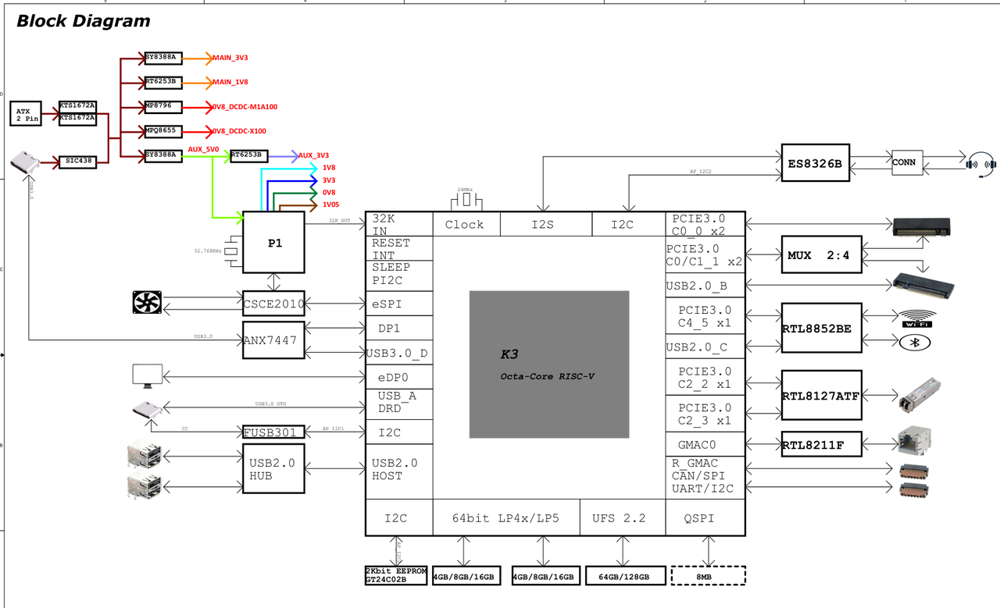
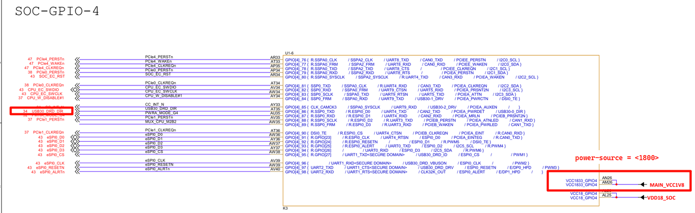
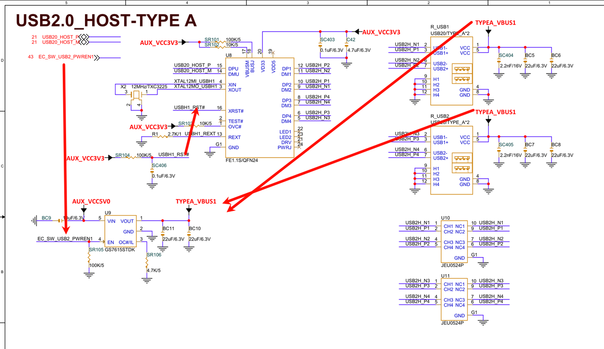
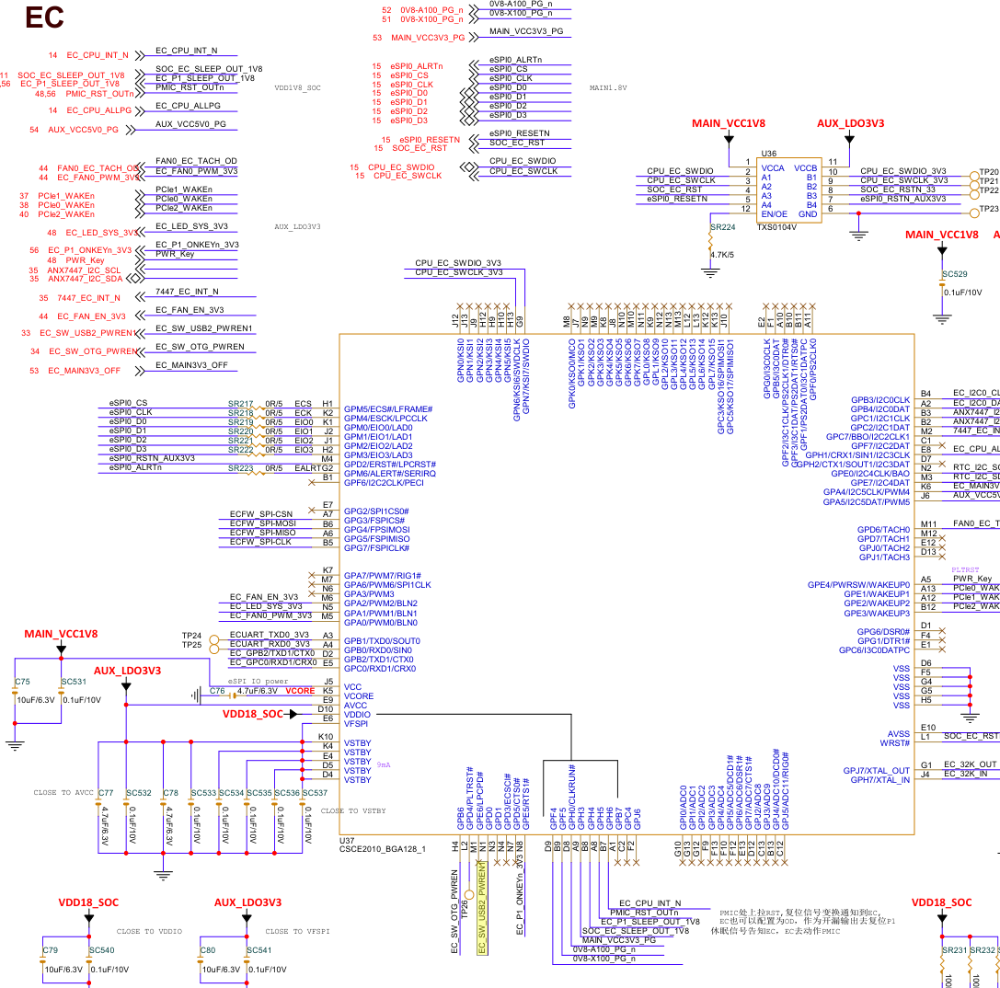
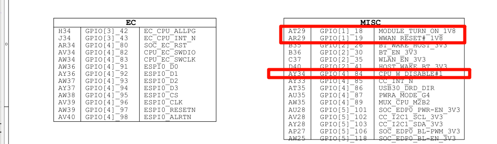
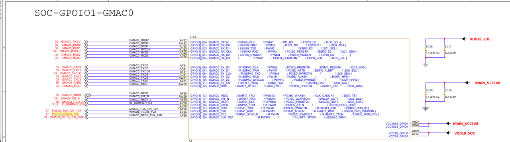

sidebar_position: 1

# USB 通用开发指南

本文介绍 K3 平台 USB 的功能特性、硬件适配、软件配置、调试方法和常见分析思路。

适用范围：SpacemiT Linux 6.18

## 快速上手

对于板级二次开发，建议按以下流程开展 USB 适配与验证：

1. 阅读原理图，确认 5 个 USB 控制器分别连接到哪些接口或板载设备。
2. 确认 `usb3_portb/c/d` 的 USB3.0 PHY 是否与 PCIe 复用。
3. 根据端口用途编写 DTS：选择 Host、Device、OTG 或 High-Speed Only 配置。
4. 检查 Linux 内核 CONFIG 是否已使能对应 PHY、DWC3、XHCI 和外设驱动。
5. 烧录并启动系统，检查控制器初始化日志和设备枚举日志。
6. 使用 `lsusb`、`/sys/kernel/debug/usb/devices`、`k3_lsusb` 等方法确认拓扑。
7. 按设备类型完成功能验证和性能测试。

章节对应关系如下：

1. 阅读原理图、确认控制器连接关系 → [方案适配说明](#方案适配说明)
2. 编写 DTS → [软件配置](#软件配置) / [DTS 配置](#dts-配置)
3. 检查内核 CONFIG → [软件配置](#软件配置) / [内核 CONFIG 配置](#内核-config-配置)
4. 查看启动日志与枚举日志 → [调试与测试](#调试与测试) / [日志分析](#日志分析)
5. 功能与性能验证 → [调试与测试](#调试与测试)

## 模块概览

### 模块概览

K3 共有 5 个 USB 控制器，分别为：


- USB2.0 Host（设备树节点 `usb2_host`）
- USB3.0 DRD PortA（设备树节点 `usb3_porta`）- 烧录口
- USB3.0 Host PortB（设备树节点 `usb3_portb`）
- USB3.0 Host PortC（设备树节点 `usb3_portc`）
- USB3.0 Host PortD（设备树节点 `usb3_portd`）

其中，USB3.0 PortB/C/D 的 USB3.0 PHY（设备树节点 `usb3_portb_u3phy`、`usb3_portc_u3phy`、`usb3_portd_u3phy`）与 PCIe 的 PHY2/PHY3/PHY4（设备树节点 `phy2`、`phy3`、`phy4`）复用，板级设计时需要结合实际连线进行配置。


### Linux 软件架构

#### USB Host


Linux USB Host 角色驱动框架可以分为以下几个层次：

- **USB Host Controller Driver：** 这是 USB 控制器驱动层，负责初始化控制器以及进行底层数据收发操作。
- **USB Core Services：** 这是核心层，负责抽象出 USB 层次和基于 URB 的传输，并提供接口供上下使用。
- **USB Class Driver：** 这是 USB 设备功能层，负责实现 USB 设备驱动、 USB 功能驱动，对接内核其他框架（如 HID、 UVC、 Storage 等）。

#### USB Device


Linux USB Device 角色驱动框架可以分为以下几个层次：

- **USB Device Controller Driver：** 这是 USB Device 角色控制器驱动层，负责初始化控制器及进行底层数据收发操作。
- **UDC Core：** 这是核心层，负责抽象出 USB Device 层次和基于 usb_request 的传输，并提供接口供上下使用。
- **Composite：** 用于组合多个 USB Device 功能为一个设备，支持用户空间通过 configfs 配置，或者 legacy 驱动硬编码组合好的 Functions。
- **Function Driver：** 这是 USB Device 功能层，负责实现 USB Device 模式的功能驱动，对接内核其他框架（如存储、 V4L2 、网络等）。

以上各层共同构成 Linux USB 子系统，负责完成设备枚举、数据传输和功能驱动对接。

### 源码结构

K3 USB 相关代码主要分布在 PHY、DWC3 和 XHCI 几个目录中：

```text
drivers/phy/spacemit/
|-- phy-k1-usb2.c          # USB2.0 PHY 驱动
|-- phy-k3-usb3.c          # USB3.0 SuperSpeed PHY 驱动

drivers/usb/host/
|-- xhci*                  # XHCI Host 驱动

drivers/usb/dwc3/
|-- core.c                 # DWC3 核心驱动
|-- gadget.c               # DWC3 gadget 模式核心驱动
|-- dwc3-generic-plat.c    # DWC3 平台驱动，需要与 DWC3/XHCI 驱动配合使用
|-- ...
```

其中，K3 的各 USB 控制器均为 DWC3 IP: 其中USB2.0 Host Only 硬件层面仅支持工作在 USB2.0 模式。

其他组件代码路径：

```
drivers/usb/misc/
        |-- onboard_usb_device.c # 用于板载 USB 设备辅助控制的驱动
```

其中，`onboard_usb_device` 是 Linux 内核中用于“板载固定 USB 设备辅助上电/复位管理”的通用驱动，适合描述焊接在板上的固定 USB 设备，例如 USB HUB、摄像头、BT/Wi-Fi、4G 模组等在枚举前所需的供电、时钟、复位和休眠策略控制。


## 关键特性

### USB2.0 Host

#### 特性

| 特性 | 特性说明 |
| :-----| :----|
| 支持速率 | 支持 High-Speed（480Mbps）、Full-Speed（12Mbps）和 Low-Speed（1.5Mbps） |
| 传输通道 | 最多支持 16 Channel 同时传输 |
| PHY 接口 | 专用 UTMI+ PHY 接口 |
| 供电控制 | 预留 VBUS DRV Pin 控制对外 VBUS 供电 |
| 休眠唤醒 | 支持作为系统唤醒源（Remote Wakeup） |

### USB3.0 DRD PortA

#### 特性

| 特性 | 特性说明 |
| :-----| :----|
| 模式支持 | 支持 Host 和 Device 模式（DRD），其中 Low-Speed 仅支持 Host 模式 |
| 支持速率 | 支持 SuperSpeed（5Gbps）、High-Speed（480Mbps）、Full-Speed（12Mbps）及 Low-Speed（1.5Mbps） |
| 端点支持 | 支持 32 Device 端点，支持动态分配 |
| PHY 接口 | 专用 USB2.0 UTMI+ PHY 接口（支持 USB2.0 Only 模式）；专用双 USB3.0 SuperSpeed PIPE3 PHY 接口，内置 Type-C 插拔方向切换开关（可选硬件 GPIO 或软件配置） |
| 供电与检测 | 预留 VBUS DRV Pin 控制对外 VBUS 供电、Type-C CC 逻辑芯片 Sideband Pin；支持 Device 模式下通过 VBUS ON Pin 检测连接断开情况 |
| 低功耗特性 | 支持 USB2.0 Suspend, USB3.0 U1, U2, U3 |
| 休眠唤醒 | 支持作为系统唤醒源（Remote Wakeup） |

### USB3.0 Host PortB/C/D

#### 特性

| 特性 | 特性说明 |
| :-----| :----|
| 模式支持 | 支持 Host 模式 |
| 支持速率 | 支持 SuperSpeed（5Gbps）、High-Speed（480Mbps）、Full-Speed（12Mbps）及 Low-Speed（1.5Mbps） |
| PHY 接口 | 专用 UTMI+ PHY 接口（支持 USB2.0 Only 模式）；共享 USB3.0 SuperSpeed/PCIe Combo PHY（可在 USB3 与 PCIe 接口之间选择） |
| 供电控制 | 预留 VBUS DRV Pin 控制对外 VBUS 供电 |
| 低功耗特性 | 支持 USB2.0 Suspend, USB3.0 U1, U2, U3 |
| 休眠唤醒 | 支持作为系统唤醒源（Remote Wakeup） |


## 软件配置

本章主要包括 **内核 CONFIG 配置** 和 **DTS 配置**。

### 内核 CONFIG 配置

在 Buildroot SDK 中，可通过 `make linux-menuconfig` 配置 Linux 内核。

配置完成后，可通过 `make linux-update-defconfig` 保存。具体操作请参考相关文档。

如果不需要裁剪内核，直接使用 SpacemiT SDK，本章节可不阅读，直接前往 [DTS 配置](#dts-配置)。

#### USB Host/DRD 驱动内核配置使能

`CONFIG_PHY_SPACEMIT_USB2` 为 USB2.0 PHY 提供支持，默认 `Y`。
`CONFIG_PHY_SPACEMIT_USB3` 为 USB3.0 PHY 提供支持，默认 `Y`。

```
  Device Drivers
        -> PHY Subsystem
                -> SpacemiT K1 USB 2.0 PHY support (PHY_SPACEMIT_K1_USB2 [=y])
                -> SpacemiT K3 USB 3.0 PHY support (PHY_SPACEMIT_K3_USB3 [=y])
```

`CONFIG_USB_XHCI_HCD` 为 K3 USB Host 功能提供 XHCI 主机支持，默认 `Y`。

```
Device Drivers
         -> USB support (USB_SUPPORT [=y])
                -> xHCI HCD (USB 3.0) support (USB_XHCI_HCD [=y])
```

`CONFIG_USB_XHCI_PLATFORM` 为平台型 XHCI 控制器提供支持，默认 `Y`。

```
Device Drivers
-> USB support (USB_SUPPORT [=y])
    -> xHCI HCD (USB 3.0) support (USB_XHCI_HCD [=y])
          -> Generic xHCI driver for a platform device (USB_XHCI_PLATFORM [=y])
```

#### DWC3 DRD/Host 驱动内核配置使能

`CONFIG_PHY_SPACEMIT_USB2` 为 USB2.0 PHY 提供支持，默认 `Y`。
`CONFIG_PHY_SPACEMIT_USB3` 为 USB3.0 PHY 提供支持，默认 `Y`。

```
  Device Drivers
        -> PHY Subsystem
                -> SpacemiT K1 USB 2.0 PHY support (PHY_SPACEMIT_K1_USB2 [=y])
                -> SpacemiT K3 USB 3.0 PHY support (PHY_SPACEMIT_K3_USB3 [=y])
```


`CONFIG_USB_DWC3_GENERIC_PLAT` 为 SpacemiT DWC3 控制器驱动提供平台支持，默认 `Y`。

```
Device Drivers
         -> USB support (USB_SUPPORT [=y])
           -> DesignWare USB3.0 DRD Core Support (USB_DWC3 [=y]) 
             -> DWC3 Generic Platform Driver (USB_DWC3_GENERIC_PLAT [=y]) 
```

`CONFIG_USB_DWC3_DUAL_ROLE` 为 DWC3 控制器提供双模式支持，默认 `Y`，实际角色可以由设备树配置。也可选择配置为单 Host 模式或者单 Device 模式。

```
Device Drivers
         -> USB support (USB_SUPPORT [=y])
           -> DesignWare USB3.0 DRD Core Support (USB_DWC3 [=y])
            -> DWC3 Mode Selection (<choice> [=y])
             -> Dual Role mode (USB_DWC3_DUAL_ROLE [=y])
```

#### 其他常用 USB CONFIG 说明

`CONFIG_USB` 为 USB 总线协议提供支持，默认情况下该选项为 `Y`。

```
Device Drivers
         -> USB support (USB_SUPPORT [=y])
```

U 盘、USB 网卡、USB 打印机等外设所需配置也需要使能，常用选项默认已开启，此处不再逐一列举。

大部分 USB 驱动位于 kernel menuconfig 的 USB support 栏目下：

```
Location:
-> Device Drivers
  -> USB support (USB [=y])
    -> USB_XX...
```

其他驱动则分布在不同菜单位置，例如 USB 声卡位于：

```text
Location:
-> Device Drivers
        -> Sound card support (SOUND [=y])
                -> Advanced Linux Sound Architecture (SND)
                        -> USB sound devices (SND_USB [=y])
```

当 USB 外设接入系统后未自动加载驱动时，可按以下步骤分析。

可先对比 PC 端 Linux 发行版：将同一 USB 外设接入 PC，分别比对 SpacemiT 平台和 Linux PC 上的 `/sys/kernel/debug/usb/devices` 信息，找到对应设备（可根据 Bus、Dev# 等信息定位），确认当前绑定到的驱动：

```
T:  Bus=03 Lev=01 Prnt=01 Port=09 Cnt=03 Dev#=  3 Spd=12   MxCh= 0
D:  Ver= 2.01 Cls=e0(wlcon) Sub=01 Prot=01 MxPS=64 #Cfgs=  1
P:  Vendor=1a86 ProdID=55d3 Rev= 0.00
C:* #Ifs= 2 Cfg#= 1 Atr=e0 MxPwr=100mA
I:* If#= 0 Alt= 0 #EPs= 3 Sub=01 Prot=01 Driver=(none)
E:  Ad=81(I) Atr=03(Int.) MxPS=  64 Ivl=1ms
E:  Ad=02(O) Atr=02(Bulk) MxPS=  64 Ivl=0ms
E:  Ad=82(I) Atr=02(Bulk) MxPS=  64 Ivl=0ms
```

在 `devices` 输出中找到对应的 `I:` 开头行，查看其 `Driver=` 信息。
如果为 `Driver=(none)`，说明当前没有加载驱动。若 Linux PC 上显示为 `Driver=xxx`，则表明 PC 内核已启用对应驱动，而 SpacemiT 内核尚未使能。此时可通过在内核代码中检索 `Driver=` 后的字符串定位驱动源码。
如 `usbhid`，在内核代码 `drivers` 目录下检索，可以找到 对应的 `usb_driver` 结构体：

```c
// src: drivers/hid/usbhid/hid-core.c
struct usb_driver hid_driver = { name = "usbhid", ...};
```

再在 Makefile 中找到该 `.c` 文件对应的 `CONFIG_USB_HID`，从而在 menuconfig 中查看
相关 help，若其帮助符合需求使能即可 :

```
linux-6.6$ grep -rn "usbhid" --include="Makefile"
drivers/hid/Makefile:161:obj-$(CONFIG_USB_HID)          += usbhid/
drivers/hid/Makefile:162:obj-$(CONFIG_USB_MOUSE)                += usbhid/
drivers/hid/Makefile:163:obj-$(CONFIG_USB_KBD)          += usbhid/
drivers/hid/usbhid/Makefile:6:usbhid-y  := hid-core.o
drivers/hid/usbhid/Makefile:7:usbhid-$(CONFIG_USB_HIDDEV)       += hiddev.o
drivers/hid/usbhid/Makefile:8:usbhid-$(CONFIG_HID_PID)  += hid-pidff.o
drivers/hid/usbhid/Makefile:10:obj-$(CONFIG_USB_HID)            += usbhid.o
```

还可以借助 linux-hardware.org 等工具，根据 USB 外设的 PID、VID、Interface 类等信息查询相关设备所需的 CONFIG。

如果 SpacemiT 平台和 Linux PC 都显示为 `Driver=usbfs`，说明该设备主要依赖应用层驱动。
若其在 SpacemiT 平台无法工作，则需要进一步检查是否缺少厂商提供的脚本、二进制服务或 udev rules。

`CONFIG_USB_ROLE_SWITCH` 为基于 role-switch 的模式切换提供支持（如 Type-C 接口 OTG 可能使用）:

```
Device Drivers
       -> USB support (USB_SUPPORT [=y])
           -> USB Role Switch Support (USB_ROLE_SWITCH [=y])
```

`CONFIG_USB_GADGET` 为 USB Device 模式提供支持，默认，此选项为 `Y`

```
Device Drivers
         -> USB support (USB_SUPPORT [=y])
           -> USB Gadget Support (USB_GADGET [=y])
```

`CONFIG_USB_GADGET` 下可选支持 Configfs 配置的 function，如 RNDIS，此处根据实际需求配置，默认常用的已打开。

```
Device Drivers
         -> USB support (USB_SUPPORT [=y])
           -> USB Gadget Support (USB_GADGET [=y])
             -> USB Gadget functions configurable through configfs (USB_CONFIGFS [=y])
               -> RNDIS (USB_CONFIGFS_RNDIS [=y])
               -> Function filesystem (FunctionFS) (USB_CONFIGFS_F_FS [=y])
               -> USB Webcam function (USB_CONFIGFS_F_UVC [=y])
               -> ....
```

用户应尽量避免启用 `USB Gadget precomposed configurations` 菜单中的选项。这些选项会在系统启动后由内核自动创建对应的 USB Gadget 配置，容易与系统默认脚本、ADB 或用户自行基于 Configfs 的配置发生冲突。若无明确需求，请不要启用它们。

```
-> Device Drivers 
  -> USB support (USB_SUPPORT)
    -> USB Gadget Support (USB_GADGET)
      -> USB Gadget precomposed configurations
        -> Mass Storage Gadget (USB_MASS_STORAGE [=n])
        -> ...
```

### DTS 配置

#### DTS 配置决策流程

为新板适配 USB DTS 时，可先按以下流程判断各控制器应采用的配置方式：

```text
该控制器是否使用？
  ├─ 否 → 保持 disabled
  └─ 是 → USB3.0 PHY 是否被 PCIe 占用？
          ├─ 是 → High-Speed Only 配置
          └─ 否 → 完整配置 DTS 配置
        → 是否支持/需要 OTG/角色切换？
          ├─ 是 → OTG 配置（含 Type-C 检测芯片/role-switch）
          └─ 否 → 根据用途选择 Host Only 或 Device Only 配置
```

#### USB2.0 Host DTS 配置

USB2.0 Host 控制器对应端口的 PIN 在原理图中通常命名为 USB2_DP 和 USB2_DN。

USB2.0 Host 作为 Host Only 模式工作时，可以通过 DTS 配置：

1. enable `usb2_host_u2phy` 节点。
2. enable `usb2_host` 节点。
3. 如果 Host 需要使用 GPIO 控制 VBUS 开关或板载 USB 设备上电，可结合 `regulator-fixed`、`onboard_usb_device` 等板级辅助节点配置。
4. 可选属性 `reset-on-resume`，用于控制系统休眠唤醒后是否 reset 控制器。默认启用该属性有利于降低休眠功耗。
5. 可选属性 `wakeup-source`，该参数用于指定 USB 设备是否可以作为唤醒源。当设备处于低功耗状态时，若启用此选项，设备的活动将能够唤醒系统。此选项与 `reset-on-resume` 参数互斥。若启用 `wakeup-source`，则不能同时启用 `reset-on-resume`，反之亦然。
6. 如果端口后面连接的是 M.2 蓝牙、4G/WWAN 等设备，且主要需求是控制上电、关断、复位等 sideband GPIO，应优先复用内核现成的 `rfkill-gpio` 驱动。

方案 DTS 配置如下：

```c
&usb2_host_u2phy {
        status = "okay";
};

&usb2_host {
        reset-on-resume;
        status = "okay";
};
```

#### USB3.0 DRD（PortA）DTS 配置

USB3.0 PortA 控制器对应端口的 PIN 在原理图中一般为 `USB20_A_DRD_USB_M/P` 和 `USB30_A_DRD_*` 相关信号，该端口通常用作 K3 的固件下载口（烧录口）。

USB3.0 PortA 支持 DRD（Dual Role Device）功能，可配置为 Host、Device 或 OTG 模式。

##### 以 Device Only 模式工作

作为 device 模式工作时，需要配置 DTS：

1. enable `usb3_porta_u2phy` 节点。
2. enable `usb3_porta_u3phy` 节点（如果仅需要 USB2.0 速率，也需要启用）。
3. enable `usb3_porta` 节点，配置 `dr_mode = "peripheral"`。

方案 DTS 配置如下：

```c
&usb3_porta_u2phy {
        status = "okay";
};

&usb3_porta_u3phy {
        status = "okay";
};

&usb3_porta {
        dr_mode = "peripheral";
        reset-on-resume;
        /* maximum-speed = "high-speed"; */
        status = "okay";
};
```

PortA 和 PortB/C/D 不同，如果要限制 USB2.0 模式，只需要为 `usb3_porta` 配置 `maximum-speed = "high-speed"` 属性即可。


##### 以 Host Only 模式工作

作为 host 模式工作时，可以通过 DTS 配置：

1. enable `usb3_porta_u2phy` 节点。
2. enable `usb3_porta_u3phy` 节点。
3. enable `usb3_porta` 节点，配置 `dr_mode = "host"`。
4. 可选属性 `reset-on-resume`，用于控制系统休眠唤醒后是否 reset 控制器。

```c
&usb3_porta_u2phy {
        status = "okay";
};

&usb3_porta_u3phy {
        status = "okay";
};

&usb3_porta {
        dr_mode = "host";
        reset-on-resume;
        /* maximum-speed = "high-speed"; */
        status = "okay";
};
```

PortA 和 PortB/C/D 不同，如果要限制 USB2.0 模式，只需要为 `usb3_porta` 配置 `maximum-speed = "high-speed"` 属性即可。

##### 以 OTG 模式工作（基于 usb-role-switch）

此配置模式适合大部分方案，可接入 Type-C 角色检测、GPIO 角色检测、用户手动切换等可选实现。

需要为 `usb3_porta` 节点配置 `usb-role-switch` 属性，以启用对 role-switch 的支持。K3 DEB1 板使用 FUSB301 Type-C 芯片进行角色检测。

`dr_mode` 属性配置为 `otg`。

`role-switch-default-mode` 属性决定开机后的默认角色，可选 `host`、`peripheral`。

配置示例（参考 k3_deb1.dts）：

```c
&usb3_porta_u2phy {
        status = "okay";
};

&usb3_porta_u3phy {
        pinctrl-names = "default";
        pinctrl-0 = <&usb30_drd_dir_0_cfg>;
        status = "okay";
};

&usb3_porta {
        dr_mode = "otg";
        usb-role-switch;
        role-switch-default-mode = "peripheral";
        monitor-vbus;
        status = "okay";
        
        ports {
                #address-cells = <1>;
                #size-cells = <0>;
                port@0 {
                        reg = <0x0>;
                        porta_role_switch: endpoint {
                                remote-endpoint = <&fusb301_ep>;
                        };
                };
        };
};

/* FUSB301 Type-C 芯片配置（在 i2c 节点下） */
&i2c1 {
        pinctrl-names = "default";
        pinctrl-0 = <&i2c1_3_cfg>;
        status = "okay";

        tcpc@25 {
                compatible = "onsemi,fusb301";
                reg = <0x25>;
                pinctrl-names = "default";
                pinctrl-0 = <&fusb301_cfg>;
                irq-gpios = <&gpio 2 21 GPIO_ACTIVE_LOW>;
                wakeup-source;
                status = "okay";

                typec_0: connector@0 {
                        compatible = "usb-c-connector";
                        label = "USB-C";
                        data-role = "dual";
                        power-role = "dual";
                        try-power-role = "sink";
                        typec-power-opmode = "default";
                        pd-disable;

                        ports {
                                #address-cells = <0x1>;
                                #size-cells = <0x0>;

                                port@0 {
                                        reg = <0x0>;
                                        fusb301_ep: endpoint {
                                                remote-endpoint = <&porta_role_switch>;
                                        };
                                };
                        };
                };
        };
};
```

其中：

- `usb-role-switch` 表示该端口的数据角色由 role-switch 框架统一管理。
- `role-switch-default-mode` 用于指定未检测到对端前的默认角色。
- `monitor-vbus` 是支持 SuperSpeed 时，且外部有 typec 芯片可以通知插拔状态的必选配置，否则USB3.0 SuperSpeed -> USB2.0 -> USB3.0 SuperSpeed 的不同速度之间连接的状态插拔会无法正常切换。

#### USB3.0 Host（PortB/C/D）DTS 配置

K3 平台有三个 USB3.0 Host 控制器（PortB、PortC、PortD）。其中 PortB/PortC/PortD 的 USB2.0 信号分别对应 `USB20_B/C/D_USB_M/P`，USB3.0 SuperSpeed 信号对应 `USB30_B/C/D_*`。

其中 PortB/PortC/PortD 的 USB3.0 PHY 与 PCIe 共用。当板级将对应 PHY 分配给 PCIe 时，USB 端口只能工作在 High-Speed Only 模式。

##### 标准 USB3.0 Host 配置

如果对应 PHY 未被 PCIe 占用，可以配置为完整的 USB3.0 Host：

```c
&usb3_portb_u2phy {
        status = "okay";
};

&usb3_portb_u3phy {
        status = "okay";
};

&usb3_portb {
        reset-on-resume;
        status = "okay";
};
```

##### High-Speed Only 配置（PCIe 占用 SuperSpeed PHY）

当 PCIe 使用该端口的共享 PHY 时，USB 端口需要配置为 High-Speed Only 模式：

```c
&usb3_portb_u2phy {
        status = "okay";
};

/* 不启用 USB3.0 PHY */
&usb3_portb_u3phy {
        status = "disabled"; 
};

&usb3_portb {
        /delete-property/ phys;
        /delete-property/ phy-names;
        maximum-speed = "high-speed";
        phys = <&usb3_portb_u2phy>;
        phy-names = "usb2-phy";
        reset-on-resume;
        status = "okay";
};
```

这里显式使用 `/delete-property/ phys;` 和 `/delete-property/ phy-names;` 的原因是：很多板级 DTSI 会在 SoC 默认节点中同时预置 USB2 和 USB3 两组 PHY 引用。切换到 High-Speed Only 模式时，需要先删除继承下来的原始双 PHY 配置，再重新写入仅包含 `usb2-phy` 的 `phys`/`phy-names`，否则可能仍会保留无效的 USB3 PHY 引用，导致驱动继续尝试初始化 SuperSpeed 链路。

#### 通用 USB DTS 配置

##### USB PHY 配置说明

K3 USB PHY 的常见使能方式如下：

- `usb2_host`：仅涉及 USB2 PHY，通常只需使能 `usb2_host_u2phy`。
- `usb3_porta`：若端口工作在 USB3.0 Host、Device 或 OTG 模式，一般同时使能 `u2phy` 和 `u3phy`。
- `usb3_portb/c/d`：若需要完整 USB3.0 能力，则同时使能 `u2phy` 和 `u3phy`；若 USB3 PHY 已复用于 PCIe，则只使能 `u2phy`，并将控制器配置为 High-Speed Only。

建议在阅读原理图后，先确认每个端口是否实际连出了 USB3 SuperSpeed 差分对，以及对应 PHY 是否被 PCIe 占用，再决定是否保留 `u3phy`。

PortC、PortD 的配置方法相同，仅需将节点名称替换为 `usb3_portc` 或 `usb3_portd`。如果板级设计中 PortD 为完整 Type-C/USB3.0 端口，则同时使能 `u2phy` 和 `u3phy`，无需设置 `maximum-speed = "high-speed"`。

##### USB 休眠唤醒配置

K3 USB 主要支持两种系统休眠策略：

- Reset Resume 策略，保持 USB 最低功耗
- No Reset Resume 策略
  - 启用 wakeup 支持
  - 禁用 wakeup 支持

USB 控制器需要在对应节点配置 `reset-on-resume` 属性使能 Reset Resume 策略。

如果需要支持 USB Remote Wakeup（如键盘鼠标网卡唤醒）：

- 需要对 USB 节点禁用 `reset-on-resume` 属性
- 并且启用 `wakeup-source` 属性

```c
&usb3_porta {
        /*reset-on-resume;*/
        wakeup-source;
        .... 其他参数省略，请参照上面的配置
};
```

如果板级 USB 口后面挂接了需要在休眠期间保持供电的板上固定 USB 设备，则应在对应供电节点或板载设备节点中配置“休眠保持上电”策略，避免休眠后掉电导致设备断开重连。

鼠标键盘唤醒较为简单，关于如何调试 USB 网卡 WOL 唤醒的详细步骤，请参考 [附录 E：USB 网卡 WOL（Wake on LAN）唤醒调试](#附录-eusb-网卡-wolwake-on-lan唤醒调试)。


##### USB 外设供电与板级辅助控制

板载固定 USB 设备通常还需要补充供电、复位、使能等辅助节点，主要分为两类：

- 使用 `regulator-fixed` 控制 VBUS 或板上固定 USB 设备供电。
- 使用 `onboard_usb_device` 等板级辅助控制节点处理复位、上电时序、方向控制等板级逻辑。

`onboard_usb_device` 适用的典型场景包括：

- 板上固定 USB HUB 需要单独控制复位脚、电源脚或参考时钟
- 板上固定 USB 设备在枚举前需要先上电再释放复位
- 系统休眠时，需要根据 remote wakeup 能力决定设备是否保持上电

此处需要区分以下两层含义：

- **USB 拓扑描述**：使用 USB 控制器下的 `hub@N`、`peer-hub`、`ports/port@N` 等通用 USB hub binding
- **板级辅助控制**：使用 `regulator-fixed`、`onboard_usb_device` 等节点描述电源、复位、时钟和休眠策略

对于蓝牙和 4G/WWAN 这类设备，如果仅涉及常规 GPIO 开关机、reset、radio disable 控制，应优先选用 `rfkill-gpio`。只有在涉及更复杂的板级供电管理、时序控制或休眠保持时，再使用 `onboard_usb_device`，每一个设备都需要在 `onboard_usb_device` 驱动中包含 USB 的 VID、PID 和电源管理信息，如果是新款 USB设备，需要修改代码。

根据驱动实现，该驱动会在 probe 阶段获取 regulator、可选时钟和 reset GPIO，并在 suspend/resume 阶段根据设备及其下游 remote wakeup 状态决定是否断电。对于带 `peer-hub` 的 USB2/USB3 配对 HUB，驱动还会通过对端节点找到对应平台设备，以统一管理固定 USB HUB 的供电状态。


##### USB Hub 子节点配置

对于焊接在板上的固定 USB Hub，应直接按内核通用 USB Hub binding 描述到对应 USB 控制器节点下。

常见属性包括：

- `compatible`：USB Hub 的 VID/PID 形式兼容串，如 `"usb2109,2817"`
- `reg`：Hub 所在的上游端口号
- `peer-hub`：USB2.0 Hub 与 USB3.0 Hub 的配对关系
- `reset-gpio`：Hub 复位 GPIO（如果硬件设计仍由软件控制）

更完整的属性定义可参考 Linux 内核中的通用 dt-binding 文档：

- `Documentation/devicetree/bindings/usb/usb-hub.yaml`

K3 Com260 中 `usb3_portb` 挂接 VL817 Hub 的示例如下，其中，我们得知 VL817 Hub 的设备 VID=0x2109， PID=0x817 和 0x2817：

```dts
&usb3_portb {
        status = "okay";
        #address-cells = <1>;
        #size-cells = <0>;
        reset-on-resume;

        /* VL817 USB2.0 hub (4 ports) */
        hub_2_0: hub@1 {
                compatible = "usb2109,2817";
                reg = <1>;
                peer-hub = <&hub_3_0>;
                reset-gpio = <&gpio 1 21 GPIO_ACTIVE_LOW>;
        };

        /* VL817 USB3.0 hub (4 ports) */
        hub_3_0: hub@2 {
                compatible = "usb2109,817";
                reg = <2>;
                peer-hub = <&hub_2_0>;
                reset-gpio = <&gpio 1 21 GPIO_ACTIVE_LOW>;
        };
};
```

对于需要与 `onboard_usb_device` 配合使用的固定 HUB，仍应先按实际枚举结果填写 HUB 的 VID/PID；只有当驱动内部匹配表已支持对应设备，平台节点与实际 USB 设备之间才能建立关联。

实际调试中，可以先进入系统，通过 /sys/class/gpio/export 接口或者 gpiolib 方法，先把需要配置的 GPIO 配置好后，使得 Onboard HUB 能够被枚举后，通过 `cat /sys/kernel/debug/usb/devices` 或者 `k3_lsusb` 或者 `lsusb` 等方法确认对应 Onboard HUB 的 PID/VID 再来配置最终版本的 DTS。

如果某个下游端口还连接了固定设备或连接器，可继续在 `hub@N` 节点下增加 `device@N` 或 `ports/port@N` 子节点，具体写法可参考 Linux文档中 `usb-hub.yaml`，从而可以把设备树字段传到外设驱动中。

如果 HUB 有 GPIO 供电或者 regulator 供电依赖，需要配上相关的 regulator 引用：

```c

/{
        vcc_5v: regulator-usbhub {
                compatible = "regulator-fixed";
                regulator-name = "usbhub";
                regulator-min-microvolt = <5000000>;
                regulator-max-microvolt = <5000000>;
                gpio = <&gpio 1 12 GPIO_ACTIVE_HIGH>;
                enable-active-high;
        };
}/

&usb3_portb {
        hub_3_0: hub@2 {
                compatible = "usb2109,817";
                reg = <2>;
                peer-hub = <&hub_2_0>;
                reset-gpio = <&gpio 1 21 GPIO_ACTIVE_LOW>;
                vdd-supply = <&vcc_5v>;
        };
};
```


如果 USB 端口的 Roothub 就是对外连接器， VBUS 供电由GPIO控制，建议把对应 GPIO 配置为 `regulator-fixed`，并且启用 regulator-always-on：

```c
usb2_host_vbus: regulator-vbus {
        compatible = "regulator-fixed";
        regulator-name = "usb2_host_vbus";
        regulator-min-microvolt = <5000000>;
        regulator-max-microvolt = <5000000>;
        gpio = <&gpio 1 11 GPIO_ACTIVE_HIGH>;
        regulator-always-on;
        enable-active-high;
};
```

#### 方案适配说明

本章节以 K3 DEB1/Pico-ITX (对应 Buildroot 源码中 `k3_deb1.dts`) 为例讲解如何适配新的硬件方案。

##### 1. 确认控制器与原理图网络对应关系

进行 USB 板级适配时，可按照“先确认控制器用途，再确认外围控制逻辑”的顺序阅读原理图。

K3 平台 USB 控制器与原理图 PIN 网络对应关系如下：

| 控制器 | DTS 节点名 | 原理图 PIN 网络名 | 说明 |
| :---- | :---- | :---- | :---- |
| USB2.0 Host | usb2_host | USB20_HOST_M/P | 多数设计中作为标准 USB-A 接口 |
| USB3.0 DRD PortA | usb3_porta | USB20_A_DRD_USB_M/P<br>USB30_A_DRD_TXN/TXP/RXN/RXP | 多数设计中作为烧录口，配置为 Type-C |
| USB3.0 Host PortB | usb3_portb | USB20_B_USB_M/P<br>USB30_B_TXN/TXP/RXN/RXP | PHY 与 PCIe 共用 |
| USB3.0 Host PortC | usb3_portc | USB20_C_USB_M/P<br>USB30_C_TXN/TXP/RXN/RXP | PHY 与 PCIe 共用 |
| USB3.0 Host PortD | usb3_portd | USB20_D_USB_M/P<br>USB30_D_TXN/TXP/RXN/RXP | PHY 与 PCIe 共用 |

**注意**：USB3.0 PortB/C/D 的 USB3.0 PHY 与 PCIe 共用，如果板级设计中对应的 USB3.0 PHY 分配给了 PCIe 使用，则该 USB 控制器只能工作在 USB2.0 模式（需要在 DTS 中配置 `maximum-speed = "high-speed"` 以及使用 /delete-property/ 重新配置 phy 相关属性）。

##### 2. 通过 Block Diagram 确认控制器使能情况

优先查看 Block Diagram 或接口总览页，确认每个 USB 控制器最终连接到的外设或连接器。



从 Block Diagram 去顺时针看，可以看出 DEB1 的 USB 接口配置：

- **USB_A DRD** 对应 `USB3.0 DRD PortA` 控制器（烧录口），因此需要使能。外接的是一个 Type-C 接口，Type-C 芯片是 FUSB301。
  - 待办：需确认 FUSB301 的 I2C 控制总线、中断引脚（INT）以及 Type-C VBUS 开关的 GPIO 配置。
- **USB2.0_B** 对应 `USB3.0 Host PortB` 控制器，没有看到 USB3.0 B引出，因此 `usb3_portb` 需要使能，且由于连接到的是 M.2 插槽且仅使用了 USB2.0，需限制最大速度为 HighSpeed。
  - 待办：需确认 M.2 插槽是否有插槽复位（Reset）、电源使能（Power Enable）或 W_DISABLE 等 GPIO 需要配置。
- **USB2.0_C** 对应 `USB3.0 Host PortC` 控制器，没有看到 USB3.0 C引出，因此 `usb3_portc` 需要使能，连接到的是板载蓝牙，需限制最大速度为 HighSpeed。
  - 待办：需确认蓝牙芯片的使能引脚（如 BT_REG_ON）、复位引脚或休眠唤醒（Wakeup）等 GPIO 需要配置。
- **USB2.0 HOST** 对应 `USB2.0 Host` 控制器，需要使能。外接了一个 FE1.1S USB2.0 HUB。
  - 待办：需确认 HUB 的复位引脚（RESET）以及下游端口 VBUS 电源开关（Power Switch）的 GPIO 控制逻辑。
- **USB3.0_D** 对应 `USB3.0 DRD PortD` 控制器，因此需要使能。外接的是一个 Type-C 接口，Type-C 芯片是 ANX7447。
  - 待办：需确认 ANX7447 的 I2C 控制总线、复位/中断引脚以及相关供电芯片的 GPIO 使能。

有的原理图比较简陋，没有清晰可辨的 Block Diagram 页面，此时需要手动检索 USB 相关的 PIN Name 去确认 USB控制器的使能情况。

这里列出 K3 所有的 USB 相关的 Pin，在原理图中通过全局检索 K3 PCB Pin Name 一列中的名称，去确认对应控制器的使能情况：

| IP Instance | Pin function | 描述 | K3 PCB Pin Name | Alternatives |
| :---- | :---- | :---- | :---- | :---- |
| USB2.0 Host Only | USB2.0 Data [I/O] | USB2.0数据传输 | USB20_HOST_M/P | NA |
| | Vbus Drive [O] | 控制USB外部端口的5V Vbus供电 | USB20_HOST_DRV | All GPIOs |
| USB3.0 DRD | USB2.0 Data [I/O] | USB2.0数据传输 | USB20_A_DRD_USB_P/M | NA |
| | USB3.0 SuperSpeed Data [I/O] | USB3.0 5Gbps差分数据传输 | USB30_A_DRD | NA |
| | Vbus Drive [O] | 控制USB外部端口的5V Vbus供电 | USB30_DRD_DRV | All GPIOs |
| | OTG ID Pin Detect [I] | 输入悬空进入Device模式，输入低进入Host模式 | USB30_DRD_ID | GPIO17 Function 6、GPIO95 Function 3、GPIO116 Function 2 |
| | Device Vbus Detect [I] | Device模式用于检测插拔，可以通过TypeC Chip替代 | USB30_DRD_VBUSON | GPIO18 Function 6、GPIO96 Function 3、GPIO117 Function 2 |
| | TypeC Interrupt [I] | 预留用于TypeC芯片中断，用于USB插拔上报、PD上报、充电唤醒等 | USB30_DRD_INT | GPIO111、GPIO119、Other GPIOs |
| | TypeC Orientation Dir [I] | 正反插方向检测，0选择PHY8(0)，1选择PHY9(1)。TypeC芯片纯硬件无驱动时需要使用 | USB30_DRD_DIR | GPIO86 Function 6、GPIO107 Function 4 |
| USB3.0 PortB Host Only | USB2.0 Data [I/O] | USB2.0数据传输 | USB20_B_USB_ | NA |
| | USB3.0 SuperSpeed Data [I/O] | USB3.0 5Gbps差分数据传输 | USB3-B_ | NA |
| | Vbus Drive [O] | 控制USB外部端口的5V Vbus供电 | USB30_B_DRV、USB30H-1_DRV | All GPIOs |
| USB3.0 PortC Host Only | USB2.0 Data [I/O] | USB2.0数据传输 | USB20_C_USB_ | NA |
| | USB3.0 SuperSpeed Data [I/O] | USB3.0 5Gbps差分数据传输 | USB3-C_ | NA |
| | Vbus Drive [O] | 控制USB外部端口的5V Vbus供电 | USB30_C_DRV、USB30H-2_DRV | All GPIOs |
| USB3.0 PortD Host Only | USB2.0 Data [I/O] | USB2.0数据传输 | USB20_D_USB_ | NA |
| | USB3.0 SuperSpeed Data [I/O] | USB3.0 5Gbps差分数据传输 | USB3-D_ | NA |
| | Vbus Drive [O] | 控制USB外部端口的5V Vbus供电 | USB30_D_DRV | All GPIOs |


##### 3. 单个控制器的外围 GPIO 配置与 DTS 编写

确认控制器用途后，继续检查连接器或板载器件依赖的额外控制信号。下面以几个典型的控制器为例：

###### 3.1 以K3 DEB1/Pico-ITX USB3.0 DRD PortA 控制器为例

在原理图中检索 `USB20_A_DRD_USB_P` 或 `USB30_A_DRD`。


发现芯片引脚经过了重命名，检索重命名后的网络 `USB_DRD_TX1P` 找到 FUSB301 的连接页面。


关注：
- FUSB301 挂载在 I2C1 总线上，需配置这些 Pin 为 I2C 功能。
- `USB30_DRD_DIR` PIN 需配置对应的 pinctrl 及电压域（如 `power-source = <1800>`）。


对应的 Linux 内核 DTS 配置示例：

```c
&i2c1 {
        pinctrl-names = "default";
        pinctrl-0 = <&i2c1_3_cfg>;
        status = "okay";

        tcpc@25 {
                compatible = "onsemi,fusb301";
                reg = <0x25>;
                pinctrl-names = "default";
                pinctrl-0 = <&fusb301_cfg>;
                irq-gpios = <&gpio 2 21 GPIO_ACTIVE_LOW>;
                wakeup-source;
                status = "okay";

                typec_0: connector@0 {
                        compatible = "usb-c-connector";
                        label = "USB-C";
                        data-role = "dual";
                        power-role = "dual";
                        try-power-role = "sink";
                        typec-power-opmode = "default";
                        pd-disable;

                        ports {
                                #address-cells = <0x1>;
                                #size-cells = <0x0>;

                                port@0 {
                                        reg = <0x0>;
                                        fusb301_ep: endpoint {
                                                remote-endpoint = <&porta_role_switch>;
                                        };
                                };
                        };
                };
        };
};
```

###### 3.2 以K3 DEB1/Pico-ITX USB2.0 Host 控制器为例

在原理图中检索 `USB20_HOST_M/P` 确认连接了 FE1.1S HUB。


分析 HUB 的控制逻辑：
- VDD 和 RST 由 `AUX_VCC3V3` 提供。
- Type-A 插槽的 VBUS 由限流开关（如 GS7615STDK）提供，其 EN 使能 PIN 是 `EC_SW_USB2_PWREN1`。
- 检索 `EC_SW_USB2_PWREN1` 发现对应 EC 芯片的 `GPD0` GPIO。EC firmware 需要在开机后把对应 GPIO 拉高。


如果该 GPIO 由 SoC 的主控控制，则在 DTS 中增加一个 `regulator-fixed` 节点：

```c
hub_vbus: regulator-hub-vbus-5v {
        compatible = "regulator-fixed";
        regulator-name = "HUB_VBUS_5V";
        regulator-min-microvolt = <5000000>;
        regulator-max-microvolt = <5000000>;
        vin-supply = <&vcc_5v>;
        gpio = <&gpio 0 18 GPIO_ACTIVE_HIGH>;
        regulator-always-on;
        regulator-boot-on;
        enable-active-high;
};
```

###### 3.3 以K3 DEB1/Pico-ITX USB3.0 Host PortB 控制器为例

PortB 连接到 M.2 Key B 插槽，用于 4G 模组。检索 `USB20_B_USB_` 查看插槽。

查阅 [M.2 Key B 规范](#附录-cPCI-Express-插槽中的-USB-常见-sideband-pin)，需要关注 `CPU_W_DISABLE#1`, `WWAN_Reset#_1V8`, `Module_Turn_ON_1V8` 等 PIN。
通过原理图中的 GPIO Assignment 或直接追溯信号，确认 GPIO 编号为 `GPIO 18` 和 `GPIO 19`。



这些 GPIO 的电压域是 1.8V。为了让 4G 模组开机正常工作，需主动拉高这两个 GPIO。在 Linux 内核 DTS 中新增 `rfkill-gpio` 节点：

```c
rfkill-usb-wwan {
        compatible = "rfkill-gpio";
        label = "m.2 WWAN"; /* B-Key */
        radio-type = "wwan";
        /* MODULE_TURN_ON_1V8 (FC_PWROFF#) */
        shutdown-gpios = <&gpio 0 18 GPIO_ACTIVE_HIGH>; 
        /* WWAN_RESET#_1V8 (WWAN1V8_RST#) */
        reset-gpios = <&gpio 0 19 GPIO_ACTIVE_HIGH>;
        /* GPIO84 for CPU_W_DISABLE#1 (WWAN_DIS#) is not needed */
};
```


## 调试与测试

### 通用 USB 休眠唤醒说明

本节介绍各控制器共用的休眠唤醒设计要点。

#### 软硬件供电策略

对于强调低功耗的休眠场景，休眠期间应关闭 USB 对外 5V VBUS 供电。若 USB 供电支持 GPIO 控制，可通过板级供电节点或板载设备辅助节点实现相应策略。

对于以下场景，休眠期间需要保留 USB 对外 5V VBUS（或板载固定 USB 设备供电）：

- 支持 USB Remote Wakeup 如 USB 键盘鼠标唤醒的功能。
- 需要打开摄像头视频流进入休眠，唤醒后恢复上层应用视频流的应用场景。部分摄像头如果休眠断电不支持恢复。
- 对于存在较长上电初始化时间的设备（从上电到响应枚举大于 2s，例如部分 4G 模组），为避免休眠唤醒过程中出现设备断开重连，休眠期间不应关闭电源供电。
- 其他出于设备兼容性或对外供电需求而必须保持供电的场景。

对于以下场景，休眠时还需要保持 SoC 的 USB 模块 1.8V 供电（`AVDD18_USB`、`AVDD18_PCIE`）：

- 支持 USB Remote Wakeup 如 USB 键盘鼠标唤醒的功能。
- 未启用 `reset-on-resume` 的情况（见各控制器章节）。

#### CONFIG 配置

需要使能 `CONFIG_PM_SLEEP`。

#### DTS 配置

各控制器的 DTS 配置请参考前文对应章节。

### 日志分析

本节分析基于 Linux 6.6 系统在 K3 开发板上的内核日志。

### Host 侧 USB Core 日志

`usbcore` 模块是内核的 USB 基本功能框架驱动。会在内核启动较早期进行打印。

```
[    0.439110] usbcore: registered new interface driver usbfs
[    0.444567] usbcore: registered new interface driver hub
[    0.449951] usbcore: registered new device driver usb
```

此处加载了三个基础驱动：

- `usbfs` 的接口驱动：对应内核源码的 `drivers/usb/core/devio.c`，该驱动主要是负责生成 usb 文件系统，即 `/dev/usb/` 下的文件；
- `hub` 的接口驱动，对应源码 `drivers/usb/core/hub.c`，主要负责初始化和控制 USB Root Hub、HUB 外设的基本功能；
- `usb` 设备驱动，对应源码 `drivers/usb/core/generic.c`，是所有 USB 设备首先绑定的通用驱动，负责枚举 USB 外设的各个功能接口。

如果启动日志中没有看到这三行打印，说明对应 CONFIG 未打开，系统将无法正常支持 USB。请优先检查内核 CONFIG `CONFIG_USB` 是否已使能。

### Host 侧 USB 外设驱动日志分析

在系统日志中 `grep` 出含有 "new interface driver" 的日志行：

```
[    2.343080] usbcore: registered new interface driver cdc_ether
[    2.349026] usbcore: registered new interface driver cdc_subset
[    2.355059] usbcore: registered new interface driver zaurus
[    2.438968] usbcore: registered new interface driver uas
[    2.444404] usbcore: registered new interface driver usb-storage
[    2.695932] usbcore: registered new interface driver uvcvideo
[    2.813355] usbcore: registered new interface driver usbhid
[    3.331863] usbcore: registered new interface driver snd-usb-audio
```

系统启动中期会注册各类 built-in（即 kernel menuconfig 中配置为 `y` 而不是 `m`）的 interface 驱动。
如果某个 CONFIG 配置为 `m`，则对应打印通常会在内核模块加载后出现；若由 udev 根据 modalias 自动加载，往往会与后续设备枚举日志一同出现。

可通过在内核代码中检索 `new interface driver` 后面的字符串定位对应驱动源码。
如 `usbhid`，在内核代码 `drivers` 目录下检索，可以找到 对应的 `usb_driver` 结构体：

```c
// src: drivers/hid/usbhid/hid-core.c
struct usb_driver hid_driver = { name = "usbhid", ...};
```

设备插入时，内核会输出设备枚举相关信息。其中，`using` 后面的内容表示当前 root hub 对应的 Host Controller 驱动名称：

```
[100384.721899] usb 2-1.3: new SuperSpeed USB device number 9 using xhci-hcd
[100384.721899] usb 2-1.3: new high-speed USB device number 9 using xhci-hcd
[100384.721899] usb 3-1.1: new low-speed USB device number 9 using xhci-hcd
[100384.721899] usb 2-1.3: new full-speed USB device number 9 using xhci-hcd
```

可以根据日志中 `new` 与 `USB device` 之间的字符串判断设备握手速率：`SuperSpeed` 表示 USB3.0 SuperSpeed 5Gbps，`high-speed` 表示 USB2.0 HighSpeed 480Mbps，`full-speed` 表示 USB2.0/USB1.1 FullSpeed 12Mbps，`low-speed` 表示 USB2.0/USB1.0 LowSpeed 1.5Mbps。

如果 Linux 内核 menuconfig 配置启用了 `CONFIG_USB_ANNOUNCE_NEW_DEVICES`，插入设备时会打印更多信息，
包括厂商、产品、序列号的字符串信息，可以方便用户确认对应端口号（如下例中的 3-7.2.3 ）的日志
对应的是什么设备：

```
[281137.690357] usb 3-7.2.3: new full-speed USB device number 32 using xhci_hcd
[281137.809037] usb 3-7.2.3: New USB device found, idVendor=361c, idProduct=1001, bcdDevice= 0.01
[281137.809043] usb 3-7.2.3: New USB device strings: Mfr=1, Product=2, SerialNumber=10
[281137.809044] usb 3-7.2.3: Product: USB download gadget
[281137.809044] usb 3-7.2.3: Manufacturer: DFU
[281137.809045] usb 3-7.2.3: SerialNumber: dfu-device
```

当设备断开连接后会有打印：

```
[100386.106842] usb 2-1.3: USB disconnect, device number 9
```

当设备被 Host reset 时，会有打印：

```
[100422.766151] usb 2-1.3: reset SuperSpeed USB device number 11 using xhci-hcd
[100422.766151] usb 2-1.3: reset high-speed USB device number 11 using xhci-hcd
```

reset 通常出现在初次枚举或休眠断电后的唤醒阶段。对于部分驱动，相关上层驱动或应用每次初始化打开设备时也可能触发 reset，例如 UVC 摄像头；该现象本身不能直接作为异常判定依据。

### 各控制器日志分析

#### USB2.0 Host 控制器

```
[    0.673445] xhci-hcd xhci-hcd.0.auto: xHCI Host Controller
[    0.675989] xhci-hcd xhci-hcd.0.auto: new USB bus registered, assigned bus number 1
[    0.683767] xhci-hcd xhci-hcd.0.auto: USB3 root hub has no ports
[    0.689611] xhci-hcd xhci-hcd.0.auto: hcc params 0x0220fe6d hci version 0x110 quirks 0x0000808000000010
[    0.699007] xhci-hcd xhci-hcd.0.auto: irq 22, io mem 0xc0a00000
[    0.705021] usb usb1: New USB device found, idVendor=1d6b, idProduct=0002, bcdDevice= 6.18
[    0.713142] usb usb1: New USB device strings: Mfr=3, Product=2, SerialNumber=1
[    0.720337] usb usb1: Product: xHCI Host Controller
[    0.725218] usb usb1: Manufacturer: Linux 6.18.3-g1e7f3402350a-dirty xhci-hcd
[    0.732316] usb usb1: SerialNumber: xhci-hcd.0.auto
[    0.737430] hub 1-0:1.0: USB hub found
[    0.740924] hub 1-0:1.0: 1 port detected
```

probe 成功后会打印 Host Controller 和 root hub 注册信息。如果没有出现 `xHCI Host Controller`、`new USB bus registered` 等日志，则表明驱动加载失败。此时应收集所有包含 `usb`、`hub`、`xhci`、`dwc3` 等关键字的日志进一步分析。

由于该 XHCI 控制器只支持 USB2.0 Host ，因此会有打印 `xhci-hcd xhci-hcd.0.auto: USB3 root hub has no ports`。

#### USB3.0 Host PortB/C/D 控制器

```
[    0.745187] xhci-hcd xhci-hcd.1.auto: xHCI Host Controller
[    0.750292] xhci-hcd xhci-hcd.1.auto: new USB bus registered, assigned bus number 2
[    0.758095] xhci-hcd xhci-hcd.1.auto: hcc params 0x0220fe6d hci version 0x110 quirks 0x0000808000000010
[    0.767325] xhci-hcd xhci-hcd.1.auto: irq 23, io mem 0x81400000
[    0.773319] xhci-hcd xhci-hcd.1.auto: xHCI Host Controller
[    0.778674] xhci-hcd xhci-hcd.1.auto: new USB bus registered, assigned bus number 3
[    0.786342] xhci-hcd xhci-hcd.1.auto: Host supports USB 3.0 SuperSpeed
[    0.792875] usb usb2: New USB device found, idVendor=1d6b, idProduct=0002, bcdDevice= 6.18
[    0.801074] usb usb2: New USB device strings: Mfr=3, Product=2, SerialNumber=1
[    0.808274] usb usb2: Product: xHCI Host Controller
[    0.813136] usb usb2: Manufacturer: Linux 6.18.3-g1e7f3402350a-dirty xhci-hcd
[    0.820250] usb usb2: SerialNumber: xhci-hcd.1.auto
[    0.825356] hub 2-0:1.0: USB hub found
[    0.828858] hub 2-0:1.0: 1 port detected
[    0.832915] usb usb3: We don't know the algorithms for LPM for this host, disabling LPM.
[    0.840873] usb usb3: New USB device found, idVendor=1d6b, idProduct=0003, bcdDevice= 6.18
[    0.849079] usb usb3: New USB device strings: Mfr=3, Product=2, SerialNumber=1
[    0.856323] usb usb3: Product: xHCI Host Controller
[    0.861136] usb usb3: Manufacturer: Linux 6.18.3-g1e7f3402350a-dirty xhci-hcd
[    0.868266] usb usb3: SerialNumber: xhci-hcd.1.auto
[    0.873335] hub 3-0:1.0: USB hub found
[    0.876860] hub 3-0:1.0: 1 port detected
```

其中，`assigned bus number` 后面的数字（此处为 2,3 分别是 USB2.0 Bus 和 USB3.0 SuperSpeed Bus）表示后续所有 bus number 为 2,3 的设备都位于该 USB3.0 Host 端口。该 bus number 也会出现在 `/dev/bus/usb/<bus-number>/<device-number>` 和 `lsusb` 输出中。

#### USB3.0 DRD PortA 控制器 Host 模式

```
[    3.613232] xhci-hcd xhci-hcd.0.auto: xHCI Host Controller
[    3.618861] xhci-hcd xhci-hcd.0.auto: new USB bus registered, assigned bus number 2
[    3.626827] xhci-hcd xhci-hcd.0.auto: hcc params 0x0220fe6d hci version 0x110 quirks 0x0000008000000090
[    3.636575] xhci-hcd xhci-hcd.0.auto: irq 89, io mem 0xcad00000
[    3.642730] xhci-hcd xhci-hcd.0.auto: xHCI Host Controller
[    3.648310] xhci-hcd xhci-hcd.0.auto: new USB bus registered, assigned bus number 3
[    3.656064] xhci-hcd xhci-hcd.0.auto: Host supports USB 3.0 SuperSpeed
[    3.671421] usb usb3: We don't know the algorithms for LPM for this host, disabling LPM.
[    3.688555] usbcore: registered new interface driver uas
[    3.694002] usbcore: registered new interface driver usb-storage
[    3.663270] hub 2-0:1.0: USB hub found
[    3.667113] hub 2-0:1.0: 1 port detected
[    3.671421] usb usb3: We don't know the algorithms for LPM for this host, disabling LPM.
[    3.680129] hub 3-0:1.0: USB hub found
[    3.683981] hub 3-0:1.0: 1 port detected
```

带 SuperSpeed 能力的 DWC3/XHCI 控制器会对应两个 root hub：一个用于 USB2.0，一个用于 USB3.0 SuperSpeed。
受驱动绑定顺序影响，`assigned bus number` 后续对应的 bus number 和总线编号可能变化；在 OTG 模式下，反复插拔 Host 转接头还会导致驱动重新加载，因此 bus number 可能持续变化。

如果板级同时启用了板载 USB 辅助控制驱动，启动日志中还会出现对应板载设备驱动的 probe 信息。

#### USB3.0 DRD PortA 控制器的 Device Only 模式

DWC3 控制器在 Device 模式下通常无特定日志输出。

如果出现以下错误日志，则需要检查 DTS 配置：

- this is not a DesignWare USB3 DRD Core
- failed to initialize core

如果出现以下错误日志，则需要检查对应 CONFIG 是否打开：

- Controller does not support device mode.
- Controller does not support host mode.

#### USB3.0 DRD PortA 控制器的 OTG 模式


由于 OTG 模式启动时默认角色为 Device，因此通常也无特定日志输出。
当接入 OTG host 转接头后：

```
[ 5545.136804] xhci-hcd xhci-hcd.2.auto: xHCI Host Controller
[ 5545.142502] xhci-hcd xhci-hcd.2.auto: new USB bus registered, assigned bus number 2
[ 5545.150602] xhci-hcd xhci-hcd.2.auto: hcc params 0x0220fe6d hci version 0x110 quirks 0x0000008000000090
[ 5545.160258] xhci-hcd xhci-hcd.2.auto: irq 74, io mem 0xcad00000
[ 5545.166521] xhci-hcd xhci-hcd.2.auto: xHCI Host Controller
[ 5545.172115] xhci-hcd xhci-hcd.2.auto: new USB bus registered, assigned bus number 3
[ 5545.179914] xhci-hcd xhci-hcd.2.auto: Host supports USB 3.0 SuperSpeed
[ 5545.187540] hub 2-0:1.0: USB hub found
[ 5545.191438] hub 2-0:1.0: 1 port detected
[ 5545.196042] usb usb3: We don't know the algorithms for LPM for this host, disabling LPM.
[ 5545.205197] hub 3-0:1.0: USB hub found
[ 5545.209082] hub 3-0:1.0: 1 port detected
```

带 SuperSpeed 能力的端口有两个 roothub，一个是 USB2.0 的，一个是 USB3.0 SuperSpeed 的。
注意这里根据驱动绑定的顺序不同， assigned bus number 以后的 bus number 还有总线可能不同，
OTG 模式配置下，反复插拔 host 转接头的话会重新卸载加载驱动， bus number 可能会不断变化。

## 接口与调试接口说明

### API 说明

#### Host API

USB Host 侧接入的设备通常会接入系统其他子系统，例如 U 盘存储设备接入存储子系统、USB HID 接入 INPUT 子系统等，相关内容请参阅 Linux 内核 API 文档。

如需开发自定义协议的 USB 外设驱动，可参考 Linux 内核 `driver-api/usb/writing_usb_driver` 进行内核态驱动开发，或参考 libusb 文档进行用户态驱动开发。

#### Device API

USB Device 支持通过 Configfs 配置，请参考 Linux 内核文档 `usb/gadget_configfs`，部分功能需要搭配应用层服务程序使用。

此外 SpacemiT 提供了 [Buildroot / usb-gadget 工具](https://gitee.com/spacemit-buildroot/usb-gadget)，其中有使用 Configfs 配置 USB Device 的脚本可供使用和参考，请参阅对应页面的帮助文档和 [USB Gadget 开发指南](2-USB-Gadget-Developer-Guide.md)。

如需开发自定义协议的 USB Device 模式驱动，可基于 FunctionFS 开发用户态驱动，相关内容可参考 Linux 内核文档 `usb/functionfs` 和内核源码目录 `tools/usb/ffs-aio-example` 示例。

### 通用 USB Host 调试方法

#### sysfs

查看 USB 设备信息：

```
ls /sys/bus/usb/devices/
1-0:1.0  1-1.1:1.0  1-1.3      1-1.4:1.0  2-1.1      2-1.1:1.2  2-1.5:1.0  usb1
...
```

sysfs 下的 USB 路径命名规则如下：

```
<bus>-<port[.port[.port]]>:<config>.<interface>
```

对于 Device 层级的 sysfs 目录，可以查询到对应设备的基础信息，常用字段如下：

```
idProduct, idVendor: USB 设备的 PID 和 VID。
product: 产品名称字符串。
speed: 如 480 为 USB2.0 high-speed, 5000 为 USB3.0 SuperSpeed。
```

更多内容见 Linux 内核 `ABI/stable/sysfs-bus-usb`、`ABI/testing/sysfs-bus-usb` 等文档。

#### debugfs

查询 USB 设备信息：

```
cat /sys/kernel/debug/usb/devices

T:  Bus=01 Lev=00 Prnt=00 Port=00 Cnt=00 Dev#=  1 Spd=480  MxCh= 1
B:  Alloc=  0/800 us ( 0%), #Int=  0, #Iso=  0
D:  Ver= 2.00 Cls=09(hub  ) Sub=00 Prot=01 MxPS=64 #Cfgs=  1
P:  Vendor=1d6b ProdID=0002 Rev= 6.06
S:  Manufacturer=Linux 6.6.36+ xhci-hcd
S:  Product=xHCI Host Controller
S:  SerialNumber=xhci-hcd.1.auto
C:* #Ifs= 1 Cfg#= 1 Atr=e0 MxPwr=  0mA
I:* If#= 0 Alt= 0 #EPs= 1 Cls=09(hub  ) Sub=00 Prot=00 Driver=hub
E:  Ad=81(I) Atr=03(Int.) MxPS=   4 Ivl=256ms
......
```

### USB3.0 DRD（PortA）调试方法

Device 模式下的 Debug 信息：

```
# cd /sys/kernel/debug/usb/cad00000.dwc3
link_state: 查看 Device 模式下时的链路状态。
```

Host 模式下的 Debug 信息：

```
# cd /sys/kernel/debug/usb/xhci/xhci-hcd.0.auto
# 查看 USB3.0 USB2.0 Port 端口信息
cat ports/port01/portsc
Powered Connected Enabled Link:U0 PortSpeed:3 Change: Wake:
# 查看 USB3.0 的 SS Port 信息
cat ports/port02/portsc
Powered Connected Enabled Link:U3 PortSpeed:4 Change: Wake: WDE WOE
```

DRD 的 Debug 信息：

```
cat /sys/kernel/debug/usb/cad00000.dwc3/mode
device
# 手动切换数据角色 ( 需要 DTS 配置 dr_mode=otg)
echo host > /sys/kernel/debug/usb/cad00000.dwc3/mode
cat /sys/kernel/debug/usb/cad00000.dwc3/mode
host
```

### 其他调试方法

此外，还可通过开启 debugfs 中 dynamic_debug 的 USB 相关调试打印获取更多日志信息。具体用法见内核关于 dynamic_debug 的文档。

### 通用 USB 测试方法

#### 典型性能参考

下表给出常见验证场景的参考结果，供板级联调阶段快速对比：

| 场景 | 测试项目 | Tx(MB/s) | Rx(MB/s) |
| :----- | :---- | :----: | :----: |
| USB2.0 Host | U 盘测速 (HIKISEMI S560 256GB) | 32.2 | 32.4 |
| USB3.0 Host | U 盘测速 (HIKISEMI S560 256GB)(SuperSpeed) | 348 | 382 |
| USB3.0 Host | U 盘测速 (HIKISEMI X301 64GB)(HighSpeed) | 27.1 | 30.2 |
| USB Gadget | U 盘模式 Gadget 测速 (SuperSpeed) | 388 | 362 |

#### 常用测试命令

测试命令如下。假定 U 盘设备节点为 `/dev/sda`，实际需要根据日志或 `lsblk` 等方法确认。

```sh
# U 盘测速：
fio -name=Tx -ioengine=libaio -direct=1 -iodepth=64 -rw=write -bs=512K -size=1024M -numjobs=1 -group_reporting -filename=/dev/sda
fio -name=Rx -ioengine=libaio -direct=1 -iodepth=64 -rw=read -bs=512K -size=1024M -numjobs=1 -group_reporting -filename=/dev/sda

# U 盘模式 Gadget 测速 (SuperSpeed):
## device:
# 其中 /dev/nvme0n1p1 是一个空闲的非系统盘块设备
USB_UDC=cad00000.dwc3 gadget-setup uas:/dev/nvme0n1p1
## pc:
fio -name=DevRx -rw=write -bs=512k -size=5G -numjobs=1 -iodepth=32 -group_reporting -direct=1 -ioengine=libaio -filename=/dev/sda
fio -name=DevTx -rw=read -bs=512k -size=5G -numjobs=1 -iodepth=32 -group_reporting -direct=1 -ioengine=libaio -filename=/dev/sda
```

USB 设备识别可通过应用层工具 `lsusb` 查看，也可使用 `lsusb -tv` 查看树形详细信息。

```
$ lsusb
Bus 003 Device 002: ID 2109:0817 VIA Labs, Inc. USB3.0 Hub
Bus 003 Device 001: ID 1d6b:0003 Linux Foundation 3.0 root hub
.....
```

USB 设备描述符可通过应用层工具 `lsusb -v` 查看。

```
$ lsusb -v -s 001:001

Bus 001 Device 001: ID 1d6b:0002 Linux Foundation 2.0 root hub
Device Descriptor:
  bLength                18
  bDescriptorType         1
  bcdUSB               2.00
  bDeviceClass            9 Hub
.....
```

当 `lsusb` 输出信息不足，或者 Buildroot 上使用的是精简版 `lsusb` 且缺少详细信息时，可在具备 Python 环境的 OS 平台下载
[lsusb.py 脚本](https://raw.githubusercontent.com/gregkh/usbutils/refs/heads/master/lsusb.py)，
该脚本可提供更高可读性和更适合开发者排查问题的信息展示：

```
usb1              1d6b:0002 09 1IF  [USB 2.00,   480 Mbps,   0mA] (xhci-hcd xhci-hcd.1.auto) hub
  1-1               05e3:0608 09 1IF  [USB 2.00,   480 Mbps, 100mA] () hub
    1-1.1             0bda:b85b e0 2IFs [USB 1.00,    12 Mbps, 500mA] (Realtek Bluetooth Radio 00e04c000001)
    1-1.3             04f2:b65e ef 2IFs [USB 2.01,   480 Mbps, 500mA] (SunplusIT Inc USB2.0 FHD UVC WebCam ZS20220104V0)
    1-1.4             1c4f:0043 00 2IFs [USB 2.00,   1.5 Mbps, 100mA] (HS-KX312  -US-01-01- USB Keyboard)
usb2              1d6b:0002 09 1IF  [USB 2.00,   480 Mbps,   0mA] (xhci-hcd xhci-hcd.0.auto) hub
  2-1               2109:2817 09 1IF  [USB 2.10,   480 Mbps,   0mA] (VIA Labs, Inc. USB2.0 Hub 000000000) hub
usb3              1d6b:0003 09 1IF  [USB 3.00,  5000 Mbps,   0mA] (xhci-hcd xhci-hcd.0.auto) hub
  3-1               2109:0817 09 1IF  [USB 3.20,  5000 Mbps,   0mA] (VIA Labs, Inc. USB3.0 Hub 000000000) hub
usb4              1d6b:0002 09 1IF  [USB 2.00,   480 Mbps,   0mA] (xhci-hcd xhci-hcd.2.auto) hub
```

对于 K3 平台，如需直接判断 `lsusb` 中各 bus number 对应的控制器，可使用附录中的 `k3_lsusb` 辅助脚本。该脚本会读取 `/sys/bus/usb/devices/usb*/devspec`，自动将 Bus 号标注为 `USB30_PortA_OTG`、`USB30_PortB`、`USB20_Host_Only` 等控制器名称，便于板级调试时快速定位端口。

USB Host 场景下，可通过第三方工具完成 USB 外设的性能和功能测试，例如：

- USB 存储的读写测试可以使用 FIO 工具，目前 buildroot 上已集成 FIO
- 鼠标键盘功能验证可以通过查看 input 子系统（可选用 evtest、 getevent 等工具）
- 网卡功能可以使用 ping 命令、 iperf3 等测试。

当作为 USB Gadget 时， PC 端可以使用如下工具进行测试：

- USB Mass Storage Gadget: fio, ATTO Disk Benchmark(Windows), CrystalDiskMark(Windows).
- USB Video Class Gadget (Webcam): guvcview, amcap(Windows), potplayer(Windows).

其他 Gadget 的测试方法参考 USB Gadget 开发指南 文档。

## 性能分析

### 影响 USB 传输速率的因素

影响 USB 传输速率的主要因素如下：

1. 协议本身支持的速率限制：如 USB Storage 的 Bulk Only 协议在协议开销上比 UAS 协议开销更多，导致 USB 3.0 总线上最大速率不如后者；又如 ISOC 协议本身需要保证实时性稳定占用总线带宽，协议规定了最大可占用的带宽大小。

1. CPU 频率与内存带宽：USB 传输的较大一部分流程依赖 CPU 参与，也涉及大量内存拷贝。在高频率 USB 传输场景下，系统应运行在较高主频；若系统同时存在大量内存访问，也可尝试调整内存总线访问优先级 QOS。

2. 存储介质：如 USB 存储设备，不同 FLASH、 SSD 作为介质，其读写最大速率会参差不齐。

3. 链路稳定性： USB 3.0 链路有自我恢复机制，对于信号质量差的情况，可能并不会反应错误到上层，但是可能出现频繁重传、链路恢复等影响传输性能。

### USB Host 传输性能分析

#### USB 存储设备速率分析

USB 存储设备需重点关注介质本身性能的影响；对于 USB 3.0 设备，还应区分其采用的是普通 Mass Storage 协议还是 UAS 协议（可通过 debugfs 查看绑定驱动为 `usb-storage` 还是 `uas`）。

使用 fio 测试时，需要关闭缓存，并采用顺序测试方式；为获得更接近 USB 硬件上限的结果，宜直接测试裸块设备的读写。

常用的 fio 测试命令：

```
fio -name=seq -rw=read -bs=512k -size=8G -numjobs=1 -iodepth=32 -group_reporting -direct=1 -ioengine=libaio -filename=/dev/sda
```

K3 的不同控制器性能在上面章节中已列出。

#### USB UVC 摄像头性能分析

K3 已经测试的各控制器支持的 USB Camera（ ISOC 传输）的最大速率：

| 总线 | ISOC 最高速率 |
| :-----| :----|
| USB 2.0| 23.4375MBps（协议最大） |
| USB 3.0 |  351MBps |

使用 ISOC 传输视频数据的帧率稳定对系统各部分性能延迟要求较高，如果同时还涉及其他大量内存操作的模块（或者类似应用程序大量进行内存访问），可以尝试调整内存总线访问优先级 QOS。

#### USB 网卡性能分析

网卡性能通常采用 iperf3 进行测试。当前 K3 平台上的典型结果如下：

- USB 2.0 Host 各类百兆网卡达到 90~100Mbps
- USB 2.0 Host 各类千兆网卡达到 200~300Mbps
- USB 3.0 Host 各类千兆网卡达到 900~1000Mbps
- USB 3.0 Host 2.5G 网卡可以达到 2000Mbps 到 2350Mbps 左右。

3.18 版本或更新的 iperf3 支持 bidirectional 测试，可以测试同时收发的性能。

USB 网卡的性能和各个厂家驱动优化、 CPU 性能等都有关系，需要具体分析。

由于网络还涉及协议栈 softirq 等的处理，可能和 USB 中断处理共享系统资源，
对于怀疑是否此因素 CPU 性能导致，可以尝试 iperf3 通过 -A 参数绑定核心到非 0 核，启用 rx queue rps、开启 threaded 等方式尝试是否会提高性能。

还可通过 ifconfig 和 tcpdump 工具确认重传率等参数。常见原因包括：系统性能不足导致协议层丢包，以及 USB 信号质量问题。


## 附录

### 附录 A：K3 平台 `k3_lsusb` 辅助脚本

在 K3 平台上，`lsusb` 只能显示 Bus 号，而 Bus 号会随着驱动重新加载、OTG 角色切换而变化，因此难以直接判断其对应的是 `usb2_host` 还是 `usb3_porta/b/c/d`。


 `k3_lsusb` 脚本：

```sh
#!/bin/sh
get_port_name() {
        case "$1" in
                *81400000*) echo "USB30_PortB" ;;
                *81700000*) echo "USB30_PortC" ;;
                *81a00000*) echo "USB30_PortD" ;;
                *c0a00000*) echo "USB20_Host_Only" ;;
                *cad00000*) echo "USB30_PortA_OTG" ;;
                *) echo "" ;;
        esac
}
mapping_file=$(mktemp 2>/dev/null || echo "/tmp/usb_mapping_$$")
for devspec_file in /sys/bus/usb/devices/usb*/devspec; do
        [ -f "$devspec_file" ] || continue
        bus_num=$(basename "$(dirname "$devspec_file")" | sed 's/usb//')
        devspec=$(cat "$devspec_file" 2>/dev/null) || continue
        port_name=$(get_port_name "$devspec")
        [ -n "$port_name" ] && echo "${bus_num}|${port_name}" >> "$mapping_file"
done
lsusb -tv | while IFS= read -r line; do
        if echo "$line" | grep -q "Bus [0-9]"; then
                bus_num=$(echo "$line" | sed -n 's/.*Bus 0*\([0-9]\+\).*/\1/p')
                if [ -f "$mapping_file" ] && [ -n "$bus_num" ]; then
                        port_name=$(grep "^${bus_num}|" "$mapping_file" | cut -d'|' -f2)
                        if [ -n "$port_name" ]; then
                                echo "$line" | sed "s|\(Bus 0*${bus_num}\)\(\.\)|\1 (${port_name})\2|"
                        else
                                echo "$line"
                        fi
                else
                        echo "$line"
                fi
        else
                echo "$line"
        fi
done
rm -f "$mapping_file"
```

示例输出：

```text
/:  Bus 001 (USB30_PortB).Port 001: Dev 001, Class=root_hub, Driver=xhci-hcd/1p, 480M
        ID 1d6b:0002 Linux Foundation 2.0 root hub
/:  Bus 002 (USB30_PortB).Port 001: Dev 001, Class=root_hub, Driver=xhci-hcd/1p, 5000M
        ID 1d6b:0003 Linux Foundation 3.0 root hub
/:  Bus 003 (USB30_PortC).Port 001: Dev 001, Class=root_hub, Driver=xhci-hcd/1p, 480M
        ID 1d6b:0002 Linux Foundation 2.0 root hub
/:  Bus 004 (USB30_PortC).Port 001: Dev 001, Class=root_hub, Driver=xhci-hcd/1p, 5000M
        ID 1d6b:0003 Linux Foundation 3.0 root hub
        |__ Port 001: Dev 002, If 0, Class=Video, Driver=uvcvideo, 5000M
                ID 2bdf:028b
        |__ Port 001: Dev 002, If 1, Class=Video, Driver=uvcvideo, 5000M
                ID 2bdf:028b
        |__ Port 001: Dev 002, If 2, Class=Audio, Driver=snd-usb-audio, 5000M
                ID 2bdf:028b
        |__ Port 001: Dev 002, If 3, Class=Audio, Driver=snd-usb-audio, 5000M
                ID 2bdf:028b
/:  Bus 005 (USB30_PortD).Port 001: Dev 001, Class=root_hub, Driver=xhci-hcd/1p, 480M
        ID 1d6b:0002 Linux Foundation 2.0 root hub
/:  Bus 006 (USB30_PortD).Port 001: Dev 001, Class=root_hub, Driver=xhci-hcd/1p, 5000M
        ID 1d6b:0003 Linux Foundation 3.0 root hub
/:  Bus 007 (USB20_Host_Only).Port 001: Dev 001, Class=root_hub, Driver=xhci-hcd/1p, 480M
        ID 1d6b:0002 Linux Foundation 2.0 root hub
        |__ Port 001: Dev 002, If 0, Class=Mass Storage, Driver=usb-storage, 480M
                ID 0781:5591 SanDisk Corp. Ultra Flair
/:  Bus 008 (USB30_PortA_OTG).Port 001: Dev 001, Class=root_hub, Driver=xhci-hcd/1p, 480M
        ID 1d6b:0002 Linux Foundation 2.0 root hub
/:  Bus 009 (USB30_PortA_OTG).Port 001: Dev 001, Class=root_hub, Driver=xhci-hcd/1p, 5000M
        ID 1d6b:0003 Linux Foundation 3.0 root hub
```

该脚本特别适合以下场景：

- 调试 OTG 反复切换后，重新确认当前 Bus 号对应的物理控制器
- 快速判断某个 U 盘、摄像头、网卡究竟枚举在哪个 USB 控制器下
- 配合日志中的 `assigned bus number`、`lsusb -t`、`/sys/kernel/debug/usb/devices` 一起分析端口拓扑

### 附录 B：`onboard_usb_device` 驱动使用指南

`onboard_usb_device` 驱动由两个核心模块组成：

- **Platform Driver**：负责板级电源管理（regulator）、复位 GPIO 控制、时钟使能、I2C 初始化及系统休眠/唤醒策略
- **USB Device Driver**：在设备枚举后与实际 USB 设备关联，用于跟踪远程唤醒（Remote Wakeup）能力和驱动状态

使用时可以将其理解为“板载 USB 设备电源管理助手”。

其 USB 设备侧的匹配，本质上仍依赖 USB 设备 ID 表。驱动通常通过类似 `usb_device_match_id()` 的机制，根据实际枚举到的设备 VID/PID 以及驱动内部支持表完成匹配；因此，DTS 中描述的板载设备信息应与真实枚举结果保持一致。
对于焊接的 HUB 场景，建议的工作流程为：在 GPIO 和电源基本配置正确的前提下，先通过 `lsusb`、`k3_lsusb` 或 `/sys/kernel/debug/usb/devices` 获取设备的实际 VID/PID，再完善正式 DTS 配置。

#### GPIO 配置方法

在调试阶段，可使用 sysfs 或 gpiolib 接口临时配置 GPIO，验证板载 HUB 复位、电源控制等功能是否正常。

**通过 sysfs export 接口配置**

```bash
# 导出 GPIO（假设 GPIO 编号为 53）
echo 53 > /sys/class/gpio/export

# 配置为输出模式
echo out > /sys/class/gpio/gpio53/direction

# 设置 GPIO 高电平（根据硬件设计，可能表示使能或释放复位）
echo 1 > /sys/class/gpio/gpio53/value

# 设置 GPIO 低电平（根据硬件设计，可能表示禁用或进入复位）
echo 0 > /sys/class/gpio/gpio53/value

# 完成后取消导出
echo 53 > /sys/class/gpio/unexport
```


**验证流程：**

1. 使用上述方法手动配置 GPIO，验证板载 HUB 是否正确响应（如复位释放、电源上电）
2. 通过 `lsusb` 确认 HUB 及其下游设备是否正常枚举
3. 获取实际的 VID/PID 后，更新 DTS 中的 HUB 节点配置
4. 在最终 DTS 中配置 `reset-gpio` 等属性，替代手动 GPIO 操作


**适用场景：**

- 板载 HUB、摄像头等设备需在枚举前完成上电和复位时序
- 设备休眠时的断电策略需根据远程唤醒能力动态调整
- HUB 芯片除 USB 拓扑描述外，还需额外的 GPIO 或 I2C 初始化操作

### 附录 C：PCI Express 插槽中的 USB 常见 sideband Pin

对于通过 Mini PCIe、M.2 Key A/E/B/C 等插槽引出的 USB 设备，除了 USB D+/D- 或 SuperSpeed 信号本身，还经常需要关注插槽定义中的 sideband Pin。这些 Pin 往往决定了蓝牙、Wi‑Fi、4G/WWAN 模组是否能正常上电、退出复位或进入飞行模式。

常见关注项如下：

| Pin | MINI | M.2 Key A | M.2 Key E | M.2 Key B | M.2 Key C |
| :-- | :-- | :-- | :-- | :-- | :-- |
| W_DISABLE#1 | lo=模组飞行模式 | lo=WIFI 飞行模式 | lo=WIFI 飞行模式 | lo=模组飞行模式 | — |
| W_DISABLE#2 | — | lo=蓝牙飞行模式 | lo=蓝牙飞行模式 | — | — |
| RESET# | lo=关机复位 | — | — | lo=关机复位 | lo=关机复位 |
| FULL_CARD_POWER_OFF# | — | — | — | hi=开机启用 | hi=开机启用 |

说明：

- `W_DISABLE#1` 多数情况下由模组内部上拉，主控通常仅在需要进入飞行模式时主动拉低。
- `RESET#`、`MODULE_TURN_ON`、`FULL_CARD_POWER_OFF#` 等信号则更常用于正常开机时序控制。
- 实际高低有效和默认电平仍需以具体模块 datasheet 与原理图为准。

对于不走标准 socket、直接焊接在板上的蓝牙模块，常见还需要关注下面这些 sideband Pin：

| Pin | 说明 |
| :-- | :-- |
| BT_WAKE_HOST / HOST_WAKE | 系统休眠后由蓝牙侧通知主控唤醒系统 |
| HOST_WAKE_BT / BT_WAKE | 数据传输时常需拉高，idle 时拉低；也常与蓝牙唤醒时序配合 |

### 附录 D：`rfkill-gpio` 驱动使用指南

`rfkill-gpio` 是 Linux 内核中用于管理无线设备（蓝牙、Wi-Fi、4G/WWAN 等）GPIO 控制的通用驱动。它通过 GPIO 管理设备的启用/禁用状态，适合描述通过简单 GPIO 信号控制的板载无线模块。

#### 适用场景

`rfkill-gpio` 适用于以下典型场景：

- **蓝牙模块**：通过 `shutdown-gpios`、`reset-gpios` 等 GPIO 控制启停和复位
- **Wi-Fi 模块**：通过 `shutdown-gpios` 控制电源或飞行模式
- **4G/WWAN 模块**：通过 `shutdown-gpios`、`reset-gpios` 等 GPIO 控制开关机和复位
- **简单射频开关**：仅需 GPIO 开关、无需复杂时序或电源管理的场景

#### DTS 配置示例

```c
rfkill-usb-bt {
        compatible = "rfkill-gpio";
        label = "rfkill-usb-bt";
        radio-type = "bluetooth";
        shutdown-gpios = <&gpio 0 30 GPIO_ACTIVE_HIGH>;
};

rfkill-usb-wwan {
        compatible = "rfkill-gpio";
        label = "m.2 WWAN";
        radio-type = "wwan";
        shutdown-gpios = <&gpio 0 18 GPIO_ACTIVE_HIGH>;
        reset-gpios = <&gpio 0 19 GPIO_ACTIVE_HIGH>;
};
```

#### GPIO 属性说明

常用的 GPIO 控制属性：

| 属性 | 说明 |
| :-- | :-- |
| `shutdown-gpios` | 关闭/禁用控制 GPIO |
| `reset-gpios` | 硬件复位控制 GPIO |
| `radio-type` | 设备类型（`wlan`、`bluetooth`、`wwan`、`gps`） |

#### 运行时控制

系统启动后，可通过 `/sys/class/rfkill/` 接口查看和控制设备状态：

```bash
# 列出所有 rfkill 设备
ls /sys/class/rfkill/

# 查看蓝牙 rfkill 设备状态（0=启用，1=禁用）
cat /sys/class/rfkill/rfkill0/state

# 禁用蓝牙
echo 1 > /sys/class/rfkill/rfkill0/state

# 启用蓝牙
echo 0 > /sys/class/rfkill/rfkill0/state
```

#### 与 `onboard_usb_device` 的区别

- **`rfkill-gpio`**：轻量级 GPIO 开关驱动，仅控制简单的启用/禁用状态，适合无复杂时序需求的场景
- **`onboard_usb_device`**：功能驱动，支持 regulator、时钟、复杂时序、suspend/resume 策略等，适合需要综合电源管理的场景

在 K3 板级 DTS 中，如果这些控制主要体现为 GPIO 开关机、reset、radio disable，应优先使用 `rfkill-gpio` 实现；如果还涉及额外电源、时钟、I2C 初始化或复杂 suspend/resume 保持策略，再使用 `onboard_usb_device` 等板级辅助节点。


### 附录 E：USB 网卡 WOL（Wake on LAN）唤醒调试

本节主要介绍如何调试 USB 网卡 WOL 唤醒。

#### 第一步：确认 USB 网卡名称

可以通过以下两种方法确认：

**方法一：** 插入设备前后分别执行 `ip a` 或 `ifconfig`，找到新增的网络接口。

**方法二：** 查看网络接口符号链接：

```bash
root@k3:/sys/class/net# ll /sys/class/net/
total 0
lrwxrwxrwx  1 root root 0 Mar  5 07:10 enx00e04c680164@ -> ../../devices/platform/soc/81400000.usb3/xhci-hcd.1.auto/usb3/3-1/3-1.1/3-1.1:1.0/net/enx00e04c680164
lrwxrwxrwx  1 root root 0 Jan 16  2000 lo@ -> ../../devices/virtual/net/lo
```

其中路径包含 `usb` 的即为 USB 网卡名称（例如 `enx00e04c680164`）。

#### 第二步：查看当前 WOL 配置

执行 `ethtool` 命令查看网卡的唤醒配置：

```bash
root@k3:/sys/class/net# ethtool enx00e04c680164
Settings for enx00e04c680164:
        ... [已省略]
        Supports Wake-on: pumbg
        Wake-on: g
        ...
```

说明：

- `Supports Wake-on: pumbg` 表示支持 5 种唤醒策略：
  - `p`：PHY 物理层变化
  - `u`：单播包（Unicast）
  - `m`：多播包（Multicast）
  - `b`：广播包（Broadcast）
  - `g`：幻数据包（Magic Packet）

- `Wake-on: g` 表示当前仅启用了幻数据包唤醒。

#### 第三步：启用 PHY 物理层唤醒

执行以下命令启用 PHY 物理层变化唤醒：

```bash
ethtool -s enx00e04c680164 wol p
```

#### 第四步：测试 WOL 唤醒

1. 执行命令进入系统休眠状态：

```bash
echo mem > /sys/power/state
```

2. 系统进入休眠后，拔出网卡上的网线，然后重新插入，即可唤醒系统。


### 我的 USB 外设不支持怎么办？

对于 Linux 内核已支持的设备（不需要安装指定厂商定制驱动），请查阅本文档的 "[其他常用 USB CONFIG 说明](#其他常用-usb-config-说明)" 章节，内含详细介绍。

对于 Linux 内核尚未支持的设备，请获取厂商支持进行驱动移植和调试适配。

