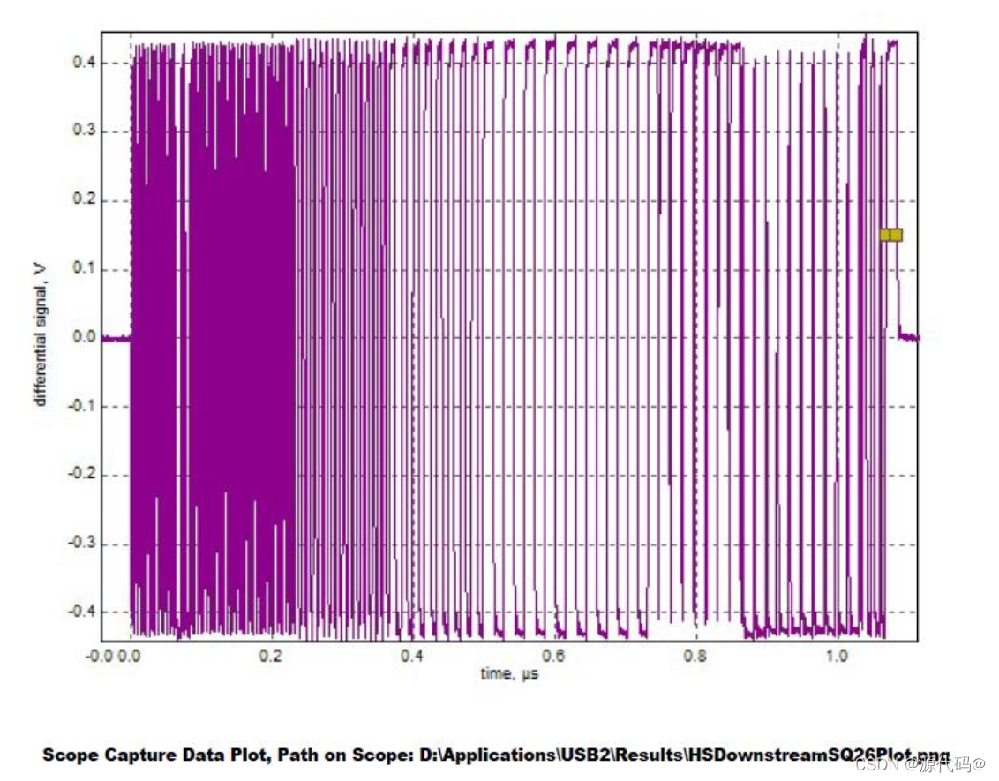

sidebar_position: 3

# USB 信号质量测试指南

> English version is coming soon...

## USB 2.0 测试指南

完整的 USB 2.0 电气信号质量测试内容可以在 USB-IF 官网中找到：

- [USB 2.0 Electrical Compliance Specification | USB-IF Document Library](https://www.usb.org/document-library/usb-20-electrical-compliance-test-specification-version-107)

主要有：

- 眼图
- 信号速率
- 上升下降时间
- 单调性测试
  
等测试项。

具体测试步骤根据相应测试仪器（示波器）或对应测试实验室的指南进行，这里介绍如何让 K3 USB 控制器产生相应的测试波形。

USB2.0 的测试波形 (Test pattern) 选项有以下几种（具体可参考 USB 2.0 Spec 7.1.20 ）：

- Test SE0 NAK
- Test J
- Test K
- Test Packet 
- Test Force Enable

测试上升下降时间、眼图、抖动、其他动态波形规范等信号质量时选用的是 Test Packet 的 Test pattern，具体的测试包组成，参阅 USB 2.0 Spec 7.1.20 。


### USB 2.0 Device 信号质量测试指南

Device 模式下，测试波形是支持以下两种方式，根据测试环境遍历任选其一即可：
-  上位机使用 xHCI Electrical Test Tool 配置测试波形： Host 安装 USB-IF 的标准测试工具 [xHCI Electrical Test Tool](https://www.usb.org/document-library/xhsett) ，向设备发送控制包 Set Feature(Test Packet) 实现。
-  K3 使用 Linux DebugFS 进行配置： Device 端直接操作控制器，进行配置， K3 SDK 上是通过 linux debugfs 节点进行配置。

#### K3 USB3.0 DRD 控制器 Device 模式（ HighSpeed 连接）测试

此测试只适用开发板 / 产品板有该 USB3.0 DRD 控制器做 Device 模式的规格，或者支持手动切换到 device 模式，具体请参考 [USB 通用开发指南 ](1-USB-General-Developer-Guide.md) 。

测试时，须保证 USB3.0 DRD 控制器工作在 Device 模式，且测试夹具线材等为最大支持 USB2.0 High-Speed 规格，而不是 USB3.0 SuperSpeed 规格。

可以使用 gadget-setup.sh 脚本配置 USB3.0 DRD 控制器进入 Device 工作模式：

```
USB_UDC=cad00000.usb3 gadget-setup.sh hid
```

具体的该脚本介绍可参考 [ USB Gadget 开发指南 ](2-USB-Gadget-Developer-Guide.md)

##### 上位机使用 xHCI Electrical Test Tool 配置测试波形

将 K3 开发板的 USB3.0 DRD 端口（原理图中的 USB2_DP/USB2_DN）通过 USB 线材和测试治具接入安装有 xHCI Electrical Test Tool 的上位机，如图选择 VID/PID 0x361c/... 的 Device，选择Device Command 发送 TEST_PACKET 选项，点击 EXECUTE 即可让 K3 USB3.0 DRD 控制器发送测试波形。


##### K3 使用 Linux DebugFS 进行配置

K3 开发板的 USB3.0 DRD 控制器在 Device 模式下，可通过 Linux DebugFS 节点直接操作控制器进行 USB 2.0 HighSpeed 测试波形配置，具体操作如下：

1. 确保开发板已启动并进入系统， USB3.0 DRD 控制器对应的 DebugFS 节点路径为 `/sys/kernel/debug/usb/cad00000.usb3/`。

2. 进入测试模式并发送测试波形：
   ```
   echo test_force_enable > /sys/kernel/debug/usb/cad00000.usb3/testmode
   echo test_packet > /sys/kernel/debug/usb/cad00000.usb3/testmode
   # 其他可选： test_j, test_k, test_se0_nak
   ```

3. 查看当前高速测试模式状态：
   ```
   cat /sys/kernel/debug/usb/cad00000.usb3/testmode
   ```

4. 退出测试模式，恢复正常工作状态：
   ```
   echo none > /sys/kernel/debug/usb/cad00000.usb3/testmode
   ```

操作时，需将开发板的 USB3.0 DRD 端口通过 USB 线材连接至测试治具，执行上述命令后即可在测试治具端观测到对应的测试波形。


### USB 2.0 Host 信号质量测试指南

Host 模式下，只支持使用应用层工具进行配置，该工具支持所有 Host 的所有 USB 2.0 端口。

K3 共有 5 个 USB 控制器，分别为：
- USB2.0 Host
- USB3.0 DRD PortA
- USB3.0 Host PortB
- USB3.0 Host PortC
- USB3.0 Host PortD

用户只需要找到对应的端口的总线号(Bus)、设备号(Dev)、端口号(Port)，无论是控制器 roothub 直出的端口还是下游 HUB 端口，均可以配置让对应端口发送测试波形。

测试需要使用命令行工具 porttest，源码在附录提供。另外，配合 `k3_lsusb` 脚本（源码也在附录），可以非常直观地找到需要测试的端口信息。

**porttest 使用方法：**

```
./porttest /dev/bus/usb/<Bus 号码>/<Dev 号码> <端口号> <测试 PATTERN 代号>
# e.g.:
# ./porttest /dev/bus/usb/001/001 1 4
# 其中测试 PATTERN 代号：
# - Reserved: 0
# - Test_J: 1
# - Test_K: 2
# - Test_SE0_NAK: 3
# - Test_Packet: 4 ，通常测试眼图等选用此波形
# - Test_Force_Enable: 5
```

如对特定端口执行了 Test Packet 的选项后，此时对应端口就会开始发送 Test Packet。

示波器看到的测试波形如下图所示：



#### 1. 准备工作（仅针对 USB3.0 DRD PortA）

如果测试的是 USB3.0 DRD PortA 的 USB 2.0 端口，需要先强制使其进入 Host 模式（需接入 TypeC 转 Host 转接头等适配方案）：

```bash
echo host > /sys/kernel/debug/usb/cad00000.usb3/mode
```

对于其他纯 Host 控制器（USB2.0 Host, PortB, PortC, PortD），无需此操作。

#### 2. 查找对应端口的 Bus 和 Dev 号码

使用 `k3_lsusb` 脚本查看当前系统中的 USB 拓扑结构：

```bash
~ # k3_lsusb
/:  Bus 001 (USB30_PortB).Port 001: Dev 001, Class=root_hub, Driver=xhci-hcd/1p, 480M
        ID 1d6b:0002 Linux Foundation 2.0 root hub
/:  Bus 002 (USB30_PortB).Port 001: Dev 001, Class=root_hub, Driver=xhci-hcd/1p, 5000M
        ID 1d6b:0003 Linux Foundation 3.0 root hub
/:  Bus 003 (USB30_PortC).Port 001: Dev 001, Class=root_hub, Driver=xhci-hcd/1p, 480M
        ID 1d6b:0002 Linux Foundation 2.0 root hub
/:  Bus 004 (USB30_PortC).Port 001: Dev 001, Class=root_hub, Driver=xhci-hcd/1p, 5000M
        ID 1d6b:0003 Linux Foundation 3.0 root hub
        |__ Port 001: Dev 002, If 0, Class=Video, Driver=uvcvideo, 5000M
                ID 2bdf:028b
        |__ Port 001: Dev 002, If 1, Class=Video, Driver=uvcvideo, 5000M
                ID 2bdf:028b
        |__ Port 001: Dev 002, If 2, Class=Audio, Driver=snd-usb-audio, 5000M
                ID 2bdf:028b
        |__ Port 001: Dev 002, If 3, Class=Audio, Driver=snd-usb-audio, 5000M
                ID 2bdf:028b
/:  Bus 005 (USB30_PortD).Port 001: Dev 001, Class=root_hub, Driver=xhci-hcd/1p, 480M
        ID 1d6b:0002 Linux Foundation 2.0 root hub
/:  Bus 006 (USB30_PortD).Port 001: Dev 001, Class=root_hub, Driver=xhci-hcd/1p, 5000M
        ID 1d6b:0003 Linux Foundation 3.0 root hub
/:  Bus 007 (USB20_Host_Only).Port 001: Dev 001, Class=root_hub, Driver=xhci-hcd/1p, 480M
        ID 1d6b:0002 Linux Foundation 2.0 root hub
        |__ Port 001: Dev 002, If 0, Class=Mass Storage, Driver=usb-storage, 480M
                ID 0781:5591 SanDisk Corp. Ultra Flair
/:  Bus 008 (USB30_PortA_OTG).Port 001: Dev 001, Class=root_hub, Driver=xhci-hcd/1p, 480M
        ID 1d6b:0002 Linux Foundation 2.0 root hub
/:  Bus 009 (USB30_PortA_OTG).Port 001: Dev 001, Class=root_hub, Driver=xhci-hcd/1p, 5000M
        ID 1d6b:0003 Linux Foundation 3.0 root hub
```

通过输出，可以直接看到对应控制器的名字（如 `USB20_Host_Only`, `USB30_PortB` 等）。

- **测试控制器直出端口（Root Hub）：**
  如果要测试 USB3.0 PortB 的直出 USB2.0 端口，找到 `Bus 005 (USB30_PortD)`，其设备号为 `Dev 001`，端口号为 `1`。

- **测试控制器未接设备的其他端口：**
   如果是测试控制器（如 `USB20_Host_Only`）下未接设备的其他端口，可以直接指定对应的 Bus 和 Dev 号码以及目标端口号。例如，根据上面的输出，`USB20_Host_Only` 所在的 Bus 为 `007`，其 Root Hub 的设备号为 `Dev 001`。如果要测试该控制器的第 2 个下行端口（假设该端口未接设备），则对应 Bus 和 Dev 填 `007/001`，端口号填 `2`。

#### 3. 执行测试命令

根据上一步获取的 Bus 和 Dev，执行 `porttest` 命令进入 Test Packet 模式：

```bash
porttest /dev/bus/usb/<Bus号码>/<Dev号码> <端口号> 4
```

**举例（测试 USB30_PortD 直出端口）：**
```bash
~ # porttest /dev/bus/usb/005/001 1 4
Setting port 1 to test mode 4 (Test_Packet)
Test mode successful
```

### USB-IF USB 2.0 产品合规测试介绍

**参考：** https://www.usb.org/usb2

针对 USB 2.0 产品，除了信号质量测试， USB-IF 还规定了其他的一些测试：功能测试、互操作性测试。

这些测试集合统称为 USB 2.0 产品合规测试（ USB 2.0 Compliance Test）。

USB 2.0 合规测试是针对 USB 外设产品的测试，如 HUB、 U 盘、等 USB 外设产品。

使用 K3 开发板开发的基于 Linux Gadget 驱动的 USB 2.0 外设成品也属于 USB 2.0 产品，如果要使用 USB 商标，必须通过 USB 2.0 产品合规测试，拿到 USB-IF 的认证。 

#### 功能（ Functional）
功能测试环节通过 USB-IF（ USB 实施者论坛）的工具 USB30CV 执行。

该工具会针对《 USB 2.0 规范》第 9 章的要求进行常规测试；

此外，对于任何实现了 USB 标准类的产品，该工具还会执行相应的类测试。 

USB30CV 工具是仅支持 Windows PC，并且要求上位机是标准 xHCI 规范控制器。

USB30CV 软件包可在 USF-IF 官方网站下载：[https://www.usb.org/document-library/usb3cv](https://www.usb.org/document-library/usb3cv)。

*Note：更老版本是 USB20CV，这是基于上位机采用 EHCI 控制器，目前新款 Windows PC 基本都是采用 XHCI，因此使用 USB30CV 测试即可。

#### 电气（ Electrical）

经批准的 USB 2.0 示波器供应商
- Keysight
- Rohde & Schwarz
- Tektronix
- Teledyne LeCroy

合规计划的电气测试环节聚焦于物理层，需使用多种工具。

在高速信号质量测试中， USB-IF 仅认可使用经批准的信号质量测试治具所采集的测试数据。

此外， USB-IF 仅接受通过其工具 USBET 生成的 USB 2.0 信号质量分析报告。

对于其他电气测试，需要参考 USB-IF 的 Low/Full-speed electrical test specification 和 [USB 2.0 Electrical test specification](https://www.usb.org/document-library/usb-20-electrical-compliance-test-specification-version-107)，并联系经批准的示波器供应商，获取相关测试治具及测试方法说明。通常是采用第三方实验室协助进行测试。

《 USB 2.0 电气合规测试规范》可在 USB-IF 的文档库中下载。

#### 互操作性（ Interoperability）

合规计划的互操作性测试环节，重点验证被测产品与 “已知合格的 USB 产品” 之间的协同工作能力。 

USB 2.0 的互操作性测试方法与 USB 3.2 采用相同标准。相关的工具资料 [xHCI Interoperability Test Procedures For Peripherals, Hubs and Hosts](https://www.usb.org/document-library/xhci-interoperability-test-procedures-peripherals-hubs-and-hosts-version-096)

## USB 3.0 测试指南

USB 3.0 测试涉及使用经过 USB-IF 认证的高速示波器和相关测试治具、仪器。

这些因不同设备供应商而差异，请参考相关测试供应商的文档和操作步骤。

这里只简要介绍如何配置 K3 的 USB 3.0 PHY 进入测试模式。

### USB 3.0 Device Tx 信号质量测试指南

首先启动 gadget-setup 脚本（参考 USB Gadget 开发指南）拉起 device，连接测试夹具。

```
USB_UDC=cad00000.usb3 gadget-setup hid
```

测试夹具对端（上位机）使用 USB 3.0 SuperSpeed LTSSM 规定的标准方法（见 USB 3.0 Spec 7.5.5 ）：

SSTX+、 SSTX- 接入 Rx Termination，让 Device 端 LSTTM 进入 LFPS Polling 状态。

此时上位机测试组件不响应， Device 发出的第一个 Polling.LFPS 超时让 Device 状态机进入 Compliance Mode。

此时查看 DebugFS， USB 3.0 Link State 进入 Compliance 模式：

```
cat /sys/kernel/debug/usb/cad00000.usb3/link_state
Compliance
```

后续对端发送 Ping.LFPS 切换下一个 pattern。

### USB 3.0 Host Tx 信号质量测试指南


测试夹具对端使用 USB 3.0 SuperSpeed LTSSM 规定的标准方法（见 USB 3.0 Spec 7.5.5 ）：

SSTX+、 SSTX- 接入 Rx Termination，让 Host 端口 LTSSM 进入 LFPS Polling 状态。

此时上位机测试组件不响应， Host 端口发出的第一个 Polling.LFPS 超时让 Host 端口状态机进入 Compliance Mode。

后续对端发送 Ping.LFPS 切换下一个 pattern。

此外 K3 上可以使用 k3_usb3_comp 脚本配置强制进入 Compliance 模式。

1. 执行命令进入 cp0 pattern
   ```
   ~ # k3_usb3_comp d
   Final Mode is:
   host
   Disabling ports on USB30_PortD (81a00000)...
   Disabling port01...
   Disabling port02...

   Entering CP0 compliance mode on USB30_PortD... /sys/kernel/debug/usb/81a00000.usb3/link_state
   Done.

   Port status (portsc):
   port01: 0x0a000080 Powered-off Not-connected Disabled Link:Disabled PortSpeed:0 Change: Wake: WCE WOE
   port02: 0x0a000140 Powered-off Not-connected Disabled Link:Compliance mode PortSpeed:0 Change: Wake: WCE WOE
   ```

2. 执行命令切换 pattern：
   ```
   ~ # k3_usb3_comp a toggle
   Toggling CP compliance on USB30_PortD (81a00000)..
   Done. CP compliance toggled.
   ```

### USB 3.0 Rx 信号质量测试指南

Rx Compliance 测试是使链路进入 Loopback mode。

进入方法和上文提到的 Tx 信号质量测试类似，也是基于规范定义的标准方法进入。

USB 3.0 控制器在 link training 的 Polling.Configuration 阶段，如果检测到 T2 pattern 中 Loopback bit 位置位，就会自动配置 USB 3.0 链路进入 Loopback mode（具体可参考 USB 3.0 规范的 7.5.10 和 7.5.11 章节）。


### USB-IF USB 3.0 产品合规测试介绍


**参考：** https://www.usb.org/usb-32

针对 USB 3.0 产品，除了电气信号质量测试， USB-IF 还规定了其他的一些测试：功能测试、互操作性测试、链路层测试。

#### 功能（ Functional）
功能测试环节通过 USB-IF（ USB 实施者论坛）的工具 USB30CV 执行。

该工具会针对《 USB 3.0 规范》第 9 章的要求进行常规测试；

此外，对于任何实现了 USB 标准类的产品，该工具还会执行相应的类测试。 

USB30CV 工具是仅支持 Windows PC，并且要求上位机是标准 xHCI 规范控制器。

USB30CV 软件包可在 USF-IF 官方网站下载： https://www.usb.org/document-library/usb3cv。

#### 链路层测试（ Link Test）

- [Link Layer Test Specification ](https://www.usb.org/document-library/usb-32-link-layer-test-specification)

#### 电气（ Electrical）

经批准的 USB 3.0 示波器供应商

- Anritsu
- Keysight
- Rohde & Schwarz
- Tektronix
- Teledyne LeCroy

合规计划的电气测试环节聚焦于物理层，需使用多种工具。

在高速信号质量测试中， USB-IF 仅认可使用经批准的信号质量测试治具所采集的测试数据。

此外， USB-IF 仅接受通过其工具 USBET 生成的 USB 3.0 信号质量分析报告。

对于其他电气测试，需要参考 USB-IF 的以下规范 :

- [The Electrical Compliance Test Specification for SuperSpeed USB 10 Gbps Rev. 1.0](https://www.usb.org/document-library/electrical-compliance-test-specification-superspeed-usb-10-gbps-rev-10)
- [The Electrical Compliance Test Specification for SuperSpeed USB Rev. 1.0a](https://www.usb.org/document-library/electrical-compliance-test-specification-superspeed-usb-rev-10a)

并联系经批准的示波器供应商，获取相关测试治具及测试方法说明。通常是采用第三方实验室协助进行测试。

#### 互操作性（ Interoperability）

合规计划的互操作性测试环节，重点验证被测产品与 “已知合格的 USB 产品” 之间的协同工作能力。 

相关的工具资料 [xHCI Interoperability Test Procedures For Peripherals, Hubs and Hosts](https://www.usb.org/document-library/xhci-interoperability-test-procedures-peripherals-hubs-and-hosts-version-096)

## 附录

### porttest 源码


推送源码到 Bianbu 中，终端打开文件所在目录执行：

```
gcc porttest.c -o porttest --static
```

生成目标文件： porttest。

```c
/* porttest -- put a USB hub port into TEST mode */
/* To build:  gcc -o porttest porttest.c */

#include <stdio.h>
#include <stdlib.h>
#include <unistd.h>
#include <fcntl.h>
#include <errno.h>
#include <sys/ioctl.h>

#include <linux/usbdevice_fs.h>
#include <linux/usb/ch9.h>

#define USB_MAXCHILDREN         31

#include <linux/usb/ch11.h>

char *mode_names[] = {
        "Reserved",             /* 0 */
        "Test_J",               /* 1 */
        "Test_K",               /* 2 */
        "Test_SE0_NAK",         /* 3 */
        "Test_Packet",          /* 4 */
        "Test_Force_Enable",    /* 5 */
        /* Remaining values are reserved */
};
#define MAX_TEST_MODE           5

int main(int argc, char **argv)
{
        const char *filename;
        int portnum, testmode;
        int fd;
        int rc;
        struct usbdevfs_ctrltransfer ctl;

        if (argc != 4) {
                fprintf(stderr, "Usage: porttest device-filename portnum testmode\n");
                return 1;
        }
        filename = argv[1];

        portnum = atoi(argv[2]);
        if (portnum <= 0 || portnum > USB_MAXCHILDREN) {
                fprintf(stderr, "Invalid port number: %d\n", portnum);
                return 1;
        }

        testmode = atoi(argv[3]);
        if (testmode <= 0 || testmode > MAX_TEST_MODE) {
                fprintf(stderr, "Invalid test mode: %d\n", testmode);
                return 1;
        }

        fd = open(filename, O_WRONLY);
        if (fd < 0) {
                perror("Error opening device file");
                return 1;
        }

        printf("Setting port %d to test mode %d (%s)\n", portnum, testmode,
                        mode_names[testmode]);

        ctl.bRequestType = USB_DIR_OUT | USB_RT_PORT;
        ctl.bRequest = USB_REQ_SET_FEATURE;
        ctl.wValue = USB_PORT_FEAT_TEST;
        ctl.wIndex = (testmode << 8) | portnum;
        ctl.wLength = 0;

        rc = ioctl(fd, USBDEVFS_CONTROL, &ctl);
        if (rc < 0) {
                perror("Error in ioctl");
                return 1;
        }
        printf("Test mode successful\n");

        close(fd);
        return 0;
}
```

### k3_usb3_comp 脚本

```bash
#!/bin/sh
# K3 USB3.0 Compliance Test Helper Script

get_port_name() {
    case "$1" in
        *81400000*) echo "USB30_PortB" ;;
        *81700000*) echo "USB30_PortC" ;;
        *81a00000*) echo "USB30_PortD" ;;
        *cad00000*) echo "USB30_PortA_OTG" ;;
        *) echo "" ;;
    esac
}

get_base_addr() {
    case "$1" in
        a|A|USB30_PortA_OTG) echo "cad00000" ;;
        b|B|USB30_PortB) echo "81400000" ;;
        c|C|USB30_PortC) echo "81700000" ;;
        d|D|USB30_PortD) echo "81a00000" ;;
        *) echo "" ;;
    esac
}

collect_usb_info() {
    for usb_path in /sys/devices/platform/soc/*.usb3; do
        if [ ! -d "$usb_path" ]; then
            continue
        fi

        base=$(basename "$usb_path" | sed 's/\.usb3$//')
        port_name=$(get_port_name "$base")

        if [ -z "$port_name" ]; then
            continue
        fi

        speed="SuperSpeed+HighSpeed"
        if [ -f "$usb_path/of_node/maximum-speed" ]; then
            max_speed=$(cat "$usb_path/of_node/maximum-speed" 2>/dev/null)
            if [ "$max_speed" = "high-speed" ]; then
                speed="HighSpeed Only"
            fi
        fi

        mode=""
        if [ "$port_name" = "USB30_PortA_OTG" ]; then
            if [ -f "/sys/kernel/debug/usb/${base}.usb3/mode" ]; then
                mode=$(cat "/sys/kernel/debug/usb/${base}.usb3/mode" 2>/dev/null)
            fi
        fi

        xhci_name=""
        for xhci in "$usb_path"/xhci-hcd.*.auto; do
            if [ -d "$xhci" ]; then
                xhci_name=$(basename "$xhci")
                break
            fi
        done

        echo "${base}|${port_name}|${speed}|${mode}|${xhci_name}"
    done
}

print_status() {
    echo "This board and image has enabled the following USB3.0 Controllers:"
    echo ""

    while IFS='|' read -r base port_name speed mode xhci_name; do
        if [ "$port_name" = "USB30_PortA_OTG" ]; then
            if [ -n "$mode" ]; then
                echo "  ${port_name}: ${speed},  Current Mode: ${mode}"
            else
                echo "  ${port_name}: ${speed}"
            fi
        else
            echo "  ${port_name}: ${speed}"
        fi
    done << EOF
$(collect_usb_info)
EOF
    echo ""
    echo "You can only select those with SuperSpeed enabled port!!!"
    echo "  run $0 <Port Name> to enter compliance mode"
    echo "  run $0 <Port Name> toggle to manually toggle patterns"
    echo ""
    echo "Spacemit K3 USB Compliance Test Tool v0.1"
    echo ""
}

do_cp_test() {
    target_base="$1"
    is_toggle="$2"

    found=0
    target_port_name=""
    target_xhci=""

    while IFS='|' read -r base port_name speed mode xhci_name; do
        if [ "$base" = "$target_base" ]; then
            found=1
            target_port_name="$port_name"
            target_xhci="$xhci_name"
            break
        fi
    done << EOF
$(collect_usb_info)
EOF

    if [ $found -eq 0 ]; then
        echo "Error: USB controller with base address ${target_base} not found" >&2
        return 1
    fi

    debugfs_link="/sys/kernel/debug/usb/${target_base}.usb3/link_state"
    mode_link="/sys/kernel/debug/usb/${target_base}.usb3/mode"
    echo "host" > "$mode_link"
    echo "Final Mode is:"
    cat "$mode_link"
    sleep 2

    if [ ! -f "$debugfs_link" ]; then
        echo "Error: debugfs node ${debugfs_link} not found" >&2
        echo "Please ensure debugfs is mounted and USB debug support is enabled" >&2
        return 1
    fi

    if [ "$is_toggle" = "toggle" ]; then
        echo "Toggling CP compliance on ${target_port_name} (${target_base})..."
        echo cp > "$debugfs_link"
        echo "Done. CP compliance toggled."
        return 0
    fi

    if [ -z "$target_xhci" ]; then
        echo "Warning: xhci-hcd instance not found for ${target_port_name}" >&2
        echo "Skipping port disable step, directly entering CP mode..."
    else
        xhci_ports_path="/sys/kernel/debug/usb/xhci/${target_xhci}/ports"

        if [ -d "$xhci_ports_path" ]; then
            echo "Disabling ports on ${target_port_name} (${target_base})..."

            for port_dir in "$xhci_ports_path"/port*; do
                if [ ! -d "$port_dir" ]; then
                    continue
                fi

                portsc_file="$port_dir/portsc"

                if [ -f "$portsc_file" ]; then
                    port_num=$(basename "$port_dir")
                    echo "  Disabling ${port_num}..."
                    echo disabled > "$portsc_file" 2>/dev/null
                fi
            done
        else
            echo "Warning: xhci ports path ${xhci_ports_path} not found" >&2
        fi
    fi

    echo ""
    echo "Entering CP0 compliance mode on ${target_port_name}... ${debugfs_link}"
    echo cp > "$debugfs_link"
    echo "Done."
    echo ""

    if [ -n "$target_xhci" ]; then
        if [ -d "/sys/kernel/debug/usb/xhci/${target_xhci}/ports" ]; then
            echo "Port status (portsc):"
            for port_dir in "/sys/kernel/debug/usb/xhci/${target_xhci}/ports"/port*; do
                if [ ! -d "$port_dir" ]; then
                    continue
                fi

                portsc_file="$port_dir/portsc"
                if [ -f "$portsc_file" ]; then
                    port_num=$(basename "$port_dir")
                    portsc_val=$(cat "$portsc_file" 2>/dev/null)
                    echo "  ${port_num}: ${portsc_val}"
                fi
            done
        fi
    fi
}

main() {
    if [ $# -eq 0 ]; then
        print_status
        exit 0
    fi

    port_arg="$1"
    toggle_arg="$2"

    base_addr=$(get_base_addr "$port_arg")

    if [ -z "$base_addr" ]; then
        echo "Error: Invalid port specification '${port_arg}'" >&2
        echo "Valid options: a/b/c/d or USB30_PortA_OTG/USB30_PortB/USB30_PortC/USB30_PortD" >&2
        exit 1
    fi

    do_cp_test "$base_addr" "$toggle_arg"
}

main "$@"

```

### k3_lsusb 源码

```sh
#!/bin/sh
get_port_name() {
        case "$1" in
                *81400000*) echo "USB30_PortB" ;;
                *81700000*) echo "USB30_PortC" ;;
                *81a00000*) echo "USB30_PortD" ;;
                *c0a00000*) echo "USB20_Host_Only" ;;
                *cad00000*) echo "USB30_PortA_OTG" ;;
                *) echo "" ;;
        esac
}
mapping_file=$(mktemp 2>/dev/null || echo "/tmp/usb_mapping_$$")
for devspec_file in /sys/bus/usb/devices/usb*/devspec; do
        [ -f "$devspec_file" ] || continue
        bus_num=$(basename "$(dirname "$devspec_file")" | sed 's/usb//')
        devspec=$(cat "$devspec_file" 2>/dev/null) || continue
        port_name=$(get_port_name "$devspec")
        [ -n "$port_name" ] && echo "${bus_num}|${port_name}" >> "$mapping_file"
done
lsusb -tv | while IFS= read -r line; do
        if echo "$line" | grep -q "Bus [0-9]"; then
                bus_num=$(echo "$line" | sed -n 's/.*Bus 0*\([0-9]\+\).*/\1/p')
                if [ -f "$mapping_file" ] && [ -n "$bus_num" ]; then
                        port_name=$(grep "^${bus_num}|" "$mapping_file" | cut -d'|' -f2)
                        if [ -n "$port_name" ]; then
                                echo "$line" | sed "s|\(Bus 0*${bus_num}\)\(\.\)|\1 (${port_name})\2|"
                        else
                                echo "$line"
                        fi
                else
                        echo "$line"
                fi
        else
                echo "$line"
        fi
done
rm -f "$mapping_file"
```