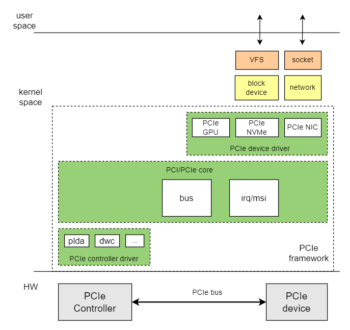

# PCIe

介绍 PCIe 的功能和使用方法。

## 模块介绍

PCIe（Peripheral Component Interconnect Express） 是一种高速串行计算机扩展总线标准。采用高速串行点对点双通道高带宽传输，所连接设备独享通道带宽。

K3 平台提供 5 个 PCIe 控制器（Port A ~ Port E），配备 6 个独立 PHY，支持连接多种 PCIe 外设，包括 NVMe SSD、SATA 控制器、Wi-Fi 模块等。

**注意：** Port D 与 USB3 控制器共享同一个 PHY 硬件资源，无法同时启用。使用时需在设备树中根据实际需求选择启用 PCIe 或 USB3。

### 功能介绍



Linux PCIe 子系统框架由三部分组成：

1. **PCIe 核心**

   - PCIe 总线枚举、资源分配、中断处理
   - PCIe 设备添加和删除
   - PCIe 设备驱动注册与注销

2. **PCIe 控制器驱动**

   - 对 PCIe 主机控制器进行操作

3. **PCIe 设备驱动**

   - PCIe 具体设备的驱动，如 GPU、NIC 和 NVMe 等

### 源码结构介绍

控制器驱动代码位于 `drivers/pci/controller/dwc` 目录下：

```
|-- pcie-designware.c           #dwc pcie驱动公共代码
|-- pcie-designware-host.c      #dwc pcie主机驱动代码
|-- pcie-spacemit-k1.c          #k3 pcie控制器驱动
|-- spacemit_pcie_phy.c         #k3 pcie phy驱动
```

## 关键特性

### 特性

| 特性 | 特性说明 |
| :-----| :----|
| 支持模式 | 支持 RC 模式 |
| 支持协议和lane数 | 支持 Gen3x1, Gen3x2, Gen3x4, Gen3x8 |
| 支持设备 | 支持NVMe SSD、PCIe转SATA、PCIe 网卡和 PCIe 显卡 |

### 控制器与 PHY 对应关系

K3 平台 5 个 PCIe 控制器与 6 个 PHY 的对应关系如下：

| 控制器 | 端口 | 最大lane数 | 可用 PHY | 说明 |
| :-----| :----| :----| :----| :----|
| pcie0_rc | Port A | x8 | phy0~phy5 | 支持 x8/x4/x2 模式，可聚合多个 PHY |
| pcie1_rc | Port B | x2 | phy1 | 仅在 Port A 使用 x2 模式时可用 |
| pcie2_rc | Port C | x2 | phy2, phy3 | 支持 x2（双PHY）或 x1 模式 |
| pcie3_rc | Port D | x1 | phy4 | 与 USB3 共享 PHY，二选一 |
| pcie4_rc | Port E | x1 | phy5 | 独立使用 |

### 性能参数

| SSD 型号（容量） | 顺序读(MB/s) | 顺序写(MB/s) | 随机读(4K MB/s) | 随机写(4K MB/s) |
| :-----| :----: | :----: | :----: | :----: |
| Colorful CN600 128GB | 1280 | 1156 | 358 | 352 |
| HS-SSD-C2000Pro 256G | 2150 | 258 | 321 | 209 |
| MAXIO MAP1202 512G | 3470 | 3138 | 282 | 325 |

> 数据基于 `deb1` (K3) + PCIe Gen3x4 插槽，在 Buildroot 2024.12 + linux-6.18 SDK 版本上，使用下面的 `fio` 测试方法，随机场景均为 4K block。

**测试方法**

```
# 顺序读
fio --name=nvme_seq_read --filename=/mnt/nvme_vfat/fiotest.bin --size=1G --bs=1M --rw=read --ioengine=libaio --direct=1 --iodepth=32 --numjobs=1 --time_based --runtime=30 --group_reporting

# 顺序写
fio --name=nvme_seq_write --filename=/mnt/nvme_vfat/fiotest.bin --size=1G --bs=1M --rw=write --ioengine=libaio --direct=1 --iodepth=32 --numjobs=1 --time_based --runtime=30 --group_reporting

# 随机读（4K）
fio --name=nvme_rand_read --filename=/mnt/nvme_vfat/fiotest.bin --size=1G --bs=4k --rw=randread --ioengine=libaio --direct=1 --iodepth=32 --numjobs=1 --time_based --runtime=30 --group_reporting

# 随机写（4K）
fio --name=nvme_rand_write --filename=/mnt/nvme_vfat/fiotest.bin --size=1G --bs=4k --rw=randwrite --ioengine=libaio --direct=1 --iodepth=32 --numjobs=1 --time_based --runtime=30 --group_reporting
```

## 配置介绍

主要包括 **驱动使能配置** 和 **DTS 配置**

### CONFIG配置

`CONFIG_PCI`：为 PCI 和 PCIe 总线协议提供支持，默认情况，此选项为 `Y`

```
Device Drivers
    PCI support (PCI [=y])
```

`PCIE_SPACEMIT_K1`：为 K3 PCIe 控制器驱动提供支持，默认情况下，此选项为 `Y`

```
Device Drivers
    PCI support (PCI [=y])
        PCI controller drivers
            DesignWare-based PCIe controllers
                SpacemiT K1 PCIe controller - Host Mode (PCIE_SPACEMIT_K1 [=y])
```

### DTS 配置

#### 配置空间分配

K3 的每个 PCIe Root Complex 都在 DTS 中声明了 4 类地址窗口：`config` 配置空间、`I/O` 空间、`MEM non-prefetchable` 空间和 `MEM prefetchable` 空间。各控制器在 `linux-6.18/arch/riscv/boot/dts/spacemit/k3.dtsi` 中的分配如下：

**各控制器地址空间基地址：**

| 控制器 | config | I/O | 非预取 MEM | 可预取 MEM |
| :--- | :--- | :--- | :--- | :--- |
| Port A (`pcie0_rc`) | `0x11_0000_0000` | `0x11_0001_0000` | `0x11_0011_0000` | `0x18_0000_0000` |
| Port B (`pcie1_rc`) | `0x11_8000_0000` | `0x11_8001_0000` | `0x11_8011_0000` | `0x16_0000_0000` |
| Port C (`pcie2_rc`) | `0x12_0000_0000` | `0x12_0001_0000` | `0x12_0011_0000` | `0x15_0000_0000` |
| Port D (`pcie3_rc`) | `0x12_8000_0000` | `0x12_8001_0000` | `0x12_8011_0000` | `0x14_0000_0000` |
| Port E (`pcie4_rc`) | `0x12_c000_0000` | `0x12_c001_0000` | `0x12_c011_0000` | `0x13_0000_0000` |

**各窗口大小：**

| 窗口类型 | Port A / B / C | Port D / E |
| :--- | :---: | :---: |
| config | 64 KiB | 64 KiB |
| I/O | 1 MiB | 1 MiB |
| 非预取 MEM | ~2046.94 MiB (`0x7fef0000`) | ~1022.94 MiB (`0x3fef0000`) |
| 可预取 MEM | 4 GiB | 4 GiB |

> Port D / E 的非预取 MEM 窗口较小，是因为其整体地址空间窗口比 Port A / B / C 小，扣除 config + I/O 区域后剩余空间更少。

##### 配置空间详细说明

以 Port A (`pcie0_rc`) 为例，说明 DTS 中地址空间的配置方式：

```c
pcie0_rc: pcie@80000000 {
        ...
        reg = <0x0 0x80000000 0x0 0x00001000>, /* dbi */
              <0x0 0x80100000 0x0 0x00001000>, /* dbi2 */
              <0x0 0x80300000 0x0 0x00003f20>, /* atu registers */
              <0x11 0x00000000 0x0 0x00010000>, /* config space */
              <0x0 0x82900000 0x0 0x00001000>; /* phy ahb (link) */
        reg-names = "dbi", "dbi2", "atu", "config", "link";
        ranges = <0x01000000 0x00 0x00010000 0x11 0x00010000 0x0 0x00100000>,
                 <0x02000000 0x0 0x00110000 0x11 0x00110000 0x0 0x7fef0000>,
                 <0x43000000 0x18 0x00000000 0x18 0x00000000 0x1 0x00000000>;
        ...
};
```

`ranges` 每一项的格式为 `<flags child-bus-address cpu-physical-address size>`，其中 flags 含义为：

| flags | 类型 |
| :--- | :--- |
| `0x01000000` | I/O 空间 |
| `0x02000000` | 32 位不可预取内存空间 |
| `0x43000000` | 64 位可预取内存空间 |

对应到 Port A 的三条 `ranges` 条目：

| 窗口 | CPU 物理地址 | 大小 |
| :--- | :--- | :--- |
| I/O | `0x11_0001_0000` | `0x0010_0000`（1 MiB） |
| 非预取 MEM | `0x11_0011_0000` | `0x7fef_0000`（~2046.94 MiB） |
| 可预取 MEM | `0x18_0000_0000` | `0x1_0000_0000`（4 GiB） |

`config` 空间通过 `reg` 属性分配，基地址 `0x11_0000_0000`，大小 64 KiB。

#### PHY 配置

K3 PCIe 使用独立的 PHY 节点，需在方案 DTS 中同时启用 PHY 和控制器。

PHY 节点定义在 `k3.dtsi` 中：

```c
phy0: phy-pcie@81d00000 {
        compatible = "spacemit,k3-pcie-phy";
        reg = <0x0 0x81d00000 0x0 0x1000>;
        spacemit,syscon-apb-spare = <&pll>;
        num-lanes = <2>;
        spacemit,phy-id = <0>;
        #phy-cells = <0>;
        status = "disabled";
};
```

#### pinctrl 配置

PCIe 的 `pinctrl` 只负责边带信号（sideband signals），不负责高速差分 Lane。真正的数据链路由 `phys = <&phyX ...>` 绑定到 PCIe PHY 节点，`pinctrl` 主要处理以下几类信号：

- `PERST#`：设备复位信号
- `WAKE#`：设备唤醒信号
- `CLKREQ#`：参考时钟请求信号

配置步骤建议按下面顺序做：

1. 先根据原理图确认板子实际接出了哪些边带信号，以及这些信号落在哪组 PAD 上。
2. 再到 `k3-pinctrl.dtsi` 中查找对应的 `pcie*_cfg` 组。
3. 如果公共 `pinctrl` 组和你的板级连线不完全一致，就在板级 DTS 里重新定义该组，只保留实际接出的 PAD。

`K3_PADCONF(pin, func)` 中的 `pin` 是 PAD 编号，`func` 是该 PAD 选择的复用功能。`bias-disable`、`bias-pull-up`、`drive-strength`、`power-source` 则要和板级电压域、上拉方式保持一致。

以 `deb1` 为例，板级 DTS 对公共 pinctrl 组做了裁剪。比如 `pcie0-1-cfg` 只保留了 `PERST#` 和 `CLKREQ#`，没有配置 `WAKE#`：

```c
pcie0-1-cfg {
        pcie0-0-pins {
                pinmux = <K3_PADCONF(79, 5)>,
                         <K3_PADCONF(81, 5)>;
                bias-pull-up;
                drive-strength = <33>;
                power-source = <1800>;
        };
};
```

`power-source` 字段的单位为 mV，`<1800>` 对应 1.8 V；若板级将边带信号接到 3.3 V（，需要根据原理图把该值改成 `<3300>` ，以免 PAD 供电域与外设不匹配。

如果你的板子没有把 `WAKE#` 接出来，可以参照这种方式在板级 DTS 中覆盖默认 pin 组，而不是硬套共享 `k3-pinctrl.dtsi` 里的三线配置。

#### 方案 DTS 配置示例（以 deb1 为例）

`deb1` 板级文件使用的是 `k3_deb1.dts`，实际启用了 `phy0/1/2/3/5` 和 `pcie0/1/2/4`，没有启用 `phy4` / `pcie3_rc`。

这里需要注意 Port A / Port B 的关系： `k3_deb1.dts` 示例里虽然写了 `pcie0_rc { num-lanes = <4>; }`，但驱动在检测到 bifurcation GPIO 置位后，会把 Port A 运行时降到 x2，并把另外的 x2 lane 让给 Port B。也就是说，`pcie1_rc` 能否真正带起，取决于分叉 GPIO 的实际电平，而不只是 DTS 里的 `num-lanes` 静态值。

首先启用相关 PHY：

```c
&phy0{
        status = "okay";
};

&phy1{
        status = "okay";
};

&phy2{
        status = "okay";
};

&phy3{
        status = "okay";
};

&phy5{
        status = "okay";
};
```

然后配置各 PCIe 控制器：

```c
&pcie0_rc {
        pinctrl-names = "default";
        pinctrl-0 = <&pcie0_1_cfg>;
        phys = <&phy0>, <&phy1>;
        phy-names = "phy0", "phy1";
        num-lanes = <4>;
        spacemit,bifurcation-gpios = <&gpio 2 25 GPIO_ACTIVE_HIGH>;
        status = "okay";
};

&pcie1_rc {
        pinctrl-names = "default";
        pinctrl-0 = <&pcie1_1_cfg>;
        phys = <&phy1>;
        phy-names = "phy1";
        num-lanes = <2>;
        spacemit,device-detect-gpios = <&gpio 2 25 GPIO_ACTIVE_HIGH>;
        status = "okay";
};

&pcie2_rc {
        pinctrl-names = "default";
        pinctrl-0 = <&pcie2_1_cfg>;
        phys = <&phy2>, <&phy3>;
        phy-names = "phy2", "phy3";
        num-lanes = <2>;
        status = "okay";
};

&pcie4_rc {
        pinctrl-names = "default";
        pinctrl-0 = <&pcie4_0_cfg>;
        phys = <&phy5>;
        phy-names = "phy5";
        num-lanes = <1>;
        status = "okay";
};
```

其中 `pcie0_rc` 的 `spacemit,bifurcation-gpios` 用于控制 Port A 的分叉模式；`pcie1_rc` 的 `spacemit,device-detect-gpios` 则是板级设备检测 GPIO。板级方案移植时，除了 `status` 和 `phys` 之外，这两个 GPIO 也要按原理图一起检查。

**各配置项说明：**

- `pinctrl-0`：选择边带信号实际落在的 PAD。确认 PERST#/WAKE#/CLKREQ# 是否全部焊接，如果某条线未引出，就像上文示例一样裁剪 pin 组，避免错误开启悬空 PAD。
- `phys` / `phy-names`：与控制器绑定的 PHY 列表，顺序要和硬件 lane wiring 一致。例如 deb1 的 Port A 需要占用 `phy0` + `phy1`，否则无法拉到 x4。
- `num-lanes`：描述期望的 lane 数。必须同时满足（1）板级是否真的把这么多 lane 接到插槽；（2）是否与 bifurcation/retimer 的拨码一致。建议把硬件连线表直接写进文档，调试时核对。
- `spacemit,bifurcation-gpios`：根据板级设计决定是否需要配置，该 gpio 检测到高电平，则表示有设备接入到与该 pcie 共用 phy 的 另一个 pcie 接口。`deb1` 这里是决定是否把 lane 分给 Port B。
- `spacemit,device-detect-gpios`：根据板级设计决定是否需要配置，该 gpio 检测到低电平，则表示没有设备接入该 pcie 接口，用来在驱动里屏蔽未插卡的控制器。
- `status`：是否启用该控制器。

#### 完整的 PCIe DTS

以 `pcie0_rc`（Port A）控制器 DTS 为例：

```
pcie0_rc: pcie@80000000 {
        compatible = "spacemit,k1-pcie";
        reg = <0x0 0x80000000 0x0 0x00001000>, /* dbi */
              <0x0 0x80100000 0x0 0x00001000>, /* dbi2 */
              <0x0 0x80300000 0x0 0x00003f20>, /* atu registers */
              <0x11 0x00000000 0x0 0x00010000>, /* config space */
              <0x0 0x82900000 0x0 0x00001000>; /* phy ahb (link) */
        reg-names = "dbi", "dbi2", "atu", "config", "link";

        bus-range = <0x00 0xff>;
        max-link-speed = <3>;
        num-lanes = <8>;
        device_type = "pci";
        #address-cells = <3>;
        #size-cells = <2>;
        ranges = <0x01000000 0x00 0x00010000 0x11 0x00010000 0x0 0x00100000>,
                 <0x02000000 0x0 0x00110000 0x11 0x00110000 0x0 0x7fef0000>,
                 <0x43000000 0x18 0x00000000 0x18 0x00000000 0x1 0x00000000>;

        interrupt-parent = <&saplic>;
        interrupts = <141 IRQ_TYPE_LEVEL_HIGH>;
        interrupt-names = "pcie_irq";

        clocks = <&syscon_apmu CLK_APMU_PCIE_PORTA_BUS>,
                 <&syscon_apmu CLK_APMU_PCIE_PORTA_MSTR>,
                 <&syscon_apmu CLK_APMU_PCIE_PORTA_SLV>;
        clock-names = "dbi", "mstr", "slv";
        resets = <&syscon_apmu RESET_APMU_PCIE_PORTA_DBI>,
                 <&syscon_apmu RESET_APMU_PCIE_PORTA_MSTR>,
                 <&syscon_apmu RESET_APMU_PCIE_PORTA_SLV>;
        reset-names = "dbi", "mstr", "slv";

        linux,pci-domain = <0>;
        msi-parent = <&simsic>;
        spacemit,apmu = <&syscon_apmu 0x1f0>;
        iommu-map = <0x0 &iommu 0x00000 0x10000>;

        status = "disabled";
};
```

## 接口介绍

### API介绍

- **注册 PCI 设备驱动**

```
/* Proper probing supporting hot-pluggable devices */
int __must_check __pci_register_driver(struct pci_driver *, struct module *,
                       const char *mod_name);

/* pci_register_driver() must be a macro so KBUILD_MODNAME can be expanded */
#define pci_register_driver(driver)     \
    __pci_register_driver(driver, THIS_MODULE, KBUILD_MODNAME)
```

- **注销 PCI 设备驱动**

```
void pci_unregister_driver(struct pci_driver *dev);
```

## Debug 介绍

### sysfs

`/sys/bus/pci`：查看系统 PCI 总线设备和驱动信息

```
|-- devices                 // PCI 总线上的设备
|-- drivers                 // PCI 总线上注册的设备驱动
|-- drivers_autoprobe
|-- drivers_probe
|-- rescan
|-- resource_alignment
|-- slots
`-- uevent
```

## 测试介绍

1. 查看 PCI 总线拓扑信息

```
#lspci
```

2. 查看 PCI 设备详细信息

```
lspci -vvvs <BDF>
```

3. NVMe SSD 读测试

```
fio --name read --eta-newline=5s --filename=/dev/nvme0n1 --rw=read --size=2g --io_size=10g --blocksize=1024k --ioengine=libaio --fsync=10000 --iodepth=32 --direct=1 --numjobs=1 --runtime=60 --group_reporting
```

4. NVMe SSD 写测试

```
fio --name write --eta-newline=5s --filename=/dev/nvme0n1 --rw=write --size=2g --io_size=60g --blocksize=1024k --ioengine=libaio --fsync=10000 --iodepth=32 --direct=1 --numjobs=1 --runtime=60 --group_reporting
```

## 兼容 32-bit PCIe EP 设备

### 问题背景

K3 平台的 DDR 物理地址全部位于 4 GiB 以上（起始于 `0x1_0000_0000`）。部分 PCIe EP 设备（如 MT7921E Wi-Fi 网卡）仅支持 32-bit DMA 寻址，无法直接访问 4 GiB 以上的系统内存，导致 DMA 传输失败。

### 解决方案

通过 **restricted DMA pool + dma-ranges 地址映射** 解决：

1. 在内存中预留一块 DMA 专用区域
2. 通过 PCIe ATU（Address Translation Unit）将 EP 设备可见的 32-bit 总线地址映射到该物理内存区域
3. EP 设备的 DMA 操作使用 32-bit 总线地址，由 PCIe 控制器自动完成地址转换

### CONFIG 配置

需要开启以下内核配置：

```
CONFIG_SWIOTLB=y                  # Software I/O TLB，提供 bounce buffer 支持
CONFIG_DMA_CMA=y                  # DMA 连续内存分配
CONFIG_DMA_RESTRICTED_POOL=y      # 支持 restricted DMA pool
```

### DTS 配置

#### 1. 预留 DMA 内存池

在 `reserved-memory` 节点中添加一块 restricted DMA pool。以下示例在 `0x1_f000_0000` 处预留 32 MiB：

```c
reserved-memory {
        #address-cells = <2>;
        #size-cells = <2>;
        ranges;

        pcie_dma_pool: pcie-dma-pool@1f0000000 {
                compatible = "restricted-dma-pool";
                reg = <0x1 0xf0000000 0x0 0x02000000>;  /* 32 MiB */
        };
};
```

#### 2. 配置 PCIe 控制器节点

在对应的 PCIe 控制器节点中添加 `dma-ranges` 和 `memory-region`：

```c
&pcie4_rc {
        /* ... 其他配置 ... */
        dma-ranges = <0x02000000 0x0 0x80000000 0x1 0xf0000000 0x0 0x02000000>;
        memory-region = <&pcie_dma_pool>;
        status = "okay";
};
```

`dma-ranges` 条目含义：

| 字段 | 值 | 说明 |
| :--- | :--- | :--- |
| flags | `0x02000000` | 32-bit 非预取内存空间 |
| PCIe 总线地址 | `0x0_8000_0000` | EP 设备看到的 DMA 地址（32-bit 可达） |
| CPU 物理地址 | `0x1_f000_0000` | 实际物理内存地址 |
| 大小 | `0x0_0200_0000` | 32 MiB |

工作流程：EP 设备向总线地址 `0x8000_0000` 发起 DMA 读写 → PCIe ATU 将其转换为 CPU 物理地址 `0x1_f000_0000` → 访问预留的 DMA 内存池。

## FAQ

### 1. SSD 没有被系统识别，如何判断问题点？

1. **先确认是否在 PCIe 总线上被枚举。** 执行 `lspci | grep -i -E "nvme|non-volatile"`，确认若无任何输出，说明 Host 在 PCIe 总线层面完全没有抓到 NVMe 设备。
2. **核对 pin 配置与电压域。** DTS 里的 `pinctrl`、`power-source`、`spacemit,*-gpios` 必须与板级原理图一致，确保 pin 编号、复用功能、PAD 供电域、电压等级以及实际焊接的边带信号完全配对。
3. **排除 SSD 器件故障。** 更换一块确认良好的 NVMe SSD，或将疑似故障 SSD 接到其他已知可用的平台验证，确认是否为器件损坏。
4. **检查初始化时序与信号质量。** 若链路偶发掉卡或在 Training 阶段失败，需配合示波器/协议分析仪查看 PERST# / CLKREQ# / REFCLK 等时序、电压摆幅与 SI，必要时与原厂工程支持联调。

