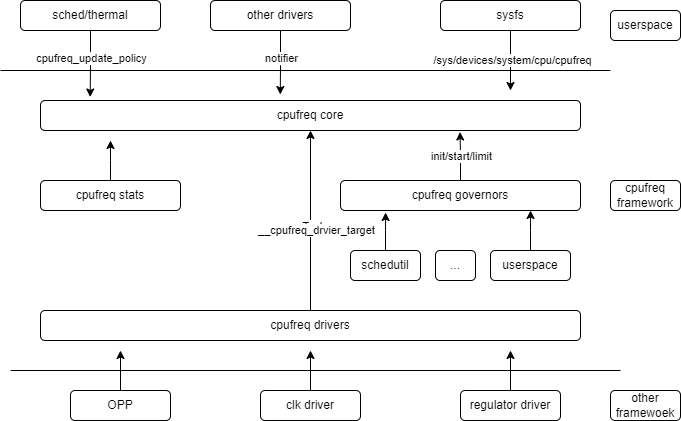

# CPUFREQ

介绍 K3 SoC CPUFREQ 的功能和使用方法。

## 模块介绍

CPUFREQ 子系统负责在 CPU 运行时通过动态调整 CPU 运行频率与电压，在确保性能需求的前提下，将功耗降至最低。

### 功能介绍



1. **cpufreq core：** cpufreq framework 的核心模块，它主要实现三类功能：
    - 抽象调频调压的公共逻辑接口
    - 以 sysfs 的形式向用户空间提供统一的接口，以 notifier 的形式向其他 driver 提供频率变化的通知
    - 提供CPU频率和电压控制的驱动框架
2. **cpufreq governor：** 负责调频调压的各种策略
3. **cpufreq driver：** 负责平台相关调频调压机制的实现
4. **cpufreq stats：** 负责调频信息和各频点运行事件统计，提供每个CPU的cpufreq有关的统计信息

### 源码结构介绍

CPU 调频平台驱动目录如下：

```
drivers/cpufreq/
├── cpufreq.c
├── cpufreq_conservative.c
├── cpufreq-dt.c
├── cpufreq-dt.h
├── cpufreq-dt-platdev.c
├── cpufreq_governor_attr_set.c
├── cpufreq_governor.c
├── cpufreq_governor.h
├── cpufreq_ondemand.c
├── cpufreq_ondemand.h
├── cpufreq_performance.c
├── cpufreq_powersave.c
├── cpufreq_stats.c
├── cpufreq_userspace.c
├── freq_table.c
├── spacemit-k3-cpufreq.c --> K3 平台驱动
```


## 关键特性

### 特性

| 特性 | 特性说明 |
| :--- | :--- |
| 支持动态调频调压 | 实时根据负载切换频率与电压 |
| 双 Cluster 独立调频 | X100 和 A100 Cluster 各自独立调频，互不影响 |
| 多档 OPP 表按工艺选择 | X100 提供 4 张 OPP 表，驱动根据芯片 SVT-DRO 与核心供电能力选择 |
| Boost 频点 | X100 的 2.3 GHz / 2.4 GHz、A100 的 1.85 ~ 2.0 GHz 为 boost 频点，需使能 boost 后才可用 |


### K3 CPU 拓扑结构

K3 SoC 采用 16 核异构设计，包含两个 CPU Cluster：

| Cluster | 核心 | 核心型号 | 频率范围 | 电压调节 |
| :------ | :--- | :------- | :------- | :------- |
| X100 Cluster | cpu_0 ~ cpu_7 | Spacemit X100 | 614.4 MHz ~ 2.4 GHz | 支持，由 `clst-supply`（edcdc1）供电，OPP 表配置了 `opp-microvolt` |
| A100 Cluster | cpu_8 ~ cpu_15 | Spacemit A100 | 614.4 MHz ~ 2.0 GHz | 仅调频，OPP 表未配置 `opp-microvolt` |

两个 Cluster 各自拥有独立的 OPP（Operating Performance Points）表和时钟源，可独立调频。

### 性能参数

#### X100 Cluster（cpu_0 ~ cpu_7）OPP 表

X100 Cluster 在 DTS 中定义了 4 张 OPP 表，频率档位完全相同（19 档，614.4 MHz ~ 2.4 GHz），区别只在各档位的电压。驱动在启动时根据芯片工艺参数 SVT-DRO 选择其中一张：

| OPP 表 | 选择条件 |
| :--- | :--- |
| `clst_core_opp_table0_x100` | SVT-DRO ≤ 207 |
| `clst_core_opp_table1_x100` | 207 < SVT-DRO ≤ 211 |
| `clst_core_opp_table2_x100` | SVT-DRO > 211 |
| `clst_core_opp_table3_x100` | 核心 regulator 的 `regulator-max-microvolt` < 1.1 V 时覆盖为此表 |

工艺越好（SVT-DRO 越大）所需电压越低，因此 table0 电压最高、table2 最低。table3 是低压供电场景下的保守表，最高档位电压压到 1.00 V。

> **注意：** 当前驱动 `drivers/cpufreq/spacemit-k3-cpufreq.c` 中定义了 `USING_OPP_TABLE3_BY_DEFAULT` 宏，会在 SVT-DRO 判断之后无条件将选表结果覆盖为 table3。也就是说实际生效的始终是 table3。可通过 `dmesg | grep "Spacemit K3"` 确认最终选中的表。

**电压说明：** DTS 中 `opp-microvolt` 为 `<target min max>` 三元组，下表列出 target 值，max 比 target 高 4 mV。标注 boost 的频点在 DTS 中带 `turbo-mode` 属性，默认不参与调频，需要使能 boost 后才可用，详见 [Boost 使用方法](#boost-使用方法)。

table3（当前默认生效）：

| 频率 | 电压（target） | 说明 |
| :--- | :---: | :--- |
| 2400000000 Hz | 1.00 V | boost |
| 2300000000 Hz | 1.00 V | boost |
| 2200000000 Hz | 0.95 V | |
| 2150000000 Hz | 0.88 V | |
| 2100000000 Hz | 0.88 V | |
| 2000000000 Hz | 0.88 V | |
| 1900000000 Hz | 0.88 V | |
| 1850000000 Hz | 0.88 V | |
| 1800000000 Hz | 0.88 V | |
| 1700000000 Hz | 0.88 V | |
| 1600000000 Hz | 0.88 V | |
| 1500000000 Hz | 0.85 V | |
| 1400000000 Hz | 0.85 V | |
| 1300000000 Hz | 0.85 V | |
| 1200000000 Hz | 0.85 V | |
| 1100000000 Hz | 0.85 V | |
| 1000000000 Hz | 0.80 V | |
| 819200000 Hz  | 0.80 V | |
| 614400000 Hz  | 0.80 V | |


#### A100 Cluster（cpu_8 ~ cpu_15）OPP 表

A100 Cluster 只有一张 OPP 表 `clst_core_opp_table0_a100`，共 14 档（614.4 MHz ~ 2.0 GHz），不配置 `opp-microvolt`，只调频不调压。

| 频率 | 说明 |
| :--- | :--- |
| 2000000000 Hz | boost |
| 1900000000 Hz | boost |
| 1850000000 Hz | boost |
| 1800000000 Hz | |
| 1700000000 Hz | |
| 1600000000 Hz | |
| 1500000000 Hz | |
| 1400000000 Hz | |
| 1300000000 Hz | |
| 1200000000 Hz | |
| 1100000000 Hz | |
| 1000000000 Hz | |
| 819200000 Hz  | |
| 614400000 Hz  | |

## 配置介绍

主要包括 **驱动使能配置** 和 **DTS 配置**

### CONFIG 配置

CPUFREQ 配置如下：

```
CONFIG_SPACEMIT_K3_CPUFREQ:

  This adds the CPUFreq driver support for Spacemit K3 SoC
  which are capable of changing the CPU's frequency dynamically.

  Symbol: SPACEMIT_K3_CPUFREQ [=y]
  Type  : tristate
  Defined at drivers/cpufreq/Kconfig:256
  Prompt: CPU frequency scaling driver for Spacemit K1X
  Depends on: CPU_FREQ [=y] && OF [=y] && COMMON_CLK [=y]
  Location:
   -> CPU Power Management
    -> CPU Frequency scaling
     -> CPU Frequency scaling (CPU_FREQ [=y])
      -> CPU frequency scaling driver for Spacemit K1X (SPACEMIT_K3_CPUFREQ [=y])
  Selects: CPUFREQ_DT [=y] && CPUFREQ_DT_PLATDEV [=y]
```

### DTS 配置

完整 OPP 表位于
`arch/riscv/boot/dts/spacemit/k3_opp_table.dtsi`

该文件定义了 5 个 OPP 表：

- `clst_core_opp_table0_x100` ~ `clst_core_opp_table3_x100`：X100 Cluster 的 4 张 OPP 表，各含 19 个频率档位（614.4 MHz ~ 2.4 GHz），配置了 `opp-microvolt` 电压参数，频率档位相同、电压不同，由驱动按 SVT-DRO 选择
- `clst_core_opp_table0_a100`：A100 Cluster 的 OPP 表，包含 14 个频率档位（614.4 MHz ~ 2.0 GHz），无电压参数

各 CPU 节点的时钟和 OPP 表绑定在 `k3_opp_table.dtsi` 中完成。X100 的每个 CPU 节点同时挂上 4 个 `operating-points-v2` phandle，驱动通过 index 选择实际使用哪一张：

```dts
/* X100 Cluster: cpu_0 ~ cpu_7 */
&cpu_0 {
    clst-supply = <&edcdc1>;
    clocks = <&syscon_apmu CLK_APMU_CPU_C0_CORE>, <&syscon_apmu CLK_APMU_CPU_C1_CORE>;
    clock-names = "cls0", "cls1";
    operating-points-v2 = <&clst_core_opp_table0_x100>, <&clst_core_opp_table1_x100>,
                          <&clst_core_opp_table2_x100>, <&clst_core_opp_table3_x100>;
};

/* A100 Cluster: cpu_8 ~ cpu_15，只有一张表 */
&cpu_8 {
    clocks = <&syscon_apmu CLK_APMU_CPU_C2_CORE>, <&syscon_apmu CLK_APMU_CPU_C3_CORE>;
    clock-names = "cls0", "cls1";
    operating-points-v2 = <&clst_core_opp_table0_a100>;
};
```

SVT-DRO 由 `/cpus` 节点下的 `svt-dro` 属性提供，驱动读取该值决定使用哪张表；若 DTS 中没有该属性，则默认使用 table0。

OPP 表中还配置了 PLL 时钟源，用于驱动在调频时切换 PLL：

```dts
opp_table0_x100 {
    compatible = "operating-points-v2";
    opp-shared;
    clocks = <&pll CLK_PLL3>, <&pll CLK_PLL4>, <&pll CLK_PLL3_D1>, <&syscon_apmu CLK_APMU_CPU_C1_PLL_SRC>;
    clock-names = "pll_clst0", "pll_clst1", "pll_src", "clt_pll_src";
    ...
};
```

高频档位（> 1 GHz）切换时，驱动会先把 cluster 时钟切到 819.2 MHz 的稳定频点，再设置目标 PLL 频率，避免直接跨档切换导致时钟不稳定。

## Debug 介绍

### sysfs

X100 Cluster 节点位于：`/sys/devices/system/cpu/cpufreq/policy0/`\
A100 Cluster 节点位于：`/sys/devices/system/cpu/cpufreq/policy8/`

| 节点 | 作用说明 |
| :--- | :--- |
| affected\_cpus, related\_cpus | 查看该 policy 关联的 CPU 核心 |
| scaling\_governor | 当前生效的调频策略 |
| scaling\_available\_frequencies | 查看系统支持的非 boost 频率点 |
| scaling\_boost\_frequencies | 查看系统支持的 boost 频率点（boost 使能后才出现） |
| scaling\_max\_freq | 软件允许的最大频率限制 |
| cpuinfo\_cur\_freq | CPU 硬件实时频率 |
| scaling\_available\_governors | 查看系统支持的策略 |
| scaling\_min\_freq | 软件允许的最小频率限制 |
| cpuinfo\_max\_freq | 硬件支持的最大频率 |
| scaling\_setspeed | userspace 模式下设置 CPU 频率的接口 |
| cpuinfo\_min\_freq | 硬件支持的最小频率 |
| scaling\_cur\_freq | 查看当前 CPU 运行频率 |
| scaling\_driver | 当前 CPU 调频驱动的名称 |
| boost | per-policy boost 开关（0/1），仅在全局 boost 使能后有效 |

全局 boost 开关位于：`/sys/devices/system/cpu/cpufreq/boost`

## 测试介绍

### 基本调频测试

1. 将策略修改成 userspace 模式
   ```
   echo userspace > /sys/devices/system/cpu/cpufreq/policy0/scaling_governor
   ```

2. 查看所支持的频率列表
   ```
   cat /sys/devices/system/cpu/cpufreq/policy0/scaling_available_frequencies
   ```

3. 设置 CPU 频率
   ```
   echo 1600000 > /sys/devices/system/cpu/cpufreq/policy0/scaling_setspeed
   ```

4. 查看频率是否设置成功
   ```
   cat /sys/devices/system/cpu/cpufreq/policy0/scaling_cur_freq
   ```

5. 对 A100 Cluster 进行同样操作
   ```
   echo userspace > /sys/devices/system/cpu/cpufreq/policy8/scaling_governor
   cat /sys/devices/system/cpu/cpufreq/policy8/scaling_available_frequencies
   echo 1200000 > /sys/devices/system/cpu/cpufreq/policy8/scaling_setspeed
   cat /sys/devices/system/cpu/cpufreq/policy8/scaling_cur_freq
   ```

可循环切换不同频点，通过 `cpuinfo_cur_freq` 验证每次是否设置成功。

### Boost 使用方法

Boost 频点（X100: 2.3 GHz / 2.4 GHz；A100: 1.85 ~ 2.0 GHz）默认不参与调频。内核提供两级 boost 开关：

- **全局开关**：`/sys/devices/system/cpu/cpufreq/boost`，写 1 启用全部 policy 的 boost，写 0 关闭
- **per-policy 开关**：`/sys/devices/system/cpu/cpufreq/policy<N>/boost`，在全局开关已启用的前提下，可以单独控制某个 policy

#### 设置 X100 Cluster 运行在 2.4 GHz

```bash
# 1. 使能全局 boost
echo 1 > /sys/devices/system/cpu/cpufreq/boost

# 2. 确认 boost 频率列表中包含 2400000（单位 kHz）
cat /sys/devices/system/cpu/cpufreq/policy0/scaling_boost_frequencies

# 3. 切换到 userspace 策略
echo userspace > /sys/devices/system/cpu/cpufreq/policy0/scaling_governor

# 4. 将频率设为 2.4 GHz
echo 2400000 > /sys/devices/system/cpu/cpufreq/policy0/scaling_setspeed

# 5. 验证
cat /sys/devices/system/cpu/cpufreq/policy0/cpuinfo_cur_freq
```

若要退出 boost：

```bash
# 关闭全局 boost，boost 频点会从可用列表中移除，当前频率会被限制到最高非 boost 频点
echo 0 > /sys/devices/system/cpu/cpufreq/boost
```

> **说明：** 写入 `scaling_setspeed` 的单位是 kHz（2400000 = 2.4 GHz）。boost 频点只在全局 boost 开关为 1 时才出现在 `scaling_available_frequencies` 和 `scaling_boost_frequencies` 中，未使能时直接写入会被内核拒绝。

## FAQ
