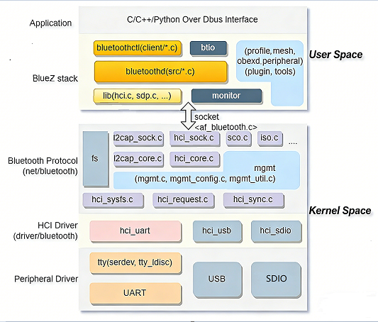

# BT

介绍 K3 平台 BT（Bluetooth）模组的常见接入方式、当前 SDK 中可见的软件栈位置、DTS 配置重点以及用户态基本使用方法。

## 模块介绍

K3 平台当前的蓝牙能力仍然主要依赖**外部 BT 模组**，常见接法包括：

- UART 接口 BT 模组
- USB 接口 BT 模组
- WiFi/BT combo 模组中的 BT 部分

和前面的 WIFI 文档类似，K3 这篇 BT 文档不能假设“平台一定有一套完整私有蓝牙驱动”。从当前 SDK 和 DTS 能确认到的内容看，更稳的理解方式是：

1. **BlueZ / 内核蓝牙协议栈** 负责 HCI/L2CAP/RFCOMM 等通用能力；
2. **具体 HCI 传输驱动** 负责 UART / USB / SDIO 等接法；
3. **板级电源与使能控制** 主要通过 GPIO / rfkill-gpio 等方式完成。

所以 K3 当前 BT bring-up 的重点，不在“平台自定义协议栈”，而在：

- 模组接在哪个接口；
- 走 H4 还是 H5；
- 复位/关断 GPIO 怎么配；
- 用户态如何把 HCI 设备拉起来。

## 功能介绍

BT 软件栈一般分成以下几层：



1. **内核蓝牙核心栈**  
   例如 `hci_core`、`l2cap`、`rfcomm`、`mgmt`；
2. **HCI 传输驱动**  
   例如 UART H4/H5、USB HCI；
3. **具体厂商协议支持**  
   例如 Realtek、Broadcom、QCA 等；
4. **板级控制**  
   包括 `shutdown-gpios`、`reset-gpios`、rfkill 等。

### K3 当前更稳的两条蓝牙主线

从当前 SDK 和 DTS 看，K3 至少有两种很明确的 BT 方案痕迹：

- **UART HCI Bluetooth**：走 Linux 标准 `BT_HCIUART` 路线
- **USB Bluetooth + rfkill-gpio**：板级通过 `rfkill-gpio` 控制模组上下电

其中，当前板级 DTS 中更容易直接对上的，是 **rfkill-gpio 控制蓝牙电源/关断** 这条路径。

## 源码结构介绍

BT 相关代码主要分成三类：

```text
linux-6.18/
|-- net/bluetooth/          # 蓝牙核心协议栈
|-- drivers/bluetooth/      # HCI 传输与厂商驱动
|-- drivers/rfkill/         # rfkill 通用框架
`-- arch/riscv/boot/dts/spacemit/
    `-- k3*.dts             # 板级 BT 电源/关断 GPIO 配置
```

### 1. 蓝牙核心协议栈

核心协议栈在：

```text
net/bluetooth/
```

这里面包括：

- `hci_core`
- `l2cap`
- `rfcomm`
- `mgmt`
- `hci_sock`
- `hci_sysfs`

也就是说，K3 当前 BT 依然是标准 Linux / BlueZ 路线，不是平台单独造了一套协议栈。

### 2. HCI 驱动与厂商支持

当前 `drivers/bluetooth/` 下可以直接看到：

- `hci_h4.c`
- `hci_h5.c`
- `hci_ldisc.c`
- `hci_serdev.c`
- `btusb.c`
- `btbcm.c`
- `btrtl.c`
- `btqca.c`
- `btmtkuart.c`
- `btmtksdio.c`
- 等

这说明 K3 当前支持蓝牙的方式，主要还是借助 Linux 通用 HCI 驱动框架和各厂商协议扩展。

### 3. 当前没看到 K1 文档里那种清晰的 `spacemit-rf` 蓝牙私有主线

和 WIFI 那篇一样，这轮我没有在 K3 当前 SDK 中直接确认到 K1 文档里那种很完整的：

- `spacemit-bt.c`
- `spacemit-pwrseq.c`

这类平台私有控制主线。

所以 K3 这篇 BT 文档不能照 K1 原样写成“平台 RFKILL 驱动为主”。当前更稳的写法，是按：

- 通用蓝牙协议栈
- HCI 传输驱动
- 板级 `rfkill-gpio`
- UART / USB 接法

来组织。

## 关键特性

### 蓝牙主线特性

| 特性 | 特性说明 |
| :--- | :--- |
| 基于标准 Linux 蓝牙栈 | `net/bluetooth/` + BlueZ 用户态 |
| 支持 UART HCI 路线 | `BT_HCIUART` + H4/H5 等协议 |
| 支持 USB HCI 路线 | `btusb` 驱动 |
| 支持多厂商协议扩展 | `btrtl` / `btbcm` / `btqca` / `btmtk*` |
| 板级可用 `rfkill-gpio` 控制 | DTS 中已能看到 BT 关断 GPIO 方案 |
| combo 模组适配方式明确 | 可将 WiFi/BT 分开做 WLAN / Bluetooth 的电源控制 |

### 当前 DTS 里已确认的 BT 板级例子

#### `k3_deb1.dts`

能直接看到：

```dts
rfkill-usb-bt {
	compatible = "rfkill-gpio";
	label = "rfkill-usb-bt";
	pinctrl-names = "default";
	pinctrl-0 = <&bt_en_cfg>;
	radio-type = "bluetooth";
	shutdown-gpios = <&gpio 0 30 GPIO_ACTIVE_HIGH>;
};
```

以及对应 pinctrl：

```dts
bt_en_cfg: bt-en-cfg {
	bt-en-pins {
		pinmux = <K3_PADCONF(30, 0)>;
		bias-pull-up;
		drive-strength = <38>;
		power-source = <3300>;
	};
};
```

这说明至少在这块板子上，BT 模组电源/使能是通过：

- `rfkill-gpio`
- `shutdown-gpios`
- 板级 pinctrl

来控制的。

#### `k3_com260.dts`

还能看到另一种例子：

```dts
rfkill-m2-bt {
	compatible = "rfkill-gpio";
	label = "rfkill-m2-bt";
	pinctrl-names = "default";
	pinctrl-0 = <&m2_wdis2_cfg>;
	radio-type = "bluetooth";
	shutdown-gpios = <&gpio 1 25 GPIO_ACTIVE_LOW>;
};
```

这类写法更像是：

- M.2 无线模组中的蓝牙部分
- 通过 `rfkill-gpio` 单独控制 BT sideband

所以从当前板级信息看，K3 的 BT 文档更应该强调：

- **板级 GPIO 使能/关断方案**
- **模组接口类型（UART/USB/M.2 combo）**

## 配置介绍

主要包括：

1. 蓝牙协议栈配置
2. HCI 传输驱动配置
3. 板级 DTS 配置
4. 用户态 bring-up 工具

### 1. 协议栈配置

蓝牙基础协议栈配置位于：

- `net/bluetooth/Kconfig`

常见基础配置包括：

- `CONFIG_BT`
- `CONFIG_BT_BREDR`
- `CONFIG_BT_LE`
- `CONFIG_BT_RFCOMM`
- `CONFIG_BT_BNEP`
- `CONFIG_BT_HIDP`
- `CONFIG_BT_DEBUGFS`

如果你还要做 HID / AVRCP 一类功能到用户态输入设备映射，常见还要配：

- `CONFIG_UHID`
- `CONFIG_INPUT_UINPUT`

### 2. UART HCI 配置

K3 若使用 UART 蓝牙，核心配置通常是：

- `CONFIG_BT_HCIUART`
- `CONFIG_BT_HCIUART_H4`
- `CONFIG_BT_HCIUART_3WIRE`
- 以及具体厂商协议支持，例如：
  - `CONFIG_BT_HCIUART_RTL`
  - `CONFIG_BT_HCIUART_BCM`
  - `CONFIG_BT_HCIUART_QCA`

从 Kconfig 可以直接确认：

- `BT_HCIUART_RTL` 会选择 `BT_HCIUART_3WIRE`
- 也就是很多 Realtek UART BT 方案默认走 **H5/3-wire** 路线

### 3. USB HCI 配置

如果板子上接的是 USB 蓝牙，核心就是：

- `CONFIG_BT_HCIBTUSB`

同时根据芯片可能还会依赖：

- `CONFIG_BT_HCIBTUSB_BCM`
- `CONFIG_BT_HCIBTUSB_RTL`

### 4. DTS 配置

当前 K3 板级里最明确的 BT DTS 主线，是 `rfkill-gpio` 控制。

例如：

```dts
rfkill-usb-bt {
	compatible = "rfkill-gpio";
	label = "rfkill-usb-bt";
	radio-type = "bluetooth";
	shutdown-gpios = <&gpio 0 30 GPIO_ACTIVE_HIGH>;
};
```

或者：

```dts
rfkill-m2-bt {
	compatible = "rfkill-gpio";
	label = "rfkill-m2-bt";
	radio-type = "bluetooth";
	shutdown-gpios = <&gpio 1 25 GPIO_ACTIVE_LOW>;
};
```

这些字段里最关键的是：

| 属性 | 作用 |
| :--- | :--- |
| `compatible = "rfkill-gpio"` | 绑定通用 rfkill-gpio 驱动 |
| `radio-type = "bluetooth"` | 标明这是蓝牙 rfkill 设备 |
| `shutdown-gpios` | 控制模组关断/使能 |
| `pinctrl-0` | 配置 BT enable / shutdown 相关引脚状态 |

### 5. UART 口选择

K3 在 `k3.dtsi` 中导出了很多串口别名：

- `serial0 = &uart0`
- `serial1 = &uart1`
- ...
- `serial10 = &uart10`
- `serial11` ~ `serial16` 对应 `r_uart*`

这说明如果后续某块板子要把 BT 接到 UART 上，**并不是只有一个固定 UART 可选**。真正该怎么写，要回到具体板级原理图和 DTS。

## 接口介绍

### 用户态控制接口

蓝牙最终在用户态通常表现为：

- `hci0`
- `bluetoothctl`
- `hciconfig`（旧工具）
- `btmgmt`
- `rfkill`

### UART attach 工具

如果使用 UART 蓝牙，通常需要先通过用户态工具把串口侧 HCI 拉起来，例如：

- `hciattach`
- 或者厂商自带 attach 工具

不同模组的典型写法会不同，比如：

- H4：更偏通用 UART HCI
- H5：Realtek 一类方案更常见

这一点在 K3 上没有变，本质仍然由具体蓝牙模组决定。

### rfkill 控制

如果板级用了 `rfkill-gpio`，用户态可以直接通过：

```shell
rfkill list
rfkill block bluetooth
rfkill unblock bluetooth
```

来验证板级关断 GPIO 是否生效。

## Debug 介绍

### 1. 先分清你走的是哪条链

调 BT 之前，先把方案分清楚：

- UART BT
- USB BT
- WiFi/BT combo 模组中的 BT 部分

这一步如果没分清，后面 DTS 和驱动都会查错方向。

### 2. 先看 rfkill 和 GPIO 侧是不是对的

如果 DTS 里已经用了 `rfkill-gpio`，优先看：

```shell
rfkill list
```

如果连 BT rfkill 设备都没有，先查：

- `compatible = "rfkill-gpio"`
- `radio-type = "bluetooth"`
- `shutdown-gpios`
- `pinctrl-0`

### 3. UART 蓝牙起不来，先别急着看配对

UART 方案优先检查：

- 串口节点是否启用
- pinctrl 是否带上 TX/RX/CTS/RTS
- 波特率是否匹配模组默认值
- H4 / H5 协议是否选对
- attach 工具是否正确执行

### 4. USB 蓝牙起不来，先看枚举

USB BT 先查：

```shell
dmesg | grep -i -e bluetooth -e btusb -e usb
```

如果 USB 设备都没枚举出来，先回头看：

- 模组电源
- `rfkill-gpio`
- USB 端口供电
- 板级 enable/shutdown GPIO

### 5. `hci0` 没出来时的排查顺序

建议顺序是：

1. 模组是否上电
2. 接口层是否正常（UART/USB）
3. HCI 驱动是否加载
4. `dmesg` 是否有厂商协议初始化日志
5. 最后再看 BlueZ 用户态

## 测试介绍

### 基础 bring-up 测试

1. 确认 rfkill / GPIO 使能正常
2. 确认 `hci0` 出现
3. 启动 BlueZ 服务
4. 使用 `bluetoothctl` 进行扫描、配对、连接

例如：

```shell
rfkill list
bluetoothctl
```

进入 `bluetoothctl` 后常见操作：

```text
power on
scan on
pair <MAC>
connect <MAC>
trust <MAC>
```

### 输入/音频相关测试

如果要做键鼠/HID 或更复杂功能，还要根据场景确认：

- `UHID`
- `INPUT_UINPUT`
- 对应用户态守护进程

这些不属于 K3 平台私有差异，但在文档里需要提醒用户。

## FAQ

### 1. K3 当前 BT 是不是有一条很明确的平台私有驱动？

从这轮已确认的 SDK 情况看，**没有像 K1 文档那样直接看到一条完整且明确的 `spacemit-bt` 平台私有主线**。当前更稳的是：

- Linux 通用蓝牙栈
- HCI 传输驱动
- 板级 `rfkill-gpio`

### 2. K3 当前最明确的 BT 板级方案是什么？

**rfkill-gpio 控制 BT 模组关断/使能** 这条线最明确，因为 `k3_deb1.dts` 和 `k3_com260.dts` 都能直接看到例子。

### 3. K3 的 BT 一定走 UART 吗？

不一定。当前能确认的至少包括：

- UART HCI 方案
- USB 蓝牙方案
- combo 模组中通过 sideband GPIO 控制 BT 的方案

### 4. 这篇最该记住哪条经验？

**先把“接口类型”和“板级 enable/shutdown GPIO”查清楚，再看 HCI/BlueZ。**

很多 BT bring-up 问题，根源根本不在协议栈，而在板级没有真正把模组拉起来。
