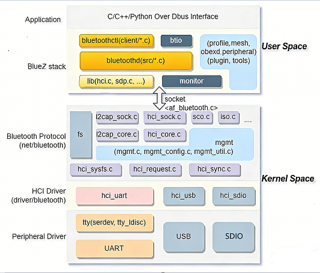

# BT

介绍 K3 平台 Bluetooth 模组的常见移植方法以及注意事项。

## 模块介绍

K3 平台需要外接**外部 BT 模组**实现 BT 功能，支持 UART / USB / SDIO 等接口。

## 功能介绍

K3 平台上使用的 BT 软件栈为 `BlueZ` ，基于 `BlueZ` 的软件框架从上到下可以分为以下几层：



1. **蓝牙应用层**
   主要实现应用层的相关逻辑，通过 `DBus` 接口与协议栈交互；
2. **BlueZ 协议栈用户空间**
   负责管理协议，提供应用接口以及服务调度等；
3. **BlueZ 协议栈内核空间**
   主要处理 L2CAP 分片重组、ACL/SCO 链路管理、HCI 核心调度等；
4. **HCI 传输驱动**
   负责通过 UART / USB / SDIO 等物理接口在主机与控制器之间传输 HCI 数据包；
5. **接口控制器**
   主要实现 BT 数据传输接口功能；

## 源码结构介绍

BT 内核相关代码主要有：

```text
linux-6.18/
|-- net/bluetooth/          # 蓝牙核心协议栈
|-- drivers/bluetooth/      # HCI 传输与厂商驱动
|-- drivers/rfkill/         # rfkill 通用框架
`-- arch/riscv/boot/dts/spacemit/       # 板级 BT 电源/ GPIO 配置
```

其中 BT 驱动相关的代码在 `drivers/bluetooth/` ：

- `hci_h4.c`
- `hci_h5.c`
- `hci_ldisc.c`
- `hci_serdev.c`
- `btusb.c`
- `btsdio.c`
- `btbcm.c`
- `btrtl.c`

USB 接口的蓝牙还涉及 USB 框架中的 `drivers/usb/misc/onboard_usb_dev.c` ，由它在设备枚举前完成模组上电和释放复位。

K3 BT 的驱动接入了 serdev 框架，在 serdev 框架之前，对于 UART 接口的蓝牙，内核只提供 tty_ldisc 设备，需要通过 `hciattach` 等命令来加载设备并下载固件，使用 serdev 框架后，可以将对应的操作放到 hci 驱动中完成。

K3 BT 导入时建议适配 `hci` 层，不同的厂商需要根据具体的传输协议进行适配，比如 rtl8852bs 使用的 H5 需要在 `hci_h5.c` 增加以下内容:

```c
static const struct of_device_id rtl_bluetooth_of_match[] = {
#ifdef CONFIG_BT_HCIUART_RTL
        { .compatible = "realtek,rtl8852bs-bt",
                .data = (const void *)&h5_data_rtl8822cs },
#endif
        { },
};
```

## 关键特性

### 平台 UART 接口特性

| 特性 | 特性说明 |
| :----- | :---- |
| 支持 4 线流控 | 支持 CTS/RTS 硬件流控 |
| 最高波特率 | 最高支持 3.6Mbps |
| 支持 DMA | 支持 DMA 传输模式 |

### 平台 USB 接口特性

K3 USB 控制器最高支持 SuperSpeed（5Gbps）。蓝牙模组只需 High-Speed（480Mbps），配置 `maximum-speed = "high-speed"` 并只使能 USB2 PHY。控制器的完整特性（模式、速率、PHY、低功耗等）参见 USB 开发指南。

### 模组性能规格

| 模组型号 | 蓝牙版本 | HCI 接口 |
| :----- | :---- | :---- |
| rtl8852bs | Bluetooth 5.2 | UART ，支持 H4/H5 传输层 |
| rtl8852be | Bluetooth 5.2 | USB |

两者的驱动都在内核树中，rtl8852bs 对应 `hci_h5.c` ，rtl8852be 对应 `btusb.c` （VID 0x0bda / PID 0xb85b），不需要额外的 out-of-tree 驱动。

## 配置介绍

主要包括驱动使能配置和 DTS 配置。

### CONFIG 配置

#### 协议栈配置

```text
Networking support (NET [=y])
        Bluetooth subsystem support (BT [=m])
                Bluetooth Classic (BR/EDR) features (BT_BREDR [=y])
                        RFCOMM protocol support (BT_RFCOMM [=m])
                                RFCOMM TTY support (BT_RFCOMM_TTY [=y])
                        BNEP protocol support (BT_BNEP [=y])
                        HIDP protocol support (BT_HIDP [=y])
                Bluetooth Low Energy (LE) features (BT_LE [=y])
        Export Bluetooth internals in debugfs (BT_DEBUGFS [=y])
```

#### UART HCI 配置

```text
Networking support (NET [=y])
        Bluetooth subsystem support (BT [=m])
                Bluetooth device drivers
                        HCI UART driver (BT_HCIUART [=m])
                                UART (H4) protocol support (BT_HCIUART_H4 [=y])
                                Three-wire UART (H5) protocol support (BT_HCIUART_3WIRE [=y])
                                Realtek protocol support (BT_HCIUART_RTL [=y])
```

默认支持 H4 和 H5 ，其中 Realtek 的蓝牙串口走的是 H5 协议。`BT_HCIUART_3WIRE` 被 `BT_HCIUART_RTL` 通过 `select` 自动打开，在 menuconfig 中不可单独修改，因此也不会出现在 `k3_defconfig` 中。

#### USB HCI 配置

```text
Networking support (NET [=y])
        Bluetooth subsystem support (BT [=m])
                Bluetooth device drivers
                        HCI USB driver (BT_HCIBTUSB [=m])
                                Broadcom protocol support (BT_HCIBTUSB_BCM [=y])
                                Realtek protocol support (BT_HCIBTUSB_RTL [=y])
```

BT_HCIBTUSB_BCM 和 BT_HCIBTUSB_RTL 分别对应 Broadcom 和 Realtek 的 USB 接口的支持，两者均为 `default y` 。

USB 接口的 BT 如果依赖 `onboard_usb_dev` 在枚举前完成上电和释放复位，还需要打开 `CONFIG_USB_ONBOARD_DEV` ：

```text
Device Drivers
        USB support (USB_SUPPORT [=y])
                USB Miscellaneous drivers
                        Onboard USB device support (USB_ONBOARD_DEV [=y])
```

#### SDIO HCI 配置

```text
Networking support (NET [=y])
        Bluetooth subsystem support (BT [=m])
                Bluetooth device drivers
                        HCI SDIO driver (BT_HCIBTSDIO [=m])
```

对应驱动为 `drivers/bluetooth/btsdio.c` 。K3 当前板级 DTS 中没有走 SDIO 接口的 BT 方案（SDIO 均用于 WiFi），该配置仅在使用 SDIO 蓝牙模组时需要打开。

#### AVRCP 配置

```text
Device Drivers
        Input device support
                Generic input layer (needed for keyboard, mouse, ...) (INPUT [=y])
                        Miscellaneous devices (INPUT_MISC [=y])
                                User level driver support (INPUT_UINPUT [=y])
```

如果要把 AVRCP 的按键值等信息通过 input device 送给用户态程序，则需要打开 INPUT_UINPUT 。

#### HOGP 配置

```text
Device Drivers
        HID bus support (HID_SUPPORT [=y])
                HID bus core support (HID[=y])
                        User-space I/O driver support for HID subsystem (UHID [=y])
```

如果要把 HoG 的 KEY_1, KEY_2, KEY_ESC 等按键值通过 input device 送给用户态程序，则需要打开 UHID 。

### DTS 配置

#### USB 接口配置

根据实际硬件配置对应的 BT 节点信息，以 `k3-pico.dtsi` 中的 `&usb3_portc` 示例为（`k3_deb1.dts` 等 pico 系列板级 dts 通过 include 使用该配置），BT 接到 portc 上：

```dts
&usb3_portc_u2phy {
        status = "okay";
};

&usb3_portc_u3phy {
        status = "disabled";
};

&usb3_portc {
        /* Bluetooth, only enable USB2 phy */
        #address-cells = <1>;
        #size-cells = <0>;
        /delete-property/ phys;
        /delete-property/ phy-names;
        maximum-speed = "high-speed";
        reset-on-resume;
        phys = <&usb3_portc_u2phy>;
        phy-names = "usb2-phy";
        pinctrl-names = "default";
        pinctrl-0 = <&bt_reset_cfg>;
        status = "okay";

        bluetooth@1 {
                /* RTL8852BE, reset must be deasserted before enumeration */
                compatible = "usbbda,b85b";
                reg = <1>;
                vdd-supply = <&p3v3>;
                reset-gpios = <&gpio 0 30 GPIO_ACTIVE_LOW>;
        };
};
```

- `maximum-speed` 指定最大速度，蓝牙模组只需要高速模式；
- `phys` 指定控制器对应的 phy ，只使能 USB2.0 PHY；
- `reset-on-resume` 恢复时复位设备；
- `bluetooth@1` 为 USB BT 子设备节点，`compatible` 采用 `usbVID,PID` 格式（`usbbda,b85b` 对应 RTL8852BE 的 VID 0x0bda / PID 0xb85b），需与 `btusb.c` 的 `btusb_match_table` 匹配；`reg` 为 USB 端口号；
- `reset-gpios` 为模组复位引脚，由 USB 框架的 `onboard_usb_dev` 驱动管理（`onboard_usb_dev.c` 的设备表中已包含 RTL8852BE），在设备枚举前完成上电和释放复位；
- `vdd-supply` 为模组供电。

复位引脚的 pinctrl 配置以实际硬件为准：

```dts
bt_reset_cfg: bt-reset-cfg {
        bt-reset-pins {
                pinmux = <K3_PADCONF(30, 0)>;

                bias-pull-up;
                drive-strength = <38>;
                power-source = <3300>;
        };
};
```

USB 接口的 BT 复位引脚由 `onboard_usb_dev` 在枚举前接管，因此 `btusb` 申请该引脚时会得到 `-EBUSY` 并跳过驱动内的硬复位，改为走 USB 层复位做恢复，这是正常行为。这种方式不需要额外的 `rfkill-gpio` 节点，但需要打开 `CONFIG_USB_ONBOARD_DEV`。

#### UART 接口配置

根据实际硬件配置对应的 BT 节点信息，以 `k3_evb.dts` 中的 `&uart2` 示例为：

```dts
&uart2 {
        pinctrl-names = "default";
        pinctrl-0 = <&uart2_0_cfg>;
        status = "okay";

        bluetooth {
                compatible = "realtek,rtl8852bs-bt";
                pinctrl-names = "default";
                pinctrl-0 = <&bt_hostwake_cfg &bt_enable_cfg>;
                device-wake-gpios = <&gpio 1 31 GPIO_ACTIVE_HIGH>;
                enable-gpios = <&gpio 2 29 GPIO_ACTIVE_HIGH>;
                interrupts-extended = <&pinctrl 62 IRQ_TYPE_EDGE_FALLING>;
        };
};
```

- `device-wake-gpios` 对应唤醒 BT 模块的 GPIO ，有效电平按实际硬件配置；
- `enable-gpios` 对应使能 BT 模块的 GPIO ，有效电平按实际硬件配置；
- `interrupts-extended` 对应 BT 模块唤醒 HOST 的中断引脚。驱动通过 `of_irq_get()` 获取该中断，**不使用 `host-wake-gpios` 属性**，配错了 host wake 不会生效；
- `pinctrl-0` 需要同时配置 host wake 和 enable 两个引脚的 pad，否则引脚复用不正确。

对应的 pinctrl 配置（`k3_evb.dts`）：

```dts
bt_hostwake_cfg: bt-hostwake-cfg {
        bt-hostwake-pins {
                pinmux = <K3_PADCONF(62, 0)>;

                bias-pull-up;
                drive-strength = <25>;
                power-source = <1800>;
        };
};

bt_enable_cfg: bt-enable-cfg {
        bt-enable-pins {
                pinmux = <K3_PADCONF(132, 1)>;

                bias-pull-up;
                drive-strength = <25>;
                power-source = <1800>;
        };
};
```

其中 host wake 引脚 PAD 62 与 `interrupts-extended` 中的中断号一致。

蓝牙 pinctrl 配置以实际硬件为准，默认开启流控：

```dts
uart2_0_cfg: uart2-0-cfg {
        uart2-0-pins {
                pinmux = <K3_PADCONF(134, 2)>,  /* uart2 tx */
                         <K3_PADCONF(135, 2)>,  /* uart2 rx */
                         <K3_PADCONF(136, 2)>,  /* uart2 cts */
                         <K3_PADCONF(137, 2)>;  /* uart2 rts */

                bias-pull-up;
                drive-strength = <25>;
        };
};
```

## 接口介绍

### USB 设备枚举确认

对于 USB 接口的蓝牙模组，内核通过 `onboard_usb_dev` 驱动管理复位引脚，在设备枚举前自动完成上电和释放复位，`btusb` 驱动随后自动加载。

可以通过以下命令确认设备是否正常枚举：

```bash
lsusb | grep Realtek
```

正常情况下应该看到类似输出（以 rtl8852be 为例）：

```text
Bus 002 Device 002: ID 0bda:b85b Realtek Semiconductor Corp.
```

也可以通过 `dmesg` 查看 `btusb` 的 probe 日志：

```bash
dmesg | grep -i "btusb\|bluetooth"
```

若设备未枚举，检查：

- `CONFIG_USB_ONBOARD_DEV` 是否打开（`k3_defconfig` 已默认启用）；
- DTS 中 `reset-gpios` 是否正确配置，有效电平是否匹配硬件；
- 用示波器或万用表确认复位引脚实际电平。

### UART attach 工具

早期的内核版本使用 UART 蓝牙，通常需要先通过用户态工具把串口侧 HCI 拉起来，例如：

- `hciattach`
- 或者厂商自带 attach 工具，比如 `rtk_hciattach`

### rfkill 控制

BlueZ 通过 rfkill 管理蓝牙的软开关状态，HCI 设备注册后内核会自动创建对应的 rfkill 节点，用户态可以直接通过：

```bash
rfkill list
rfkill block bluetooth
rfkill unblock bluetooth
```

这里操作的是 HCI 层的软阻塞，与板级 DTS 中是否配置 `rfkill-gpio` 节点无关。

### bluetoothctl

`bluetoothctl` 是 `Linux` 系统中 `BlueZ` 蓝牙协议栈的核心交互式管理工具，用于蓝牙设备的扫描、配对、连接、配置等相关操作，替代了旧版的 `hcitool` / `hciconfig` 。

`bluetoothctl` 依赖 `bluetoothd` 守护进程，先确保服务运行：

```bash
systemctl start bluetooth
systemctl status bluetooth
```

进入 `bluetoothctl` 后常见操作：

```text
power on
scan on
pair <MAC>
connect <MAC>
trust <MAC>
```

## 测试介绍

### BT 基本功能测试

首先确保 bluetoothd 服务正常运行，输入 `bluetoothctl` 进入命令行：

```bash
[bluetooth]# power on
[bluetooth]# Changing power on succeeded
[bluetooth]# scan on
[bluetooth]# SetDiscoveryFilter success
[bluetooth]# Discovery started
[bluetooth]# [CHG] Controller 5C:8A:AE:67:62:04 Discovering: yes
[bluetooth]# [NEW] Device 45:DC:1E:BC:2C:77 45-DC-1E-BC-2C-77
[bluetooth]# [NEW] Device 4C:30:B8:02:7F:7A 4C-30-B8-02-7F-7A
[bluetooth]# [NEW] Device DC:28:67:9A:70:8E DC-28-67-9A-70-8E
[bluetooth]# [NEW] Device 58:FB:F1:17:D4:19 58-FB-F1-17-D4-19
[bluetooth]# [NEW] Device 84:7B:57:FB:20:8D 84-7B-57-FB-20-8D
[bluetooth]# [CHG] Device 84:7B:57:FB:20:8D TxPower: 0x000c (12)
[bluetooth]# [CHG] Device 84:7B:57:FB:20:8D Name: LT-ZHENGHONG
[bluetooth]# [CHG] Device 84:7B:57:FB:20:8D Alias: LT-ZHENGHONG
[bluetooth]# [CHG] Device 84:7B:57:FB:20:8D UUIDs: 0000110c-0000-1000-8000-00805f9b34fb
[bluetooth]# [CHG] Device 84:7B:57:FB:20:8D UUIDs: 0000110a-0000-1000-8000-00805f9b34fb
[bluetooth]# [CHG] Device 84:7B:57:FB:20:8D UUIDs: 0000110e-0000-1000-8000-00805f9b34fb
[bluetooth]# [CHG] Device 84:7B:57:FB:20:8D UUIDs: 0000110b-0000-1000-8000-00805f9b34fb
[bluetooth]# [CHG] Device 84:7B:57:FB:20:8D UUIDs: 0000111f-0000-1000-8000-00805f9b34fb
[bluetooth]# [CHG] Device 84:7B:57:FB:20:8D UUIDs: 0000111e-0000-1000-8000-00805f9b34fb
[bluetooth]#
[bluetooth]# pair 84:7B:57:FB:20:8D
Attempting to pair with 84:7B:57:FB:20:8D
[CHG] Device 84:7B:57:FB:20:8D Connected: yes
[LT-ZHENGHONG]# Request confirmation
[LT-ZHENGHONG]#   [agent] Confirm passkey 947781 (yes/no): yes
[DEL] Device 58:FB:F1:17:D4:19 58-FB-F1-17-D4-19
[bluetooth]# info 84:7B:57:FB:20:8D
Device 84:7B:57:FB:20:8D (public)
        Name: LT-ZHENGHONG
        Alias: LT-ZHENGHONG
        Class: 0x002a010c (2752780)
        Icon: computer
        Paired: no
        Bonded: no
        Trusted: no
        Blocked: no
        Connected: yes
        LegacyPairing: no
        UUID: A/V Remote Control Target (0000110c-0000-1000-8000-00805f9b34fb)
        UUID: Audio Source              (0000110a-0000-1000-8000-00805f9b34fb)
        UUID: A/V Remote Control        (0000110e-0000-1000-8000-00805f9b34fb)
        UUID: Audio Sink                (0000110b-0000-1000-8000-00805f9b34fb)
        UUID: Handsfree Audio Gateway   (0000111f-0000-1000-8000-00805f9b34fb)
        UUID: Handsfree                 (0000111e-0000-1000-8000-00805f9b34fb)
        RSSI: 0xffffffae (-82)
        TxPower: 0x000c (12)
[LT-ZHENGHONG]# [DEL] Device DC:28:67:9A:70:8E DC-28-67-9A-70-8E
[LT-ZHENGHONG]# [DEL] Device 45:DC:1E:BC:2C:77 45-DC-1E-BC-2C-77
[LT-ZHENGHONG]# [DEL] Device 53:84:3E:02:79:84 53-84-3E-02-79-84
[LT-ZHENGHONG]# [CHG] Device 84:7B:57:FB:20:8D Bonded: yes
[LT-ZHENGHONG]# info 84:7B:57:FB:20:8D
Device 84:7B:57:FB:20:8D (public)
        Name: LT-ZHENGHONG
        Alias: LT-ZHENGHONG
        Class: 0x002a010c (2752780)
        Icon: computer
        Paired: no
        Bonded: yes
        Trusted: no
        Blocked: no
        Connected: yes
        LegacyPairing: no
        UUID: A/V Remote Control Target (0000110c-0000-1000-8000-00805f9b34fb)
        UUID: Audio Source              (0000110a-0000-1000-8000-00805f9b34fb)
        UUID: A/V Remote Control        (0000110e-0000-1000-8000-00805f9b34fb)
        UUID: Audio Sink                (0000110b-0000-1000-8000-00805f9b34fb)
        UUID: Handsfree Audio Gateway   (0000111f-0000-1000-8000-00805f9b34fb)
        UUID: Handsfree                 (0000111e-0000-1000-8000-00805f9b34fb)
        RSSI: 0xffffffae (-82)
        TxPower: 0x000c (12)
```

## FAQ

### 1. 找不到 `hci0` 设备节点？

执行 `hciconfig` 无以下类似打印：

```bash
hci0:Type: Primary  Bus: USB
        BD Address: C0:09:25:A7:F4:2D  ACL MTU: 1021:6  SCO MTU: 255:12
        UP RUNNING
        RX bytes:3505 acl:0 sco:0 events:352 errors:0
        TX bytes:63142 acl:0 sco:0 commands:352 errors:0
```

常见原因包括：

- 对应方案的控制器 DTS 是否有使能；
- 模组供电是否正常；
- UART 接口的蓝牙确认 `enable-gpios` / `device-wake-gpios` 状态是否正常，`interrupts-extended` 是否配置正确；
- USB 接口的蓝牙先用 `lsusb` 确认设备是否枚举成功，若没有枚举，检查 `reset-gpios` 是否释放、`CONFIG_USB_ONBOARD_DEV` 是否打开；
- 对应的固件是否存在。

### 2. BLE 设备扫描不到（BR/EDR 能扫描，BLE 不行）？

可以通过 `bluetoothctl show` 确认控制器是否支持 BLE，正常情况下输出应包含 `Roles: central` 和 `Roles: peripheral`：

```bash
[bluetoothctl]> show
Controller C0:09:25:A7:F4:2D (public)
        Manufacturer: 0x005d (93)
        Version: 0x0c (12)
        Name: k3
        Alias: k3
        Class: 0x006c0000 (7077888)
        Powered: yes
        PowerState: on
        Discoverable: no
        DiscoverableTimeout: 0x000000b4 (180)
        Pairable: yes
        UUID: A/V Remote Control        (0000110e-0000-1000-8000-00805f9b34fb)
        UUID: Handsfree Audio Gateway   (0000111f-0000-1000-8000-00805f9b34fb)
        UUID: PnP Information           (00001200-0000-1000-8000-00805f9b34fb)
        UUID: Audio Sink                (0000110b-0000-1000-8000-00805f9b34fb)
        UUID: Audio Source              (0000110a-0000-1000-8000-00805f9b34fb)
        UUID: A/V Remote Control Target (0000110c-0000-1000-8000-00805f9b34fb)
        UUID: Generic Access Profile    (00001800-0000-1000-8000-00805f9b34fb)
        UUID: Generic Attribute Profile (00001801-0000-1000-8000-00805f9b34fb)
        UUID: Device Information        (0000180a-0000-1000-8000-00805f9b34fb)
        UUID: Vendor specific           (03b80e5a-ede8-4b33-a751-6ce34ec4c700)
        UUID: Handsfree                 (0000111e-0000-1000-8000-00805f9b34fb)
        Modalias: usb:v1D6Bp0246d0555
        Discovering: no
        Roles: central
        Roles: peripheral
Advertising Features:
        ActiveInstances: 0x00 (0)
        SupportedInstances: 0x0a (10)
        SupportedIncludes: tx-power
        SupportedIncludes: appearance
        SupportedIncludes: local-name
        SupportedSecondaryChannels: 1M
        SupportedSecondaryChannels: 2M
        SupportedSecondaryChannels: Coded
        SupportedCapabilities.MinTxPower: 0x0001 (1)
        SupportedCapabilities.MaxTxPower: 0x001d (29)
        SupportedCapabilities.MaxAdvLen: 0xfb (251)
        SupportedCapabilities.MaxScnRspLen: 0xfb (251)
        SupportedFeatures: CanSetTxPower
        SupportedFeatures: HardwareOffload
```

如果输出中没有 `Roles: central` 或 `Roles: peripheral`，说明控制器不支持 BLE 或内核未开启相关配置。

常见原因包括：

- 确认控制器支持 BLE；
- 内核是否有开启 BLE 配置。

### 3. 配对失败: Authentication failed？

常见原因包括：

- 设备 PIN 码错误；
- 设备已被其他设备配对，先在目标设备上取消原有配对。

### 4. A2DP 连接成功但没有声音？

可以通过 `bluetoothctl info <MAC>` 确认对端设备角色：

```bash
Device 84:7B:57:FB:20:8D (public)
        Name: BT-Speaker
        Alias: BT-Speaker
        Class: 0x00240414 (2360340)
        Icon: audio-card
        Paired: yes
        Bonded: yes
        Trusted: yes
        Blocked: no
        Connected: yes
        LegacyPairing: no
        UUID: Audio Sink                (0000110b-0000-1000-8000-00805f9b34fb)
        UUID: A/V Remote Control Target (0000110c-0000-1000-8000-00805f9b34fb)
        UUID: A/V Remote Control        (0000110e-0000-1000-8000-00805f9b34fb)
        UUID: Handsfree                 (0000111e-0000-1000-8000-00805f9b34fb)
```

如果输出中没有 `Audio Sink (0000110b...)` UUID，说明对端不支持 A2DP Sink 角色（例如手机通常只有 `Audio Source`），无法作为音频播放目标。

常见原因包括：

- 确认 PulseAudio 或 PipeWire 已启动，且加载了蓝牙音频模块；
- 确认音频输出设备已切换到蓝牙设备；
- 检查 `bluetoothctl info <MAC>` 中是否包含 `Audio Sink (0000110b...)` UUID，若没有说明对端不支持 A2DP Sink；
- 确认内核已开启 `BT_BREDR` 和 `BT_LE` 配置；
- 查看 `dmesg` 是否有 A2DP codec 协商失败的日志。
