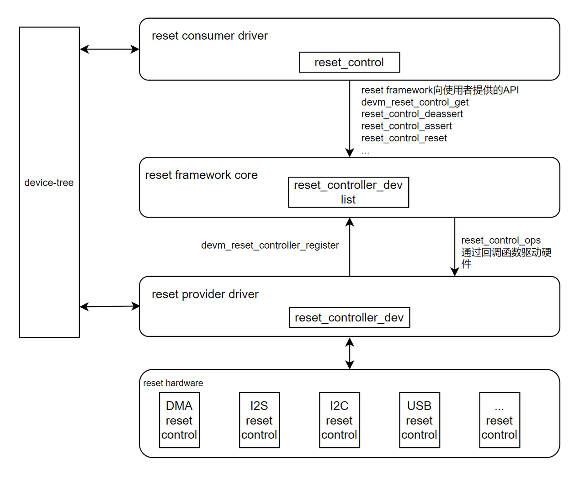

# Reset

介绍 K3 平台复位系统的组成、驱动实现、设备树配置方式、使用方法以及常用调试方法。

## 模块介绍

Reset 系统负责给 SoC 内部各个模块提供复位控制功能，让模块能够恢复到已知状态，确保模块能够正确初始化。

### 功能介绍

#### 复位框架

Linux 提供了一个复位管理框架 Reset Controller Framework，为设备驱动提供统一的复位操作接口，使设备驱动不必关心复位硬件实现的具体细节。



Reset Controller Framework 包括以下核心组成部分：

- **reset provider**：即 reset controller，负责提供系统所需的各种复位信号。

- **reset consumer**：即使用复位的设备驱动，通过 Reset Controller Framework 提供的通用 API 获取和控制复位信号。

- **reset framework**：Reset Controller Framework 的核心部分，向 reset consumers 提供操作 reset 的通用 API；实现复位管理的核心逻辑，将与硬件相关的 reset 控制逻辑封装成操作函数集，交由 reset provider 实现。

- **device tree**：Reset Controller Framework 允许在设备树中声明可用的复位信号与设备的关联。设备树中的 `resets` 属性通过 "provider + ID" 指定了设备使用哪个复位资源，`reset-names` 属性为这些复位资源提供了一个易于理解的名称，设备驱动通过这些名称获取对应的复位资源并进行控制和管理。

#### 复位功能

复位系统的主要功能包括：

- **Assert（复位）**：将模块置于复位状态，模块停止工作
- **Deassert（释放复位）**：将模块从复位状态释放，允许模块正常工作
- **Reset（完整复位）**：先 assert 再 deassert，完成一次完整的复位操作
- **Status（状态查询）**：查询模块是否处于复位状态

#### K3 复位体系

K3 平台的复位体系与时钟体系紧密结合，按地址域拆成多个 reset provider，与 clock provider 对应。

| reset provider 节点 | 地址 | 典型用途 |
| :--- | :--- | :--- |
| `syscon_mpmu` | `0xd4050000` | MPMU 相关基础复位 |
| `syscon_apmu` | `0xd4282800` | APMU 域复位，如 QSPI、SDH、USB、CPU 等 |
| `syscon_apbc` | `0xd4015000` | APB 外设复位，如 UART/PWM/I2C/SPI/RTC |
| `syscon_apbc2` | `0xf0610000` | 安全域APB外设复位 |
| `syscon_dciu` | `0xd8440000` | DCIU 相关控制 |
| `syscon_rcpu_sysctrl` | `0xc0880000` | R-domain 系统控制相关复位 |
| `syscon_rcpu_uartctrl` | `0xc0881f00` | R-domain UART |
| `syscon_rcpu_i2sctrl` | `0xc0882000` | R-domain I2S |
| `syscon_rcpu_spictrl` | `0xc0885f00` | R-domain SPI |
| `syscon_rcpu_i2cctrl` | `0xc0886f00` | R-domain I2C |
| `syscon_rpmu` | `0xc088c000` | R-domain PMU |
| `syscon_rcpu_pwmctrl` | `0xc088d000` | R-domain PWM |

所以 K3 DTS 里常见的复位引用形式是：

```dts
resets = <&syscon_apbc RESET_APBC_CAN0>;
```

这表示：

- Reset Provider 是 `syscon_apbc`
- Reset ID 是 `RESET_APBC_CAN0`

需要根据实际的驱动实现来确定对应的 Reset provider 和 Reset ID。

#### 复位与时钟

复位需要与时钟配合使用才能正确初始化硬件模块。K3 的典型操作流程如下：

**模块初始化流程**

1. 使能时钟 (clk_prepare_enable)
2. 释放复位 (reset_control_deassert)
3. 配置工作时钟频率 (clk_set_rate)
4. 配置模块寄存器
5. 模块开始工作

**模块关闭流程**

当模块进入休眠或关闭时，按相反顺序操作：

1. 停止模块工作
2. 复位模块 (reset_control_assert)
3. 关闭时钟 (clk_disable_unprepare)

## 源码结构介绍

### 源码位置

K3 复位相关代码主要位于：

```text
linux-6.18/
|-- drivers/reset/
|   `-- reset-spacemit.c          # K3 复位控制器驱动
|-- include/dt-bindings/clock/
|   `-- spacemit,k3-syscon.h      # K3 Reset 和 Clock ID 定义
|-- include/soc/spacemit
|   `-- k3-syscon.h               # K3 Reset 和 Clock 寄存器定义
`-- arch/riscv/boot/dts/spacemit/
    |-- k3.dtsi
    |-- k3-rdomain.dtsi
    `-- k3*.dts
```

SpacemiT K3 Reset 驱动实现了标准的 Reset Controller Framework 接口功能：

- `reset_control_assert()`：将复位信号置为有效状态（复位模块）
- `reset_control_deassert()`：将复位信号置为无效状态（释放复位）

## 配置介绍

### CONFIG 配置

- `CONFIG_RESET_CONTROLLER`：Reset Controller Framework 支持，为系统提供 Reset 框架基础

```text
-> Device Drivers│
  │       -> Reset Controller Support (RESET_CONTROLLER [=y])│
```

- `CONFIG_SPACEMIT_RESET`：SpacemiT Reset 驱动支持，提供具体的 Reset 控制器实现

```text
-> Device Drivers│
  │       -> Reset Controller Support (RESET_CONTROLLER [=y])│
  │              -> SpacemiT SoC reset controller (SPACEMIT_RESET [=y])│
```

### DTS 配置

K3 复位控制器按不同地址域分成了多个 reset controller，每个 reset controller 负责管理一个地址域内的复位信号，reset controller 节点在 `k3.dtsi` 中定义，这些节点同时也是 clock controller，DTS 配置如下：

```dts
/ {
        soc: soc {
                ...
                syscon_mpmu: system-controller@d4050000 {
                        compatible = "spacemit,k3-syscon-mpmu";
                        reg = <0x0 0xd4050000 0x0 0x10000>;
                        clocks = <&osc_32k>, <&vctcxo_1m>, <&vctcxo_3m>,
                                 <&vctcxo_24m>, <&reserved_clk>, <&external_clk>;
                        clock-names = "osc_32k", "vctcxo_1m", "vctcxo_3m", "vctcxo_24m",
                                      "reserved_clk", "external_clk";
                        #clock-cells = <1>;
                        #reset-cells = <1>;
                };

                syscon_apmu: system-controller@d4282800 {
                        compatible = "spacemit,k3-syscon-apmu";
                        reg = <0x0 0xd4282800 0x0 0x400>;
                        clocks = <&osc_32k>, <&vctcxo_1m>, <&vctcxo_3m>, <&vctcxo_24m>,
                                 <&reserved_clk>, <&external_clk>;
                        clock-names = "osc_32k", "vctcxo_1m", "vctcxo_3m", "vctcxo_24m",
                                      "reserved_clk", "external_clk";
                        #clock-cells = <1>;
                        #power-domain-cells = <1>;
                        #reset-cells = <1>;
                };

                syscon_apbc: system-controller@d4015000 {
                        compatible = "spacemit,k3-syscon-apbc";
                        reg = <0x0 0xd4015000 0x0 0x1000>;
                        clocks = <&osc_32k>, <&vctcxo_1m>, <&vctcxo_3m>, <&vctcxo_24m>,
                                 <&reserved_clk>, <&external_clk>;
                        clock-names = "osc_32k", "vctcxo_1m", "vctcxo_3m", "vctcxo_24m",
                                      "reserved_clk", "external_clk";
                        #clock-cells = <1>;
                        #reset-cells = <1>;
                };

                syscon_apbc2: system-controller@f0610000 {
                        compatible = "spacemit,k3-syscon-apbc2";
                        reg = <0x0 0xf0610000 0x0 0x2000>;
                        clocks = <&osc_32k>, <&vctcxo_1m>, <&vctcxo_3m>, <&vctcxo_24m>,
                                 <&reserved_clk>, <&external_clk>;
                        clock-names = "osc_32k", "vctcxo_1m", "vctcxo_3m", "vctcxo_24m",
                                      "reserved_clk", "external_clk";
                        #clock-cells = <1>;
                        #reset-cells = <1>;
                };

                syscon_dciu: system-controller@d8440000 {
                        compatible = "spacemit,k3-syscon-dciu";
                        reg = <0x0 0xd8440000 0x0 0xc000>;
                        #clock-cells = <1>;
                        #reset-cells = <1>;
                };

                syscon_rcpu_sysctrl: system-controller@c0880000 {
                        compatible = "spacemit,k3-syscon-rcpu-sysctrl";
                        reg = <0x0 0xc0880000 0x0 0x1000>;
                        clocks = <&vctcxo_24m>, <&external_clk>;
                        clock-names = "vctcxo_24m", "external_clk";
                        #clock-cells = <1>;
                        #reset-cells = <1>;
                };

                syscon_rcpu_uartctrl: system-controller@c0881f00 {
                        compatible = "spacemit,k3-syscon-rcpu-uartctrl";
                        reg = <0x0 0xc0881f00 0x0 0x100>;
                        #clock-cells = <1>;
                        #reset-cells = <1>;
                };

                syscon_rcpu_i2sctrl: system-controller@c0882000 {
                        compatible = "spacemit,k3-syscon-rcpu-i2sctrl";
                        reg = <0x0 0xc0882000 0x0 0x1000>;
                        #clock-cells = <1>;
                        #reset-cells = <1>;
                };

                syscon_rcpu_spictrl: system-controller@c0885f00 {
                        compatible = "spacemit,k3-syscon-rcpu-spictrl";
                        reg = <0x0 0xc0885f00 0x0 0x100>;
                        #clock-cells = <1>;
                        #reset-cells = <1>;
                };

                syscon_rcpu_i2cctrl: system-controller@c0886f00 {
                        compatible = "spacemit,k3-syscon-rcpu-i2cctrl";
                        reg = <0x0 0xc0886f00 0x0 0x100>;
                        #clock-cells = <1>;
                        #reset-cells = <1>;
                };

                syscon_rpmu: system-controller@c088c000 {
                        compatible = "spacemit,k3-syscon-rpmu";
                        reg = <0x0 0xc088c000 0x0 0x800>;
                        #clock-cells = <1>;
                        #reset-cells = <1>;
                };

                syscon_rcpu_pwmctrl: system-controller@c088d000 {
                        compatible = "spacemit,k3-syscon-rcpu-pwmctrl";
                        reg = <0x0 0xc088d000 0x0 0x100>;
                        #clock-cells = <1>;
                        #reset-cells = <1>;
                };
                ...
        };
};

```
这些节点通过 `#reset-cells = <1>` 属性声明自己为 Reset Provider。各个设备节点通过 `resets` 和 `reset-names` 属性引用对应的 Reset 资源。

## API 介绍

Reset Controller Framework 为设备驱动提供了统一的 Reset 操作接口，可在 `include/linux/reset.h` 中查看，以下是一些常用接口：

- `get`：获取 Reset 句柄

```c
/**
 * devm_reset_control_get - get reset control
 * @dev: device
 * @id: reset name
 * Returns a reset control or IS_ERR() condition containing errno.
 */
struct reset_control *devm_reset_control_get(struct device *dev, const char *id);

/**
 * of_reset_control_get_by_name - get reset control by name
 * @node: device
 * @name: reset name
 * Returns a reset control or IS_ERR() condition containing errno.
 */
struct reset_control *of_reset_control_get_by_name(struct device_node *node,
                                                   const char *name);
```
上述接口，第 2 个参数缺省时，默认返回 DTS `resets` 列表中的第 1 个时钟。

- `put`：释放 Reset 句柄

```c
/**
 * reset_control_put - release a reset control
 * @rstc: reset control
 */
void reset_control_put(struct reset_control *rstc);
```

- `assert`：复位

```c
/**
 * reset_control_assert - asserts the reset line
 * @rstc: reset control
 * Returns 0 on success or negative errno on failure.
 */
int reset_control_assert(struct reset_control *rstc);
```

- `deassert`：释放复位

```c
/**
 * reset_control_deassert - deasserts the reset line
 * @rstc: reset control
 * Returns 0 on success or negative errno on failure.
 */
int reset_control_deassert(struct reset_control *rstc);
```

- `reset`：先复位再释放复位

```c
/**
 * reset_control_reset - perform a complete reset of the device
 * @rstc: reset control
 * Returns 0 on success or negative errno on failure.
 * This function will assert, then deassert the reset line.
 */
int reset_control_reset(struct reset_control *rstc);
```

## 使用介绍

主要以 **Provider** 和 **Consumer** 两个角色角度来介绍。

### Provider

K3 Reset Provider 在 `k3.dtsi` 里已经定义好，板级 DTS 一般不需要配置 Provider，这部分一般没有什么工作。

### Consumer

Reset Consumer 一般需要完成以下工作：

- 找到正确的 Reset Provider 和 Reset ID，在 DTS 节点中配置 `resets`；
- 在 DTS 节点中配置 `reset-names`：
  - 不同设备的 `reset-names` 会有区别，具体看 reset 的用途，也可以根据实际的情况自定义，主要是设备驱动获取 Reset 句柄时需要使用，常见的取值有 `reset`、`rst`、`sys_rst`等；
- 设备驱动中通过接口获取 Reset 句柄，并进行 Reset 相关的操作。

大多数 K3 外设 DTS 节点 Reset 配置的写法都类似：

```dts
xxx: device@addr {
	resets = <&ResetProvider RESET_ID>;
	status = "disabled";
};
```

Reset Provider 和 Reset ID 可以通过 ID 的前缀来对应，具体对应关系如下：

| Reset ID 前缀 | 前缀对应的 Provider 节点 |
| :--- | :--- |
| RESET_MPMU_ | syscon_mpmu |
| RESET_APMU_ | syscon_apmu |
| RESET_APBC_ | syscon_apbc |
| RESET_APBC2_ | syscon_apbc2 |
| RESET_DCIU_ | syscon_dciu |
| RESET_RCPU_SYSCTRL_ | syscon_rcpu_sysctrl |
| RESET_RCPU_UARTCTRL_ | syscon_rcpu_uartctrl |
| RESET_RCPU_I2SCTRL_ | syscon_rcpu_i2sctrl |
| RESET_RCPU_SPICTRL_ | syscon_rcpu_spictrl |
| RESET_RCPU_I2CCTRL_ | syscon_rcpu_i2cctrl |
| RESET_RPMU_ | syscon_rpmu |
| RESET_RCPU_PWMCTRL_ | syscon_rcpu_pwmctrl |

## 使用示例

模块如要使用 Reset 功能，需要在 DTS 中配置 `resets` 和 `reset-names` 属性，然后在驱动中通过 Reset Controller Framework API 进行 Reset 相关的操作。

- 配置 DTS
在 `include/dt-bindings/clock/spacemit,k3-syscon.h` 找到对应的Reset ID，配置到模块 DTS 中。
以`can0`为例：can0 的 Reset ID 只有一个：RESET_APBC_CAN0，前缀 RESET_APBC_ 对应 Provider 为 syscon_apbc，所以其 DTS 配置如下：

```dts
    flexcan0: fdcan@d4028000 {
        compatible = "spacemit,k1-flexcan";
        reg = <0x0 0xd4028000 0x0 0x4000>;
        interrupts = <161 IRQ_TYPE_LEVEL_HIGH>;
        interrupt-parent = <&saplic>;
        fsl,clk-source = <0>;
        clocks = <&syscon_apbc CLK_APBC_CAN0>,<&syscon_apbc CLK_APBC_CAN0_BUS>;
        clock-names = "per","ipg";
        resets = <&syscon_apbc RESET_APBC_CAN0>;
        reset-names = "reset";
        status = "disabled";
    };
```

- 加头文件和 `reset_control` 结构体
在驱动代码中添加头文件和结构体定义：
```c
#include <linux/reset.h>
```

```c
struct flexcan_priv {
        struct reset_control *reset;
};
```

- 获取复位句柄
通过 `devm_reset_control_get_optional` 获取复位句柄

```c
reset = devm_reset_control_get_optional(&pdev->dev, "reset");
        if(IS_ERR(reset)) {
                dev_err(&pdev->dev, "flexcan get reset failed\n");
                return PTR_ERR(reset);
        }
```

- 释放复位
通过 `reset_control_deassert` 释放复位

```c
        if (priv->reset) {
                err = reset_control_deassert(priv->reset);
                if (err && priv->clk_ipg && priv->clk_per) {
                        clk_disable_unprepare(priv->clk_per);
                        clk_disable_unprepare(priv->clk_ipg);
                }
        }
```

- 复位
通过 `reset_control_assert` 复位模块
```c
        if (priv->reset)
                reset_control_assert(priv->reset);
```

## FAQ

### 1.模块不工作，应该如何排查复位相关问题？

- DTS 配置是否正确：`resets` 是否配置，Provider 和 ID 是否正确；`reset-names` 是否与驱动匹配；
- Provider 节点是否有 `#reset-cells = <1>` 属性；
- 驱动里实际 `devm_reset_control_get()` 请求的名字是什么，是否有报错，例如 `failed to get reset` `failed to deassert reset`；
- 驱动是否正确释放复位（deassert）；
- 复位和时钟的顺序是否正确；
- 是否还有其他依赖没满足，比如 clock / pinctrl / power-domain / regulator 等；

### 2.为什么有些模块挂 `syscon_apbc`，有些挂 `syscon_apmu`？

因为它们处于不同时钟/电源/总线域。通常来说：

- 低速 APB 外设更多挂在 `syscon_apbc`；
- 高速或更复杂模块更多挂在 `syscon_apmu`；
- R-domain 模块则更多挂在 `syscon_rcpu_*` 系列 provider。

可参照 `使用介绍` 章节的对应方法。

### 3.reset_control_get 和 reset_control_get_optional 有什么区别？

- `reset_control_get`：如果 DTS 中没有配置 `resets` 属性，会返回错误；
- `reset_control_get_optional`：如果 DTS 中没有配置 `resets` 属性，会返回 NULL（不是错误），代表该复位信号是可选的。

对于复位信号是可选的模块，应该使用 `_optional` 接口，这样即使没有配置复位信号，驱动也能正常工作。

### 4.什么时候需要调用 reset_control_assert？

通常在以下场景需要调用 `reset_control_assert`：

- 模块卸载或关闭时，将模块复位以节省功耗
- 模块出错需要重新初始化时
- 系统进入低功耗模式时

大多数情况下，只需要在初始化时调用 `reset_control_deassert` 释放复位即可。
