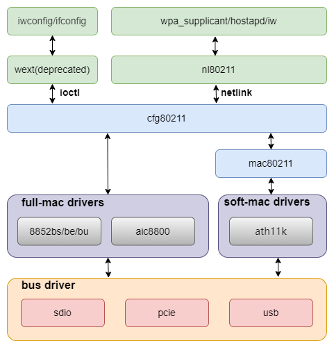

# WIFI

介绍 K3 平台 WiFi 模组的常见移植方法以及注意事项。

## 模块介绍

K3 平台需要外接**外部 WiFi 模组**实现 WiFi 功能，支持 SDIO / PCIe / USB 等接口。

## 功能介绍

WiFi 在 Linux 里主要有以下几层：



1. **cfg80211 / mac80211 / nl80211**
   提供 Linux 无线协议栈与用户态控制接口；
2. **模组驱动**
   WiFi 模组驱动，由 WiFi 厂商提供，主要实现 WiFi 功能；
3. **接口控制器**
   主要实现 WiFi 数据传输接口功能，如 PCIe、SDIO 以及 USB 等接口；

## 源码结构介绍

涉及的源码主要有：

```text
linux-6.18/
|-- drivers/net/wireless/          # 具体 WiFi 驱动（厂商/主线）
|-- drivers/mmc/                   # SDIO / MMC host 控制器
|-- drivers/regulator/             # 模组供电控制
|-- drivers/mmc/core/pwrseq*       # mmc-pwrseq 通用上电/复位逻辑
`-- arch/riscv/boot/dts/spacemit/  # 板级 DTS 配置
```

其中 WiFi 驱动的源码一般放到以下目录：

```text
drivers/net/wireless/realtek/
|-- rtl8852bs/          # rtl8852bs SDIO 驱动（厂商提供）
`-- rtw89/              # rtw89 框架驱动（主线）
```

## 关键特性

### 平台接口特性

#### SDIO 接口

| 特性 | 特性说明 |
| :----- | :---- |
| 兼容 SDIO 3.0 | 兼容 4bit SDIO Specification Ver3.00 |
| 支持 SD 3.0 模式 | 支持 UHS，最高支持 SDR104 |
| 支持 PIO/DMA | 支持 PIO, SDMA, ADMA, ADMA2 传输模式 |

#### PCIe 接口

K3 PCIe 控制器最高支持 PCIe Gen3 x8。WiFi 模组（如 rtl8852be）通常使用 Gen2 x1 模式。控制器的完整特性（模式、速率、PHY、电源管理等）参见 PCIe 开发指南。

### 模组性能参数

| 模组型号 | 接口 | 驱动 | TX(Mb/s) | RX(Mb/s) |
| :----- | :---- | :---- | :----: | :----: |
| rtl8852bs | SDIO | rtl8852bs（厂商驱动） | 460 | 480 |
| rtl8852be | PCIe | rtw89（主线驱动） | 870 | 880 |

## 配置介绍

主要包括内核配置和 DTS 配置。

### CONFIG 配置

#### 无线协议栈配置

`CONFIG_NET` / `CONFIG_WIRELESS` / `CONFIG_CFG80211` 为 WiFi 提供基础支持，需要设置为 `Y`：

```text
Networking support (NET [=y])
    Wireless (WIRELESS [=y])
        cfg80211 - wireless configuration API (CFG80211 [=y])
```

部分驱动（如 rtw89）还依赖 `CONFIG_MAC80211`，需要一并启用：

```text
Networking support (NET [=y])
    Wireless (WIRELESS [=y])
        Generic IEEE 802.11 Networking Stack (mac80211 [=y])
```

#### SDIO 接口配置

`CONFIG_MMC` 为 MMC 总线协议提供支持，通常为 `Y`：

```text
Device Drivers
    MMC/SD/SDIO card support (MMC [=y])
```

`CONFIG_MMC_SDHCI` / `CONFIG_MMC_SDHCI_PLTFM` / `CONFIG_MMC_SDHCI_OF_K1` 为 SpacemiT SDHCI 控制器提供支持，需要设置为 `Y`：

```text
Device Drivers
    MMC/SD/SDIO card support (MMC [=y])
        Secure Digital Host Controller Interface support (MMC_SDHCI [=y])
            SDHCI platform and OF driver helper (MMC_SDHCI_PLTFM [=y])
                SDHCI OF support for the SpacemiT SDHCI controller (MMC_SDHCI_OF_K1 [=y])
```

#### PCIe 接口配置

`CONFIG_PCI` / `CONFIG_PCIE_SPACEMIT_K1` 为 K3 PCIe 控制器提供支持：

```text
Device Drivers
    PCI support (PCI [=y])
        PCI controller drivers
            DesignWare-based PCIe controllers
                SpacemiT K1 PCIe controller (host mode) (PCIE_SPACEMIT_K1 [=y])
```

`CONFIG_RTW89` / `CONFIG_RTW89_8852BE` 为 rtl8852be PCIe WiFi 模组提供支持：

```text
Device Drivers
    Network device support (NETDEVICES [=y])
        Wireless LAN (WLAN [=y])
            Realtek devices (WLAN_VENDOR_REALTEK [=y])
                Realtek 802.11ax wireless chips support (RTW89 [=y])
                    Realtek 8852BE PCI wireless network (Wi-Fi 6) adapter (RTW89_8852BE [=m])
```

#### SDIO 接口驱动配置

`CONFIG_RTL8852BS` 为 rtl8852bs SDIO WiFi 模组提供支持：

```text
Device Drivers
    Network device support (NETDEVICES [=y])
        Wireless LAN (WLAN [=y])
            Realtek devices (WLAN_VENDOR_REALTEK [=y])
                Realtek 8852B SDIO Wireless driver (RTL8852BS [=m])
```

### DTS 配置

#### SDIO 接口配置示例

##### SDIO 控制器配置

`k3_evb.dts` 中的 `&sdio` 示例为：

```dts
&sdio {
        pinctrl-names = "default";
        pinctrl-0 = <&mmc2_cfg>;
        bus-width = <4>;
        non-removable;
        vmmc-supply = <&vmmc_sdio>;
        vqmmc-supply = <&p1v8>;
        mmc-pwrseq = <&sdio_pwrseq>;
        no-mmc;
        no-sd;
        keep-power-in-suspend;
        clock-frequency = <375000000>;
        #address-cells = <1>;
        #size-cells = <0>;
        status = "disabled";

        wifi@1 {
                reg = <1>;
                compatible = "realtek,rtl8852bs";
                pinctrl-names = "default";
                pinctrl-0 = <&wifi_hostwake_cfg>;
                interrupts-extended = <&pinctrl 101 IRQ_TYPE_EDGE_FALLING>;
        };
};
```

K3 上的 SDIO WiFi 驱动不再需要关注 regulator 和 GPIO 等板级相关信息，统一放到总线层面进行管理。
供电相关的 regulator 和 GPIO 等配置放到 `vmmc-supply`、`vqmmc-supply` 中，WiFi REG_ON/RESET 放到 `sdio_pwrseq` 中进行配置。

其中：

- `wifi@1` 为 SDIO WiFi 子设备节点，`compatible` 需与驱动匹配，`reg` 为 SDIO 功能号（通常为 1）；
- `interrupts-extended` 对应 WiFi 模组唤醒 HOST 的中断引脚，驱动通过 `of_irq_get()` 获取该中断；
- `pinctrl-0` 中的 `wifi_hostwake_cfg` 用于配置 host wake 引脚的 pad。

##### WiFi Host Wake pinctrl 配置

对应的 `wifi_hostwake_cfg` 配置（`k3_evb.dts`）：

```dts
wifi_hostwake_cfg: wifi-hostwake-cfg {
        wifi-hostwake-pins {
                pinmux = <K3_PADCONF(101, 0)>;

                bias-pull-up;
                drive-strength = <25>;
                power-source = <1800>;
        };
};
```

其中 PAD 101 与 `interrupts-extended` 中的中断号一致。

##### SDIO 电源配置

`vmmc_sdio` 用于封装 WiFi 模组供电依赖的 regulator 和 GPIO，有的模组供电除了依赖 regulator 以外可能还需要依赖某些 GPIO 的状态， 建议使用 `regulator-fixed` 进行封装。

```dts
vmmc_sdio: regulator-vmmc-sdio {
        compatible = "regulator-fixed";
        regulator-name = "vmmc-sdio";
        regulator-min-microvolt = <3300000>;
        regulator-max-microvolt = <3300000>;
        enable-active-high;
        gpio = <&gpio 3 6 GPIO_ACTIVE_HIGH>;
};
```

##### WiFi REG_ON 配置

`sdio_pwrseq` 定义 reset 引脚，对应 WiFi REG_ON ：

```dts
sdio_pwrseq: sdio-pwrseq {
        compatible = "mmc-pwrseq-simple";
        reset-gpios = <&gpio 3 4 GPIO_ACTIVE_LOW>;
};
```

#### PCIe 接口配置示例

PCIe WiFi 模组（如 rtl8852be）通过 PCIe 控制器连接，模组具体接在哪个端口需按板级原理图确认。以 K3 pico 系列为例，WiFi 接在 Port E（`pcie4_rc`），对应配置为：

```dts
&pcie4_rc {
        pinctrl-names = "default";
        pinctrl-0 = <&pcie4_1_cfg>;
        phys = <&phy5>;
        phy-names = "phy5";
        num-lanes = <1>;
        status = "okay";
};
```

`k3-pinctrl.dtsi` 中为每个 PCIe 控制器提供了多组可选的 pinctrl 配置，对应边带信号可选的不同 PAD 组。以 pcie4 为例：

```dts
pcie4_0_cfg: pcie4-0-cfg {
        pcie4-0-pins {
                pinmux = <K3_PADCONF(31, 4)>,   /* pcie4 perst */
                         <K3_PADCONF(32, 4)>,   /* pcie4 wake */
                         <K3_PADCONF(33, 4)>;   /* pcie4 clkreq */

                bias-disable;
                drive-strength = <25>;
        };
};

pcie4_1_cfg: pcie4-1-cfg {
        pcie4-0-pins {
                pinmux = <K3_PADCONF(76, 5)>,   /* pcie4 perst */
                         <K3_PADCONF(77, 5)>,   /* pcie4 wake */
                         <K3_PADCONF(78, 5)>;   /* pcie4 clkreq */

                bias-disable;
                drive-strength = <25>;
        };
};
```

板级 DTS 根据实际连线选择对应的配置组即可，例如边带信号接在 PAD 76/77/78 时选 `pcie4_1_cfg`。如果公共组的电气参数（`bias` / `drive-strength` / `power-source`）与板级电压域不匹配，可以在板级 DTS 中重新定义同名节点覆盖。

其中：

- `pinctrl-0` 配置 PCIe 边带信号（PERST、WAKE、CLKREQ）的 pad；
- `phys` / `phy-names` 绑定该控制器使用的 PHY，顺序需与硬件 lane 连线一致；
- `num-lanes` 为期望的 lane 数，需与板级实际连线一致。

PCIe 的 PERST# 由控制器驱动管理（默认走 PMU 寄存器，也可通过 `reset-gpios` 改为 GPIO 控制），复位时序、PHY 绑定、lane 分叉等控制器侧配置参见 PCIe 开发指南。

##### WiFi 模组使能配置

PCIe WiFi 模组的使能引脚通常用 `rfkill-gpio` 封装，由上层通过 RFKILL 控制。`k3-pico.dtsi` 中的配置为：

```dts
rfkill-pcie-wlan {
        compatible = "rfkill-gpio";
        label = "rfkill-pcie-wlan";
        pinctrl-names = "default";
        pinctrl-0 = <&wlan_en_cfg>;
        radio-type = "wlan";
        shutdown-gpios = <&gpio 1 3 GPIO_ACTIVE_HIGH>;
};
```

对应的 pinctrl 配置：

```dts
wlan_en_cfg: wl-en-cfg {
        wlan-en-pins {
                pinmux = <K3_PADCONF(35, 0)>;

                bias-pull-up;
                drive-strength = <38>;
                power-source = <3300>;
        };
};
```

`shutdown-gpios` 和 `wlan_en_cfg` 需按实际硬件的 WiFi 使能引脚配置。模组使能后 PCIe 会枚举到设备并自动加载 `rtw89` 驱动，不需要在 DTS 中声明 WiFi 子节点。

## 接口介绍

### 用户态接口

用户态推荐采用 `nl80211` 接口访问 WiFi 设备，例如：

- `wpa_supplicant`
- `wpa_cli`
- `iw`
- `ip`

基于 `wext` 接口的访问方式默认不支持， 需要的话可以打开 `CONFIG_CFG80211_WEXT` ：

```text
cfg80211 wireless extensions compatibility (CFG80211_WEXT [=n])
```

## Debug 介绍

### 1. 确认控制器状态

#### SDIO 控制器

```bash
dmesg | grep -i mmc1
```

MMC 子系统会为每个 host 在 debugfs 根目录下创建 `mmcN` 目录，可以据此确认控制器是否注册成功：

```bash
ls -d /sys/kernel/debug/mmc*
```

#### PCIe 控制器

确认 PCIe 设备枚举：

```bash
lspci
```

正常情况下可以看到 Root Complex 和挂在其下的 WiFi 设备：

```text
0000:00:00.0 PCI bridge: SpacemiT X100 PCIe Root Complex (rev 01)
0002:00:00.0 PCI bridge: SpacemiT X100 PCIe Root Complex (rev 01)
0002:01:00.0 Ethernet controller: Realtek Semiconductor Co., Ltd. RTL8127 10GbE Controller (rev 08)
0004:00:00.0 PCI bridge: SpacemiT X100 PCIe Root Complex (rev 01)
0004:01:00.0 Network controller: Realtek Semiconductor Co., Ltd. RTL8852BE PCIe 802.11ax Wireless Network Controller
```

BDF 中的 domain 号与 DTS 中的 `linux,pci-domain` 对应，`pcie0_rc` ~ `pcie4_rc` 依次为 domain 0 ~ 4。上面输出中 WiFi 位于 `0004:01:00.0`，即挂在 `pcie4_rc`（Port E）下。

查看 PCIe 设备详细信息：

```bash
lspci -vvv -s 0004:01:00.0
```

检查内核日志：

```bash
dmesg | grep -E "pcie|rtw89"
```

### 2. 确认 WiFi 模组识别

一般会在 `dmesg` 中看到：

- SDIO/PCIe card/function 枚举日志
- 后续厂商 WiFi 驱动 probe 日志

如果 WiFi 模组没有识别到，需要排查：

- `vmmc-supply`（SDIO）
- `vqmmc-supply`（SDIO）
- `reset-gpios`（SDIO）或 pinctrl 配置（PCIe）
- `spacemit,tx_delaycode`（SDIO）
- `status = "okay"`

### 3. 确认总线工作状态

#### SDIO 总线状态

```bash
cat /sys/kernel/debug/mmc1/ios
```

确认以下信息：

- `clock`
- `bus width`
- `timing spec`
- `signal voltage`

#### PCIe 链路状态

查看链路状态：

```bash
lspci -vvv -s 0004:01:00.0 | grep -E "LnkCap|LnkSta"
```

确认以下信息：

- `LnkCap`：控制器和设备各自声明的能力（最大速率、最大宽度）；
- `LnkSta`：实际协商结果，重点看 `Speed` 和 `Width` 是否达到预期。

如果协商速率或宽度低于预期，需要检查板级 lane 连线、`num-lanes` 配置以及信号完整性。

## 测试介绍

### 扫描连接测试

首先确认 wpa_supplicant 服务有正常运行。

```bash
wpa_supplicant -iwlan0 -Dnl80211 -c/etc/wpa_supplicant.conf -B
```

wpa_supplicant.conf 基础配置如下：

```txt
ctrl_interface=/var/run/wpa_supplicant
update_config=1

network={
    ssid="your_wifi_ssid"
    psk="your_password"
}
```

- `ctrl_interface`：wpa_cli 通信接口路径，如果不是默认的 `/var/run/wpa_supplicant`，则 wpa_cli 运行时需要使用 `-p` 显式指定；
- `update_config`：允许 wpa_supplicant 动态更新配置文件（如通过 wpa_cli 添加网络）；
- `network`：WiFi 网络配置段，`ssid` 为网络名称，`psk` 为密码（WPA/WPA2）。

高级配置（根据实际需求选配）：

```txt
disable_scan_offload=1       # 禁用硬件扫描，强制使用软件扫描（部分模组硬件扫描有兼容性问题时使用）
filter_rssi=-75              # 过滤信号强度低于 -75 dBm 的 AP
pmf=1                        # 启用 PMF（802.11w）管理帧保护，1=可选，2=强制
sae_pwe=2                    # SAE 密码元素推导方式，2=仅使用 H2E（WPA3 相关）
wowlan_triggers=any          # 启用 WiFi 唤醒（需驱动和硬件支持）
bgscan="simple:11:-70:300"   # 后台扫描，信号 ≥-70dBm 时 300s 扫描一次，<-70dBm 时 11s 扫描一次
gas_rand_addr_lifetime=0     # GAS 随机 MAC 地址有效期，0=永久
gas_rand_mac_addr=1          # 启用 GAS 交互时的随机 MAC 地址（隐私保护）
```

wpa_cli 扫描：

```bash
wpa_cli -iwlan0 -p/var/run/wpa_supplicant
scan
scan_results
```

正常扫描会有类似如下输出：

```bash
bssid / frequency / signal level / flags / ssid
f6:12:b3:d4:65:ef       2462    -37     [WPA2-PSK-CCMP][WPS][ESS][P2P]  wilson
78:85:f4:82:01:3c       2462    -66     [WPA2-PSK-CCMP][WPS][ESS]       HUAWEI-LX45AG_HiLink
02:0e:5e:76:a5:6e       2412    -69     [WPA-PSK-CCMP+TKIP][ESS]        ChinaNet-1mMr
30:8e:7a:2f:64:8c       2437    -69     [WPA-PSK-CCMP+TKIP][WPA2-PSK-CCMP+TKIP][ESS]    K03_1tlftb
dc:16:b2:57:9e:65       2437    -78     [WPA2-PSK-CCMP][ESS]    \x00\x00\x00\x00\x00\x00\x00\x00
dc:16:b2:57:9e:60       2437    -78     [WPA-PSK-CCMP][WPA2-PSK-CCMP][WPS][ESS] TK-ZJB
48:0e:ec:ad:52:4d       2462    -78     [WPA-PSK-CCMP][WPA2-PSK-CCMP][WPS][ESS] TP-LINK_524D
3c:d2:e5:c6:08:9b       2452    -83     [WPA2-PSK-CCMP][ESS]
3e:d2:e5:16:08:9b       2452    -83     [WPA-PSK-CCMP+TKIP][WPA2-PSK-CCMP+TKIP][ESS]    young
80:ea:07:dc:f2:be       2462    -88     [WPA-PSK-CCMP][WPA2-PSK-CCMP][ESS]      HZXF
9a:00:74:84:d1:60       2412    -85     [WPA-PSK-CCMP+TKIP][WPA2-PSK-CCMP+TKIP][ESS]   ChinaNet-ieR7
dc:f8:b9:46:ec:30       2472    -85     [WPA-PSK-CCMP+TKIP][WPA2-PSK-CCMP+TKIP][ESS]   ChinaNet-MiZK
```

选择需要连接的 AP 网络进行连接：

```bash
> add_network
0
> set_network 0 ssid "wilson"
OK
> set_network 0 key_mgmt WPA-PSK
OK
> set_network 0 psk "wilson2001"
OK
> enable_network 0
```

```bash
wpa_supplicant -iwlan0 -Dnl80211 -c/wpa_supplicant.conf -B
wpa_cli -iwlan0 -p/var/run/wpa_supplicant
```

### 吞吐量测试

同一局域网中可使用：

```bash
# 服务端
iperf3 -s

# 客户端
iperf3 -c <server-ip> -t 60
```

### 信号强度查看

连接成功后可通过以下命令查看当前信号强度和链路状态：

```bash
iw dev wlan0 link
```

查看更详细的统计信息：

```bash
iw dev wlan0 station dump
```

关注以下字段：

- `signal` — 当前 RSSI，单位 dBm，一般 -70 dBm 以上为正常；
- `tx bitrate` / `rx bitrate` — 当前协商速率；
- `tx failed` / `tx retries` — 发送失败和重传次数，数值持续增大说明信号质量差。

## FAQ

### 1. 为什么控制器起来了，但加载驱动后找不到 `wlan0` 设备节点？

通用排查点：

- 对应方案的控制器 DTS 是否有使能；
- 对应的 Wi‑Fi 固件是否存在。

SDIO 接口还需检查：

- `vmmc-supply` / `vqmmc-supply` 配置错误或者电压异常；
- `mmc-pwrseq` 是否正确配置 WiFi 模组 REG_ON/RESET 引脚。

PCIe 接口还需检查：

- 先用 `lspci` 确认设备是否枚举成功，若没有枚举，说明问题在链路层而非驱动层；
- `rfkill list` 确认模组未被 block，以及 `rfkill-gpio` 的使能引脚是否正确配置；
- PCIe 控制器的 `phys` / `num-lanes` 是否与板级连线一致。

### 2. WiFi 可以使用，但是使用过程中经常会出现异常打印？

例如出现如下错误打印：

```txt
[69686.314058] rtl8852bs mmc1:0001:1: rtw_sdio_raw_write: sdio write failed (-84)
[69686.314063] mmc1: set tx_delaycode: 127
[69686.314080] rtl8852bs mmc1:0001:1: RTW_SDIO: WRITE use CMD53
[69686.314085] rtl8852bs mmc1:0001:1: RTW_SDIO: WRITE to 0x1800a, 80 bytes
[69686.322783] mmc1: pretuned card, use select_delay[1]:200
[69686.328249] RTW_SDIO: WRITE 00000000: 00 64 48 00 00 00 00 00 1a 00 24 00 b9 23 00 00
[69686.341886] RTW_SDIO: WRITE 00000010: 00 00 00 00 00 00 00 00 00 00 00 40 00 00 00 00
[69686.349841] RTW: ERROR sdio_io: write FAIL! error(-2) addr=0x1800a 80 bytes, retry=0,0
[69686.349942] rtl8852bs mmc1:0001:1: rtw_sdio_raw_write: sdio write failed (-110)
```

常见原因包括：

- `-84` 表示 SDIO 的 tx 出现 crc 校验错误，需要调整 SDIO 的 `spacemit,tx_delaycode` 参数；
- `-110` 表示 SDIO 操作超时，通常是信号完整性问题或时序参数不匹配，同样可以尝试调整 `spacemit,tx_delaycode` 或降低 SDIO 时钟频率排查。

### 3. 连接 AP 成功但无法上网？

常见原因包括：

- 确认是否获取到 IP 地址，可通过 `ip addr show wlan0` 查看；
- 若未获取 IP，确认 DHCP 客户端（如 `udhcpc` / `dhclient`）是否正常运行；
- 确认 DNS 配置是否正确，检查 `/etc/resolv.conf` 是否有有效的 nameserver；
- 确认默认路由是否存在，可通过 `ip route` 查看。
