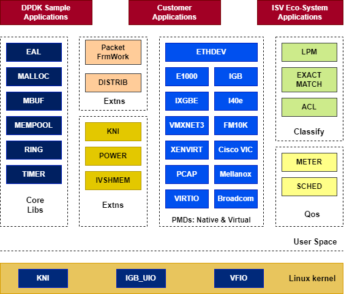

sidebar_position: 2

# K3 GMAC DPDK 用户使用指南

## DPDK 介绍

DPDK（Data Plane Development Kit，数据平面开发套件）是一个由 Linux 基金会托管的开源项目。它最初由 Intel 于 2010 年创建，现已成为业界广泛采用的高性能数据包处理加速框架。DPDK 是一组运行在用户空间的函数库和驱动程序集合，旨在加速各种 CPU 架构（包括 Intel x86、ARM、RISCV 等）上的数据包处理工作负载。

官方网址：[https://www.dpdk.org/]

### DPDK框架

DPDK 是一个高度模块化、层次分明的用户态数据平面开发框架。其整体架构设计遵循“底层抽象、核心复用、上层可扩展”的原则，旨在为开发者提供从硬件加速到业务逻辑构建的全链路支持。

DPDK 框架如下图所示：



### DPDK 组件说明

DPDK 由多个功能库和驱动程序组成，各组件分工协作，共同构成一个完整的高性能数据包处理框架。

#### 核心库

* 环境抽象层（EAL）

       提供对底层硬件和内存空间等资源的访问接口，屏蔽底层差异。

* 环形缓冲区管理库（RING）

       无锁的多生产者、多消费者FIFO队列。

* 内存池管理库（MEMPOOL）

       负责管理数据包缓冲区的分配与释放。

* 数据包缓冲区管理库（MBUF）

       管理数据包缓冲区（mbuf），提供对数据包数据的分配、释放、操作等功能。

* 定时器库（TIMER）

       提供基于EAL时间参考的异步定时器服务。

#### 轮询模式驱动（PMD）

DPDK实现高性能数据包收发的核心驱动组件。DPDK包含1 Gigabit、10 Gigabit、40 Gigabit以及半虚拟化virtio等多种PMD。

#### Classify库

* 精确匹配（Exact Match）

       用于流表精确查找（如 OpenFlow 五元组匹配），查找速度极快。

* LPM库（LPM）

       实现最长前缀匹配（Longest Prefix Match） 算法，主要用于IPv4路由查找。

* 通配符匹配（ACL）

       访问控制列表，支持基于源/目的 IP、端口、协议的多字段规则匹配，用于防火墙、访问控制场景。

#### QoS库

QoS（Quality of Service，服务质量）框架提供流量管理能力。主要包括：策略器（Policer）、缓存器（Buffer）和调度器（Scheduler）。

#### 扩展库（Extns）

* 数据包框架（Packet FrmWork）

       数据包框架提供了一套构建复杂数据包处理流水线的标准方法，通过将一组输入端口和输出端口用树形拓扑中的查找表连接起来构成处理流水线。

* 用户态 KNI库（KNI）

       和内核 KNI 模块配合，实现向内核协议栈的报文转发。

* 功耗管理（Power）

       CPU 功耗管理，支持根据负载动态调频（C-states）、往复休眠等策略，降低空闲功耗

#### 应用程序（Applications）

* 自带应用程序（DPDK Sample Apps）

       DPDK自带的命令行测试工具，用于验证网卡PMD功能和性能。

* 用户应用程序（Customer Apps）

       用户自研应用，如 vSwitch（虚拟交换机）、负载均衡器、防火墙、IDS/IPS 等。

### DPDK核心原理

DPDK 能够实现微秒级延迟和线速转发性能。其核心原理可归结为两大关键技术：内核旁路（Kernel Bypass） 和轮询模式驱动（Poll Mode Driver, PMD）。

* 内核旁路（Kernel Bypass）

  DPDK 彻底绕过了 Linux 内核网络协议栈：

  **1. 用户态接管：** 利用 UIO（User Space I/O）或 VFIO 驱动，将网卡寄存器和 I/O 直接映射到用户空间。

  **2. 零拷贝（Zero Copy）：** 网卡（NIC）通过 DMA 控制器直接将数据包拷贝到用户空间的大页内存缓冲区（mbuf）。用户态应用（DPDK Enabled App）直接读取这些缓冲区，彻底消除了数据从内核态到用户态的内存拷贝过程。

* 轮询模式驱动（PMD）

  传统中断模式在面对高并发、大吞吐量的海量网卡数据包时，会导致 CPU 频繁触发中断。DPDK 引入 PMD（轮询模式驱动）：

  **1. 无中断收包（No Interrupts）：** PMD 驱动运行在用户空间（DPDK PMD），分配专用 CPU 核心对网卡接收队列（Rx Queue）进行轮询。只要网卡收到包，PMD 即可在用户态直接读取描述符环形队列（Descriptor Rings）并处理。

  **2. 无系统调用（No System Calls）：** 收发包全流程无需调用 recv / send 等阻塞式系统调用，避免了内核上下文切换开销。


## Kernel配置

stmmac_uio驱动配置和加载。

### Kernel config

```config
CONFIG_HUGETLBFS=y
CONFIG_UIO=y
CONFIG_STMMAC_UIO=m
```

### dts配置

在方案dts中使能stmmac_uio驱动。

```dts
&gmac_uio0 {
       status = "okay";
};

&gmac_uio1 {
       status = "okay";
};
```

## 性能优化

### CPU隔离（isolcpus）

将指定CPU核心从内核调度器中剥离，避免内核线程或用户态普通进程抢占，专用于DPDK数据面处理。

配置方法：内核启动参数增加 "isolcpus=2,3"

```diff
 chosen {
-               bootargs = "earlycon=sbi console=ttyS0,115200 loglevel=8 random.trust_bootloader=1 unaligned_scalar_speed=fast unaligned_vector_speed=fast";
+               bootargs = "earlycon=sbi console=ttyS0,115200 loglevel=8 isolcpus=2,3 nohz_full=2,3 rcu_nocbs=2,3 random.trust_bootloader=1 unaligned_scalar_speed=fast unaligned_vector_speed=fast";
                rng-seed = <0x25d69b2 0xff555073 0xd23238ea 0x57aa5455 0x792478ed 0xa744f28e 0x6ba4fc54 0xa2bf20fc>;
                stdout-path = "serial0:115200";
        };
```

示例表示隔离 CPU 2 和 CPU 3，隔离后的核心不会自动被系统调度。

### 无滴答内核 (nohz_full)

减少被隔离核心的定时器中断，使其进入“无滴答”模式，显著降低中断开销，提升数据包处理的确定性。

#### Kernel 配置

```config
CONFIG_NO_HZ_FULL=y
CONFIG_RCU_NOCB_CPU=y
```

#### kernel启动参数配置

在内核命令行中，为需要无滴答模式的核心添加参数（需与 isolcpus 范围一致）：
nohz_full=2,3 rcu_nocbs=2,3

```dts
bootargs = "earlycon=sbi console=ttyS0,115200 loglevel=8 isolcpus=2,3 nohz_full=2,3 rcu_nocbs=2,3 random.trust_bootloader=1 unaligned_scalar_speed=fast unaligned_vector_speed=fast";
```

rcu_nocbs=2,3，将 RCU 回调迁移至未隔离核心。

### 关闭串口

减少串口控制台输出对 CPU 的干扰。

### 验证

检查 CPU 隔离：cat /sys/devices/system/cpu/isolated 应输出 2,3。

检查无滴答模式：cat /sys/devices/system/cpu/nohz_full 应输出 2,3

## DPDK安装

### 代码下载

```
https://github.com/spacemit-com/dpdk-spacemit.git
```

### 安装依赖

```bash
sudo apt update
sudo apt install -y build-essential clang llvm libelf-dev
sudo apt install -y meson ninja-build pkg-config libnuma-dev
sudo apt install -y python3-pyelftools libpcap-dev m4 libbsd-dev
```

### 编译

```bash
cd /root/dpdk/dpdk
meson setup -Dplatform=spacemit_k3 build
cd build
ninja
ninja install
ldconfig
```

## DPDK测试

### testpmd测试

#### 测试命令
```bash
echo 1024 > /sys/kernel/mm/hugepages/hugepages-2048kB/nr_hugepages
sudo mkdir -p /mnt/huge
sudo mount -t hugetlbfs nodev /mnt/huge
modprobe uio
modprobe stmmac_uio
dpdk-testpmd --iova-mode=pa --vdev=net_stmmac0 --vdev=net_stmmac1 -l 0,2,3 --main-lcore=0 -- --nb-cores=2 -i --txd=1024 --rxd=1024
```

#### 功能说明

利用 CPU 2 和 CPU 3 两个核心，高速轮询并处理两个 stmmac 虚拟网卡的数据包。同时开启了交互式命令行界面（-i），允许在程序运行时手动输入命令（如 start、stop、show port stats all）来控制转发、查看丢包和吞吐量速率（PPS）。

#### testpmd参数说明

* --iova-mode=pa

       因为gmac不⽀持iommu，故iova-mode设置pa模式

* --vdev=net_stmmac0 --vdev=net_stmmac1

       表⽰指定的虚拟设备，对应 eth0 和 eth1

* -l 0,2,3 

       表示 DPDK 可以使用的核心列表

* --main-lcore=0

       表⽰核 0 ⽤作管理，核 2 和 3 ⽤于转发

* -- 

       ⽤于分隔 eal 参数与 testpmd 应用参数

* --nb-cores=2
       
       指定用于数据包转发的工作核心数量

* -i

       表⽰进⼊ dpdk-testpmd 命令交互模式

* --txd=1024

       设置每个端口的发送描述符数量（Transmit Descriptors）为 1024

* --rxd=1024

       设置每个端口的接收描述符数量（Receive Descriptors）为 1024

### l2fwd

#### 测试命令

```bash
echo 1024 > /sys/kernel/mm/hugepages/hugepages-2048kB/nr_hugepages
sudo mkdir -p /mnt/huge
sudo mount -t hugetlbfs nodev /mnt/huge
modprobe uio
modprobe stmmac_uio
./l2fwd -l 0,2,3 --main-lcore=0 --iova-mode=pa --vdev=net_stmmac0 --vdev=net_stmmac1 -- -p 0x3 -q 1
```

#### 功能说明

在两个虚拟网卡（net_stmmac0 和 net_stmmac1）之间进行双向的数据包二层转发（类似网桥）。其中端口 0 收到包就从端口 1 发出去，端口 1 收到包就从端口 0 发出去。

#### 参数说明

* eal

       --前面的参数，参数含义与 testpmd 参数同

* -p 0x3

       十六进制掩码（Port Mask），控制启用哪些网卡端口。0x3 转换为二进制是 0011，代表启用 Port 0 和 Port 1（即上面配置的两个 vdev）。

* -q 1

       指定每个 CPU 核心负责处理的接收队列数量。

### l3fwd

#### 测试命令
```bash
echo 1024 > /sys/kernel/mm/hugepages/hugepages-2048kB/nr_hugepages
sudo mkdir -p /mnt/huge
sudo mount -t hugetlbfs nodev /mnt/huge
modprobe uio
modprobe stmmac_uio
./l3fwd -l 2 --iova-mode=pa --vdev=net_stmmac0 --vdev=net_stmmac1 -- -p 0x3 -P --config="(0,0,2),(1,0,2)" --parse-ptype
```

#### 功能说明

在两个虚拟网卡（net_stmmac0 和 net_stmmac1）之间进行 IP 路由层面的三层数据包转发。它通过单核（CPU 2）同时轮询两个网卡端口，并在收到数据包后，解析 IP 首部，根据内置的路由表决定将数据包从哪个端口转发出去。

#### 参数说明

* eal参数

       --前面的参数，参数含义与 testpmd 参数同

* -p 0x3

       十六进制掩码（Port Mask），控制启用哪些网卡端口。0x3 转换为二进制是 0011，代表启用 Port 0 和 Port 1（即上面配置的两个 vdev）。

* -P

       开启网卡的混杂模式。强制网卡接收所有到达的数据包，而不去校验数据包的目的 MAC 地址是否与网卡自身的 MAC 地址匹配。

* --config="(0,0,2),(1,0,2)"

       核心、端口与网卡接收队列的绑定映射配置。(0,0,2)：将 Port 0（net_stmmac0）的 0 号接收队列，绑定给 CPU 2 处理；(1,0,2)：将 Port 1（net_stmmac1）的 0 号接收队列，也绑定给 CPU 2 处理。

* --parse-ptype

       强制开启软件解析数据包类型（Packet Type）。

## FAQ

### 查看更详细日志

* dpdk-testpmd --log-level=help

  输出 DPDK 当前支持的所有有效日志类型和级别（Log Levels）。

       ```text
       Log type is a pattern matching items of this list (plugins may be missing):
        bus.auxiliary
        bus.cdx
        bus.dpaa
        bus.fslmc
        bus.ifpga
        bus.pci
        bus.platform
        ...
       Syntax using globbing pattern:     --log-level pattern:level
       Syntax using regular expression:   --log-level regexp,level
       Syntax for the global level:       --log-level level
       Logs are emitted if allowed by both global and specific levels.

       Log level can be a number or the first letters of its name:
        1   emergency
        2   alert 
        ...
       ```

* --log-level=pmd.net.stmmac:debug

  将 DPDK stmmac 驱动打印级别提高到 debug，默认为 notice。

       ```
       dpdk-testpmd --iova-mode=pa --vdev=net_stmmac0 --vdev=net_stmmac1 -l 0,2,3 --main-lcore=0 -n 4 --log-level=pmd.net.stmmac:debug -- --forward-mode=flowgen --nb-cores=2 -i --txd=1024 --rxd=1024
       ```

* --log-level=pm.lib.eal:debug

  将系统底层核心组件 lib.eal 的日志级别提升至最详细的 debug（调试）级别。

### testpmd启动提示无法获取大页内存信息

* testpmd启动时报错如下:

       ```
       # dpdk-testpmd --iova-mode=pa --vdev=net_stmmac0 --vdev=net_stmmac1 -l 0,2,3 --main-lcore=0 -n 4 -- --forward-mode=flowgen --nb-cores=2 -i --txd=1024 --rxd=1024                      
       EAL: Detected CPU lcores: 8
       EAL: Detected NUMA nodes: 1
       EAL: Detected static linkage of DPDK
       EAL: Multi-process socket /var/run/dpdk/rte/mp_socket
       EAL: Selected IOVA mode 'PA'
       EAL: Cannot get hugepage information.
       EAL: Error - exiting with code: 1
       Cannot init EAL: Permission denied
       ```

* 原因:
       
  系统在内核中没有预留大页，或者大页没有挂载到 /dev/hugepages。

* 修复与配置:

  **检查系统大页状态:**

       ```bash
       cat /proc/meminfo | grep -i huge
       ```

  查看 HugePages_Total 和 HugePages_Free 是否为 0。如果是 0，代表系统根本没分配大页。

  **动态分配 2MB 大页**

       ```bash
       echo 256 > /sys/kernel/mm/hugepages/hugepages-2048kB/nr_hugepages
       ```

  **检查并手动挂载大页文件系统（Hugetlbfs）：**
       
  DPDK 需要通过读写挂载点文件来获取内存段信息。执行以下命令强制挂载：

       ```bash
       mkdir -p /dev/hugepages
       mount -t hugetlbfs nodev /dev/hugepages
       ```

  挂载完成后，再次尝试启动 testpmd，看报错是否消失。