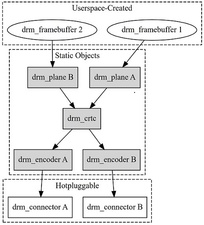

sidebar_position: 5

# SpacemiT 屏幕调试文档

本文介绍 SpacemiT K3 平台 Uboot 和 Kernel 的 MIPI 与 DP/eDP 屏幕驱动用例和调试方法。

## 模块介绍

SpacemiT 平台的 Display 模块基于 **DRM（Direct Rendering Manager）** 框架实现。
DRM 是 Linux 系统中主流的显示框架，能够很好地适应现代显示硬件的特性。

在 Linux 内核中，DRM 作为显示设备管理的子系统，主要负责以下工作：

- **显示硬件抽象与管理：** 统一管理不同类型的显示硬件。
- **图形内存管理：** 分配与控制显存的使用。
- **显示输出控制：** 协调显示内容的合成与输出。
- **多显示接口支持：** 兼容 DSI、DP、eDP 等多种接口。



## Uboot 屏幕调试

### 源码结构介绍

SpacemiT 平台 Uboot 显示驱动源码结构如下：

```
tree spacemit/
spacemit/
├── dp                                                       // DP 驱动
│   ├── inno_dp.c
│   ├── inno_dp.h
│   ├── inno_dp_phy.c
│   ├── inno_dp_phy.h
│   ├── inno_dp_reg.h
│   └── Makefile
├── dsi
│   ├── built-in.o
│   ├── drv
│   │   ├── spacemit_dphy.c                                  // MIPI DSI DPHY 驱动
│   │   ├── spacemit_dphy.h
│   │   ├── spacemit_dsi_common.c
│   │   ├── spacemit_dsi_drv.c                               // MIPI DSI 驱动
│   │   ├── spacemit_dsi_drv.h
│   │   └── spacemit_dsi_hw.h
│   ├── include
│   │   ├── spacemit_dsi_common.h
│   │   └── spacemit_video_tx.h
│   ├── Makefile
│   └── video
│       ├── lcd                                               // panel 配置
│       │   ├── lcd_ft8201sinx101.c
│       │   ├── lcd_icnl9911c.c
│       │   ├── lcd_icnl9911c.c
│       │   ├── lcd_icnl9951r.c
│       │   ├── lcd_jd9365dah3.c
│       │   └── lcd_tc358762xbg_dpi.c
│       ├── spacemit_mipi_port.c
│       ├── spacemit_video_tx.c
├── Kconfig
├── Makefile
├── spacemit_dpi.c
├── spacemit_dpu.c                                            // DPU 驱动
├── spacemit_dpu.h
├── spacemit_edp.c
├── spacemit_inno_dp.c                                        // DP 驱动
├── spacemit_inno_dp.h
├── spacemit_mipi.c                                           // MIPI 驱动
└── spacemit_mipi.h
```

### 配置介绍

#### CONFIG 配置

1. 执行 `make uboot-menuconfig`

2. 进入 **Device Drivers -> Graphics support**，启用以下配置(默认情况下已开启)。

```
Device Drivers  --->
	Graphics support  --->
		<*> Enable SPACEMIT Video Support
		<*>    MIPI Port  
		<*>    INNO DP/EDP Port
```

#### DP DTS 配置

配置 DP 相关设备树如下。
配置 dpu 和 dp 节点 `status = "okay"`

```c
//uboot-2022.10/arch/riscv/dts/k3_deb1.dts
&dpu {
	status = "okay";

	dpu_out: port {
		#address-cells = <1>;
		#size-cells = <0>;

		// 根据实际方案配置输出端口
		dpu_out_dp1: endpoint@1 {
			reg = <1>;
			remote-endpoint = <&dp1_in_dpu>;
		};
	};

};

&dp1 {
	pinctrl-names = "default";
	pinctrl-0 = <&pinctrl_dp1_1>; //pinctrl 配置
	status = "okay";

	ports {
		dp1_in: port {
			#address-cells = <1>;
			#size-cells = <0>;
			dp1_in_dpu: endpoint@0 {
				reg = <0>;
				remote-endpoint = <&dpu_out_dp1>;
			};
		};
	};
};
```

#### MIPI DTS 配置

##### MIPI DSI

1. **GPIO 定义**
   在 MIPI DSI 面板的 GPIO 配置中，以 **k3_deb1** 方案为例：
   - **GPIO63：** 配置为面板复位（reset）引脚。
   - **GPIO56 和 GPIO57：** 配置为面板电源控制引脚。

   
```c
//uboot-2022.10/arch/riscv/dts/k3_deb1.dts
&dpu {
	status = "okay";
};

&mipi_dsi {
	status = "okay";
};

&panel {
	force-attached = "icnl9911c";  //对应的 panel name，系统根据该项识别匹配相应的panel
	dcp-gpios = <&gpio 56 0>;
	dcn-gpios = <&gpio 57 0>;
	reset-gpios = <&gpio 63 0>;
	status = "okay";
};
```

2. PWM 背光配置
通过 PWM 控制背光
```c
&pwm19 {
	pinctrl-names = "default";
	pinctrl-0 = <&pinctrl_pwm19_1>; //方案对应的pwm pinctrl
	status = "okay";
};

&backlight {
	pwms = <&pwm19 0 2000>;
	default-brightness-level = <6>;
	status = "okay";
};
```

#### Display Timing 配置

在 U-Boot 阶段，系统默认使用以下时钟配置：
- **pix-clock：** 88,000,000 Hz
- **bit-clock：** 614,400,000 Hz
相关计算公式可参考[SpacemiT 平台 Display 模块](../device/peripheral_driver/12-Display.md)
如需修改，需配置
```c
//uboot-2022.10/arch/riscv/dts/k3_evb.dts
&mipi_dsi {
	bit-clk = <624000000>;
	pix-clk = <88000000>;
	status = "okay";
};

```
已完成功能调试的 **MIPI DSI panel** 相关驱动文件位于 **lcd 目录**：

```
uboot-2022.10/drivers/video/spacemit/dsi/video$ tree lcd
lcd
├── lcd_ft8201sinx101.c
├── lcd_icnl9911c.c
├── lcd_icnl9911c.c
├── lcd_icnl9951r.c
├── lcd_jd9365dah3.c
└── lcd_lt8911ext_edp_1080p.c
```

### 新增 MIPI Panel 配置参考实例

以下示例以 **lcd_icnl9911c** 为例，演示如何在 SpacemiT 平台上新增 MIPI DSI panel 支持。

1. **新建驱动文件**
在路径 `uboot-2022.10/drivers/video/spacemit/dsi/video/lcd/` 下新建 `lcd_icnl9911c.c` 文件：
以下各项根据屏幕相关信息进行配置。
- timing信息：
```c
struct spacemit_mode_modeinfo icnl9911c_spacemit_modelist[] = {
	{
		.name = "720x1600-60",
		.refresh = 60,
		.xres = 720,
		.yres = 1600,
		.real_xres = 720,
		.real_yres = 1600,
		.left_margin = 48,
		.right_margin = 48,
		.hsync_len = 4,
		.upper_margin = 32,
		.lower_margin = 150,
		.vsync_len = 4,
		.hsync_invert = 0,
		.vsync_invert = 0,
		.invert_pixclock = 0,
		.pixclock_freq = 87*1000,
		.pix_fmt_out = OUTFMT_RGB888,
		.width = 72,
		.height = 126,
	},
};

struct spacemit_mipi_info icnl9911c_mipi_info = {
	.height = 1600,
	.width = 720,
	.hfp = 48,/* unit: pixel */
	.hbp = 48,
	.hsync = 4,
	.vfp = 150, /*unit: line*/
	.vbp = 32,
	.vsync = 4,
	.fps = 60,

	.work_mode = SPACEMIT_DSI_MODE_VIDEO, /*command_mode, video_mode*/
	.rgb_mode = DSI_INPUT_DATA_RGB_MODE_888,
	.lane_number = 4,
	.phy_bit_clock = 614400000,
	.phy_esc_clock = 51200000,
	.split_enable = 0,
	.eotp_enable = 0,

	.burst_mode = DSI_BURST_MODE_BURST,
};
```
- 初始化命令（**initial-cmd**）：

```c
static struct spacemit_dsi_cmd_desc icnl9911c_init_cmds[] = {
	//8279 + INX10.1
	{SPACEMIT_DSI_DCS_LWRITE, SPACEMIT_DSI_LP_MODE, 0,   3, {0xF0, 0x5A, 0x59}},
	{SPACEMIT_DSI_DCS_LWRITE, SPACEMIT_DSI_LP_MODE, 0,   3, {0xF1, 0xA5, 0xA6}},
	{SPACEMIT_DSI_DCS_LWRITE, SPACEMIT_DSI_LP_MODE, 0,  33, {0xB0, 0x83, 0x82, 0x86, 0x87, 0x06, 0x07, 0x04, 0x05, 0x33, 0x33, 0x33, 0x33, 0x20, 0x00, 0x00, 0x77, 0x00, 0x00, 0x3F, 0x05, 0x04, 0x03, 0x02, 0x01, 0x02, 0x03, 0x04, 0x00, 0x00, 0x00, 0x00, 0x00}},
	{SPACEMIT_DSI_DCS_LWRITE, SPACEMIT_DSI_LP_MODE, 0,  30, {0xB1, 0x13, 0x91, 0x8E, 0x81, 0x20, 0x00, 0x00, 0x77, 0x00, 0x00, 0x04, 0x08, 0x54, 0x00, 0x00, 0x00, 0x44, 0x40, 0x02, 0x01, 0x40, 0x02, 0x01, 0x40, 0x02, 0x01, 0x40, 0x02, 0x01}},
	{SPACEMIT_DSI_DCS_LWRITE, SPACEMIT_DSI_LP_MODE, 0,  18, {0xB2, 0x54, 0xC4, 0x82, 0x05, 0x40, 0x02, 0x01, 0x40, 0x02, 0x01, 0x05, 0x05, 0x54, 0x0C, 0x0C, 0x0D, 0x0B}},
	{SPACEMIT_DSI_DCS_LWRITE, SPACEMIT_DSI_LP_MODE, 0,  32, {0xB3, 0x12, 0x00, 0x00, 0x00, 0x00, 0x26, 0x26, 0x91, 0x91, 0x91, 0x91, 0x3C, 0x26, 0x00, 0x18, 0x01, 0x02, 0x08, 0x20, 0x30, 0x08, 0x09, 0x44, 0x20, 0x40, 0x20, 0x40, 0x08, 0x09, 0x22, 0x33}},

		·······

	{SPACEMIT_DSI_DCS_LWRITE, SPACEMIT_DSI_LP_MODE, 0,  23, {0xC8, 0xF7, 0xD3, 0xBA, 0xA5, 0x80, 0x63, 0x36, 0x8B, 0x56, 0x2A, 0xFF, 0xCE, 0x23, 0xF4, 0xD3, 0xA4, 0x86, 0x5A, 0x1A, 0x7F, 0xE4, 0x00}},
	{SPACEMIT_DSI_DCS_LWRITE, SPACEMIT_DSI_LP_MODE, 0,   9, {0xD0, 0x80, 0x0D, 0xFF, 0x0F, 0x61, 0x0B, 0x08, 0x0C}},
	{SPACEMIT_DSI_DCS_LWRITE, SPACEMIT_DSI_LP_MODE, 0,  15, {0xD2, 0x42, 0x0C, 0x30, 0x01, 0x80, 0x26, 0x04, 0x00, 0x00, 0xC3, 0x00, 0x00, 0x00}},
	{SPACEMIT_DSI_DCS_LWRITE, SPACEMIT_DSI_LP_MODE, 0,   3, {0xF1, 0x5A, 0x59}},
	{SPACEMIT_DSI_DCS_LWRITE, SPACEMIT_DSI_LP_MODE, 0,   3, {0xF0, 0xA5, 0xA6}},
	{SPACEMIT_DSI_DCS_LWRITE, SPACEMIT_DSI_LP_MODE, 0,   2, {0x35, 0x00}},
	{SPACEMIT_DSI_DCS_LWRITE, SPACEMIT_DSI_LP_MODE, 150, 2, {0x11, 0x00}},
	{SPACEMIT_DSI_DCS_LWRITE, SPACEMIT_DSI_LP_MODE,  50, 2, {0x29, 0x00}},
	{SPACEMIT_DSI_DCS_LWRITE, SPACEMIT_DSI_LP_MODE,   5, 2, {0x26, 0x00}},
};
```

- **Panel ID 识别（确认屏幕型号）**
验证连接的屏幕型号与驱动兼容性
通过配置 **read_id** 读取 **panel_id**, 如下，lcd_icnl9911c 读取 `0x04` 寄存器

   ```c
   //uboot-2022.10/drivers/video/spacemit/dsi/video/lcd/lcd_icnl9911c.c
   static struct spacemit_dsi_cmd_desc icnl9911c_read_id_cmds[] = {
	{SPACEMIT_DSI_GENERIC_READ1, SPACEMIT_DSI_LP_MODE, UNLOCK_DELAY, 1, {0x04}},
   };
   ```

   对比返回值与预期值，不匹配则报错。如下，`0x04` 寄存器理应读取的到值为 `0x99`

   ```c
   //uboot-2022.10/drivers/video/spacemit/dsi/video/lcd/lcd_icnl9911c.c
   struct lcd_mipi_panel_info lcd_icnl9911c = {
	.lcd_name = "icnl9911c",
	.panel_id0 = 0x99,
   ```

- **ESD 静电防护检测**
实时监测屏幕工作状态，预防静电损伤。
在 lcd_icnl9911c 配置中，读取 `0xA` 寄存器进行 ESD check

   ```
   //uboot-2022.10/drivers/video/spacemit/dsi/video/lcd/lcd_icnl9911c.c
   static struct spacemit_dsi_cmd_desc icnl9911c_read_power_cmds[] = {
	{SPACEMIT_DSI_GENERIC_READ1, SPACEMIT_DSI_HS_MODE, UNLOCK_DELAY, 1, {0xA}},
   };
   ```

   驱动会将读取结果与预设的 `power_value` 进行比对，若不同，则说明屏幕可能发生了 ESD 异常。
   示例中，寄存器 `0xA` 理应返回值与 `power_value` 一致：

   ```c
   //uboot-2022.10/drivers/video/spacemit/dsi/video/lcd/lcd_icnl9911c.c
   struct lcd_mipi_panel_info lcd_icnl9911c = {

	.power_value = 0x9c,
   ```

1. **修改 Makefile**
在 `obj-y` 中添加新 panel：

```c
//uboot-2022.10/drivers/video/spacemit/dsi/Makefile
# SPDX-License-Identifier: GPL-2.0

obj-y += video/spacemit_video_tx.o \
	video/spacemit_mipi_port.o \
	drv/spacemit_dphy.o \
	drv/spacemit_dsi_common.o \
	drv/spacemit_dsi_drv.o

obj-y += video/lcd/lcd_icnl9911c.o
obj-y += video/lcd/lcd_icnl9951r.o
obj-y += video/lcd/lcd_jd9365dah3.o
obj-y += video/lcd/lcd_icnl9911c.o
obj-y += video/lcd/lcd_lt8911ext_edp_1080p.o
```

2. **修改头文件 `spacemit_dsi_common.h`**

```c
//uboot-2022.10/drivers/video/spacemit/dsi/include/spacemit_dsi_common.h
int lcd_icnl9911c_init(void);
int lcd_icnl9951r_init(void);
int lcd_icnl9911c_init(void);    // 增加 lcd_icnl9911c.c实现的相应函数的声明
int lcd_jd9365dah3_init(void);
int lcd_lt8911ext_edp_1080p_init(void);
```

3. **修改端口识别逻辑 `spacemit_mipi_port.c`**
在 panel 匹配逻辑中加入新 panel

```c
//uboot-2022.10/drivers/video/spacemit/dsi/video/spacemit_mipi_port.c

if (strcmp("lt8911ext_edp_1080p", priv->panel_name) == 0) {
	tx_device_client.panel_type = LCD_EDP;
	tx_device.panel_type = tx_device_client.panel_type;
	lcd_lt8911ext_edp_1080p_init();
    } else if(strcmp("icnl9951r", priv->panel_name) == 0) {
	tx_device_client.panel_type = LCD_MIPI;
	tx_device.panel_type = tx_device_client.panel_type;
	lcd_icnl9951r_init();
    } else if(strcmp("jd9365dah3", priv->panel_name) == 0) {
	tx_device_client.panel_type = LCD_MIPI;
	tx_device.panel_type = tx_device_client.panel_type;
	lcd_jd9365dah3_init();
    } else {
	// lcd_icnl9911c_init();
	lcd_icnl9911c_init();          //增加icnl9911c panel识别，新增其它panel参考以上三个
    }
```

## Kernel 屏幕调试

SpacemiT 平台 Display 模块的功能和使用方法参考：[SpacemiT 平台 Display 模块](../device/peripheral_driver/12-Display.md)

### eDP 配置

以下示例基于 **k3_deb1** 方案，展示了 eDP 的设备树配置：

```c
// linux-6.18/arch/riscv/boot/dts/spacemit/k3_deb1.dts
&dpu0_crtc0 {
	memory-region = <&dpu_resv0>;
	status = "okay";
};

&edp0 {
	pinctrl-names = "default";
	pinctrl-0 = <&dp0_1_cfg>;
	backlight = <&backlight>;
	gpios-power = <101>;
	gpios-enable = <118>;
	status = "okay";
};
```

### DP 配置

以下示例基于 **k3_deb1** 方案，展示了 DP 的设备树配置：

```c
// linux-6.18/arch/riscv/boot/dts/spacemit/k3_deb1.dts
&dpu1_crtc0 {
	memory-region = <&dpu_resv1>;
	status = "okay";
};

&dp1 {
	pinctrl-names = "default";
	pinctrl-0 = <&dp1_1_cfg>;
	status = "okay";
};
```

### MIPI DSI panel 配置实例

在 kernel 阶段，MIPI 屏幕的配置步骤如下：

1. 配置供电与 GPIO

2. 新建 MIPI 屏幕 dtsi 文件

3. 根据供应商资料配置时序和命令
   参考屏幕供应商提供的 MIPI 屏幕参数和主控芯片 datasheet，结合屏幕时序等信息，配置 dtsi 中的：
   - clock 参数（前后肩、分辨率、及计算得出的 pixel clock和 bit clock）
   - 初始化命令（initial-command）
   - 读 ID 命令（read-id-command）

4. 将 MIPI Panel 与方案关联

#### k3_evb 方案

以下示例展示了 **k3_evb** 方案使用 `lcd_icnl9911c_mipi` 作为显示屏的 DTS 配置：

```c
//linux-6.18/arch/riscv/boot/dts/spacemit/k3_evb.dts
#include "lcd_dsi_panel.dtsi"
#include "lcd/lcd_icnl9911c_mipi.dtsi"

&dpu_crtc0 {
	spacemit-dpu-bitclk = <600000000>;
	memory-region = <&dpu_resv0>;
	status = "okay";
};

&dpu_crtc1 {
	memory-region = <&dpu_resv1>;
	status = "okay";
};

&dsi0 {
	status = "okay";

	panel0: panel0@0 {
		status = "ok";
		compatible = "spacemit,mipi-panel";
		reg = <0>;
		reset-gpios = <&gpio 1 31 GPIO_ACTIVE_HIGH>;
		dc0-gpios = <&gpio 1 24 GPIO_ACTIVE_HIGH>;
		dc1-gpios = <&gpio 1 25 GPIO_ACTIVE_HIGH>;
		id = <2>;
		force-attached = "lcd_icnl9911c_mipi";
	};
};

&lcds {
	status = "okay";
};

&pwm19 {
	pinctrl-names = "default";
	pinctrl-0 = <&pwm19_1_cfg>;
	status = "okay";
};

&pwm_bl {                                       // 配置背光
	pwms = <&pwm19 2000>;
	brightness-levels = <
		0   20  20  20  21  21  21  22  22  22  23  23  23  24  24  24
		25  25  25  26  26  26  27  27  27  28  28  29  29  30  30  31
		32  33  34  35  36  37  38  39  40  41  42  43  44  45  46  47
		48  49  50  51  52  53  54  55  56  57  58  59  60  61  62  63
		64  65  66  67  68  69  70  71  72  73  74  75  76  77  78  79
		80  81  82  83  84  85  86  87  88  89  90  91  92  93  94  95
		96  97  98  99  100 101 102 103 104 105 106 107 108 109 110 111
		112 113 114 115 116 117 118 119 120 121 122 123 124 125 126 127
		128 129 130 131 132 133 134 135 136 137 138 139 140 141 142 143
		144 145 146 147 148 149 150 151 152 153 154 155 156 157 158 159
		160 161 162 163 164 165 166 167 168 169 170 171 172 173 174 175
		176 177 178 179 180 181 182 183 184 185 186 187 188 189 190 191
		192 193 194 195 196 197 198 199 200 201 202 203 204 205 206 207
		208 209 210 211 212 213 214 215 216 217 218 219 220 221 222 223
		224 225 226 227 228 229 230 231 232 233 234 235 236 237 238 239
		240 241 242 243 244 245 246 247 248 249 250 251 252 253 254 255
	>;
	default-brightness-level = <50>;
	status = "okay";
};
```

##### MIPI 屏供电

本方案 MIPI 接口根据原理图需要配置 GPIO 和 PWM。

- GPIO
   屏幕需要复位和电源控制 GPIO：
   dcp-gpios = gpio 56;
   dcn-gpios = gpio 57;
   reset-gpios = gpio 63;

   ```c
   reset-gpios = <&gpio 1 31 GPIO_ACTIVE_HIGH>;             // 配置 panel 复位 GPIO
   dc0-gpios = <&gpio 1 24 GPIO_ACTIVE_HIGH>;               // 配置 panel 电源控制 GPIO
   dc1-gpios = <&gpio 1 25 GPIO_ACTIVE_HIGH>;               // 配置 panel 电源控制 GPIO
   ```

- PWM
   采用 PWM 控制背光，对应设备树

   ```c
   &pwm19 {
	pinctrl-names = "default";
	pinctrl-0 = <&pwm19_1_cfg>;
	status = "okay";
   };
   ```

#### LCD dtsi 配置

在 `linux-6.18/arch/riscv/boot/dts/spacemit/lcd` 路径下，新建 lcd_icnl9911c_mipi.dtsi

```c
// SPDX-License-Identifier: GPL-2.0

/ { lcds: lcds {
	lcd_icnl9911c_mipi: lcd_icnl9911c_mipi {
		dsi-work-mode = <1>;           // panel中配置 mipi dsi工作模式：1 DSI_MODE_VIDEO_BURST;
		dsi-lane-number = <4>;         // panel中配置mipi dsi lane数量
		dsi-color-format = "rgb888";
		width-mm = <72>;               // panel中配置屏幕active area
		height-mm = <126>;             // panel中配置屏幕active area
		use-dcs-write;                 // panel中配置是否使用dcs命令模式

		/*mipi info*/
		height = <1600>;
		width = <720>;
		hfp = <48>;
		hbp = <48>;
		hsync = <4>;
		vfp = <150>;
		vbp = <32>;
		vsync = <4>;
		fps = <60>;
		work-mode = <0>;
		rgb-mode = <3>;
		lane-number = <4>;
		phy-freq = <624000>;            // mipi dsi dphy bitclk 配置
		phy-escape-clock = <52000>;
		phy-bit-clock = <624000000>;
		split-enable = <0>;             // 分屏模式，8lane 屏幕需启用分屏模式，每屏幕4lane, 计算timing时, 长变为原来的1/2
		eotp-enable = <0>;
		burst-mode = <2>;
		esd-check-enable = <0>;
		vpn-tx-dly-cnt = <76>;
		vpn-dly-cnt = <540>;

		/* DSI_CMD, DSI_MODE, timeout, len, cmd */
		initial-command = [
			39 01 00 03 F0 5A 59
			39 01 00 03 F1 A5 A6
			39 01 00 21 B0 83 82 86 87 06 07 04 05 33 33 33 33 20 00 00 77 00 00 3F 05 04 03 02 01 02 03 04 00 00 00 00 00
			39 01 00 1e B1 13 91 8E 81 20 00 00 77 00 00 04 08 54 00 00 00 44 40 02 01 40 02 01 40 02 01 40 02 01
			39 01 00 12 B2 54 C4 82 05 40 02 01 40 02 01 05 05 54 0C 0C 0D 0B
			39 01 00 20 B3 12 00 00 00 00 26 26 91 91 91 91 3C 26 00 18 01 02 08 20 30 08 09 44 20 40 20 40 08 09 22 33
			39 01 00 1D B4 03 00 00 06 1E 1F 0C 0E 10 12 14 16 04 03 03 03 03 03 03 03 03 03 FF FF FC 00 00 00
			39 01 00 1D B5 03 00 00 07 1E 1F 0D 0F 11 13 15 17 05 03 03 03 03 03 03 03 03 03 FF FF FC 00 00 00
			39 01 00 19 B8 00 00 00 00 00 00 00 00 00 00 00 00 00 00 00 00 00 00 00 00 00 00 00 00
			39 01 00 03 BA 6B 6B
			39 01 00 0E BB 01 05 09 11 0D 19 1D 55 25 69 00 21 25
			39 01 00 0F BC 00 00 00 00 02 20 FF 00 03 33 01 73 33 02
			39 01 00 0B BD E9 02 4F CF 72 A4 08 44 AE 15
			39 01 00 0D BE 7D 7D 5A 46 0C 77 43 07 0E 0E 00 00
			39 01 00 09 BF 07 25 07 25 7F 00 11 04
			39 01 00 0D C0 10 FF FF FF FF FF 00 FF 00 00 00 00
			39 01 00 14 C1 C0 20 20 96 04 32 32 04 2A 40 36 00 07 CF FF FF C0 00 C0
			39 01 00 02 C2 00
			39 01 00 10 C2 CC 01 10 00 01 30 02 21 43 00 01 30 02 21 43
			39 01 00 0D C3 06 00 FF 00 FF 00 00 81 01 00 00 00
			39 01 00 0D C4 84 03 2B 41 00 3C 00 03 03 3E 00 00
			39 01 00 0C C5 03 1C C0 C0 40 10 42 44 0F 0A 14
			39 01 00 0B C6 87 A0 2A 29 29 00 64 37 08 04
			39 01 00 17 C7 F7 D3 BA A5 80 63 36 8B 56 2A FF CE 23 F4 D3 A4 86 5A 1A 7F E4 00
			39 01 00 17 C8 F7 D3 BA A5 80 63 36 8B 56 2A FF CE 23 F4 D3 A4 86 5A 1A 7F E4 00
			39 01 00 09 D0 80 0D FF 0F 61 0B 08 0C
			39 01 00 0E D2 42 0C 30 01 80 26 04 00 00 C3 00 00 00
			39 01 00 03 F1 5A 59
			39 01 00 03 F0 A5 A6
			39 01 00 02 35 00
			39 01 96 01 11
			39 01 32 01 29
		];
		sleep-in-command = [
			39 01 00 02 26 08
			39 01 78 01 28
			39 01 78 01 10
		];
		sleep-out-command = [
			39 01 96 01 11
			39 01 32 01 29
		];
		read-id-command = [
			37 01 00 01 01
			14 01 00 01 04
		];

		display-timings {
			timing0 {
				clock-frequency = <87901200>;
				hactive = <720>;
				hfront-porch = <48>;
				hback-porch = <48>;
				hsync-len = <4>;
				vactive = <1600>;
				vfront-porch = <150>;
				vback-porch = <32>;
				vsync-len = <4>;
				vsync-active = <1>;
				hsync-active = <1>;
			};
		};
	};
};};
```

##### 时序计算

- **Pixel Clock**
pixel clock = (hactive + hfp + hbp + hsync) * (vactive + vfp + vbp + vsync) * fps = （720 + 48 + 48 + 4）* (1600 + 150 + 32 + 4) * 60 = 87901200 HZ

- **Bit Clock**
`bitclk_min` = (((hactive × bpp + hbp × bpp + 2 × lane_number) × pixel clock/1000000) / ((hsync+hbp+hactive-0.65 × pixel clock/1000000) × lane_number) + 1) × 8
           = (((720 × 3 + 48 × 3 + 2 × 4) × 87.9012) / ((4+48+720-0.65 × 87.9012) × 4) + 1) × 8
           = (((2160 + 144 + 8) × 87.9012) / ((772 - 57.136) × 4) + 1) × 8
           = ((2312 × 87.9012) / (714.864 × 4) + 1) × 8
           = (203226.3744 / 2859.456 + 1) × 8
           = (71.06 + 1) × 8
           = 72.06 × 8
           ≈ 576.48 MHz
    `bitclk_max` = pixel clock × 4 × 8 / lane_number
		= 87,847,200 × 4 × 8 / 4
		= 702,777,600 Hz ≈ 703 MHz

通过 Display Timing 计算：

- **Pixel Clock** = 87870000 HZ
- **Bit Clock** 选择介于 bitclk_min 和 bitclk_max 之间的值，采用 624000000 HZ
DTS 文件中, 系统配置如下：

- `clock-frequency` = **87901200 Hz**
- `spacemit-dpu-bitclk` = **624000000 Hz**
- `phy-freq` = **624000 Hz**

## FAQ

### 1. 8lane mipi 配置方法
8lane屏幕以linux-6.18/arch/riscv/boot/dts/spacemit/lcd/lcd_nt36523_mipi.dtsi为例
采用split模式，需使能
```c
	split-enable = <1>;
```
同时在计算timing时，原分辨率为
```c
	height = <2560>;
	width = <1600>;
	lane-number = <8>;
```
但在计算代入公式时，需：
```c
	height = <1280>; // = 2560/2
	width = <1600>;
	lane-number = <4>; // = 8/2
```
### 2. Weston 主屏配置

Weston 的启动脚本位于：

```c
//buildroot/package/weston/run_weston.sh
```

**默认脚本**

```c
#export EGL_LOG_LEVEL=debug
export MESA_LOADER_DRIVER_OVERRIDE=pvr
export XDG_RUNTIME_DIR=/root
export QT_QPA_PLATFORM_PLUGIN_PATH=/usr/lib/qt/plugins/platforms
export QT_QPA_PLATFORM=wayland
weston --log=/var/log/weston --tty=1 --idle-time=0
```

在 DP 和 LCD 同时配置为 `okay` 时，Weston 默认会使用 **第一个 DRM 显示设备**（即 `/sys/class/drm` 中检测到的第一个 card）。

**查看 DRM 设备**

```bash
cd /sys/class/drm
ls
```

- `card0`：默认绑定 LCD
- `card2`：默认绑定 DP

**指定 DP 为主屏**
若希望 Weston 默认在 DP 上显示，则需修改 `run_weston.sh` 脚本，在启动参数中显式指定 DRM 设备：

```c
//buildroot/package/weston/run_weston.sh
#export EGL_LOG_LEVEL=debug
export MESA_LOADER_DRIVER_OVERRIDE=pvr
export XDG_RUNTIME_DIR=/root
export QT_QPA_PLATFORM_PLUGIN_PATH=/usr/lib/qt/plugins/platforms
export QT_QPA_PLATFORM=wayland
weston --log=/var/log/weston --tty=1 --drm-device=card2 --idle-time=0
```

通过 `--drm-device=card2` 参数，Weston 将直接使用 DP 作为主屏显示。

### 3. Bianbu 主屏配置

在 **Bianbu** 环境中，`mutter` 默认将 **DSI** 识别为主显示器。
若需将主显示器修改为 **DP**，需要调整 `mutter` 源码并重新编译。

```c
//mutter/src/backends/meta-monitor.c
meta_monitor_is_laptop_panel (MetaMonitor *monitor)
{
  const MetaOutputInfo *output_info =
    meta_monitor_get_main_output_info (monitor);

  switch (output_info->connector_type)
    {
    case META_CONNECTOR_TYPE_eDP:
    case META_CONNECTOR_TYPE_LVDS:
    case META_CONNECTOR_TYPE_DP: //原默认配置为 META_CONNECTOR_TYPE_DSI
      return TRUE;
    default:
      return FALSE;
    }
}
```