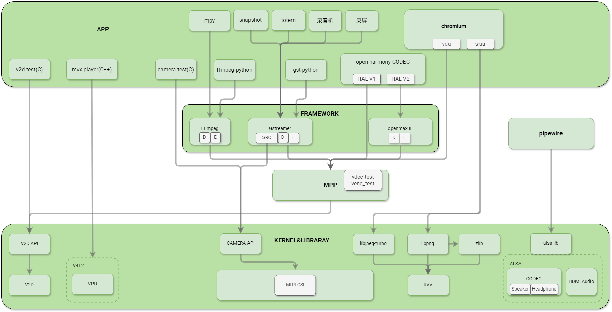

sidebar_position: 1

# 多媒体整体框架

本文介绍 K3 平台的多媒体整体框架及各层功能。
通过阅读，你将了解应用、框架、MPP 到驱动的关系，以及常用硬件模块的作用。

## 框架层次图及说明

整个多媒体系统分为 **4 层**，从上到下依次是：

### 1. APP 层

这一层包括 **第三方应用** 和 **自研应用**。

**第三方应用**

- **mpv**（Bianbu 默认播放器）
  - 支持 H.264 / HEVC / VP8 / VP9 / MPEG-4 / MPEG-2 / MJPEG 等多种格式的硬件解码
  - 最高支持 **4K60** 视频播放

- **totem**（Ubuntu 默认播放器）
  - 支持 H.264 / HEVC / VP8 / VP9 / MPEG-4 / MPEG-2 / MJPEG 等多种格式的硬件解码
  - 最高支持 **4K60** 视频播放

- **snapshot**（Bianbu/Ubuntu 桌面系统默认相机应用）
  - 支持预览，拍照，录像等功能
  - 实现 **720P30** 流畅录像

- **chromium**（Bianbu 系统默认浏览器）
  - 支持 H.264/HEVC 等多种格式的硬件解码
  - 最高支持 **4K60** 视频播放

**自研应用**
  主要是我们提供的 API 对接 demo 或测试程序，用于功能验证和参考开发，例如：

- **v2d-test**
  - 测试 V2D 模块（非压缩图像格式转换、旋转、缩放）

- **mvx-player**
  - 测试 VPU 模块（视频编解码），命令行操作，输出保存为文件
  
- **camera-test**
  - 测试 CAMERA 模块（CPP-ISP-MIPICSI 通路）
  - 仅限平台摄像头，不含 USB camera（USB camera 使用 v4l-utils 测试）

### 2. 开源多媒体框架层（FRAMEWORK）

在这一层，最常用的是 **GStreamer** 和 **FFmpeg**。
它们是功能完整的多媒体解决方案，包含了视频播放所需的各个环节：
**muxer（复用）** / **demuxer（解复用）** / **decoder（解码）** / **encoder（编码）** / **display（显示）**。
我们在这层实现了多个插件，通过 **MPP** 将 K3 的硬件编解码库接入到这些框架中。

- **FFmpeg**
  - 已对接 K3 硬件编解码器
  - **解码**：H.264 / HEVC / VP8 / VP9 / MPEG-4 / MPEG-2 / MJPEG，最高支持 **4K120**
  - **输出像素格式**：AV_PIX_FMT_DRM_PRIME、AV_PIX_FMT_NV12
  - **编码**：H.264 / H.265 / VP8 / VP9 / MJPEG，最高支持 **4K60**

- **GStreamer**
  - 已对接 K3 硬件编解码器
  - **解码**：H.264 / HEVC / VP8 / VP9 / MPEG-4 / MPEG-2 / MJPEG，最高支持 **4K120**
  - **编码**：H.264 / H.265 / VP8 / VP9 / MJPEG，最高支持 **4K60**

- **OpenMAX IL**
  - 编解码功能适配中

### 3. MPP（Multimedia Processing Platform）

- 对上：提供统一多媒体 API。
- 对下：动态加载不同平台的编解码库插件来调用编解码库。

### 4. 驱动与库（Driver & Library）

- 由 IP 厂商提供。
- 包含硬件驱动和 API 动态库，直接操作芯片多媒体模块。

## 概念术语

- **VPU（Video Processing Unit）**
  - 视频处理单元，负责硬件视频编解码，减轻 CPU 负担。
  - K3 基于 V4L2 框架实现，支持 H.264 / HEVC / VP8 / VP9 / MJPEG / MPEG-4 解码，以及 H.264 / HEVC / VP8 / VP9 / MJPEG 编码。

- **V2D**
  - K3 提供的图像处理硬件模块，支持**格式转换、缩放、裁剪**等操作。

- **RVV**
  - RISC-V 架构的向量扩展指令集，用于加速数据并行计算，类似 ARM NEON。

- **MPP（Multimedia Processing Platform）**
  - 多媒体处理平台，负责对接硬件编解码与上层框架。

- **Gstreamer**
  - 开源的、灵活且功能强大的多媒体框架，用于构建流媒体应用程序和处理音频/视频数据。
  - 它提供了一套库和工具，可以用来创建、处理和播放各种多媒体流，包括音频、视频、流媒体等。
  - 支持多种编解码器和格式，可在多平台运行。

- **FFmpeg**
  - 跨平台开源音视频处理工具，支持录制、转换、推流和编辑。
  - 兼容多种音视频格式和编解码器，可以在不同的操作系统上运行，包括 Windows、Mac 和 Linux。
  - 广泛应用于多媒体处理领域。

- **V4L2（Video for Linux 2）**
  - Linux 系统的视频采集/输出设备 API。
  - 为摄像头、视频采集卡等设备提供统一访问接口，便于视频采集、处理和显示。

- **ALSA（Advanced Linux Sound Architecture 高级 Linux 音频架构）**
  - Linux 系统上主流的音频架构，被广泛应用于各种 Linux 发行版中，用于处理音频和音频设备的软件架构。
  - 提供了一个统一的音频接口，使得应用程序可以与音频硬件进行通信，支持多种音频设备和音频格式，并提供了低延迟和高质量的音频处理功能。
  - 提供了一组工具和库，用于配置和管理音频设备，以及编写音频应用程序。
