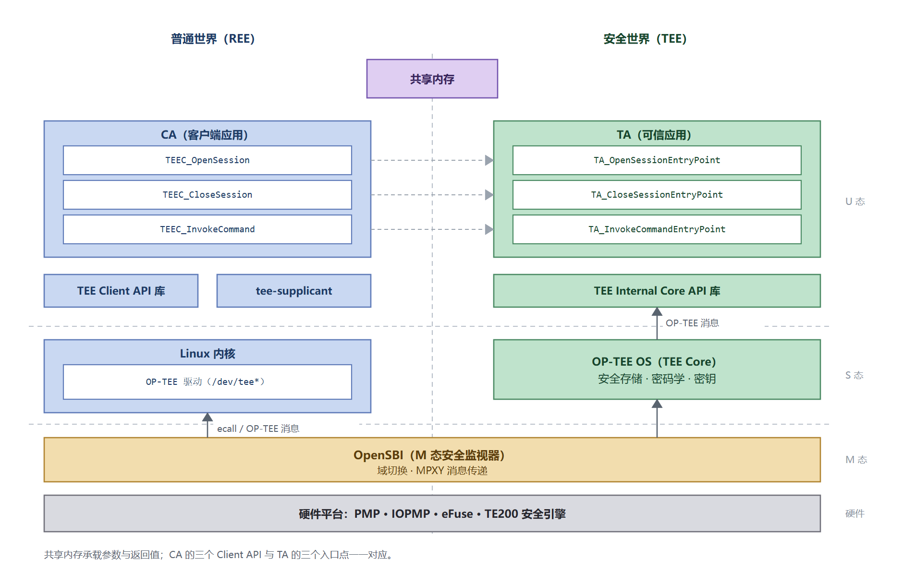

# CA 开发指南 / TEE Client API 参考

## 概述

### 编写目的

本文是 K3 平台上开发 CA（Client Application，运行在普通世界、调用 TEE 服务的应用程序）的操作手册：从准备交叉编译环境、编写 CA、编译链接，到部署与验证，按步骤给出可照做的流程；TEE Client API 的接口参考附在其后。

这里使用的 TEE Client API 是 **GlobalPlatform（GP）** 定义的规范接口。

- **K3 上的实现**：libteec。
- **TA 侧对应**：GP 的 TEE Internal Core API，见 [TA 开发指南](ta_guide.md)。
- **两套规范的对应关系**见 [TEE 架构与集成指南](tee_architecture.md) 的 GP API 小节，规范链接见该文的参考资料。

### 适用范围

本文适用于 SpacemiT K3 系列 SoC 的 Buildroot 方案。

- **构建环境**：交叉编译——在开发主机上编译，可执行文件在 RISC-V 目标设备上运行。
- **相关文档**：TA 侧见 [TA 开发指南](ta_guide.md)；可直接运行的例子见 [TEE 示例集](examples.md)；整体结构见 [TEE 架构与集成指南](tee_architecture.md)。

### 文档结构

1. **CA 与 TEE 的交互模型**：三个调用与三个入口点的对应关系。
2. **运行环境**：设备节点、后台服务与 TA 存放位置。
3. **TEE Client API 参考**：数据类型、参数类型、函数、返回值与错误码。
4. **UUID 与命令 ID 约定**、**与安全存储的关系**。
5. **快速上手**：五步流程总览。
6. **步骤 1–4**：准备交叉编译环境 → 编写 CA → 编译与链接 → 部署与验证。
7. **完整示例**、**常见问题**。

### 重要约束

> [!CAUTION]
> CA 提交的参数类型（`paramTypes`）必须与 TA 侧读取的参数类型**完全一致**。类型不匹配不会在编译期报错，而是在运行期返回参数错误，是最常见的接入故障。

## CA 与 TEE 的交互模型

CA 侧的三个调用与 TA 侧的三个入口点一一对应：



| CA 侧 | TA 侧 |
|---|---|
| `TEEC_OpenSession` | `TA_OpenSessionEntryPoint` |
| `TEEC_CloseSession` | `TA_CloseSessionEntryPoint` |
| `TEEC_InvokeCommand` | `TA_InvokeCommandEntryPoint` |

参数与返回值经共享内存传递；UUID 与命令 ID 必须在两侧一致。

## 运行环境

| 项 | 说明 |
|---|---|
| 设备节点 | `/dev/tee0`、`/dev/teepriv0` 等，由内核 TEE 驱动创建 |
| 后台服务 | `tee-supplicant`，由初始化脚本自动拉起；提供文件系统与 RPMB 等 RPC 服务 |
| TA 存放位置 | `/lib/optee_armtz/`，以 UUID 命名 |

运行 CA 之前先确认环境可用：

```bash
ls /dev/tee*
ps | grep tee-supplicant
```

## TEE Client API 参考

### 数据类型

| 类型 | 说明 |
|---|---|
| `TEEC_Result` | 32 位返回码，`0`（`TEEC_SUCCESS`）表示成功 |
| `TEEC_Context` | CA 与 TEE 之间的连接 |
| `TEEC_Session` | CA 与某个 TA 之间的会话 |
| `TEEC_Operation` | 一次命令调用的参数与状态容器 |
| `TEEC_Parameter` | 单个参数的联合体，取值见下表 |
| `TEEC_Value` | 两个 32 位整数 `a`、`b`，用于传递小数据 |
| `TEEC_TempMemoryReference` | 临时的内存引用，仅在本次操作期间有效 |
| `TEEC_RegisteredMemoryReference` | 引用的共享内存块（可指定偏移与长度） |
| `TEEC_SharedMemory` | 已注册或已分配的共享内存块 |
| `TEEC_UUID` | TA 的唯一标识 |

`TEEC_Operation` 最多携带 4 个参数（`params[0..3]`），每个参数的类型由 `paramTypes` 描述，同时可用 `started` 标志与 `TEEC_RequestCancellation()` 配合实现取消。

### 参数类型

`paramTypes` 由 4 组 4 位字段拼装，每个参数使用一个取值：

| 取值 | 含义 |
|---|---|
| `TEEC_NONE` | 该参数未使用 |
| `TEEC_VALUE_INPUT` / `OUTPUT` / `INOUT` | 参数是 `TEEC_Value`，分别为输入、输出、双向 |
| `TEEC_MEMREF_TEMP_INPUT` / `OUTPUT` / `INOUT` | 参数是临时内存引用 |
| `TEEC_MEMREF_WHOLE` | 引用整个已注册共享内存块 |
| `TEEC_MEMREF_PARTIAL_INPUT` / `OUTPUT` / `INOUT` | 引用已注册共享内存块的一部分 |

共享内存标志：

| 取值 | 含义 |
|---|---|
| `TEEC_MEM_INPUT` | 该内存块由 CA 写入、TA 读取 |
| `TEEC_MEM_OUTPUT` | 该内存块由 TA 写入、CA 读取 |

### 函数

```c
TEEC_Result TEEC_InitializeContext(const char *name, TEEC_Context *context);
void        TEEC_FinalizeContext(TEEC_Context *context);

TEEC_Result TEEC_OpenSession(TEEC_Context *context,
                             TEEC_Session *session,
                             const TEEC_UUID *destination,
                             uint32_t connectionMethod,
                             const void *connectionData,
                             TEEC_Operation *operation,
                             uint32_t *returnOrigin);
void        TEEC_CloseSession(TEEC_Session *session);

TEEC_Result TEEC_InvokeCommand(TEEC_Session *session,
                               uint32_t commandID,
                               TEEC_Operation *operation,
                               uint32_t *returnOrigin);

TEEC_Result TEEC_RegisterSharedMemory(TEEC_Context *context,
                                      TEEC_SharedMemory *sharedMem);
TEEC_Result TEEC_AllocateSharedMemory(TEEC_Context *context,
                                      TEEC_SharedMemory *sharedMem);
void        TEEC_ReleaseSharedMemory(TEEC_SharedMemory *sharedMemory);

void        TEEC_RequestCancellation(TEEC_Operation *operation);
```

说明：

- `TEEC_InitializeContext()` 的 `name` 通常传 `NULL`，表示使用默认 TEE 设备。
- `TEEC_OpenSession()` 的 `connectionMethod` 一般用 `TEEC_LOGIN_PUBLIC`；面向用户或组的登录方式见下表。
- `returnOrigin` 用于区分错误来源，见下文。
- `TEEC_RegisterSharedMemory()` 注册调用方自有的内存，`TEEC_AllocateSharedMemory()` 由库分配内存。

登录方式：

| 取值 | 含义 |
|---|---|
| `TEEC_LOGIN_PUBLIC` | 不提供登录身份（最常用） |
| `TEEC_LOGIN_USER` | 以当前用户身份登录 |
| `TEEC_LOGIN_GROUP` | 以指定组身份登录 |
| `TEEC_LOGIN_APPLICATION` | 以应用程序身份登录 |
| `TEEC_LOGIN_USER_APPLICATION` | 用户 + 应用程序身份 |
| `TEEC_LOGIN_GROUP_APPLICATION` | 组 + 应用程序身份 |

### 返回值与错误码

`TEEC_SUCCESS`（`0x00000000`）表示成功。常用错误码：

| 错误码 | 名称 | 常见原因 |
|---|---|---|
| `0xFFFF0000` | `TEEC_ERROR_GENERIC` | 通用错误 |
| `0xFFFF0001` | `TEEC_ERROR_ACCESS_DENIED` | 权限不足 |
| `0xFFFF0006` | `TEEC_ERROR_BAD_PARAMETERS` | 参数类型或取值不匹配（接入期最常见） |
| `0xFFFF0007` | `TEEC_ERROR_BAD_STATE` | 状态不正确，如会话未建立 |
| `0xFFFF0008` | `TEEC_ERROR_ITEM_NOT_FOUND` | 对象或 TA 不存在 |
| `0xFFFF0009` | `TEEC_ERROR_NOT_IMPLEMENTED` | TA 未实现该命令 |
| `0xFFFF000C` | `TEEC_ERROR_OUT_OF_MEMORY` | 内存不足 |
| `0xFFFF000E` | `TEEC_ERROR_COMMUNICATION` | 与 TEE 通信失败 |
| `0xFFFF000F` | `TEEC_ERROR_SECURITY` | 安全错误，如密钥派生失败 |
| `0xFFFF0010` | `TEEC_ERROR_SHORT_BUFFER` | 输出缓冲区过小 |
| `0xF0100003` | `TEEC_ERROR_STORAGE_NOT_AVAILABLE` | 安全存储不可用（常见于 `tee-supplicant` 未运行） |
| `0xFFFF3024` | `TEEC_ERROR_TARGET_DEAD` | TA 已终止 |
| `0xFFFF3041` | `TEEC_ERROR_STORAGE_NO_SPACE` | 安全存储空间不足 |

错误来源 `returnOrigin`：

| 取值 | 含义 |
|---|---|
| `TEEC_ORIGIN_API` | 由客户端库本身报告 |
| `TEEC_ORIGIN_COMMS` | 由通信层报告（驱动或后台服务） |
| `TEEC_ORIGIN_TEE` | 由 TEE 内核报告 |
| `TEEC_ORIGIN_TRUSTED_APP` | 由 TA 报告 |

排查时先看 `returnOrigin`：`COMMS` 通常指向环境问题（后台服务未运行、设备节点缺失），`TRUSTED_APP` 则指向 TA 自身的逻辑或参数校验。

## UUID 与命令 ID 约定

- 每个 TA 由 `TEEC_UUID` 唯一标识，CA 与 TA 两侧必须使用相同的 UUID 值。
- 命令 ID 由 TA 自行定义，通常从 `0` 开始。CA 与 TA 必须使用同一套命令 ID 语义。
- 修改 UUID 或命令 ID 后，必须同时更新 TA 与所有 CA，否则表现为 `TEEC_ERROR_ITEM_NOT_FOUND` 或 TA 返回 `TEEC_ERROR_NOT_IMPLEMENTED`。
- 建议把 UUID 与命令 ID 放在两侧共用的头文件中，避免手工同步出错。

## 与安全存储的关系

TA 通过 TEE 的存储 API 读写对象时，实际的数据落地由普通世界完成：

| 存储后端 | 数据落地位置 | 说明 |
|---|---|---|
| REE FS（默认） | Linux 根文件系统，由 `tee-supplicant` 代管 | 无抗回滚保护；依赖 HUK 派生的密钥保护机密性与完整性 |
| RPMB | 存储器件的 RPMB 分区 | 具备抗回滚保护；需要器件已完成 RPMB key 灌注 |

两类后端对 CA 的接口一致，CA 无需感知差异。需要注意：

- 使用默认后端（REE 文件系统）时，**`tee-supplicant` 未运行会直接导致安全存储调用失败**，错误通常表现为 `TEEC_ERROR_STORAGE_NOT_AVAILABLE`。
- 更完整的存储分层见 [TEE 架构与集成指南](tee_architecture.md) 的安全存储章节。

## 快速上手

CA 的开发流程是五步，与 TA 侧对称：

| 步骤 | 做什么 | 产出 |
|---|---|---|
| 1 | 准备交叉编译环境：工具链、`libteec` 与 `tee_client_api.h` | 可编译的交叉环境 |
| 2 | 编写 CA：初始化上下文 → 打开会话 → 下发命令 → 关闭 | CA 源码 |
| 3 | 交叉编译并链接 `libteec` | 目标平台可执行文件 |
| 4 | 放到设备上运行，按返回码与错误来源定位问题 | 验证结果 |

## 步骤 1：准备交叉编译环境

### 用哪个工具链

Buildroot 构建（包括编译 optee-examples、optee-test、自己的包）用的是 `output/k3/host/bin/riscv64-unknown-linux-gnu-`，这是 Buildroot 生成的 **wrapper**，背后是 **SpaceMiT 官方外部工具链**：

| 层 | 位置 | 说明 |
|---|---|---|
| wrapper | `output/k3/host/bin/riscv64-unknown-linux-gnu-` | Buildroot 生成，自动附带 `--sysroot`、`-mabi` 等参数 |
| 工具链本体 | `output/k3/host/opt/ext-toolchain/bin/riscv64-unknown-linux-gnu-` | GCC 15.2.0，来自 `spacemit-toolchain-linux-glibc-x86_64-v1.2.2.tar.xz` |

在开发主机上编 CA 时，**用工具链本体**：wrapper 是在 Ubuntu 24.04 的构建容器里编译出来的，要求宿主 glibc ≥ 2.38，宿主较旧时会报 `version 'GLIBC_2.xx' not found`；工具链本体是官方 tarball，对宿主要求更低。也可以直接下载同一份工具链装在自己的机器上（见 `output/k3/.config` 中的 `BR2_TOOLCHAIN_EXTERNAL_URL`）。

### 依赖与 sysroot

`libteec` 与其头文件都在 Buildroot 的 sysroot 里：

| 项 | 位置 |
|---|---|
| 头文件 | `output/k3/host/riscv64-buildroot-linux-gnu/sysroot/usr/include/`：`tee_client_api.h`、`tee_client_api_extensions.h` |
| 库 | 同目录下 `usr/lib/`：`libteec.so`、`libteec.so.2`、`libteec.so.2.0.0` |
| TA 开发套件 | `output/k3/build/optee-os-custom/out/export-ta_rv64/`（只在同时编译 TA 时需要） |

wrapper 已内置 `--sysroot` 指向该目录；用工具链本体时要显式加上 `--sysroot=<该目录>`。下文用 `$BR` 表示 Buildroot 输出目录（在构建容器内是挂载点 `/k3`）。

设备上的运行路径与编译期无关：

```text
/usr/lib/libteec.so.2        # 目标设备上的库
/usr/bin/optee_example_*     # 示例 CA 的安装位置
```

## 步骤 2：编写 CA

一次完整的调用由五步组成：

1. `TEEC_InitializeContext()` 建立与 TEE 的连接。
2. `TEEC_OpenSession()` 按 UUID 打开目标 TA 的会话。
3. `TEEC_InvokeCommand()` 按命令 ID 下发命令，参数经共享内存或寄存器传递。
4. `TEEC_CloseSession()` 结束会话。
5. `TEEC_FinalizeContext()` 释放连接。

骨架如下（完整可编译版本见「完整示例」）：

```c
#include <tee_client_api.h>

/* UUID 与命令 ID 必须与 TA 侧一致 */
#define TA_UUID  { /* ... */ }
#define CMD_X    0

TEEC_Context ctx;
TEEC_Session sess;
TEEC_Operation op;
TEEC_UUID uuid = TA_UUID;
uint32_t origin = 0;
TEEC_Result res;

res = TEEC_InitializeContext(NULL, &ctx);              /* 1. 连接 */
/* 检查 res ... */

res = TEEC_OpenSession(&ctx, &sess, &uuid,             /* 2. 打开会话 */
                       TEEC_LOGIN_PUBLIC, NULL, NULL, &origin);
/* 检查 res 与 origin ... */

memset(&op, 0, sizeof(op));                            /* 3. 准备参数 */
op.paramTypes = TEEC_PARAM_TYPES(TEEC_VALUE_INOUT,
                                 TEEC_NONE, TEEC_NONE, TEEC_NONE);
op.params[0].value.a = 41;

res = TEEC_InvokeCommand(&sess, CMD_X, &op, &origin);  /* 4. 下发命令 */
/* 检查 res 与 origin ... */

TEEC_CloseSession(&sess);                              /* 5. 收尾 */
TEEC_FinalizeContext(&ctx);
```

### 为什么要包含 TA 的头文件

UUID 与命令 ID 是 CA 与 TA 之间仅有的约定：UUID 决定 `TEEC_OpenSession()` 打开哪个 TA，命令 ID 决定 `TEEC_InvokeCommand()` 调用 TA 里的哪个入口。两者都由 TA 侧定义，惯例是**把它们放进 TA 的 `include/` 头文件，CA 直接包含该头文件**，避免两边各写一份、改一处忘另一处。

示例的 `hello_world/ta/include/hello_world_ta.h` 就是这种共享头文件，内容只有宏，CA 与 TA 都可以包含：

```c
#define TA_HELLO_WORLD_UUID \
	{ 0x8aaaf200, 0x2450, 0x11e4, \
		{ 0xab, 0xe2, 0x00, 0x02, 0xa5, 0xd5, 0xc5, 0x1b} }

/* The function IDs implemented in this TA */
#define TA_HELLO_WORLD_CMD_INC_VALUE   0
#define TA_HELLO_WORLD_CMD_DEC_VALUE   1
```

CA 侧直接引用这些宏，不必再抄一遍常量：

```c
#include <hello_world_ta.h>

TEEC_UUID uuid = TA_HELLO_WORLD_UUID;   /* 打开会话 */
res = TEEC_OpenSession(&ctx, &sess, &uuid, TEEC_LOGIN_PUBLIC, NULL, NULL, &origin);

res = TEEC_InvokeCommand(&sess, TA_HELLO_WORLD_CMD_INC_VALUE, &op, &origin);  /* 下发命令 */
```

编译 CA 时用 `-I` 指向该头文件所在目录（示例工程里是 `-I../ta/include`，见「步骤 3」）。两边不一致的后果：UUID 不符会在打开会话时报找不到对象，命令 ID 不符则表现为返回未实现或结果错位。

两个容易踩的点：`TEEC_Operation` 在使用前必须 `memset` 清零，否则残留的 `started` 或参数类型会导致异常；`paramTypes` 必须与 TA 侧逐项对应（见「参数类型」与 TA 开发指南的参数对应章节）。

当 TA 需要访问普通世界资源（如文件系统、RPMB）时，OP-TEE 内核向普通世界发起 RPC，由 `tee-supplicant` 代为实现。因此 **`tee-supplicant` 必须在运行**，否则涉及安全存储的调用会失败。

## 步骤 3：编译与链接

### 方式一：在 host 目录下用 Makefile（推荐）

optee_examples 每个示例的 `host/` 目录都有这份 Makefile（上游原文），直接拿来做自己工程的模板：

```make
CC      ?= $(CROSS_COMPILE)gcc
LD      ?= $(CROSS_COMPILE)ld
AR      ?= $(CROSS_COMPILE)ar
NM      ?= $(CROSS_COMPILE)nm
OBJCOPY ?= $(CROSS_COMPILE)objcopy
OBJDUMP ?= $(CROSS_COMPILE)objdump
READELF ?= $(CROSS_COMPILE)readelf

OBJS = main.o

CFLAGS += -Wall -I../ta/include -I$(TEEC_EXPORT)/include -I./include
LDADD  += -lteec -L$(TEEC_EXPORT)/lib

BINARY = optee_example_hello_world

.PHONY: all
all: $(BINARY)

$(BINARY): $(OBJS)
	$(CC) $(LDFLAGS) -o $@ $< $(LDADD)

.PHONY: clean
clean:
	rm -f $(OBJS) $(BINARY)

%.o: %.c
	$(CC) $(CFLAGS) -c $< -o $@
```

`OBJS`、`BINARY` 按自己的源码与程序名改，其余不用动。需要补齐的变量有三个：

| 变量 | 含义 | 取值 |
|---|---|---|
| `CC` | 编译器（含 sysroot） | 见下方两套命令 |
| `CROSS_COMPILE` | 工具链前缀 | 容器内：`$BR/host/bin/riscv64-unknown-linux-gnu-`；宿主：工具链本体同前缀路径 |
| `TEEC_EXPORT` | 含 `include/` 与 `lib/` 的目录 | `$BR/host/riscv64-buildroot-linux-gnu/sysroot/usr` |

**为什么 `CC` 必须显式传**：Makefile 写的是 `CC ?= $(CROSS_COMPILE)gcc`，而 `CC` 是 make 的内置变量（默认值 `cc`），`?=` 不会覆盖它；只传 `CROSS_COMPILE` 时会用主机 `cc` 去链 RISC-V 库，报 `skipping incompatible .../libteec.so` 与 `cannot find -lteec`。示例根目录那份 Makefile 之所以只传 `CROSS_COMPILE` 就能用，是因为它调用 host 侧时加了 `--no-builtin-variables`（见下）。

在 Buildroot 输出所在的主机（工具链用本体，需自带 `--sysroot`）：

```bash
BR=$PWD/output/k3
TC=$BR/host/opt/ext-toolchain/bin/riscv64-unknown-linux-gnu-
SYSROOT=$BR/host/riscv64-buildroot-linux-gnu/sysroot

cd <工程>/host
make clean
make --no-builtin-variables CC="$TC""gcc --sysroot=$SYSROOT" TEEC_EXPORT=$SYSROOT/usr
```

在构建容器内（wrapper 自带 `--sysroot`，工具链在 `PATH` 之外，用带路径的前缀）：

```bash
BR=/k3
cd <工程>/host
make clean
make --no-builtin-variables CROSS_COMPILE=$BR/host/bin/riscv64-unknown-linux-gnu- TEEC_EXPORT=$BR/host/riscv64-buildroot-linux-gnu/sysroot/usr
```

产物为 RISC-V 64 位可执行文件、`NEEDED` 含 `libteec.so.2`。若不想每次写 `--no-builtin-variables`，把 Makefile 里的 `CC ?=` 改成 `CC =` 即可，之后 `make CROSS_COMPILE=… TEEC_EXPORT=…` 就能用。

### 方式二：一条命令

不需要 Makefile 时，直接调用编译器即可（`-I` 指向 TA 的 UUID 头文件所在目录，若源码用到）：

```bash
# 宿主（工具链本体）
"${TC}"gcc --sysroot=$SYSROOT -o myca main.c -I../ta/include -lteec

# 容器内（wrapper）
/k3/host/bin/riscv64-unknown-linux-gnu-gcc -o myca main.c -I../ta/include -lteec
```

检查编译结果：

```bash
file myca                        # 期望 ELF 64-bit LSB executable, UCB RISC-V
readelf -d myca | grep NEEDED    # 期望出现 libteec.so.2
```

链接的是目标平台的 `libteec.so`（RISC-V 64 位）；设备上运行时加载的是随镜像安装的 `/usr/lib/libteec.so.2`。在 x86 主机上直接执行产物会因架构不符而失败，属交叉编译的正常现象。

在 Buildroot 方案中，CA 可以直接放进目标文件系统（通过自定义包或示例包）。注意：**若 CA 需要出现在 initramfs 中，必须在生成 initramfs 的白名单中显式加入**，否则只有根文件系统里存在。

## 步骤 4：部署与验证

1. **放到设备上**：**推荐随镜像打包**——CA 与 TA 一样，可以加进 Buildroot 的 optee-examples 包（新增目录会被顶层 CMake 自动枚举），然后 `make optee-examples-rebuild && make`；具体操作见 [官方示例与测试](examples.md) 的「新增一个测试用例」。开发调试时也可以直接把可执行文件推到设备。
2. **确认前置条件**：`/dev/tee*` 存在、`tee-supplicant` 在运行、目标 TA 已在 `/lib/optee_armtz/` 下。
3. **运行并核对返回**：返回码为 `TEEC_SUCCESS`（`0`）表示成功；失败时打印 `returnOrigin`，按「返回值与错误码」判断来源——`TEEC_ORIGIN_COMMS` 多为环境问题，`TEEC_ORIGIN_TRUSTED_APP` 多为 TA 逻辑或参数问题。

## 完整示例

以下 CA 与 [TA 开发指南](ta_guide.md) 的完整示例配套：TA 把传入的数值加一。

```c
#include <stdio.h>
#include <string.h>
#include <tee_client_api.h>

/* 与 TA 侧保持一致 */
#define TA_UUID \
	{ 0x8aaaf200, 0x2450, 0x11e4, \
	  { 0xab, 0xe2, 0x00, 0x02, 0xa5, 0xd5, 0xc5, 0x1b } }

#define CMD_INC_VALUE 0

int main(void)
{
	TEEC_Context ctx;
	TEEC_Session sess;
	TEEC_Operation op;
	TEEC_UUID uuid = TA_UUID;
	uint32_t err_origin = 0;
	TEEC_Result res;

	res = TEEC_InitializeContext(NULL, &ctx);
	if (res != TEEC_SUCCESS) {
		printf("InitializeContext failed: 0x%x\n", res);
		return 1;
	}

	res = TEEC_OpenSession(&ctx, &sess, &uuid, TEEC_LOGIN_PUBLIC,
			       NULL, NULL, &err_origin);
	if (res != TEEC_SUCCESS) {
		printf("OpenSession failed: 0x%x origin 0x%x\n", res, err_origin);
		TEEC_FinalizeContext(&ctx);
		return 1;
	}

	memset(&op, 0, sizeof(op));
	op.paramTypes = TEEC_PARAM_TYPES(TEEC_VALUE_INOUT, TEEC_NONE,
					 TEEC_NONE, TEEC_NONE);
	op.params[0].value.a = 41;

	res = TEEC_InvokeCommand(&sess, CMD_INC_VALUE, &op, &err_origin);
	if (res != TEEC_SUCCESS) {
		printf("InvokeCommand failed: 0x%x origin 0x%x\n", res, err_origin);
	} else {
		printf("value incremented to %u\n", op.params[0].value.a);
	}

	TEEC_CloseSession(&sess);
	TEEC_FinalizeContext(&ctx);

	return res == TEEC_SUCCESS ? 0 : 1;
}
```

编译按「步骤 3」执行；成功时输出 `value incremented to 42`。

## 常见问题

### 编译时提示找不到 tee_client_api.h 或 libteec

该头文件与 libteec 都在交叉工具链自带的 sysroot 里，编译不必额外加 `-I` / `-L`。按报错区分：

- 同时出现 `skipping incompatible .../libteec.so` 与 `cannot find -lteec`：用的是主机 `cc`。用示例根目录的 Makefile 编译（其中的 `--no-builtin-variables` 会正确处理 `CROSS_COMPILE`）；若直接进 `host/` 编译，需显式传 `CC`，并先 `make clean`。
- 只有 `cannot find -lteec`：`TEEC_EXPORT` 未传或指错，它应指向含 `include/` 与 `lib/` 的目录（如 sysroot 下的 `usr/`）。
- 报 `version 'GLIBC_2.xx' not found`：用的是 Buildroot wrapper（`host/bin/`），它需要 glibc ≥ 2.38。改用工具链本体（`host/opt/ext-toolchain/bin/`），或进构建容器（`make k3-shell`）。
- 报 `err.h: No such file or directory` 或其它 C 库头文件找不到：用的是裸机工具链 `riscv64-unknown-elf-gcc`，改用 `riscv64-unknown-linux-gnu-gcc`。
- 报 `riscv64-unknown-linux-gnu-gcc: command not found`：工具链不在 `PATH` 中，用 `$BR/host/bin/` 下的绝对路径，或先 `export PATH=$BR/host/bin:$PATH`。
- 报 `Relocations in generic ELF (EM: 62)` 或 `error adding symbols: file in wrong format`：目录里有上一次用主机编译器编出的目标文件（x86-64 的 `*.o`），`make` 不会主动重编它。`make clean` 或删掉 `*.o` 后重新编译。

### 产物在主机上无法执行

产物是 RISC-V 64 位可执行文件，只能在目标设备上运行；在 x86 主机上执行会报格式错误，属正常现象。

### 调用返回参数错误

先核对 CA 的 `paramTypes` 与 TA 侧读取的类型是否逐个一致。这类不匹配不会在编译期暴露。其次确认 `TEEC_Operation` 在使用前已清零，否则残留的 `started` 或参数类型会导致异常。

### 打开会话返回找不到对象

确认四点：TA 是否已安装到 TA 存放目录、UUID 是否两侧一致、TA 是否在本次构建中被打包、以及 `tee-supplicant` 是否在运行。

### 安全存储相关调用失败

确认 `tee-supplicant` 在运行，且设备节点的权限允许当前用户访问。若使用 RPMB 后端，还需确认器件已完成 RPMB key 灌注。
