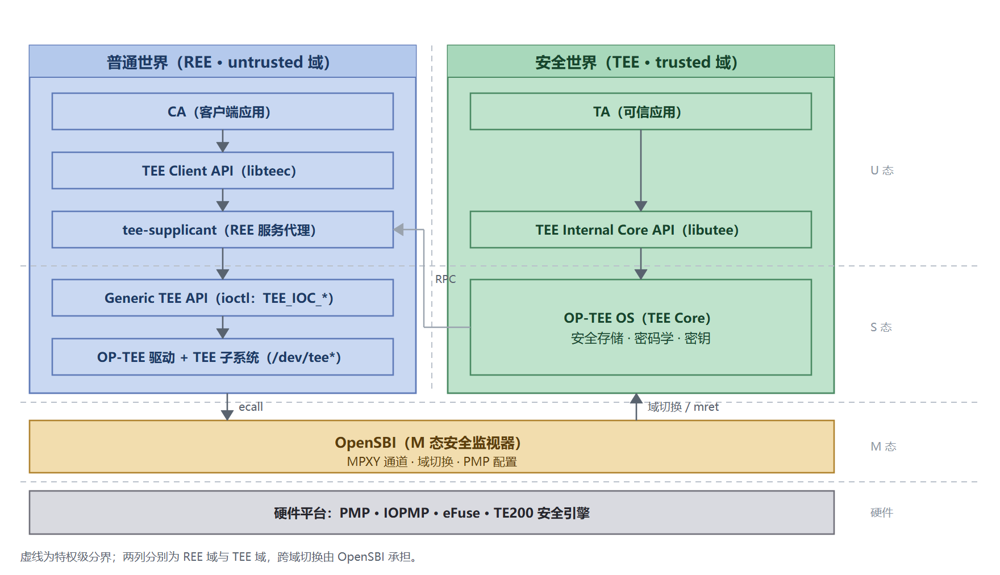
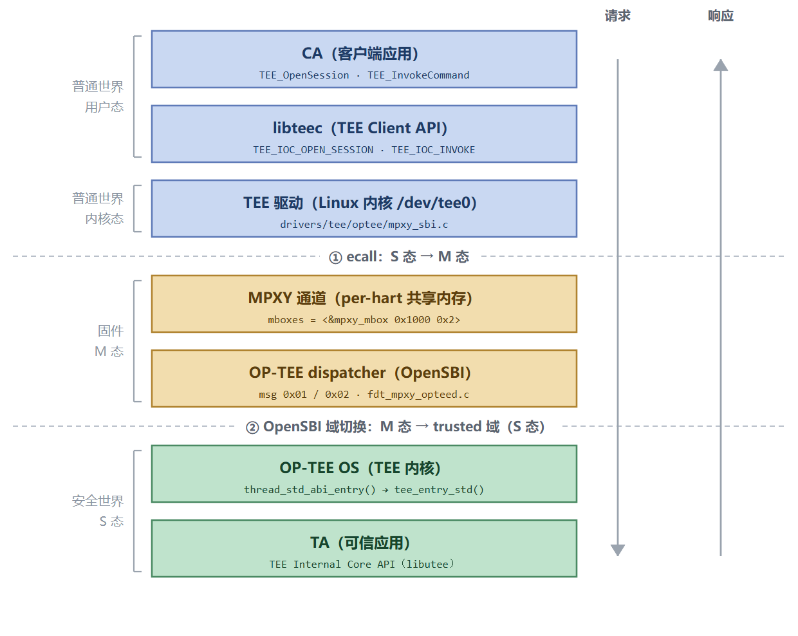
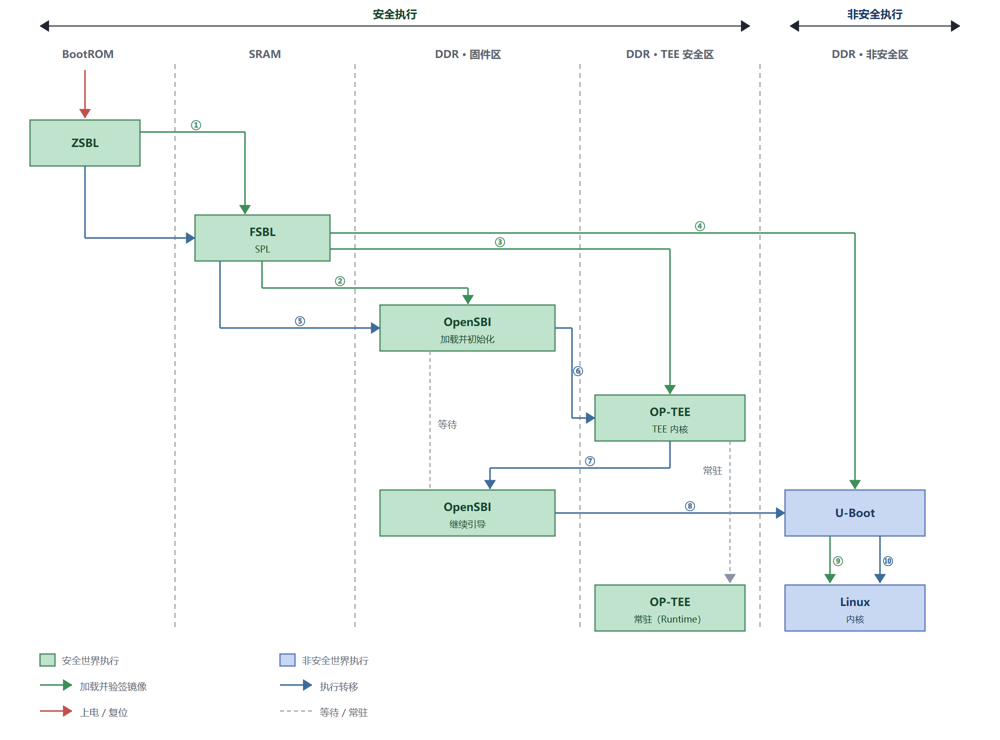
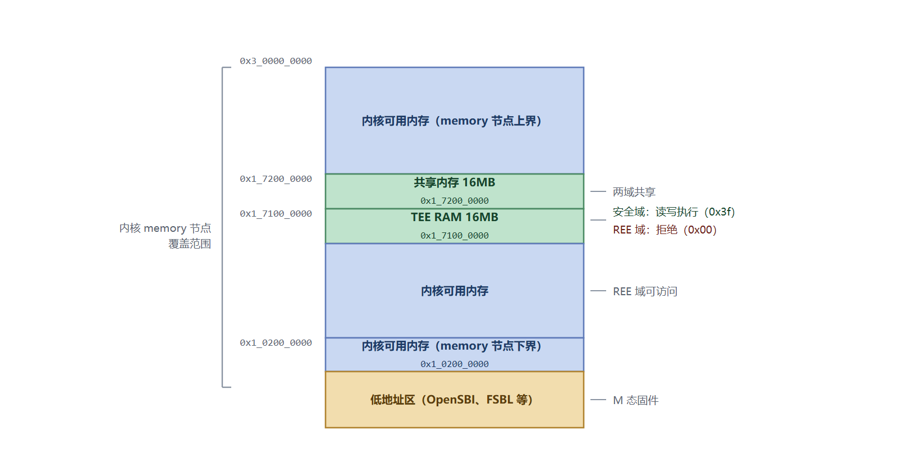
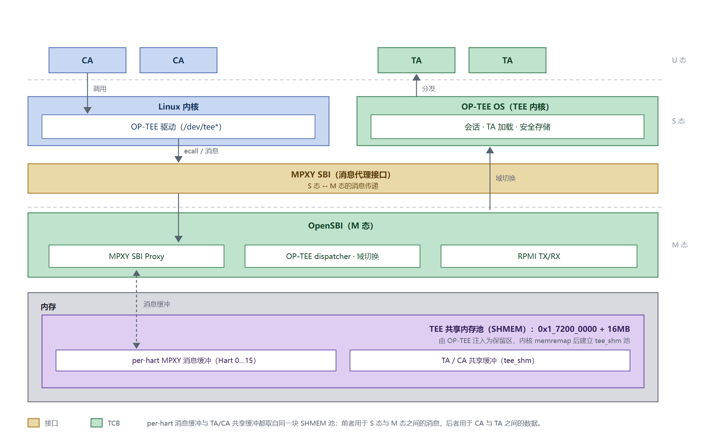
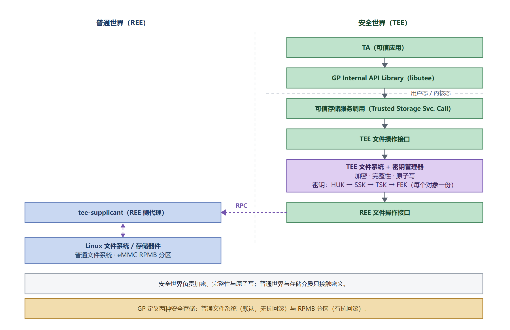

# TEE 架构与集成指南

## 概述

### 编写目的

本文介绍 SpacemiT K3 平台 OP-TEE 的架构位置、组件构成、启动流程、内存布局、通信机制与 BSP 集成方式，帮助读者理解其结构与集成方式，并据此定位与排查问题。

### 适用范围

本文适用于 SpacemiT K3 系列 SoC 的 Buildroot 方案。

本文只讲 **TEE 的结构与集成**，相关文档分工如下：

- **安全启动**（固件签名与验签链）：见[安全启动开发指南](../device/secureboot.md)。
- **镜像构建与烧录**：见 [TEE 镜像构建与烧录说明](tee_image.md)。
- **CA / TA 开发**：分别见 [CA 开发指南](ca_guide.md) 与 TA 开发指南。
- **特性支持状态**：见[安全特性支持矩阵](support_matrix.md)。

### 源码仓库

本文多处引用具体的代码文件。下表列出涉及的仓库与正文使用的简称，后文直接用简称代指；代码路径均相对于该仓库根目录。

| 简称 | 位置 | 说明 |
|---|---|---|
| **U-Boot** | `bsp-src/uboot-2022.10` | U-Boot 与 SPL 的源码树，含设备树 `arch/riscv/dts/k3-optee.dtsi`（域与 TEE 相关节点的定义处） |
| **OpenSBI** | `bsp-src/opensbi` | M 态固件：域管理、MPXY 框架与 OP-TEE 安全载荷分发 |
| **OP-TEE OS** | `bsp-src/optee_os` | TEE 内核本体；K3 平台代码在 `core/arch/riscv/plat-k3/` |
| **Linux 内核** | `bsp-src/linux-6.18` | 内核与 TEE 驱动（`drivers/tee/optee/`） |
| **Buildroot** | 构建根目录 | 顶层构建配置（`local.mk`、`configs/`）与 optee 各包的构建规则 |
| optee_client / optee_test / optee_examples | 上游仓库 | 不在 BSP 源码树内，构建时由 Buildroot 拉取，地址见「组件清单」 |

U-Boot、OpenSBI、OP-TEE OS 与 Linux 内核四项为 BSP 仓库内的本地源码树（位于 `bsp-src/` 下，经 `*_OVERRIDE_SRCDIR` 指定）；Buildroot 即构建根目录本身。

### 文档结构

1. **TEE 在系统中的位置**：从 CA 到 TEE 的调用链。
2. **组件清单**：四个组件的职责、代码来源与 GP API 的对应。
3. **启动流程**：从上电到 TEE 常驻，含初始化与常驻时机。
4. **内存布局**：TEE RAM 与共享内存，以及设备树侧的配合。
5. **通信机制**：SMC/ABI、MPXY 通道与 RPC。
6. **安全存储**：对象读写路径、密钥层级与落地位置。
7. **BSP 集成**：OpenSBI、U-Boot/SPL、内核与 Buildroot 各启用了哪些配置。
8. **开发模式与量产模式**。

### 重要约束

> [!CAUTION]
> TEE 的加载地址与内存划分存在**多处硬约束**，涉及 SPL、OpenSBI、TEE 镜像、设备树与内核，且 TEE RAM 与共享内存落在内核可见的内存范围内。修改任意一处都必须同步其余各处，否则会出现 TEE 无法启动或内存踩踏。见下文「内存布局」。

## TEE 在系统中的位置

OP-TEE 在 K3 上运行于 RISC-V S 态，由 OpenSBI 提供 M 态固件与跨域分发：



调用链的几个关键点：

- **CA 与 TA 不直接通信**：CA 的请求经 libteec 组包，通过 TEE 驱动下发到 OP-TEE。
- **反向请求由 `tee-supplicant` 代办**：OP-TEE 需要访问普通世界资源时发起 RPC，由该守护进程实现。
- **跨态与跨域**：RISC-V 没有 Arm 的 `smc` 指令，S 态与 M 态之间的切换由 `ecall`/`mret` 完成，跨域分发由 OpenSBI 承担。

链路上的各层：

- **TEE OS**：OP-TEE 的 RISC-V 后端，源码在 **OP-TEE OS**。
- **M 态固件**：OpenSBI 的域管理与 MPXY 实现（其中安全载荷分发由 `lib/utils/mpxy/fdt_mpxy_opteed.c` 承担），源码在 **OpenSBI**。
- **K3 的改动**：集中在平台层 `core/arch/riscv/plat-k3/` 与设备树。
- **升级影响面**：升级所依赖的版本时，通常只需重新适配平台层与设备树，而不是整条调用链。

一次 CA 调用穿越的全部层次与两处世界边界：



图中每个环节的锚点都可以在代码中定位：

- **REE 侧入口**：`TEE_OpenSession`/`TEE_InvokeCommand` 经 `TEE_IOC_OPEN_SESSION` 等 ioctl 进入 **Linux 内核**的 `drivers/tee/optee/mpxy_sbi.c`。
- **设备树绑定**：16 个 per-hart 通道绑到 `mpxy_mbox`（`mboxes = <&mpxy_mbox 0x1000 0x2>`），定义见 **U-Boot** 设备树 `arch/riscv/dts/k3-optee.dtsi`。
- **M 态接住消息**：OpenSBI 的 OP-TEE dispatcher（`lib/utils/mpxy/fdt_mpxy_opteed.c`）负责切到 trusted 域。
- **安全侧入口**：`thread_std_abi_entry()` 进而 `tee_entry_std()`（**OP-TEE OS**），最终由 OP-TEE 分发给 TA。

## 组件清单

| 组件 | 层 | 职责 | 代码来源 |
|---|---|---|---|
| TEE OS | 安全世界 | TEE 内核框架（进程、内存、驱动）、TEE Internal Core API 实现（libutee）、用户态 ELF 加载器（ldelf）、可扩展密码算法库 | BSP 本地源码树 **OP-TEE OS**（`BR2_TARGET_OPTEE_OS` 开启，`OPTEE_OS_OVERRIDE_SRCDIR` 定向到本地），平台代码在 `core/arch/riscv/plat-k3/` |
| TEE Client | 普通世界用户态 | TEE Client API 实现（libteec）、向 TEE 提供服务的守护进程（tee-supplicant） | 上游 [optee_client](https://github.com/OP-TEE/optee_client)，`BR2_PACKAGE_OPTEE_CLIENT` 开启，构建时从上游仓库拉取 |
| TEE Test | 普通世界用户态 | 测试集 xtest | 上游 [optee_test](https://github.com/OP-TEE/optee_test)，`BR2_PACKAGE_OPTEE_TEST=y`，构建时从上游仓库拉取 |
| 官方示例 | 普通世界用户态 | 七个示例 TA/CA | 上游 [optee_examples](https://github.com/OP-TEE/optee_examples)，`BR2_PACKAGE_OPTEE_EXAMPLES=y`，构建时从上游仓库拉取 |
| Linux TEE driver | 普通世界内核 | REE 侧 TEE 框架与驱动，衔接 CA、tee-supplicant 与 TEE | 内核上游 `drivers/tee/optee/`，K3 使用 BSP 本地源码树 **Linux 内核** |

其中 TEE Client、TEE Test 与官方示例的源码不在 BSP 源码树内：构建时由 Buildroot 从上游仓库拉取到编译目录，构建过程需要能够访问上游仓库。

四者构成完整的调用与服务体系：

- **TEE OS** 提供隔离与安全服务，是可信计算基。
- **TEE Client** 中，libteec 是 CA 的编程接口，tee-supplicant 是安全世界访问普通世界资源的唯一代理。
- **TEE Test** 用于验证整条链路自洽。
- **Linux TEE driver** 是普通世界内核侧的接入点，向用户态暴露 `/dev/tee*` 与 `/dev/teepriv*`。

### GP API 与 OP-TEE 的对应

OP-TEE 对外提供的两套接口都来自 **GlobalPlatform（GP）** 定义的 TEE 规范，而不是私有接口：

| 接口 | 规范 | 使用方 | K3 上的实现 |
|---|---|---|---|
| TEE Client API | GlobalPlatform TEE Client API Specification | 普通世界的 CA | libteec（`optee_client`） |
| TEE Internal Core API | GlobalPlatform TEE Internal Core API Specification | 安全世界的 TA | libutee（`optee_os`） |

两套规范分别约定 CA 侧与 TA 侧的编程接口，包括数据类型、函数、参数与错误码；TA 内部的存储、密码学、时间等能力也由 Internal Core API 定义。因此按这两套 API 编写的 CA/TA 与具体 TEE 实现解耦。

K3 上两侧使用的 API 与调用路径见上一节框图；两个规范的链接见本文结尾的参考资料。后续 CA 与 TA 开发分别参见 [CA 开发指南 / TEE Client API 参考](ca_guide.md) 与 [TA 开发指南](ta_guide.md)。

## 启动流程

安全镜像从上电到 TEE 常驻的完整链路：



图中绿色箭头表示**加载并验签**；当前版本尚未集成逐级验签，实际行为见[安全特性支持矩阵](support_matrix.md)。

各阶段的执行位置：ZSBL 在芯片内 BootROM，FSBL 在片内 SRAM，OpenSBI 与 U-Boot 位于 DDR 低地址的固件区，OP-TEE 位于 DDR 的 TEE 安全区，Linux 位于非安全区。具体地址见下表的加载目标地址。

初始化与常驻时机：

- **SPL 阶段**：只做装载，不初始化 TEE 逻辑；TEE 镜像此时已在内存中就位。
- **OpenSBI 阶段**：建立域模型与 PMP，随后进入 trusted 域**首次执行 OP-TEE**；TEE 完成平台初始化后并不退出，而是**常驻**，等待来自普通世界的调用。
- **常驻含义**：TEE 不被换出，其内存（TEE RAM）与代码在整个运行期保持有效；后续每次 CA 调用都是进入已驻留的 TEE 执行，而非重新加载。因此 TEE RAM 一旦被普通世界覆写，后果是运行期随机崩溃而非启动失败——这也是内存布局必须严格保证的原因（内核侧的排除机制见下文「内存布局」）。

固件加载顺序与目标地址：

| 顺序 | 镜像 | 加载方 | 加载目标地址 |
|---|---|---|---|
| 1 | `FSBL.bin`（SPL） | BROM | `0xc080_1000` |
| 2 | `esos.itb` | SPL | — |
| 3 | `optee.itb` | SPL | `0x1_7100_0000` |
| 4 | `u-boot.itb` | SPL | `0x1_0200_0000` |
| 5 | OpenSBI（`fw_dynamic.itb`） | U-Boot | `0x1_0000_0000` |

**TEE 镜像缺失时的行为**：

- **MMC 与 MTD 路径**：安全构建把 TEE 镜像设为必需，镜像缺失或加载失败时 SPL 直接中止启动，不会退化到非安全路径。
- **UFS、未知启动设备**：这些路径不加载 OP-TEE，保持与非安全构建相同的宽松语义。

验证安全镜像时需注意区分启动介质。

串口上可依次观察到：

```text
I/TC: OP-TEE version: 4.5.0 ...       # OP-TEE 启动横幅（trusted 域首次执行）
[  OK  ] Started OP-TEE driver        # 内核探测到 OP-TEE
```

## 内存布局



下图给出各区域的归属与保护方式；图中仅示意相对位置与大小，不按地址比例绘制。

### TEE RAM 与共享内存

| 区域 | 地址 | 大小 | 用途 |
|---|---|---|---|
| TEE RAM（TDDRAM） | `0x1_7100_0000` | 16 MB | TEE 内核、TA、TEE 堆与栈；**常驻** |
| 共享内存（SHMEM） | `0x1_7200_0000` | 16 MB | REE 与 TEE 之间传递数据；由 REE 分配、在 TEE 注册 |

### 共享内存采用保留式，不是动态式

平台配置明确选择了**保留式共享内存**：

| 配置项 | 取值 | 含义 |
|---|---|---|
| `CFG_CORE_RESERVED_SHM` | `y` | 使用固定的保留共享内存区域 |
| `CFG_CORE_DYN_SHM` | `n` | **不启用**动态共享内存 |
| `CFG_SHMEM_START` / `CFG_SHMEM_SIZE` | `0x1_7200_0000` / `0x100_0000` | 保留共享内存的基址与大小 |

两种方式的差异与对设备树的要求：

| | 保留式（当前） | 动态式 |
|---|---|---|
| 内存来源 | 平台配置固定一段 | 内核在运行时注册，可用任意普通内存 |
| 设备树 | **不需要** `reserved-memory` 描述共享内存 | 通常需要 `memory-region` 指向预留区 |
| 内核如何得知 | 由 OP-TEE 通过 ABI 通告共享内存配置，内核据此映射 | 由内核按设备树与运行时注册管理 |
| 灵活性 | 固定，不可动态扩容 | 灵活，可随负载申请 |

因此在本平台上：**静态设备树不描述共享内存**，而是由 OP-TEE 在启动时向设备树注入保留区（见下节）。若照搬其它平台「在设备树里用 `memory-region` 配 OP-TEE 共享内存」的做法，会与实际机制重复或冲突。

### 保留区由 OP-TEE 主动注入设备树

TEE RAM 与共享内存落在内核内存节点覆盖的范围内，但**不需要静态设备树预先声明**：OP-TEE 启动时会主动向设备树插入两个 `reserved-memory` 子节点，内核据此把它们标记为 `nomap`、不可复用，从而不会分配到这两段地址。

注入点：

| 节点 | 注入位置 | 依据配置 |
|---|---|---|
| `optee_core` | `core/arch/riscv/kernel/boot.c` | `CFG_TDDRAM_START` / `CFG_TDDRAM_SIZE` |
| `optee_shm` | `core/kernel/boot.c` | `CFG_SHMEM_START` / `CFG_SHMEM_SIZE`（仅保留式 SHM） |

子节点由 `core/kernel/dt.c` 在 `/reserved-memory` 下创建。同一处还会注入 `/firmware/optee` 节点（`compatible = "linaro,optee-tz"`、`method = "smc"`）；若设备树中已存在该节点则跳过，不覆盖。

启动后可在内核日志中确认注入结果：

```text
[    0.000000] OF: reserved mem: 0x0000000172000000..0x0000000172ffffff (16384 KiB) nomap non-reusable optee_shm@1,72000000
[    0.000000] OF: reserved mem: 0x0000000171000000..0x0000000171ffffff (16384 KiB) nomap non-reusable optee_core@1,71000000
```

两条日志分别对应共享内存与 TEE RAM，`nomap non-reusable` 表示内核对这两段既不建立映射也不复用。**排查内存踩踏类问题时，先确认这两条日志是否都在。**

> [!CAUTION]
> 注入失败会**直接 panic**。因此设备树 blob 的可用空间必须足够：平台配置的 DTB 上限（`CFG_DTB_MAX_SIZE`）必须能容纳新增节点。若缩小该上限或压紧设备树，可能表现为启动即 panic。
>
> 此外，`optee_core` 与 `optee_shm` 均由 OP-TEE 依据平台配置生成，**不要在静态设备树里再手写一份**：重复声明会造成同一区间被描述两次，排查时极易误判。

### TEE RAM 的硬件保护

除内核侧的保留区声明外，TEE RAM 还由 **OpenSBI 域模型 + PMP 硬件强制**保护。**U-Boot** 设备树 `arch/riscv/dts/k3-optee.dtsi` 定义了相关节点：

```dts
chosen {
    opensbi-domains {
        compatible = "opensbi,domain,config";

        tmem: tmem {
            compatible = "opensbi,domain,memregion";
            base = <0x01 0x71000000>;   /* TEE RAM 基址 */
            order = <0x18>;             /* 2^24 = 16 MB */
        };

        allmem: allmem {
            compatible = "opensbi,domain,memregion";
            base = <0x01 0x00>;
            order = <0x40>;             /* 全地址空间 */
        };

        tdomain: trusted-domain {
            regions = <&allmem 0x3f>;
            next-addr = <0x01 0x71000000>;   /* 进入 TEE */
            next-mode = <0x01>;              /* S 态 */
        };

        udomain: untrusted-domain {
            regions = <&tmem 0x00>, <&allmem 0x3f>;   /* tmem 权限为 0 */
            next-addr = <0x01 0x02000000>;            /* 进入 U-Boot */
            next-mode = <0x01>;
        };
    };
};
```

说明：

- `tmem` 对应 TEE RAM 区间。
- `udomain`（U-Boot 与 Linux 所在域）对 `tmem` 的权限为 `0x00`，即**无任何访问权限**，由 PMP 在硬件上拒绝。
- `tdomain` 拥有全部内存权限，并从 TEE RAM 基址以 S 态进入 TEE。
- `allmem` 的 `order = 0x40` 表示覆盖整个 64 位地址空间。

两个域的归属汇总：

| 域 | 内存区域与权限 | 执行体 | 入口地址 |
|---|---|---|---|
| `tdomain`（可信域） | `allmem`：`0x3f`（全权限） | OP-TEE | `0x1_7100_0000` |
| `udomain`（非可信域） | `tmem`：`0x00`（拒绝）、`allmem`：`0x3f` | U-Boot 与内核 | `0x1_0200_0000` |

两个域都使用全部 16 个 hart；`udomain` 的启动 hart 为 `cpu_0`。域间通信由 `sbi-mpxy-opteed` 节点提供，通道号 `0x1000` – `0x100f`（每 hart 一个，见「通信机制」）。

两层保护的分工：**PMP 负责硬件拒绝**（越权访问直接触发异常，不会静默破坏），**OP-TEE 注入的 reserved-memory 负责软件排除**（内核不分配这些地址）。两者缺一不可：只有 PMP 时会因内核误用而频繁异常，只有保留区声明则失去硬件兜底。

> [!NOTE]
> `udomain` 对 TEE RAM 无访问权限是**硬件层面**的保证，而内核侧的排除由 OP-TEE 注入的保留区完成（见上节）。两者共同保证 TEE RAM 与共享内存不被普通世界使用。
>
> 排查时若两条 `OF: reserved mem` 日志缺失，说明注入未生效；此时内核会把这两段当作普通内存使用，后果是运行期随机崩溃而非启动失败，极难定位。

### 地址锚点一致性

以下四处必须保持一致，改一处必须同步其余各处：

| 锚点 | 位置 |
|---|---|
| TEE 镜像加载与入口地址 | **OP-TEE OS** 平台目录的 FIT 描述文件 `core/arch/riscv/plat-k3/optee.its`（`load` / `entry` 字段） |
| TEE RAM 与共享内存基址 | **OP-TEE OS** 平台配置 `core/arch/riscv/plat-k3/conf.mk`（`CFG_TDDRAM_START` / `CFG_SHMEM_START`） |
| TEE RAM 保留区与域入口 | **U-Boot** 设备树 `arch/riscv/dts/k3-optee.dtsi`（`tmem` 节点与 `tdomain` 的 `next-addr`） |
| TEE 内核链接地址 | OP-TEE 链接脚本按 `CFG_TDDRAM_START` 生成（同一 `conf.mk`） |

## 通信机制

### SMC / ABI 调用

Arm 用 `smc` 指令实现 REE 与 TEE 的通信。RISC-V 没有该指令，改用 `ecall` 完成 S 态 → M 态 → S 态的切换，但**沿用了同一套 ABI 调用规范**：参数寄存器中的 Function ID 指明本次调用的服务类型。

ABI 定义位于 `core/arch/riscv/include/tee/optee_abi.h`。调用分两类：

| 类型 | 中断行为 | 典型用途 |
|---|---|---|
| fast call | 执行期间屏蔽中断，相当于原子执行 | 获取 OS UUID、获取 OS 版本、获取共享内存配置、能力交换、secondary 核启动 |
| yield call | 不屏蔽中断，可被普通世界中断打断 | CA 发起的 TEE Client API 命令、TEE 发起的 RPC 响应 |

### MPXY 与 RPMI conduit

Arm 依赖 `smc` 指令完成跨世界通信；RISC-V 用 **SBI MPXY（Message Proxy）扩展**替代，本质仍是 `ecall`。MPXY 的定位是：让 S 态软件能够收发消息，普通世界与安全世界之间的消息经 M 态转发。



图中绿色为可信计算基（TCB）：除安全世界内核 **OP-TEE OS** 外，M 态的 **OpenSBI**（域隔离、跨域分发与 PMP 配置）同样属于 TCB；棕色为跨域接口（MPXY SBI）。

三类共享内存的分工与来源：

| 名称 | 用途 | 来源 |
|---|---|---|
| TEE 共享内存池（SHMEM） | REE 与 TEE 之间交换数据的池 | OP-TEE 的静态共享区（`CFG_SHMEM_START`，K3 上为 `0x1_7200_0000` + 16MB），启动时注入为 `optee_shm` 保留区并通过 `OPTEE_SMC_GET_SHM_CONFIG` 告知内核 |
| per-hart MPXY 消息缓冲 | S 态与 M 态之间传递消息的载体，每个 hart 一个通道 | 内核从上述池中分配一块 `tee_shm`，把物理地址经 RPMI mailbox 消息头交给 OpenSBI |
| TA / CA 共享内存 | CA 与 TA 之间传递参数与数据 | CA 经 libteec 分配或注册，内核从同一池中分配 `tee_shm` 并注册给 OP-TEE，TA 通过 memref 访问 |

组成要素：

- **per-hart 共享内存**：S 态与 M 态之间传递消息的载体，每个 hart 一个通道。
- **多协议（channel）**：MPXY 只提供传输框架，实际消息格式由各自的通信协议定义（RPMI、OPTEED 等），通过 `channel_id` 区分。

K3 的通道分配（**U-Boot** 设备树 `arch/riscv/dts/k3-optee.dtsi` 的 `sbi-mpxy-opteed` 节点）：

```dts
sbi-mpxy-opteed {
    opensbi-domain-instance = <0x02>;              /* 指向 tdomain */
    riscv,sbi-mpxy-channel-id = <0x1000 0x1001 ... 0x100f>;   /* 16 个 per-hart 通道 */
    compatible = "riscv,sbi-mpxy-opteed";
};
```

即 **16 个通道 `0x1000`–`0x100f`，与 16 个 hart 一一对应**。通道内的协议编号用于区分消息去向。

内核侧的对接方式（`firmware/optee` 节点）：

```dts
firmware {
    optee {
        compatible = "linaro,optee-tz";
        method = "smc";                                   /* 保留 ABI 命名 */
        mboxes = <&mpxy_mbox 0x1000 0x2>, <&mpxy_mbox 0x1001 0x2>, ...
                  <&mpxy_mbox 0x100f 0x2>;                /* 16 个 hart,协议号 0x2 */
    };
};
```

`mboxes` 的每一项由「MPXY 通道号 + 协议号」组成：通道号 `0x1000`–`0x100f` 对应 hart，协议号 `0x2` 为 TEE 协议。注意 `method` 仍写作 `"smc"`，这是 ABI 命名沿用，**不代表使用 Arm 的 `smc` 指令**。

### 消息类型

OP-TEE 在 MPXY 之上定义了两类消息，`message_id` 指明类型：

| 消息 | 方向 | 含义 |
|---|---|---|
| `OPTEED_MSG_COMMUNICATE` | REE → TEE | 普通世界发起调用 |
| `OPTEED_MSG_COMPLETE` | TEE → REE | 安全世界返回结果 |

消息内容沿用 ABI 的参数寄存器值：

```c
struct mpxy_opteed_msg {
    unsigned long a0, a1, a2, a3, a4, a5, a6, a7;
};
```

因此 S 态软件经 MPXY 进入 M 态后，OpenSBI 依据 `message_id` 决定本次消息发往 TEE 还是 REE。

### RPC

RPC 是由安全世界发往普通世界的请求，同样经 SMC/MPXY 机制实现，分成两类去向：

| 去向 | 内容 |
|---|---|
| tee-supplicant | TA 装载、共享内存分配与释放、RPMB 访问、文件系统操作等 |
| Linux TEE driver | 通知类消息（告知普通世界安全世界正在等待、或等待已完成）、获取普通世界时钟 |

`tee-supplicant` 通过 `/dev/teepriv*` 与内核交互：它持续发起接收类 ioctl，内核把 TEE 发来的 RPC 消息交给它；它处理完毕后再发起发送类 ioctl，由内核取回响应。

RPC 最主要的用途是安全存储：TA 读写持久化对象时，由安全世界向普通世界请求文件操作，见下文「安全存储」。

## 安全存储

安全存储为 TA 提供持久化对象。OP-TEE 的实现遵循 GlobalPlatform 的定义：TA 用同一套 TEE Internal Core API 的存储接口读写对象，数据落地有两种后端。机密性、完整性与原子写都由安全世界保证，两种后端的差别在抗回滚与启用前提：

| 后端 | 数据落地 | 机密性 | 完整性 | 原子写 | 抗回滚 | K3 状态 |
|---|---|---|---|---|---|---|
| 普通世界文件系统（REE FS） | 普通世界的文件（密文） | ✓ | ✓ | ✓ | ✗ | 支持（默认） |
| RPMB 分区 | eMMC / UFS 的 RPMB 分区 | ✓ | ✓ | ✓ | ✓ | 部分支持（代码就绪，默认未使能） |

安全存储的分层与跨世界传递：



各环节的分工：

| 环节 | 位置 | 职责 |
|---|---|---|
| 可信存储服务 | 安全世界（TEE Internal Core API） | 向 TA 提供对象读写接口 |
| TEE 文件系统 + 密钥管理器 | 安全世界 | 加密、完整性校验与原子写；管理每个对象的文件密钥 |
| REE 文件操作接口 | 安全世界 | 把文件读写请求转换成 RPC |
| tee-supplicant | 普通世界用户态 | 代安全世界读写文件 |
| 普通世界文件系统 / 存储器件 | 普通世界 | 只保存密文 |

两个要点：

- **密钥来源**：文件密钥由 HUK 逐级派生（`SSK → TSK → FEK`），每个安全对象一份。因此存储内容与设备绑定，换设备无法解密，不同 TA 的存储数据也互不可见。
- **两种后端的差异**：默认走 REE FS，数据文件落在普通世界的 `/data/tee/`（内容为密文），只有机密性与完整性，攻击者删除或回滚文件不会被察觉；需要抗回滚时改用 RPMB 后端，其前提是器件已完成 RPMB key 灌注（key 由 HUK 结合器件 CID 派生并写入），当前未使能。路径与启用前提见 [TEE 镜像构建与烧录说明](tee_image.md) 的「编译产物与在系统中的位置」与[安全特性支持矩阵](support_matrix.md)。

RPC 的传递路径见上文「通信机制」的 RPC 小节。

## BSP 集成：启用了哪些配置

各部分无需改动源码，通过配置项开启。以下按组件列出需要打开的配置与配套的设备树节点。

### OpenSBI（M 态固件）

| 配置项 | 作用 |
|---|---|
| `CONFIG_FDT_MPXY` | SBI 消息代理（MPXY）框架 |
| `CONFIG_FDT_MPXY_OPTEED` | OP-TEE 安全载荷分发（域管理与 opteed 消息） |
| `CONFIG_FDT_MPXY_RPMI_*` | RPMI 各服务组（时钟 / 电压 / 电源域 / RTC / 按键） |

配套设备树节点位于 **U-Boot** 设备树 `arch/riscv/dts/k3-optee.dtsi`（已存在）：`opensbi-domains`（`tmem` / `tdomain` / `udomain` 三个域与内存划分）、`sbi-mpxy-opteed`（per-hart 通道）、`firmware/optee`（内核侧接入点）。

### U-Boot / SPL

| 配置项 | 作用 |
|---|---|
| `CONFIG_SPACEMIT_SECURE_BOARD` | 以安全形态构建板级固件：SPL 在 U-Boot 之前加载 OP-TEE 独立分区，并使用安全分区布局；选中后自动启用 `CONFIG_RISCV_OPTEE_SUPPORT` |
| `CONFIG_RISCV_OPTEE_SUPPORT` | 在设备树中编入 OP-TEE 与域节点（k3-optee.dtsi），并在启动时把这些节点拷贝进内核设备树 |

两个开关的叠加方式：非安全构建用 `k3_defconfig`（不含 OP-TEE 逻辑）；安全构建由 secure-firmware 包在独立的镜像构建目录（`output/k3/build/secure-firmware-1.0/uboot-sec/`）中，以 `k3_defconfig` 叠加 `configs/k3_sec.config`（开启 `SPACEMIT_SECURE_BOARD`）构建；非安全的 U-Boot 构建目录全程只读，安全构建不影响普通镜像的固件。

### 内核

| 配置项 | 作用 |
|---|---|
| `CONFIG_TEE` | 内核 TEE 框架 |
| `CONFIG_OPTEE` | OP-TEE 驱动（暴露 `/dev/tee*` 与 `/dev/teepriv*`） |

还需 MPXY 的 mailbox 与协议驱动（`riscv,sbi-mpxy-mbox` 及其消费者），否则 `firmware/optee` 的 `mboxes` 无法解析。

### Buildroot

| 配置项 | 作用 |
|---|---|
| `BR2_TARGET_OPTEE_OS`（`PLATFORM="k3"`、`CORE_IMAGES="tee.bin"`） | 把 OP-TEE OS 构建进输出，产物为 `tee.bin` 与 `optee.itb` |
| `BR2_PACKAGE_OPTEE_CLIENT` | libteec 与 tee-supplicant（由 OPTEE_TEST 依赖自动选入） |
| `BR2_PACKAGE_OPTEE_TEST` | xtest 测试集 |
| `BR2_PACKAGE_OPTEE_EXAMPLES` | 七个示例 TA/CA |
| `BR2_TARGET_UBOOT_NEEDS_OPTEE_TEE` / `..._TEE_BIN` | 把 OP-TEE 镜像链接给 U-Boot 打包 |
| `OPTEE_OS_OVERRIDE_SRCDIR`（local.mk） | 指定 TEE 使用 BSP 本地源码树 **OP-TEE OS** |

TEE 用户态组件与 TA 不是标准可执行文件，生成 initramfs 时需显式加入安装白名单。产物布局与分区表见 [TEE 镜像构建与烧录说明](tee_image.md)。

### TEE 内的平台驱动

| 驱动 | 用途 | 默认状态 |
|---|---|---|
| 硬件随机数 | 替代软件随机数后端 | 使能 |
| 安全引擎（非对称） | RSA、ECDSA、SM2DSA | 使能 |
| 安全引擎（对称） | AES、SM4 及多种分组模式 | 使能 |
| 安全引擎（摘要） | SHA、SM3 | 未启用（使用软件实现） |
| eFuse 读取与 HUK 派生 | 读取芯片密钥并派生根密钥 | 使能 |
| IOPMP | 外设访问隔离 | 使能（IOPMP4 恒为关闭，功能冗余；其余 8 个实例使能） |
| RTC PTA | 向普通世界暴露平台 RTC | 使能 |

eFuse 驱动**只实现读取路径**：安全世界按设计不烧录熔丝，烧录由 U-Boot 在产线完成。读取路径先触发阵列重载、轮询就绪位，随后缓存全部 bank，重复读取不再产生额外硬件时序开销。

## 开发模式与量产模式

以下开关在开发与量产阶段要求不同，构建量产版本前必须逐项确认：

| 开关 | 配置项 | 开发/调试 | 量产 | 影响 |
|---|---|---|---|---|
| 未烧熔丝时的 HUK 兜底 | `CFG_K3_HUK_ALLOW_UNFUSED` | 打开 | 关闭 | 打开时 HUK 可由源码复现，全部子密钥公开 |
| HUK 指纹校验 | `CFG_K3_HUK_VERIFY` | 按需临时打开 | 关闭 | 仅用于追溯，源码要求出货前删除 |
| 安全存储后端 | `CFG_RPMB_FS` | 视需要（可先用 RPMB 模拟：`BR2_PACKAGE_OPTEE_CLIENT_RPMB_EMU`） | 打开 | 关闭时安全存储对象落在普通世界的文件系统（`/data/tee/`），缺少回滚保护 |
| RPMB key 灌注 | `CFG_RPMB_WRITE_KEY`（授权 CID：`CFG_RPMB_WRITE_KEY_CID`） | 产测版打开 | 关闭 | 打开时 TEE 可写出 RPMB key，存在泄露风险 |
| RPMB 测试密钥 | `CFG_RPMB_TESTKEY` | 可临时使用 | 关闭 | 硬编码密钥，无安全性 |
| TEE 核心日志等级 | `CFG_TEE_CORE_LOG_LEVEL`（TA 侧：`CFG_TEE_TA_LOG_LEVEL`） | 最详细（4） | 建议降级 | 详细日志暴露内部状态并增大镜像体积 |

> [!CAUTION]
> 未烧录熔丝的设备使用公开的开发 HUK，其全部子密钥都可由源码复现，**不可用于出货**。产线设备必须在烧录熔丝后重新验证。


## 与其他文档的关系

| 主题 | 文档 |
|---|---|
| 安全启动信任链与固件签名 | [安全启动开发指南](../device/secureboot.md) |
| TEE 镜像构建、烧录与验证 | [TEE 镜像构建与烧录说明](tee_image.md) |
| 安全固件的分区表 | [TEE 镜像构建与烧录说明](tee_image.md) 的分区布局章节 |
| CA 开发与 TEE Client API | [CA 开发指南 / TEE Client API 参考](ca_guide.md) |
| 示例与测试套件 | [TEE 示例集](examples.md) |
| 特性支持状态 | [安全特性支持矩阵](support_matrix.md) |
| 刷机流程与分区布局基础 | [启动开发指南](../device/boot.md) |


## 参考资料

本文参考的外部文档与上游仓库如下。

| 名称 | 版本 | 链接 |
|---|---|---|
| OP-TEE 官方文档 | latest | <https://optee.readthedocs.io/en/latest/> |
| optee_client（构建时拉取） | 4.5.0 | <https://github.com/OP-TEE/optee_client> |
| optee_test（构建时拉取） | 4.5.0 | <https://github.com/OP-TEE/optee_test> |
| optee_examples（构建时拉取） | 4.5.0 | <https://github.com/OP-TEE/optee_examples> |
| RISC-V SBI Specification（含 MPXY 消息代理扩展） | 2.0 | <https://github.com/riscv-non-isa/riscv-sbi-doc> |
| GlobalPlatform TEE Client API Specification | 1.0.1 | <https://globalplatform.org/specs-library/tee-client-api-specification/> |
| GlobalPlatform TEE Internal Core API Specification | 1.4 | <https://globalplatform.org/specs-library/tee-internal-core-api-specification/> |
