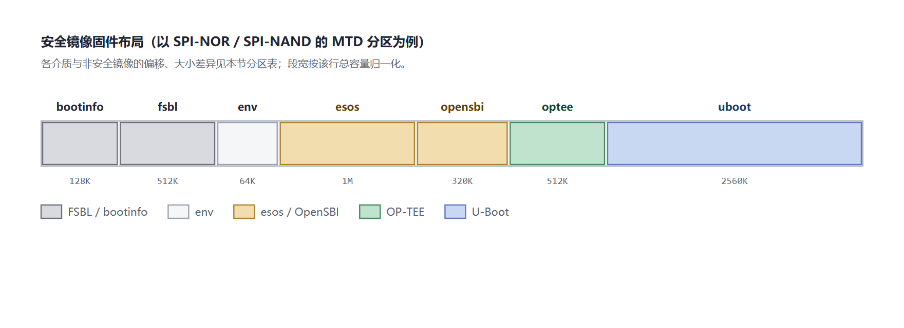

# TEE 镜像构建与烧录说明

## 概述

### 编写目的

本文说明 SpacemiT K3 平台 Buildroot 方案下 TEE（OP-TEE）安全镜像的构成、构建方式、分区布局、启动流程与验证方法，帮助开发者构建、烧录并确认安全镜像可用。

### 适用范围

本文适用于 SpacemiT K3 系列 SoC 的 Buildroot 方案。TEE 的结构与集成原理参见 [TEE 架构与集成指南](tee_architecture.md)，各安全特性的支持状态参见[安全特性支持矩阵](support_matrix.md)。

### 文档结构

1. **镜像说明**：安全镜像与普通镜像的差异。
2. **使能与整编**：默认配置与一条命令产出双镜像。
3. **单独编译安全固件**：分步构建与清理重编。
4. **产物目录**：安全产物的存放位置。
5. **编译产物与在系统中的位置**：每个产物落到哪里、由什么指定。
6. **分区布局**：各存储介质的安全分区表。
7. **启动流程与验证**。
8. **已知限制**。

### 重要约束

> [!CAUTION]
> 安全镜像与普通镜像必须**成套烧录**。安全版的分区表、U-Boot、FSBL 与普通版互不兼容，混用会导致启动失败。切换回普通镜像时同样需要烧录完整的普通镜像包。

## 镜像说明

启用 TEE 支持后，编译产物中会额外生成一套安全镜像，文件名带 `-sec` 后缀，与普通镜像并存：

| 镜像 | 内容 | 用途 |
|---|---|---|
| `Buildroot-k3-<时间戳>.zip` | 普通固件，不含 OP-TEE | 常规启动与调试 |
| `Buildroot-k3-<时间戳>-sec.zip` | 普通固件 + OP-TEE 及安全版 U-Boot / FSBL / env，含独立 TEE 分区 | 安全环境启动 |
| `Buildroot-k3-<时间戳>-sdcard.img` | 普通卡启动镜像 | 卡启动 |
| `Buildroot-k3-<时间戳>-sec-sdcard.img` | 安全卡启动镜像，含 TEE 分区 | 卡启动（安全） |

烧录方式与普通镜像一致：`-sec.zip` 用 Titan 工具刷机，`-sec-sdcard.img` 用 `dd` 或 Balena Etcher 写卡。

安全 zip 与非安全 zip 的文件集对齐，仅多出 TEE 镜像与安全版打包配置。其中 `factory/FSBL.bin`、`u-boot.itb`、`env.bin` 为安全版（带 TEE 加载逻辑与安全环境变量），`ec.bin`、bootfs、rootfs 与分区表两套都有。

## 使能与整编

默认配置 `configs/spacemit_k3_defconfig` 已使能全部 TEE 相关选项：

- `BR2_TARGET_OPTEE_OS=y`（版本 4.5.0）
- `BR2_PACKAGE_OPTEE_EXAMPLES=y`、`BR2_PACKAGE_OPTEE_TEST=y`
- `BR2_PACKAGE_SECURE_FIRMWARE=y`
- RPMB 模拟关闭（`BR2_PACKAGE_OPTEE_CLIENT_RPMB_EMU` 未使能）

整编时自动生成两套镜像，无需额外开关：

```bash
make envconfig      # 选择 spacemit_k3_defconfig
make                # 全量编译，自动产出普通与安全两套镜像
ls output/k3/images/ | grep -E 'zip|img'
```

安全固件依赖的源码仓由 repo manifest 拉取，包括 OP-TEE OS、U-Boot（含安全板级配置）与 OpenSBI（使能 OP-TEE 分发器）。

## 单独编译安全固件

OP-TEE OS 与安全固件打包都是标准的构建目标，命令透传到顶层 Makefile。

### OP-TEE OS

```bash
make optee-os                     # 编译 OP-TEE OS，生成 tee.bin
make optee-os-rsync               # 源码改动后重新同步到构建目录
make optee-os-reconfigure         # 配置或平台改动后重新配置并编译
make optee-os-rebuild             # 强制重跑构建步骤
make optee-os-dirclean            # 清理构建目录
make optee-os-menuconfig          # 打开 OP-TEE 配置界面
make optee-os-update-defconfig    # 保存配置修改回源码
```

### 安全固件集

```bash
make secure-firmware              # 打 TEE 镜像，并在独立镜像构建目录中构建安全 U-Boot 变体，产出到 images/sec/
make secure-firmware-rebuild      # 源码改动后强制重跑
make secure-firmware-dirclean     # 清理
```

### 依赖方配置改动

```bash
make opensbi-reconfigure          # OpenSBI 配置改动后重新生成
```

源码有改动时，先同步再编译：

```bash
make optee-os-rsync && make optee-os
make uboot-rsync && make uboot
make secure-firmware
make                              # 尾部打包步骤自动重打两套 zip
```

### 清理重编固件

只清理固件链并重编，保留内核与根文件系统产物：

```bash
# 1. 删除产物目录下的固件文件（保留内核、根文件系统与设备树）
# 2. 清理固件包的构建目录
make uboot-dirclean esos-dirclean opensbi-dirclean optee-os-dirclean \
     optee-client-dirclean optee-test-dirclean optee-examples-dirclean \
     secure-firmware-dirclean

# 3. 全量重编，内核与根文件系统构建有效时自动跳过
make
```

## 产物目录

```text
output/k3/images/
├── Buildroot-k3-<ts>.zip / -sdcard.img          # 普通镜像（tee-free）
├── Buildroot-k3-<ts>-sec.zip / -sec-sdcard.img  # 安全镜像
└── sec/                                         # 安全固件集
    ├── tee.bin                                  # OP-TEE 内核
    ├── optee.itb                                # 独立 TEE 分区镜像（FIT）
    ├── u-boot.itb                               # 安全版 U-Boot
    ├── FSBL.bin                                 # 安全版 SPL
    ├── env.bin                                  # 安全分区布局的环境变量
    ├── u-boot-nodtb.bin / u-boot-spl.bin        # 安全 U-Boot 中间产物
    └── uboot/                                   # 安全设备树（含域门控节点）
```

安全产物全部收在 `images/sec/` 内，打包过程不触碰产物根目录与普通镜像的打包暂存目录。安全 U-Boot 在独立镜像构建目录（`output/k3/build/secure-firmware-1.0/uboot-sec/`）中构建：每次构建先从非安全 U-Boot 构建目录同步副本、再叠加 `k3_sec.config`，非安全构建目录全程只读，因此安全构建不会污染普通镜像的固件，也不需要备份或还原步骤。

## 编译产物与在系统中的位置

安全构建产出三类东西：TEE 固件镜像、普通世界侧的库与守护进程、TA 与测试程序。它们在系统中的位置与指定方式如下（位置一栏同时给出运行期命令行可覆盖的参数）：

| 产物 | 是什么 | 在系统中的位置 | 由什么指定 |
|---|---|---|---|
| `tee.bin` | OP-TEE 内核（TEE Core）镜像 | 不落到文件系统；被打包进 `optee.itb` 后写入 optee 分区 | `BR2_TARGET_OPTEE_OS_CORE_IMAGES="tee.bin"` 指定要构建的 core 镜像 |
| `optee.itb` | 独立 TEE 分区镜像（FIT 容器，内含 `tee.bin`） | 器件的 optee 分区（MTD 分区或 eMMC / SD 分区，见「分区布局」） | FIT 描述文件 `core/arch/riscv/plat-k3/optee.its` 决定加载与入口地址；分区偏移与大小由分区表（genimage 配置与 `MTDPARTS_DEFAULT`）决定 |
| `libteec.so.2` | CA 侧客户端库 | 目标根文件系统 `/usr/lib/` | `BR2_PACKAGE_OPTEE_CLIENT`（由 `BR2_PACKAGE_OPTEE_TEST` 依赖自动选入） |
| `tee_client_api.h` | CA 编译用头文件 | 目标 `/usr/include/`；交叉编译时由工具链自带的 sysroot 提供（`output/k3/host/riscv64-buildroot-linux-gnu/sysroot/usr/include/`），也可从 optee_client 的编译目录 `output/k3/build/optee-client-4.5.0/libteec/include/` 取 | 同上 |
| `tee-supplicant` | 普通世界守护进程（代理文件与 RPMB 等 RPC） | `/usr/sbin/tee-supplicant`，由 `/etc/init.d/S30tee-supplicant` 拉起 | 同上 |
| `<uuid>.ta` | TA 文件 | `/lib/optee_armtz/`（权限 444） | 目录 = supplicant 编译期的 `TEEC_LOAD_PATH`（默认 `/lib`）与 `optee_armtz` 子目录名组合；运行期可用 `--ta-path` / `--ta-dir` 覆盖。安装动作由 optee-examples 包的安装钩子完成，见 [TA 开发指南](ta_guide.md) 的部署小节 |
| 安全存储对象 | TA 持久化对象的数据文件（密文） | `/data/tee/` | supplicant 编译期的 `TEE_FS_PARENT_PATH`（默认 `/data/tee`）；运行期可用 `--fs-parent-path` 覆盖 |
| `xtest` 等测试程序 | 测试套件 | `/usr/bin/` | `BR2_PACKAGE_OPTEE_TEST` |

两点补充：

- **只有 TA 是“数据结构”而非可执行文件**，它由普通世界的 `tee-supplicant` 按 UUID 从 TA 目录读出并交给 TEE，因此 TA 目录必须同时存在于运行时文件系统中。
- 安全存储的数据文件默认落在 `/data/tee/`（普通世界可见，但内容为密文）；改用 RPMB 后端后，数据落在器件的 RPMB 分区，见 [TEE 架构与集成指南](tee_architecture.md) 的安全存储章节。

## 分区布局

安全镜像的分区表在普通分区表基础上增加独立的 TEE 分区，OpenSBI 与 U-Boot 的分区边界随之调整：

| 变化项 | 非安全镜像 | 安全镜像 |
|---|---|---|
| TEE 固件 | 无 | 新增独立 `optee` 分区（USB 烧录路径除外，见下） |
| OpenSBI 分区 | 384K（MTD） | 收缩为 320K，让出 64K |
| U-Boot 起始偏移 | 2112K（MTD） | 后移到 2560K |

在 GPT 介质上，`optee` 直接占用 4M 独立分区，其后的 `bootfs` 与 `rootfs` 相应后移 4M；MTD 介质上放不下 4M，`optee` 缩减为 512K，从 OpenSBI 分区省出的空间中挤出位置。



图中每一行的条形长度按该行介质的总容量独立归一化，段与段之间的留白表示未被任何分区占用的余量。「USB 烧录」一行没有独立 `optee` 分区，`optee.itb` 以文件形式放在 `bootfs` 内。

> [!IMPORTANT]
> **启动介质容量要求**
>
> 当前安全镜像对启动介质的要求：
>
> - **容量**：要求**大于等于 8M**。
> - **4M SPI-NOR**：`uboot` 分区自 2560K 起仅剩 1536K，而安全版 `u-boot.itb` 约 2383K，**当前放不下**；8M 及以上均可，存在 8M 的 SPI-NOR。
> - **可用介质**：SPI-NOR 8M 及以上、SPI-NAND，或 eMMC / SD / UFS。
>
> 详见下文「已知限制」。

各介质的分区表文件：

| 存储介质 | 分区表 | TEE 分区 |
|---|---|---|
| eMMC / SD | `partition_universal.json` | 12 MB 起，4 MB 大小，bootfs 顺延至 16 MB |
| SPI NOR 4M | `partition_4M.json` | 2048 K 起，512 K 大小 |
| SPI NOR 64M | `partition_64M.json` | 2048 K 起，512 K 大小 |
| USB | `partition_flash.json` | 无独立 TEE 分区，TEE 镜像在 bootfs 文件列表内 |

### SPI-NOR 4M 与 SPI-NAND 64M（MTD）

| 分区 | 偏移 | 4M 大小 | 64M 大小 | 镜像 | 备注 |
|---|---|---|---|---|---|
| `bootinfo` | 0 | 128K | 128K | `factory/bootinfo_spinor.bin` / `bootinfo_spinand.bin` | 记录 FSBL 位置，**位置不可变** |
| `fsbl` | 128K | 512K | 512K | `factory/FSBL.bin` | 偏移由 `bootinfo` 指定 |
| `env` | 640K | 64K | 64K | `env.bin` | U-Boot 环境变量，**偏移与大小不可变** |
| `esos` | 704K | 1M | 1M | `esos.itb` | |
| `opensbi` | 1728K | 320K | 320K | `fw_dynamic.itb` | 非安全镜像为 384K |
| `optee` | 2048K | 512K | 512K | `optee.itb` | **安全镜像新增** |
| `uboot` | 2560K | 余量 1536K | 2560K | `u-boot.itb` | 4M 上为最后一个分区 |
| `bootfs` | 5M | — | 59M | `bootfs.img` | 仅 64M 存在 |

计算过程：OpenSBI 从 384K 收缩到 320K，省出 64K；`optee` 从 2048K 起占用 512K，到 2560K 结束；U-Boot 因此从 2112K 后移到 2560K，可用空间由 1984K 减少到 1536K。

对应的内核命令行分区表（`configs/k3_sec.config` 中的 `CONFIG_MTDPARTS_DEFAULT`）：

```text
d420c000.spi:128K@0(bootinfo),512K@128K(fsbl),64K@640K(env),1M@704K(esos),320K@1728K(opensbi),512K@2048K(optee),-@2560K(uboot)
```

### eMMC / SD / UFS（GPT）

| 分区 | 偏移 | 大小 | 镜像 |
|---|---|---|---|
| `env` | 640K | 64K | `env.bin` |
| `bootinfo` | 1M | 128K | `factory/bootinfo_block.bin` |
| `fsbl` | 1536K | 512K | `factory/FSBL.bin` |
| `esos` | 4M | 3M | `esos.itb` |
| `opensbi` | 7M | 1M | `fw_dynamic.itb` |
| `uboot` | 8M | 4M | `u-boot.itb` |
| `optee` | 12M | 4M | `optee.itb` |
| `bootfs` | 16M | 256M | `bootfs.img` |
| `rootfs` | 272M | 余量 | `rootfs.ext4` |

GPT 介质使用分区名索引，偏移不与 MTD 对齐。`optee` 在 `uboot` 之后，占据 4M 独立分区。

### USB 烧录

USB 烧录（`partition_flash.json`）的差异：

- **沿用 GPT 的固件分区偏移**，但不设独立 `optee` 分区。
- `bootfs` 从 12M 开始，`optee.itb` 与 `u-boot.itb`、`esos.itb` 等一起作为文件写入 `bootfs` 的 FAT32 文件系统。
- SPL 在该路径下按 `optee_itb_path`（默认为 `optee.itb`）从引导文件系统读取 TEE 镜像。

### 与非安全镜像的对照

| 项 | 非安全（MTD） | 安全（MTD） | 非安全（GPT） | 安全（GPT） |
|---|---|---|---|---|
| OpenSBI 大小 | 384K | 320K | 1M | 1M |
| `optee` 分区 | 无 | 512K @ 2048K | 无 | 4M @ 12M |
| U-Boot 偏移 | 2112K | 2560K | 8M | 8M |
| U-Boot 可用空间（4M） | 1984K | 1536K | — | — |
| `bootfs` 偏移（64M / GPT） | 5M / 12M | 5M / 16M | 12M | 16M |
| `rootfs` 偏移（GPT） | 268M | 272M | 268M | 272M |

安全镜像与非安全镜像的分区表、U-Boot、FSBL 与环境变量互相绑定，必须成套烧录，不可混用。

## 启动流程

安全镜像的启动链路为：SPL 先加载 TEE 镜像到内存，再加载 OpenSBI（带 OP-TEE 分发支持），OpenSBI 启动时拉起 OP-TEE，最后进入 U-Boot 与内核。

串口预期日志：

```text
# OpenSBI 拉起 OP-TEE 后的横幅
I/TC: OP-TEE version: 4.5.0 ...

# 内核探测到 OP-TEE
[  OK  ] Started OP-TEE driver
```

SPL 在 MMC 与 MTD 路径上把 TEE 镜像视为必需项，缺失即中止启动；UFS 与未知设备保持宽松。这是为了避免安全镜像在无声降级的情况下启动成非安全状态。

## 运行与验证

### 上板运行

```bash
# tee-supplicant 由初始化脚本自动拉起
ps | grep tee-supplicant

# 运行 OP-TEE 自测套件
xtest

# 运行官方示例
optee_example_hello_world

# 查看 TEE 设备
ls /dev/tee*
```

### 构建侧验证

```bash
# OpenSBI 已编入 OP-TEE 分发器
nm output/k3/images/fw_dynamic.elf | grep opteed

# 核对安全 zip 的文件集
unzip -l output/k3/images/Buildroot-k3-<ts>-sec.zip

# 确认 TEE 镜像不超过分区上限
ls -l output/k3/images/sec/optee.itb
```

### 分区与保留区校验

```bash
# MTD 分区表，应包含 optee 分区，并与 k3_sec.config 的 MTDPARTS 一致
cat /proc/mtd

# 内核是否收到 OP-TEE 注入的保留区（应含 optee_core 与 optee_shm 两条）
dmesg | grep -i "reserved mem"
```

## 已知限制

| 限制 | 说明 |
|---|---|
| 启动介质容量须大于等于 8M | 4M SPI-NOR 的 `uboot` 分区仅剩 1536 K，放不下安全版 `u-boot.itb`（约 2383 K），需调整分区或减小镜像体积；8M 及以上可用 |
| TEE 镜像体积上限 | eMMC 的 TEE 分区为 4 MB，SPI NOR 为 512 KB，`optee.itb` 必须不超过对应上限（当前约 503K；开启 RPMB 等特性后体积会变化，调整构建配置后应重新确认） |
| TEE 镜像默认不做签名校验 | `optee.its` 只有 crc32 完整性校验，没有 signature 节点；签名脚本已随方案提供，但未接入构建流程，需手动执行。默认产物的可信性来自「由 SPL 从受保护分区加载 + 运行时 PMP 隔离」，启动链的签名保证由 `FSBL` 与 `u-boot.itb` 承担 |
| 安全与非安全镜像不可混用 | 分区表、U-Boot、FSBL 与环境变量互相绑定，必须成套烧录；GPT 介质上安全镜像的 `bootfs`/`rootfs` 偏移比非安全镜像后移 4M，沿用手工分区表会产生偏移错位 |

## 常见问题

### 构建报 `sec/env.bin is NOT secure`（或 `u-boot-nodtb.bin`）

secure-firmware 在发布产物前会检查安全固件确实带安全分区布局（`extra_optee_partition`，仅 `CONFIG_SPACEMIT_SECURE_BOARD=y` 时生成），检查失败即中止构建，避免把非安全固件当作安全固件打包。出现该错误说明 `configs/k3_sec.config` 未生效：确认该文件在 U-Boot 源码树中存在、`merge_config.sh` 执行无报错后，`make secure-firmware-rebuild`。

### 烧录安全 zip 一开始就失败，串口没有新输出

先核对 zip 是否缺少 `ec.bin`。烧录工具按包内的清单依次写入 FSBL、U-Boot 与 `ec.bin`，任一文件缺失即中断。用 `unzip -l` 与普通 zip 对比，文件集应当一致，安全 zip 只多出 TEE 镜像与安全打包配置。缺 `ec.bin` 是打包回归的典型症状。

### TEE 镜像超过分区容量

确认 `optee.itb` 的体积未超过分区上限：eMMC 为 4 MB，SPI NOR 为 512 KB。超限会写入失败。若接近上限，检查 OP-TEE 是否以调试参数构建——调试构建会显著增大镜像。

### 烧录后串口没有 OP-TEE 横幅

按顺序检查三点：SPL 是否打印加载成功、OpenSBI 固件是否含分发器符号、设备树是否包含域门控节点。三者缺一都可能进入非安全启动路径而无明显报错。

TEE 固件的加载顺序、地址锚点与内存布局的软硬件配合，参见 [TEE 架构与集成指南](tee_architecture.md) 的启动流程与内存布局章节。
