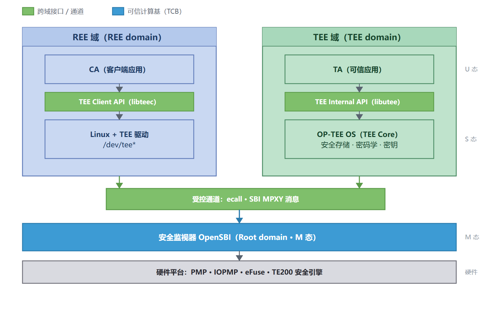
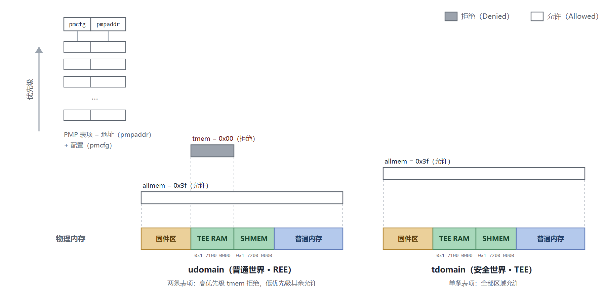
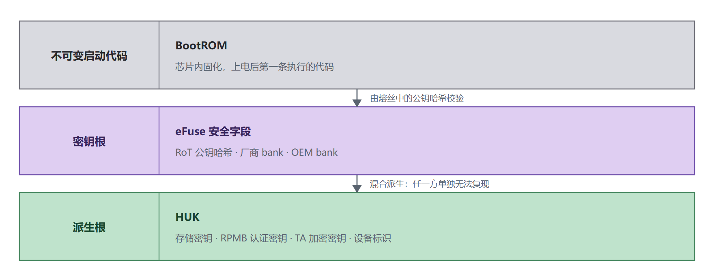
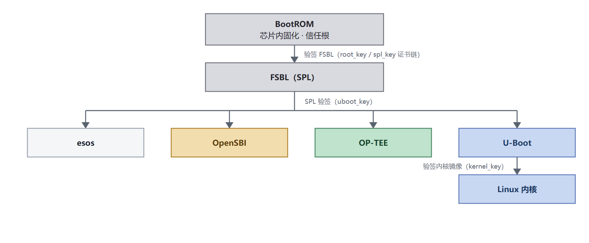
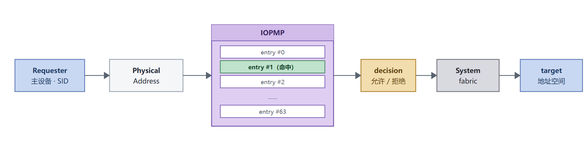

# 安全方案架构白皮书

| 项目 | 内容 |
|---|---|
| 适用 SoC | SpacemiT K3 |
| 适用方案 | Buildroot（安全镜像） |
| 对应 TEE 版本 | `spacemit.k3.v1.0` |
| 文档版本 | v1.0（2026-09-15） |

文中的能力判定与各特性的最低版本要求均以上述版本为准；后续版本调整时，本文与[安全特性支持矩阵](support_matrix.md)会同步更新。

## 概述

### 编写目的

本文说明 SpacemiT K3 平台安全方案的总体架构：安全目标与威胁模型、隔离与信任根设计、安全能力的现状与边界，以及各组件之间的职责划分。本文用于方案选型、架构评审与对外技术说明，不提供具体操作步骤。

各特性的逐项支持状态与最低版本要求见[安全特性支持矩阵](support_matrix.md)；TEE 的结构与集成细节见 [TEE 架构与集成指南](tee_architecture.md)；安全启动的信任链细节见[安全启动开发指南](../device/secureboot.md)。

### 适用范围

本文适用于 SpacemiT K3 系列 SoC 的 Buildroot 方案。

规范中的部分主题不在本方案范围内：控制流完整性（影子栈与标记跳转目标）、软件内存标记、架构元数据存储、能力式架构（CHERI）、机密计算（CoVE）与后量子密码（PQC）就绪。这些能力 K3 当前未采用，本文不作展开，支持状态登记于[安全特性支持矩阵](support_matrix.md)。

### 文档结构

1. **背景**：为什么需要安全能力，K3 安全方案由哪几层组成。
2. **威胁模型**：防御对象与不在防御范围内的攻击。
3. **TEE 参考模型**：执行域划分与部署模型。
4. **隔离模型**：特权级隔离与物理内存访问控制。
5. **信任根**：信任的起点。
6. **可信启动**：信任链的建立。
7. **认证（Attestation）**。
8. **安全封装（Sealing）**。
9. **设备访问控制**。
10. **安全调试与性能管理**。
11. **安全生命周期**。
12. **系统更新**。
13. **系统集成**。
14. **软件架构**。

### 术语

| 缩略语 | 全称 | 说明 |
|---|---|---|
| TEE | Trusted Execution Environment | 可信执行环境 |
| REE | Rich Execution Environment | 普通执行环境 |
| TA | Trusted Application | 可信应用，运行在 TEE 中 |
| CA | Client Application | 客户端应用，运行在普通世界、调用 TA |
| RoT | Root of Trust | 信任根 |
| HUK | Hardware Unique Key | 硬件唯一密钥 |
| PMP | Physical Memory Protection | RISC-V 物理内存保护 |
| IOPMP | I/O Physical Memory Protection | 外设物理内存保护 |
| SR 条目 | Security Requirement | RISC-V International《RISC-V Security Model》中的**规范性**安全需求条目编号，形如 `SR_PMP_002`（该规范的模型与用例部分为非规范性，需求条目本身为规范性）。本文各章以此引用对应的安全需求 |
| SID / RRID | Source ID / Requester ID | 总线主设备的身份标识；IOPMP 以 SID 为索引命中内存域，再按 entry 逐段判定访问权限 |
| TCB | Trusted Computing Base | 可信计算基 |
| MPXY | Message Proxy | SBI 消息代理扩展，跨域消息的传输框架 |
| RPMI | RISC-V Platform Management Interface | 在 MPXY 之上定义的平台管理消息格式，按服务组组织请求与响应 |
| GP | GlobalPlatform | 定义 TEE 标准与认证的行业组织 |

### 重要说明

> [!NOTE]
> 本文描述能力状态时使用的术语与[安全特性支持矩阵](support_matrix.md)一致：
>
> - **支持**：已实现并通过验证，可直接用于产品。
> - **部分支持**：可用但受条件限制，需按注明的前提使用。
> - **暂不支持**：当前版本未提供（未实现，或已实现但默认未使能且无明确启用路径）。
> - **不在范围**：已明确不提供，或依赖本方案之外的条件（如未烧录熔丝的设备不具备对应能力）。

### 范围与责任划分

| 范围 | 归属 |
|---|---|
| SoC 硬件能力（隔离原语、熔丝、调试策略、生命周期） | 芯片 |
| 引导链与安全启动（验签、密钥签名流程、熔丝烧录） | 安全启动 |
| TEE 运行环境、安全存储、密钥派生与使用 | TEE |
| 固件与镜像的构建、打包与烧录 | Buildroot |

跨范围的改动需同时评估两侧影响，尤其是涉及地址锚点、熔丝字段与分区布局的变更。

## 1. 背景

联网设备规模持续增长，越来越多的计算平台运行着与数据安全、用户隐私相关的应用，例如生物特征支付、数字版权管理（DRM）、企业服务与基于 Web 的服务。这类平台若缺乏安全防护能力，容易受到外部攻击与内部恶意软件的侵入，导致用户隐私与重要数据被泄露或窃取。

平台级安全不是单一机制能够完成的：固件可能被替换，密钥可能被抽取，外设与 DMA 可能越过 CPU 直接读写内存，调试接口可能成为旁路。因此 K3 的安全方案由多层能力组成，各自覆盖攻击面的一部分：

- **信任根与安全启动**：以芯片内不可变的 BootROM 与熔丝（eFuse）为起点逐级验签，保证投入运行的固件经过授权；
- **密钥体系**：以硬件唯一密钥（HUK）为根派生各级密钥，密钥材料不可被软件直接读取；
- **执行隔离**：以 RISC-V 特权级、PMP 与 IOPMP 把系统划分为不同信任级别的执行域，域间访问由硬件强制约束；
- **可信执行环境（TEE）**：在隔离出的安全域中运行 TEE OS 与可信应用，承载安全存储、密码学等对机密性要求最高的服务；
- **安全调试与生命周期管理**：控制调试通道，以及设备在各生命周期状态下可用的能力。

其中 TEE 是运行期机密计算的承载，但它只有建立在信任根、安全启动与隔离机制之上才有意义。本文把这几层作为一个整体来描述：TEE 是 K3 安全方案的组成部分之一，而不是全部。

从软件栈的组织方式看，K3 的 TEE 建立在 OP-TEE 的 RISC-V 支持之上：

- **TEE OS**：复用其进程与内存管理、系统调用、线程模型与 GlobalPlatform 接口实现；K3 特有的硬件资源经平台层接入。
- **与 M 态固件的接口**：只使用已标准化的接口——OpenSBI 的域模型把 hart 与内存划分为安全域与 REE 域，SBI MPXY 提供跨域消息传输，RPMI 与 OPTEED 定义其上的消息格式。
- **普通世界接入**：Linux TEE 驱动经同一套 MPXY 通道访问 TEE。
- **直接结果**：TA 的编程接口遵循 GlobalPlatform 规范，同一份 TA 可以在其他采用相同 OP-TEE 后端的 RISC-V 平台上复用；K3 的差异集中在硬件安全资源的接入方式上。

K3 相对通用 RISC-V TEE 栈的增量，主要是把 SoC 自带的安全资源接入这条链路：

- **TE200 安全引擎**：承载密钥与敏感运算的独立安全子系统；
- **eFuse 与 HUK 派生体系**：硬件唯一密钥及其子密钥（RPMB、SSK、DIE_ID、UNIQUE_TA、TA_ENC 等）；
- **IOPMP**：外设主设备发起的访问控制，与 hart 侧的 PMP 互补；
- **硬件密码引擎**：由平台驱动接入 OP-TEE 的密码算法层；
- **安全镜像与分区布局**：在引入 TEE 之后重新划分的固件存储布局。

## 2. 威胁模型

### 2.1 防御对象

按攻击者能力从低到高划分：

| 类别 | 描述 | 典型手段 |
|---|---|---|
| 软件攻击 | 攻击者与受害者同为本系统上的进程 | 恶意软件、越权调用、接口滥用、时序侧信道 |
| 非侵入式物理攻击 | 攻击者具备物理接触，但无破坏封装的能力 | 调试接口接入、总线与信号被动监视、电压/时钟异常注入 |
| 侵入式物理攻击 | 具备实验室级设备 | 去封装、微探针、激光故障注入、功耗与电磁分析 |
| 远程攻击 | 攻击者无物理与逻辑访问权限 | 协议级攻击、辐射或功耗波动 |

TEE 通过软硬件协同的隔离机制实现安全资源保护，因此其能力边界是：**主要防御软件攻击与部分非侵入式硬件攻击**。强物理攻击（侵入式、精细侧信道）不在当前方案的防御范围内，需要额外的硬件防篡改设计。

### 2.2 攻击面与控制手段

| 编号 | 攻击 | 本方案的控制手段 | 状态 |
|---|---|---|---|
| 不受限访问 | 未经授权直接访问运行中的资源 | 特权级隔离、PMP、IOPMP | 支持 |
| 瞬态执行攻击 | 利用推测执行泄露数据 | 依赖微架构自身的缓解 | 不在范围 |
| 接口滥用 | 滥用跨越特权或隔离边界的接口 | 隔离机制 + TA 侧参数校验 | 支持 |
| 事件计数（时序侧信道） | 通过计时推断机密信息 | 受隔离边界限制的性能计数器 | 支持 |
| 控制流截获 | 操纵调用栈与跳转目标 | 工具链与运行时加固 | 部分支持（部分加固项未开启，见[安全特性支持矩阵](support_matrix.md)） |
| 内存安全 | 越界、释放后使用等 | 语言与运行时约束 | 部分支持 |
| 物理泄漏分析 | 观察功耗、辐射、温度 | 需硬件防篡改设计 | 不在范围 |
| 物理内存操纵 | 物理读写或行hammer | 需内存加密与校验 | 不在范围 |
| 启动攻击 | 通过故障注入绕过安全启动、冷启动残留 | 安全启动 + 故障安全软件技术 | 部分支持 |
| 供应链颠覆 | 破坏签名与配置流程 | 认证流程与密钥保护 | 部分支持 |

## 3. TEE 参考模型

### 3.1 三个执行域

TEE 模型将软件执行环境划分为物理隔离的执行域：

| 执行域 | 托管内容 | 在 K3 上的对应 |
|---|---|---|
| Root domain | RoT 固件与安全监视器 | OpenSBI（M 态） |
| TEE domain | TEE OS 与可信应用（TA） | OP-TEE（S 态，trusted 域） |
| REE domain | 面向用户的 OS 与应用程序 | U-Boot / Linux / CA（untrusted 域） |

三个域在 K3 上的组成、跨域接口与可信计算基：

REE 域的操作系统通过根域中的安全监视器与 TEE OS 交互；安全监视器负责跨域边界的上下文切换与隔离，包括事件管理。在 K3 上，这一角色由 OpenSBI 的域模型承担。

### 3.2 TEE 提供的安全服务

安全存储、密码学服务、认证服务、用户身份管理、数字版权管理与支付服务。K3 当前提供其中与平台相关的基础能力：安全存储、密码学服务与认证所需的基础设施，其余服务可由 TA 在应用层实现。

### 3.3 部署模型

| 模型 | 特征 | K3 选择 |
|---|---|---|
| 静态分区 TEE | 单一 TEE 为 REE 域提供服务；TA 通常在启动时安装；系统配置与资源分配基本静态，确定性更好 | **采用** |
| 虚拟化 TEE | TEE 域内由安全分区管理器隔离多个 TEE 客户机，支持更动态的资源分配 | 未采用；需 Hypervisor 扩展支持 |

选择静态分区模型的理由是确定性与较小的可信计算基：资源划分静态、不需要 Hypervisor 扩展，符合嵌入式与边缘设备场景。

本章涉及的规范安全需求条目与 K3 v1.0 的实现情况：

| 条目 | 要求要点 | K3 v1.0 |
|---|---|---|
| SR_SUD_005 | 高信任级 supervisor 域的资源不得被低信任级域访问 | 支持（PMP 与 IOPMP 共同保证，见 §4、§9） |
| SR_SUD_004 | 以内存保护表保护一个 supervisor 域的资源不被其它域访问 | 支持（三域模型，见 §3.1） |
| SR_PMP_005 | 以 SPMP 保护 U 态工作负载互不干扰 | 支持（TEE 内 TA 之间默认不共享内存） |
| SR_IOP_001 | 以 IOPMP 实施设备访问控制 | 支持（9 实例部署，见 §9） |

## 4. 隔离模型

### 4.1 基于特权级的隔离

RISC-V 特权模型提供 M / S / U 三种模式，在执行权限与访问权限上分离：

| 模式 | 能力 | K3 上的承载 |
|---|---|---|
| M 态 | 最高权限；中断与异常响应、物理内存保护、特权访问控制 | OpenSBI |
| S 态 | 超级用户权限，具备内存管理能力 | OP-TEE（安全）、U-Boot 与 Linux（普通） |
| U 态 | 仅非特权指令 | 用户态程序、TA |

异常默认自陷到 M 态，由 M 态固件转发。K3 通过 OpenSBI 的域模型在 S 态层面区分安全与普通执行：**RISC-V 硬件本身不区分安全与普通世界，世界切换由 OpenSBI 的域上下文切换实现**（详见 §13.2）。

### 4.2 物理内存访问控制

RISC-V 的地址空间访问控制分两层：一层约束 hart 自身发起的访问（PMP 系列），一层约束外设与 DMA 主设备发起的访问（IOPMP）。两层互补，缺一不可。

| 机制 | 作用对象 | K3 状态 |
|---|---|---|
| PMA（物理内存属性） | 底层硬件的固有访问属性（只读区、设备区等） | 硬件固有 |
| PMP | hart 对物理内存的访问权限，仅 M 态可配置 | **支持**，用于隔离各执行域 |
| IOPMP | CPU 以外主设备发起的访问，覆盖 DMA 与外设 | **支持**，9 个检查器实例，含平台策略 |

**PMP（hart 侧）** 是域隔离的基础：

- **配置权限**：只有 M 态可配置。
- **作用**：包含若干地址与配置寄存器，可允许或拒绝低特权模式的读、写、执行权限，同时也能约束对 MMIO 的访问。
- **域切换**：M 态固件保存当前域的配置并载入下一域的配置；域间共享的内存需同时写入各域的配置表。

K3 的域划分与共享内存安排见 §13.2。

每个域都有自己一份 PMP 表项：表项按优先级排列，高优先级表项覆盖低优先级表项。K3 两个域的实际配置如下——REE 域（udomain）用一条高优先级的拒绝表项把 TEE RAM 排除在外，其余地址由低优先级表项放行；安全域（tdomain）只有一条全权限表项：

**IOPMP（外设侧）** 为 CPU 以外的主设备访问请求提供物理内存访问控制，是本方案设备隔离的核心组件。K3 在启动早期由安全世界的平台驱动完成各实例配置，部署规模、判定依据与保护范围见 §9。

### 4.3 隔离保证

方案遵循的隔离保证可归纳为四条：

1. 根域可访问任意域的资源，但应避免无意访问其它域资源（防特权提升）。
2. 其它域不得访问根域资源。
3. TEE 域资源不得被 REE 域访问。
4. REE 域资源对 REE 域可读写执行、对 TEE 域可读写（默认共享规则）。

TA 之间的隔离由 TEE OS 保证：每个 TA 是独立的服务单元，**TA 之间默认不共享内存**；普通世界与安全世界之间通过共享内存交互，以提高数据传递效率。所有跨域通信均经由安全通道，由 TEE OS 或安全监视器管理。

本章涉及的规范安全需求条目与 K3 v1.0 的实现情况：

| 条目 | 要求要点 | K3 v1.0 |
|---|---|---|
| SR_PMP_001 | PMP 配置只允许 M 态直接访问 | 支持（由 OpenSBI 按域配置） |
| SR_PMP_002 | 以 PMP 将 M 态与低特权级隔离 | 支持 |
| SR_ISO_002 | 设备不得未经许可访问隔离组件的内存 | 支持（IOPMP 实施，见 §9） |

## 5. 信任根

信任根是全部安全操作所依赖的基础，包含加密功能所需的密钥，用于安全启动过程。硬件信任根是最安全的实现形式。信任根提供的可信功能包括：安全启动、度量、安全存储、报告与验证。

### 5.1 K3 的信任根

| 层次 | 实现 | 说明 |
|---|---|---|
| 不可变启动代码 | 芯片内 BootROM | 只读、不可篡改；上电后的第一条执行代码 |
| 密钥根 | eFuse 中的安全字段 | 包括 RoT 公钥哈希与 OEM 密钥材料 |
| 派生根 | 由 eFuse 密钥派生 | HUK 及其子密钥 |

设计要点：

- **eFuse 中的密钥材料不可由软件直接读写**：安全世界只能通过平台驱动读取熔丝内容并派生需要的密钥。
- **HUK 由两个熔丝 bank 混合派生**：一个由 SoC 厂商烧写、另一个由 OEM 烧写，因此**任一方单独无法复现 HUK**——这把「芯片厂商」与「设备厂商」的共同参与变成了密钥可复现的必要条件。

作为参照：安全系统通常支持具有独立信任根的多条信任链（例如 TPM 用于启动、SIM 用于用户身份）。K3 当前以芯片内 BootROM + eFuse 作为唯一信任根，fTPM 暂不支持。

本章涉及的规范安全需求条目与 K3 v1.0 的对应：

| 条目 | 要求要点 | K3 v1.0 |
|---|---|---|
| SR_ROT_001 | 系统必须实现硬件信任根 | 支持：信任根为芯片内不可变的 BootROM 与 eFuse 密钥材料，均为硬件的不可篡改起点 |
| SR_ROT_002 | 系统必须实现固件信任根 | 支持：上电后第一条执行代码即芯片内 BootROM——只读、不可篡改的固化代码，构成 hart 上的固件信任根 |

规范把信任根分为两类：hart 上的固件信任根（FW RoT），以及独立于 hart 的专用可信子系统（HW RoT）。K3 由芯片内不可变的 BootROM 与 eFuse 密钥材料构成信任根，属前者。

### 5.2 密钥层级

各项能力的支持状态见[安全特性支持矩阵](support_matrix.md)。

## 6. 可信启动

可信启动用于保证系统加载的是经过授权的软件，通常有两种建立方式：

| 方式 | 原理 | K3 状态 |
|---|---|---|
| 安全启动 | 基于硬件根，逐级使用签名验签验证每个启动阶段 | 部分支持（当前版本未集成完整验签链；方案与烧录流程见[安全启动开发指南](../device/secureboot.md)） |
| 度量启动 | 基于硬件根，对关键固件做完整性度量并记录 | 部分支持（度量值生成与存储能力有限） |

### 6.1 安全启动信任链

目标形态下，BootROM 验签 FSBL，FSBL（SPL）分别验签 esos、OpenSBI、OP-TEE 与 U-Boot 四个镜像，U-Boot 再验签 Linux 内核——OP-TEE 与启动链其余固件处于同一验签层级：

使能方式上，信任链由两处控制：**BootROM 读取 eFuse 中的 secure boot 位**决定是否启用安全启动，启用后对 FSBL 验签（加密镜像则先解密）；**U-Boot 等后续镜像的验签由 SPL 的配置开启**。

当前版本（v1.0）尚未集成逐级验签，上图为目标形态。

安全启动的安全需求来自 RISC-V 平台安全模型规范（条目编号见术语表「SR 条目」），与本方案的对应关系：

| 条目 | 要求要点 | K3 v1.0 实现情况 |
|---|---|---|
| SR_MSM_004 | 本地验证必须植根于不可变启动代码 | 支持：系统从芯片内 BootROM 开始执行 |
| SR_MSM_003 | 只使用受信任机构的授权 | 支持：签名由独立保管的私钥产生，公钥经哈希写入熔丝 |
| SR_AUT_001 | Secured 状态下只允许加载授权软件 | 部分支持：验签方案与密钥基础设施就绪，当前版本未集成逐级验签 |

此外方案有一条自身的工程要求：**安全镜像必须成套**——分区表、引导程序与环境变量互相绑定，避免安全镜像在无声降级的情况下启动。

### 6.2 当前边界

需明确两点：

1. **TEE 镜像默认未签名**。打包描述中只有 crc32 完整性校验，没有签名节点；签名脚本已随方案提供，但未接入构建流程、需手动执行，因此默认产物不含签名，其可信性依赖上一级加载路径。
2. **eFuse 是否已烧录不由软件判定**。安全启动的启用条件分布在 BootROM（secure boot 位）与 SPL 配置两处，运行时没有统一接口查询当前是否已启用安全启动，实际状态需以产线记录确认。

## 7. 认证（Attestation）

认证用于让远端依赖方在向设备提交敏感资产前，确认设备及其所依赖的软硬件处于预期状态。要求包括：挑战/应答机制（抗重放）、可生成启动状态与运行状态报告、使用数字签名体系保证报告完整性与真实性、支持导入自定义根证书。

分层认证使认证过程的一部分可以委托给较低权限的组件：根域签名的平台认证覆盖受信任的子系统，TEE 域可在此基础上给出各自的认证结果。

**K3 的支持情况**：

- **已具备**：认证所需的信任根与密钥派生基础设施（硬件信任根、HUK 派生、安全世界持有密钥）。
- **暂不支持**：面向远端的认证服务——不具备由硬件信任根签名、使用硬件配置身份的平台认证报告生成能力（对应 SR_ATT_002 与 SR_ATT_003）；也未提供 fTPM。后续状态以[安全特性支持矩阵](support_matrix.md)为准。

## 8. 安全封装（Sealing）

安全封装用于保护系统上的安全资产：由硬件根密钥派生封装密钥，用于封装高敏感数据（例如文件加密密钥）。

规范的封装安全需求条目与本方案的对应：

| 条目 | 要求要点 | K3 v1.0 |
|---|---|---|
| SR_SLG_001 | 已封装资产应只在 Secured（安全）状态下才可解封 | 支持：解封在安全世界内完成 |
| SR_SLG_002 | 本地封装的资产必须只能在原物理实例上解封 | 支持：密钥源于本设备熔丝内容派生的 HUK，换设备无法复现 |
| SR_SLG_003 | 绑定启动度量的本地封装资产，仅当度量未变化、或系统获得授权更新后才可解封 | 暂不支持：当前未集成启动度量，封装密钥不绑定度量值 |

实现上另有两条方案级特征：封装所需的根密钥由硬件根密钥派生，且软件不可直接读写（HUK 由熔丝内容派生）；存储密钥层级中每个 TA 有独立密钥、每个安全文件有独立密钥。

K3 的安全存储即封装的支持形态，详见 §14 与 [TEE 架构与集成指南](tee_architecture.md)。

## 9. 设备访问控制

对静态分配的设备（划分给 REE 域或安全域），访问控制由 IOPMP 实现，策略可由启动配置或信任根控制。K3 在静态分区模型下同样采用 IOPMP，对外设与 DMA 访问施加约束。

IOPMP 对每一次主设备访问的判定流程：主设备（Requester）发起的访问携带其身份标识（SID，K3 全部采用静态 SID，即 AxUSER）与物理地址，IOPMP 先以 SID 命中内存域（MD），再按域内的 entry 逐段判定读、写权限，判定结果经系统互联送达目标地址空间：

### 9.1 K3 的 IOPMP 部署

K3 部署 9 个 IOPMP 检查器实例，每个实例检查一组主设备对一类目标地址空间的访问；除 IOPMP4 外均在启动阶段由安全世界完成配置并使能：

| 实例 | 基址 | 上游主设备 | 管控地址空间 | 使能 |
|---|---|---|---|---|
| IOPMP1（M2F） | `0xF080_0000` | RCPU | AP Device IO Space | ✓ |
| IOPMP2（F2M） | `0xF085_0000` | secure DMA、non-sec DMA、USB3、安全引擎、SD、USB OTG、UFS、eSPI (AP)、PCIe、CPU | Audio Space | ✓ |
| IOPMP3（DMA） | `0xF087_0000` | secure DMA、non-sec DMA（两者共用一个 SID，IOPMP 视为同一设备） | 全部地址空间 | ✓ |
| IOPMP4（RISCV） | `0xF086_0000` | — | — | 恒为关闭 |
| IOPMP5（HSDMA） | `0xF088_0000` | HSDMA | DRAM | ✓ |
| IOPMP6（INT0） | `0xF081_0000` | DBG_AW、DBG_AR（GDB 写/读通道）、GPU、VPU、ETR、REE_W、REE_R | DRAM | ✓ |
| IOPMP7（INT1） | `0xF082_0000` | secure DMA、non-sec DMA、USB3、安全引擎、SD、USB OTG、UFS、eSPI (AP)、GMAC0、GMAC1、AUD（RCPU，含 RCPU 域全部主设备）、UCIE、GMAC2 | DRAM | ✓ |
| IOPMP8（INT2） | `0xF083_0000` | PCIe | DRAM | ✓ |
| IOPMP9（INT3） | `0xF084_0000` | ISP、LCD0、LCD1 | DRAM | ✓ |

各实例按 SID 命中内存域（MD），再按域内 entry 逐段判定，entry 数决定单个实例能区分的地址段数量。

IOPMP4 恒为关闭（功能冗余），不加载任何策略：核自身发起的访问已由 PMP 约束，无需该实例重复检查。

### 9.2 判定依据与保护范围

判定依据与受控范围：

- **索引**：IOPMP 以主设备身份（SID）为索引判定访问合法性。
- **受控主体**：RCPU（表中 AUD）、CPU、安全引擎、USB3、SD、USB OTG、UFS、eSPI、PCIe、GPU、VPU、ETR、ISP、LCD、GMAC、UCIE、HSDMA、各类 DMA，以及调试访问通道（DBG_AW/DBG_AR）。
- **SID 形态**：所有实例均采用静态 SID（即 AxUSER）。

内存侧的保护效果：

- **非安全主设备**：可访问的 DDR 区间被显式限定；TEE RAM 与共享内存（`0x1_7100_0000`–`0x1_72ff_ffff`）被排除在可访问区间之外。
- **安全主设备**：安全密码引擎 TE200 等安全外设允许访问上述两段。
- **PCIe 与 UCIe**：地址窗口另按 NAPOT/BOUND 规则单独描述。
- **默认动作**：各实例均配置默认动作，用于未命中显式规则时兜底。

外设隔离的价值在于：即使普通世界的内核被攻破，攻击者也难以借助 DMA 直接读写安全世界的内存。

本章涉及的规范安全需求条目与 K3 v1.0 的实现情况：

| 条目 | 要求要点 | K3 v1.0 |
|---|---|---|
| SR_IOP_001 | 支持 PMP 的系统须以 IOPMP 实施设备访问控制 | 支持（9 实例部署） |
| SR_IOP_004 | 以 IOPMP 保证低特权级设备不能访问 M 态资源 | 支持（TEE RAM 与共享内存被排除在非安全主设备可访问区间之外） |

## 10. 安全调试与性能管理

外部调试是绕过隔离机制的捷径，因此必须受控。外部调试一般有三种模式：

| 模式 | 特征 | 适用阶段 |
|---|---|---|
| 开启 | 调试通道直接可用 | 早期开发 |
| 鉴权 | 需通过认证后才打开访问通路 | 量产（需认证子系统支持） |
| 关闭 | 完全不开放 | 最高安全等级 |

方案要求：外部调试只能由信任根使能、只能在复位后使能、M 态与非 M 态应分开、自托管调试只能由更高特权组件使能、低特权软件不得监视高特权软件。性能监视同样是侧信道来源：性能计数器与 QoS 属性不应允许低特权软件观察高特权软件的运行情况。

**K3 的支持情况**：当前**部分支持**。

已具备的两项机制：

- **调试接口可永久关闭**：eFuse bank0 bit14 为 JTAG DISABLE 位，烧录后不可逆。
- **调试访问受硬件策略约束**：GDB 的调试访问经 DBG_AW（写）与 DBG_AR（读）两条通道发起，全部经过 IOPMP6 检查，可访问的内存范围由安全世界在启动期配置的 IOPMP 策略显式限定；TEE RAM 等安全区域可对调试访问关闭（当前策略偏开发取向，量产时应收紧）。

尚未具备的：

- 按特权级、按域分离的调试使能。
- 由信任根调节的调试使能。

因此安全调试的完整需求仍需结合生命周期管理落实：开发与测试阶段开放，量产阶段收紧调试访问策略或烧录熔丝关闭 JTAG。

性能侧还有一条需要处置的路径：内核内置按端口的 DDR 带宽与延迟统计（设备节点为 `/dev/ddr_perf`，可读各端口的读写字节数、请求数与读延迟）。**CPU 的访问在硬件上不区分安全与非安全**，区分安全属性的是安全外设自身携带的位，因此该统计中的 CPU 端口必然包含安全世界流量，无法靠过滤排除。设备节点默认权限为 0600，普通用户态进程不可读，但特权用户态进程仍可读。量产应关闭该统计或收紧其访问权限。

本章涉及的规范安全需求条目与 K3 v1.0 的实现情况：

| 条目 | 要求要点 | K3 v1.0 |
|---|---|---|
| SR_DBG_001 | 外部调试只能由硬件信任根（M 态）或固件信任根（非 M 态）使能 | 暂不支持（JTAG 关闭为单向熔断，不是信任根调节的使能） |
| SR_DBG_002 | M 态与非 M 态的外部调试须分开使能 | 暂不支持 |
| SR_INV_003 | 侵入式子系统的使能须按域分开 | 暂不支持 |
| SR_INV_001 | 侵入式子系统须受信任根控制或调节 | 部分支持（调试接口可经熔丝永久关闭；调试主设备经 IOPMP6 受策略约束） |
| SR_PMU_002 | 低特权软件不得监视高特权软件 | 部分支持：计数器可见性由 `mcounteren` / `scounteren` 决定。启动时将 `SCOUNTEREN` 置 7，U 态只能读 `cycle`、`time`、`instret`，可编程性能计数器与事件选择寄存器对 U 态不可见；S 态按设计可达全部计数器（内核性能分析依赖）。残余面是 `cycle` / `instret` 公开带来的粗粒度执行时间侧信道 |
| SR_QOS_001 / SR_QOS_002 | 低特权软件不得观察高特权软件相关的 QoS 事件与属性 | 部分支持：内核内置按端口的 DDR 带宽与延迟统计（`/dev/ddr_perf`），CPU 端口的统计必然包含安全世界流量，无法靠过滤排除；设备节点默认权限为 0600，普通用户态不可读，特权用户态仍可读，量产应在节点权限或驱动编译层面收紧 |

性能计数器一侧的约束由特权级 CSR（`mcounteren` / `scounteren`）实现，与内存访问控制无关：内存由 MMU/PMP 保护，而计数器的可读性由这两组 CSR 单独决定。

涉及的时间源是 SoC 的 CLINT/ACLINT 机器定时器（24 MHz），性能计数器与 `cycle` / `time` 都取自该时钟源。

## 11. 安全生命周期

安全生命周期反映系统在生命周期内的可信度，并决定硬件配置资产的状态。每个状态定义该状态下的安全属性：对内部资源的访问、更新能力以及硬件对错误的处理方式，都取决于生命周期状态。

| 状态 | 含义 |
|---|---|
| Manufacture | 尚未锁定，没有硬件配置资产 |
| Security provisioning | 配置硬件配置资产的过程（可分包或分阶段执行） |
| Secured | 硬件配置资产已锁定且不可变，只允许授权软件，调试关闭 |
| Recoverable debug | 在保证信任根不受入侵的前提下重新开放可测试性、可调试性 |
| Terminated | 永久禁用设备 |

**K3 的实现方式**：生命周期状态由 eFuse 的字段指定，状态相关行为由硬件与启动固件共同落实；状态转换没有软件接口，进入某个状态就是在对应分组里烧录比特，且烧录不可逆。

**状态字段**：位于 eFuse bank6 的 byte4–byte7，是一个 32 位字——四组状态字段各占 3 bit（合计 12 bit），另有 8 bit 的 DFT 字段与 12 bit 保留位。每组状态字段至少有 2 个 bit 为 1，该组即生效，优先级为 RMA > SP > DM > CM。出厂新片该字段全 0。除读 eFuse 字段本身外，也可以在启动早期读 `SYS_BOOT_CNTRL` 寄存器判断是否处于 RMA——该寄存器不独立存储状态，只是把若干 eFuse 位汇总映射出来供固件快速读取。

| 状态 | 阶段 | 状态相关行为 |
|---|---|---|
| New Chip（全 0） | 未进入制造阶段 | 使用默认值，未锁定 |
| CM（Chip Manufacturing） | 芯片制造 | 配置资产尚未灌入 |
| DM（Device Manufacturing） | 设备制造 | 配置资产可灌入 |
| SP（Secure Production） | 安全产品 | eFuse 中提供 AES 密钥的 HUK（bank1）与 SSK（bank2）两个 bank 均不可访问，只能由安全引擎使用，CPU 无法读写 |
| RMA（Return Material Authorization） | 授权返修 | eFuse 中的 HUK（bank1）与 SSK（bank2）对 CPU 与安全引擎均不可访问；无视 JTAG 禁用位、JTAG 重新使能；启动只校验镜像头（magic、镜像长度与头校验和），不做解密、不做验签，也跳过防回滚检查；镜像头校验失败时即使安全启动已开启也不进入 panic，而是进入下载模式 |

> [!CAUTION]
> RMA 是产线返修用的降级状态：进入后调试接口重新开放、启动链不再验签，设备保护等级显著下降。量产设备不应进入 RMA；确需返修时应按产线流程受控使用。

**HUK 与 SSK 两个 bank 在各状态下的可用性**（AES 密钥材料即来自这两个 bank）：

| 状态 | 使用 | 读取 |
|---|---|---|
| New Chip | 默认值 | 默认值 |
| CM | 已灌入的密钥 | 已灌入的密钥（可读） |
| DM | 已灌入的密钥 | 不可访问 |
| SP | 已灌入的密钥，仅安全引擎可用 | 不可访问 |
| RMA | 不可用（对 CPU 与安全引擎均不可访问） | 不可访问 |

与规范状态模型的对应关系：CM 与 DM 覆盖 Manufacture 与 Security provisioning（产线灌入配置资产），SP 对应 Secured，RMA 对应 Recoverable debug（在受控前提下重新开放可测试性与可调试性）。规范中的 Terminated 没有独立字段，最接近的做法是不可逆的熔丝锁定位，例如永久关闭调试接口。

本章涉及的规范安全需求条目与 K3 v1.0 的实现情况：

| 条目 | 要求要点 | K3 v1.0 |
|---|---|---|
| SR_LFC_001 | 安全系统必须管理安全生命周期 | 部分支持（状态由 eFuse 字段指定且有状态相关行为，但没有状态机与状态查询接口，状态转换即烧录比特） |
| SR_LFC_002 | 硬件配置资产仅在 Secured 状态下可访问 | 部分支持（提供 AES 密钥的 HUK 与 SSK 两个 bank 在 DM 之后即不可访问、SP 下仅安全引擎可用、RMA 下对 CPU 与安全引擎均不可访问；其余配置资产需按资产逐项核对） |

## 12. 系统更新

系统更新既要能修复缺陷、分发新功能，又不能成为降级或植入的通道。规范对更新的要求集中在：不可变以外的组件必须可更新、更新必须被度量并在启动前验证、更新必须单调且能抵抗更新失败，且更新与授权消息只能来自受信任来源。

**K3 的支持情况**：镜像以分区为单位整体替换，因此固件与系统组件都可更新；但**启动前的度量与验签尚未集成**（与 §6 的边界一致），防回滚计数器的启用方式也未确定。

本章涉及的规范安全需求条目与 K3 v1.0 的实现情况：

| 条目 | 要求要点 | K3 v1.0 |
|---|---|---|
| SR_UPD_001 | 不可变以外的组件必须可更新 | 支持：各分区镜像可独立替换 |
| SR_UPD_002 | 系统更新必须被度量并在启动前验证 | 部分支持：验签与密钥基础设施就绪，当前版本未集成逐级验签（见 §6） |
| SR_UPD_005 | 系统更新必须单调（不得降到旧版本） | 部分支持：防回滚计数字段已定义，启用与校验方式未定 |
| SR_UPD_007 | 系统更新与授权消息只能来自受信任来源 | 部分支持：签名私钥独立保管，公钥经哈希写入熔丝 |
| SR_AUT_002 | 安全配置状态下只加载授权软件 | 暂不支持（与 §6 的边界一致） |

SR_UPD_004（影响安全平台的更新应延后）与 SR_UPD_006（更新须能抵抗失败）对应的策略尚未定义，当前按暂不支持处理。

## 13. 系统集成

### 12.1 隔离组件的分工

RISC-V 的隔离机制都基于对地址空间的访问控制，核心组件是 PMP 与 IOPMP：

| 组件 | 作用对象 | 容量特征 |
|---|---|---|
| PMP | RISC-V hart 的访问 | 每 hart 一组规则表项，由 OpenSBI 按域配置 |
| IOPMP | 外设与 DMA 的访问 | 9 个检查器实例，按主设备 SID 索引 |

表项数量有限意味着**地址空间的域划分不能过度碎片化**，否则规则表项不足，无法覆盖。这是系统集成时的硬性约束：划分域时应按较大粒度分段，而不是逐个区域细分。

### 12.2 K3 的域模型与世界切换

RISC-V 硬件不区分安全与普通世界，**世界切换由 OpenSBI 的域上下文切换实现**：

- OpenSBI domain 包含一组内存区域与 hart。
- 启动时默认处于 root domain；设备树可声明额外的 trusted domain 与 untrusted domain，各自指定内存区域与入口地址。
- 切换域时，OpenSBI 设置目标域的入口地址、相关 CSR 与 PMP 寄存器，恢复该域上下文，最后以 `mret` 进入 S 态完成世界切换。

K3 的实际划分：

- **trusted 域**：拥有全部内存权限，从 TEE 内存基址以 S 态进入。
- **untrusted 域**（承载 U-Boot 与 Linux）：**对 TEE 内存无任何访问权限**，从普通内存地址进入。
- **域与 hart 的对应**、以及各域可访问的内存区域均由设备树声明，实际节点见 [TEE 架构与集成指南](tee_architecture.md) 的内存布局章节。

### 12.3 内存保留

TEE RAM 与共享内存落在内核可见的内存范围内，因此需要在内核侧排除。K3 的做法是：**由 TEE 在启动时主动向设备树注入保留区节点**，内核据此将其标记为不可映射、不可复用。这样做的优点是保留区与平台的 TEE 配置天然一致，不需要在两处手工维护同一份地址。

与之配套的硬件保护是 PMP：即使内核违反约定去访问这些地址，也会被硬件拒绝。软件排除与硬件拒绝两层共同作用，缺一不可。

## 14. 软件架构

### 13.1 组件与职责

| 组件 | 层 | 职责 |
|---|---|---|
| OP-TEE OS | 安全世界 | TEE 内核框架、Internal Core API 实现、用户态 ELF 加载器、可扩展密码算法库 |
| OP-TEE Client | 普通世界用户态 | TEE Client API 实现与向 TEE 提供服务的守护进程 |
| OP-TEE Test | 普通世界用户态 | 测试集 |
| Linux TEE driver | 普通世界内核 | REE 侧 TEE 框架与驱动 |

OP-TEE 的接口与隔离基础：

- **实现的接口**：TEE Internal Core API 与 TEE Client API。
- **底层隔离**：其设计原本依赖 Arm TrustZone，但结构上兼容任何适合 TEE 概念的隔离技术——K3 上对应的是 RISC-V 的特权级与 PMP。
- **设计目标**：隔离与小占用。

### 13.2 安全世界与普通世界的交互

- **调用方向**：CA 的请求经客户端库组包，通过内核驱动下发到 TEE；TEE 需要普通世界资源时反向发起远程调用，由守护进程代为完成。
- **切换机制**：RISC-V 没有 Arm 的 `smc` 指令，S 态与 M 态之间的切换由 `ecall` 完成，跨域分发由 OpenSBI 承担；ABI 调用规范沿用同一套约定。
- **消息传递**：由 SBI 的消息代理扩展提供传输框架，采用 per-hart 通道，实际消息格式由上层协议定义。

具体机制、通道分配与设备树配置见 [TEE 架构与集成指南](tee_architecture.md) 的通信机制章节。

### 13.3 安全存储

安全存储需要保证数据的机密性、完整性与修改的原子性。有两种实现方式：

| 方式 | 抗回滚 | K3 状态 |
|---|---|---|
| 基于普通世界文件系统 | **无** | 支持（默认方式） |
| 基于存储器件 RPMB 分区 | 有 | 部分支持（默认未使能） |

默认方式下，TA 的对象数据落在普通世界的文件系统中，由守护进程代管；其机密性与完整性由安全世界内基于根密钥派生的密钥保护，**但无法察觉文件被删除或回滚**。需要抗回滚能力时应改用 RPMB 方式，其前提是器件已完成密钥灌注。

## 参考资料

本文引用的外部规范如下；版本不确定的条目暂留空。

| 名称 | 版本 | 链接 |
|---|---|---|
| RISC-V Security Model，RISC-V International | 0.9.1（2026-09） | <https://github.com/riscv-non-isa/riscv-security-model> |
| The RISC-V Instruction Set Manual, Volume II: Privileged Architecture（PMP 所在卷） | 1.2 | <https://github.com/riscv/riscv-isa-manual> |
| RISC-V IOPMP Architecture Specification | 0.9.2-RC2 | <https://github.com/riscv-non-isa/riscv-iopmp> |
| RISC-V SBI Specification（含 MPXY 消息代理扩展） | 2.0 | <https://github.com/riscv-non-isa/riscv-sbi-doc> |
| GlobalPlatform TEE Internal Core API Specification | 1.4 | <https://globalplatform.org/specs-library/tee-internal-core-api-specification/> |
| GlobalPlatform TEE Client API Specification | 1.0.1 | <https://globalplatform.org/specs-library/tee-client-api-specification/> |
